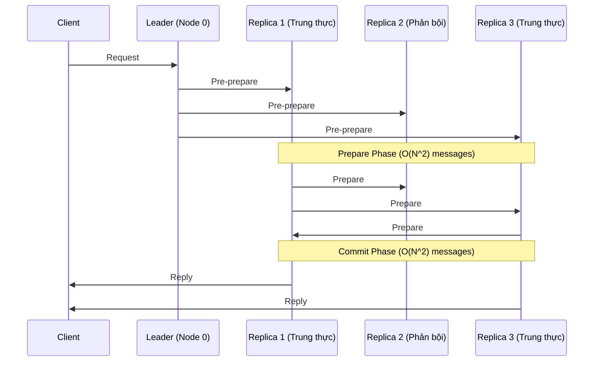

Trong các hệ thống phân tán (Distributed Systems) quy mô lớn, chúng ta thường giả định rằng các node (máy chủ) khi gặp sự cố sẽ đơn giản là "chết" hoặc "treo" (Crash-stop failure/Fail-stop model). Đây là nền tảng cho các thuật toán đồng thuận như Raft hay Paxos. Tuy nhiên, điều gì xảy ra nếu một node không chết, mà tiếp tục hoạt động nhưng lại trả về dữ liệu sai lệch, bị hỏng hóc hoặc mang tính phá hoại?

Đó chính là lúc chúng ta phải đối mặt với **Byzantine Fault Tolerance (BFT)**. Dưới góc nhìn của một Kỹ sư Dữ liệu thực chiến (Staff Data Engineer), BFT không chỉ là chuyện của Blockchain hay tiền điện tử, mà là bài toán chống lại sự suy thoái dữ liệu thầm lặng (Silent Data Corruption), phần cứng lỗi, và kiến trúc Zero-Trust.

## 1. Bài Toán Các Vị Tướng Byzantine và Thực Tế Kỹ Thuật

Bài toán "Byzantine Generals Problem" (1982) mô tả các vị tướng cần đồng thuận Tấn Công hay Rút Lui, nhưng trong số họ có kẻ phản bội phát tán thông tin sai lệch.

Trong hệ thống Data Engineering, "kẻ phản bội" không nhất thiết là một hacker. Thực tế tàn khốc của hệ thống vật lý thường là:
- **Silent Data Corruption (SDC):** Tia vũ trụ (Cosmic rays) lật một bit (bit-flip) trong RAM ECC từ `0` thành `1`. CPU xử lý một phép toán cộng sai logic do lỗi vi mạch (hardware microcode bug). 
- **Lỗi Firmware Ổ Cứng (Disk bad sectors):** Ổ SSD báo rằng đã ghi dữ liệu thành công (fsync) nhưng thực tế dữ liệu ghi xuống bị rác hoặc mất.
- **Mạng méo mó (Network packet corruption):** Các bit TCP/IP bị sai lệch khi đi qua các bộ định tuyến bị lỗi, mà checksum của TCP không đủ mạnh để phát hiện (TCP checksum chỉ có 16-bit).
- **Mã độc và Môi trường Zero-Trust:** Các cụm phân tán bị xâm nhập từ nội bộ, dẫn đến việc giả mạo các message truyền trong cluster.

Nếu áp dụng Raft/Paxos (Crash-Tolerance) vào đây, Leader có thể đọc phải rác từ đĩa, và vô tư "đồng thuận" sao chép cái rác đó cho toàn bộ cluster. Kết quả: Dữ liệu hỏng toàn hệ thống.

## 2. Crash-Tolerance vs Byzantine-Tolerance: Toán Học Đánh Đổi

Để một hệ thống chịu được lỗi, ta cần số node tối thiểu $N$.
Giả sử có $f$ node bị lỗi.

### Crash-Tolerance (Raft/Paxos)
- Mô hình lỗi: Node bị sập hoặc mất mạng.
- Số node tối thiểu: **$N = 2f + 1$**
- Giải thích: Để chịu được 1 node sập ($f=1$), ta cần 3 node. Khi 1 node sập, 2 node còn lại vẫn tạo thành đa số (majority) so với 3 node gốc ($2 > 3/2$).

### Byzantine Fault Tolerance (BFT/PBFT)
- Mô hình lỗi: Node trả về dữ liệu xạo, hợp sức để đánh lừa mạng.
- Số node tối thiểu: **$N = 3f + 1$**
- Giải thích: Tại sao không phải $2f+1$? Giả sử có $f$ node nói dối. Trong quá trình bỏ phiếu, có $f$ node trung thực khác bị trễ mạng (không phản hồi kịp). Vậy số node trung thực đã trả lời là $N - 2f$. Để phe trung thực thắng phe nói dối, ta phải có $N - 2f > f \implies N > 3f$.
Vậy để chịu 1 lỗi Byzantine ($f=1$), hệ thống cần tới 4 node.

## 3. Kiến Trúc PBFT (Practical BFT) và Nút Thắt Hiệu Năng

PBFT (1999) hoạt động qua 3 pha để đảm bảo sự đồng thuận dù có kẻ phản bội: Pre-prepare, Prepare, và Commit. 



**Sự Đánh Đổi Tàn Khốc (Trade-offs):**
- **Thông lượng (Throughput) tụt dốc:** Do mọi node phải kiểm tra chéo lẫn nhau ở pha Prepare và Commit, độ phức tạp mạng là $O(N^2)$. Với cụm 10 node, có 100 kết nối. Với 1000 node, có 1 triệu kết nối cho *mỗi transaction*.
- **Độ trễ (Latency) tăng vọt:** BFT không bao giờ được dùng cho High-Frequency Trading hoặc Event Streaming như Kafka do quá trình bắt tay (handshakes) quá nặng.

Đó là lý do các hệ thống Data Engineering truyền thống **không dùng PBFT nguyên bản**. Thay vào đó, chúng mượn các ý tưởng của BFT ở tầng Storage.

## 4. Ứng Dụng Tư Duy BFT Trong Data Engineering Thực Chiến

Là một Data Engineer, thay vì chạy PBFT, chúng ta đối phó với Byzantine failures (cụ thể là Data Corruption) bằng các chiến lược xác minh mật mã (Cryptographic Verification).

### 4.1. Checksums ở Tầng File (HDFS, Amazon S3)
Các hệ thống như Hadoop HDFS, ZFS hay AWS S3 liên tục tính toán Checksum (như CRC32C) cho từng Block/Object.
- Khi dữ liệu được lưu, checksum được tính và lưu riêng rẽ.
- Khi một node chạy Background Scanner và phát hiện checksum của block hiện tại không khớp với checksum đã lưu (Silent Data Corruption do lỗi ổ cứng), nó lập tức đánh dấu block đó là "Byzantine/Corrupted" và báo cáo cho NameNode.
- Hệ thống sẽ tự động fetch một bản copy trung thực từ Replica khác đè lên. 

### 4.2. Merkle Trees (Anti-Entropy) trong Cassandra và DynamoDB
Để đồng bộ hóa dữ liệu giữa các node mà không tốn băng thông mạng ($O(N)$), Apache Cassandra sử dụng **Merkle Tree** (cấu trúc dữ liệu dạng cây băm).

1. Mỗi dải dữ liệu được băm (hash) tạo thành các nốt lá.
2. Các nốt lá được băm gộp lên dần cho đến Root Hash.
3. Khi 2 node muốn kiểm tra xem dữ liệu của chúng có đồng nhất không, chúng chỉ việc so sánh Root Hash. Nếu khớp, toàn bộ data giống nhau.
4. Nếu sai, chúng chỉ so sánh các nhánh con để tìm ra chính xác block nào bị sai lệch (corrupted) và chỉ đồng bộ lại block đó.

```mermaid
graph TD
    Root["Root Hash: 8A4B"] --> H0["Hash 0: 1F2B"]
    Root --> H1["Hash 1: C49A"]
    H0 --> Data0["Data Block 0"]
    H0 --> Data1["Data Block 1"]
    H1 --> Data2["Data Block 2"]
    H1 --> Data3["Data Block 3("Corrupted")"]
    
    style Data3 fill:#ff9999,stroke:#333,stroke-width:2px
```

### 4.3. Data Mesh và Zero-Trust Cross-Validation
Trong Data Mesh đa miền (multi-domain), một Data Product (như user_profiles) có thể bị nhiễm dữ liệu bẩn do logic nghiệp vụ lỗi từ team nguồn. BFT được áp dụng ở khái niệm **Data Contracts** và **Cross-Validation**:
Sử dụng công cụ như Great Expectations hoặc Soda để chạy các rules (hashes, distribution bounds) từ bên thứ 3 (Audit/Governance layer) nhằm xác minh dữ liệu trước khi đẩy xuống Data Warehouse, triệt tiêu việc "tin tưởng mù quáng" vào hệ thống nguồn.

## 5. Tổng Kết
Trong kỹ thuật dữ liệu doanh nghiệp, trừ khi bạn làm việc với Blockchain hoặc Ledger tài chính khép kín, bạn sẽ hiếm khi phải cấu hình một mạng lưới thuần PBFT. Tuy nhiên, việc hiểu BFT giúp Staff Engineer nhận thức được rằng **không thể tin tưởng bất kỳ phần cứng hay mạng nội bộ nào 100%**. Luôn luôn mã hóa, luôn luôn hashing, và sử dụng Merkle Trees/Checksums là cách chúng ta đưa tính chịu lỗi Byzantine vào các Data Lake/Data Warehouse.

## Nguồn Tham Khảo (References)
- [Practical Byzantine Fault Tolerance - Miguel Castro, Barbara Liskov (1999)](https://pmg.csail.mit.edu/papers/osdi99.pdf)
- [Dynamo: Amazon's Highly Available Key-value Store](https://www.allthingsdistributed.com/files/amazon-dynamo-sosp2007.pdf) (Phần Anti-entropy sử dụng Merkle Trees)
- [Designing Data-Intensive Applications - Martin Kleppmann](https://dataintensive.net/) (Chương 8: The Trouble with Distributed Systems)
