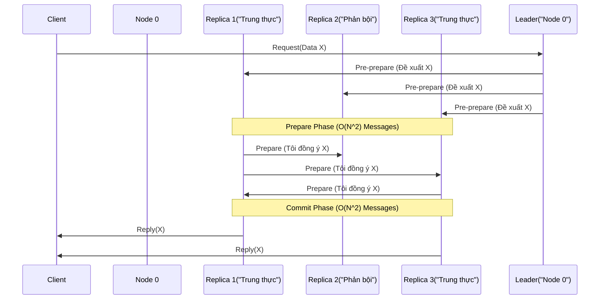
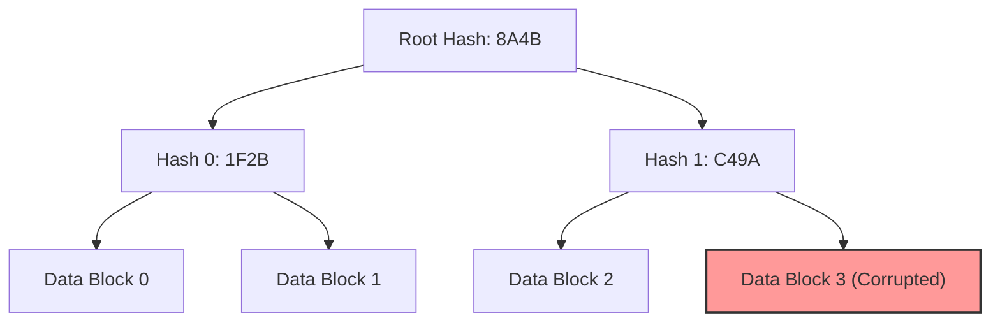

Trong các hệ thống phân tán (Distributed Systems) quy mô lớn như HDFS, Kafka, hay Cassandra, chúng ta thường giả định rằng các Node (máy chủ) khi gặp sự cố sẽ đơn giản là "chết" hoặc "treo" (Crash-stop failure / Fail-stop model). Đây là nền tảng cho các thuật toán đồng thuận kinh điển như **Raft** hay **Paxos**. 

Tuy nhiên, điều gì xảy ra nếu một Node *không chết*, mà nó tiếp tục hoạt động nhưng lại trả về dữ liệu sai lệch, bị hỏng hóc, hoặc thậm chí cố tình phát tán thông tin giả mạo?

Đó chính là lúc chúng ta phải đối mặt với **Byzantine Fault Tolerance (BFT)**. Dưới góc nhìn của một Kỹ sư Dữ liệu thực chiến, BFT không chỉ là chuyện của Blockchain hay Crypto. Nó là bài toán chống lại sự suy thoái dữ liệu thầm lặng (Silent Data Corruption), phần cứng lỗi, và thiết kế kiến trúc Zero-Trust.

---

## 1. Vấn đề Tướng Byzantine và Thực Tế Kỹ Thuật

Bài toán "Byzantine Generals Problem" (1982) mô tả một nhóm các vị tướng cần đồng thuận để Tấn Công hay Rút Lui. Trong số họ có kẻ phản bội (Traitor) cố tình phát tán thông tin nhiễu loạn để làm đội quân chia rẽ.

Trong hệ thống Data Engineering, "kẻ phản bội" không nhất thiết là một hacker. Thực tế tàn khốc của vật lý phần cứng thường tạo ra các "Byzantine Node" vô tình:
- **Silent Data Corruption (SDC):** Tia vũ trụ (Cosmic rays) lật một bit (bit-flip) trong RAM từ `0` thành `1`. CPU xử lý một phép toán cộng sai logic do lỗi vi mạch (hardware microcode bug).
- **Lỗi Firmware Ổ Cứng:** Ổ SSD/HDD báo cáo với hệ điều hành rằng đã ghi dữ liệu thành công (`fsync` return OK) nhưng thực tế dữ liệu ghi xuống đĩa bị rác (Disk bad sectors).
- **Mạng méo mó:** Các bit TCP/IP bị sai lệch khi đi qua các bộ định tuyến (Router) bị lỗi, mà checksum 16-bit của TCP quá yếu để phát hiện ra sự xáo trộn này.

Nếu áp dụng thuật toán Raft (Crash-Tolerance) vào đây, Leader có thể vô tình đọc phải rác từ đĩa cứng của nó, và vô tư "đồng thuận" sao chép cái rác đó cho toàn bộ Follower. Kết quả: **Dữ liệu hỏng toàn hệ thống**.

---

## 2. Crash-Tolerance vs. Byzantine-Tolerance: Toán Học Đánh Đổi

Để một hệ thống chịu được lỗi, ta cần cấu hình số Node tối thiểu là $N$. Giả sử có tối đa $f$ Node bị lỗi.

### 2.1. Crash Fault Tolerance (CFT - Raft / Paxos)
- **Mô hình lỗi:** Node bị sập nguồn, cháy ổ cứng, hoặc đứt cáp mạng.
- **Công thức:** $N = 2f + 1$
- **Giải thích:** Để chịu được 1 Node sập ($f=1$), cụm cần 3 Node. Khi 1 Node sập, 2 Node còn lại vẫn tạo thành đa số (Majority Quorum) so với tổng số 3 Node ($2 > 3/2$).

### 2.2. Byzantine Fault Tolerance (BFT / PBFT)
- **Mô hình lỗi:** Node trả về dữ liệu xạo, hợp tác với nhau để đánh lừa mạng.
- **Công thức:** $N = 3f + 1$
- **Giải thích:** Tại sao không phải $2f+1$? Giả sử có $f$ Node nói dối (Byzantine). Trong quá trình bỏ phiếu, rất có thể có $f$ Node trung thực khác bị trễ mạng (không phản hồi kịp). Vậy số Node trung thực đã phản hồi là $N - 2f$. 
Để phe trung thực chắc chắn thắng phe nói dối (Majority of responses), ta phải có: $N - 2f > f \implies N > 3f$.
*Kết luận:* Để chịu được 1 lỗi Byzantine ($f=1$), hệ thống BFT cần tới 4 Node (so với 3 của CFT). Để chịu 33 lỗi, nó cần tới 100 Node.

---

## 3. Kiến Trúc PBFT (Practical BFT) và Nút Thắt Hiệu Năng

Thuật toán PBFT (1999) hoạt động qua 3 pha để đảm bảo sự đồng thuận dù có kẻ phản bội: *Pre-prepare*, *Prepare*, và *Commit*.

**Sự Đánh Đổi Tàn Khốc (Performance Trade-offs):**
- **Thông lượng (Throughput) sụp đổ:** Vì BFT không tin ai, mọi Node phải kiểm tra chéo (Cross-check) lẫn nhau ở pha Prepare và Commit. Độ phức tạp mạng là $O(N^2)$. Với cụm 10 Node, có 100 kết nối. Với 1000 Node, mạng lưới phải gánh 1 triệu kết nối mạng cho *mỗi transaction*.
- **Độ trễ (Latency) khổng lồ:** Quá trình bắt tay (Handshakes) quá nặng.

Đó là lý do các hệ thống Data Engineering (Kafka, Spark, Cassandra, Spanner) **không dùng PBFT nguyên bản**. Thay vào đó, chúng mượn các triết lý của BFT để áp dụng vào tầng Storage (Lưu trữ) và Validation (Kiểm tra).

---

## 4. Ứng Dụng Tư Duy BFT Trong Data Engineering Thực Chiến

Thay vì chạy thuật toán PBFT chậm chạp, chúng đối phó với Byzantine failures bằng các **chiến lược xác minh mật mã (Cryptographic Verification)**.

### 4.1. File-Level Checksums (HDFS, Amazon S3, ZFS)
Để chống lại Silent Data Corruption do ổ cứng hỏng (Bit-rot), các hệ thống lưu trữ phân tán luôn đi kèm cơ chế tự kiểm tra.
- Khi dữ liệu được ghi vào S3 hoặc HDFS, một giá trị Checksum (như CRC32C hoặc MD5) được tính toán và lưu siêu dữ liệu (Metadata) riêng rẽ.
- Khi Data Node chạy tiến trình Background Scanner (hoặc khi đọc file), nếu phát hiện Checksum của block hiện tại không khớp với Checksum đã lưu, nó lập tức tự đánh dấu bản thân là "Byzantine/Corrupted".
- NameNode/Control Plane sẽ tự động cô lập block rác đó và copy một bản trung thực từ Replica khác đè lên.

### 4.2. Merkle Trees (Anti-Entropy) trong Cassandra / DynamoDB
Làm sao để 2 Node phân tán có dung lượng 10TB biết được chúng đang chứa dữ liệu hoàn toàn giống nhau, mà không cần gửi 10TB qua mạng (gây sập Network)? Apache Cassandra sử dụng **Merkle Tree** (Cấu trúc cây băm mật mã).

1. Dữ liệu được chia nhỏ, mỗi mảnh được băm (Hash) tạo thành các nốt lá (Leaf nodes).
2. Các nốt lá được băm gộp lên dần cho đến khi ra được một Root Hash duy nhất đại diện cho cả 10TB.
3. Khi 2 Node muốn đối soát (Anti-entropy), chúng chỉ trao đổi Root Hash (dài vài byte). Nếu khớp, 10TB dữ liệu giống nhau 100%.
4. Nếu sai, chúng duyệt cây từ trên xuống để tìm ra chính xác Data Block nào bị sai lệch (Corrupted) và chỉ tải lại đúng Block đó qua mạng.

### 4.3. Data Mesh và Zero-Trust Cross-Validation
Trong kiến trúc Data Mesh đa miền (Multi-domain), một Data Product (như `sales_events`) có thể bị nhiễm rác do logic nghiệp vụ lỗi từ team Upstream. Đây là một dạng Organizational Byzantine Fault (Lỗi Byzantine cấp tổ chức).
- **Giải pháp:** Xây dựng kiến trúc **Zero-Trust**. Đội Data Platform không "tin tưởng mù quáng" vào dữ liệu Upstream. Họ triển khai các Data Contracts và dùng công cụ như dbt-expectations hoặc Great Expectations để chạy Cross-validation (kiểm tra phân phối, tính duy nhất) như một chiếc "Circuit Breaker" trước khi cho phép dữ liệu vào Data Warehouse.

---

## 5. Tổng Kết

Trong Kỹ thuật Dữ liệu Doanh nghiệp, trừ khi bạn làm việc với Blockchain hoặc Sổ cái tài chính [Financial Ledgers] khép kín, bạn sẽ hiếm khi phải triển khai một mạng lưới thuần BFT/PBFT do rào cản hiệu năng $O(N^2)$. 

Tuy nhiên, việc thẩm thấu **Tư duy BFT** giúp Staff Engineer nhận thức một chân lý: *Không thể tin tưởng bất kỳ phần cứng hay mạng nội bộ nào 100%*. Luôn mã hóa, luôn băm dữ liệu (Hashing), dùng Merkle Trees, và thiết lập Data Contracts là cách chúng ta nhúng khả năng chịu lỗi Byzantine vào các kiến trúc Data Lakehouse tỷ đô.

## Nguồn Tham Khảo (References)
- [Practical Byzantine Fault Tolerance - Miguel Castro, Barbara Liskov (1999]][https://pmg.csail.mit.edu/papers/osdi99.pdf]
- [Dynamo: Amazon's Highly Available Key-value Store][https://www.allthingsdistributed.com/files/amazon-dynamo-sosp2007.pdf] (Phần Anti-entropy sử dụng Merkle Trees)
- [Designing Data-Intensive Applications - Martin Kleppmann](https://dataintensive.net/] (Chương 8: The Trouble with Distributed Systems)
