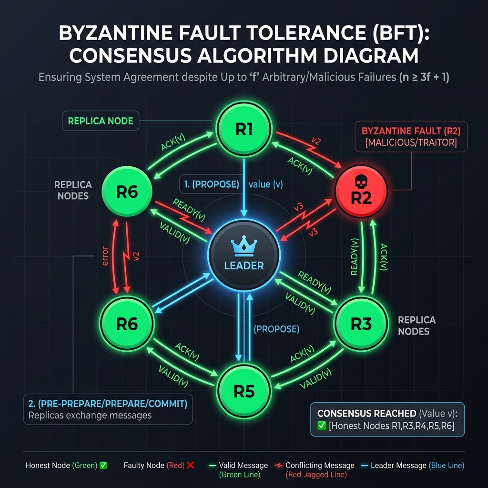

Khi thiết kế các hệ thống phân tán (Distributed Systems) khổng lồ, một trong những thách thức lớn nhất là làm sao để hệ thống vẫn hoạt động đúng ngay cả khi một số node (máy chủ) không chỉ bị sập (Crash-stop failure) mà còn "phản bội" (Byzantine failure) bằng cách gửi đi các thông tin sai lệch, độc hại hoặc mâu thuẫn.

## 1. Khái niệm cốt lõi

**Byzantine Fault Tolerance (BFT)**, hay Khả năng chịu lỗi Byzantine, là đặc tính của một hệ thống máy tính máy tính phân tán vẫn có thể duy trì hoạt động và đạt được sự đồng thuận chung ngay cả khi có một số thành phần trong hệ thống bị lỗi, và đặc biệt là khi các thành phần này bắt đầu lan truyền thông tin sai lệch hoặc hoạt động bất thường. 

Thuật ngữ "Byzantine" xuất phát từ bài toán **"Byzantine Generals Problem" (Bài toán các vị tướng Byzantine)** do Leslie Lamport, Robert Shostak và Marshall Pease đề xuất năm 1982. 

Tưởng tượng các vị tướng của đế chế Byzantine bao vây một thành phố. Họ phải cùng nhau đưa ra một quyết định chung: Tấn Công hay Rút Lui. Tuy nhiên, họ chỉ có thể giao tiếp với nhau thông qua những người đưa tin (messengers). Bài toán đặt ra là:
1. Thông điệp có thể bị mất, trễ hoặc bị đánh tráo trên đường đi.
2. Tệ hơn, trong số các tướng có những kẻ phản bội. Chúng có thể gửi thông điệp "Tấn công" cho tướng A, nhưng lại gửi "Rút lui" cho tướng B nhằm phá hoại sự đồng thuận.

Trong Data Engineering và hệ thống phân tán, "kẻ phản bội" chính là:
- Các node bị lỗi phần cứng (ví dụ: RAM hỏng lật bit 0 thành 1, ổ cứng bị bad sector).
- Mạng bị nhiễu làm sai lệch gói tin hoặc độ trễ mạng cực cao (Network partitions).
- Phần mềm có bug gây ra các phản hồi sai logic.
- Hệ thống bị hacker chiếm quyền điều khiển và cố tình gửi dữ liệu rác, độc hại vào cụm server.

## 2. Cơ chế hoạt động (Mechanism)

Hầu hết các hệ thống Data Engineering truyền thống (như Hadoop, Spark, Kafka) chỉ được thiết kế cho **Crash-Tolerance** (node bị sập thì bầu node khác thay thế) thông qua các thuật toán đồng thuận như Paxos hay Raft. Chúng giả định rằng các node "không nói dối" (Fail-stop).

Ngược lại, BFT đòi hỏi hệ thống phải chống lại được những node "nói dối".

*Hình: Cơ chế đồng thuận trong hệ thống có node phản bội.*

Thuật toán BFT chứng minh toán học rằng: Để hệ thống có thể chịu được tối đa `f` node bị lỗi (lỗi Byzantine), hệ thống cần tối thiểu `N = 3f + 1` node tổng cộng.
Ví dụ: Để chịu được 1 node bị hack hoặc lỗi bit, bạn cần ít nhất 4 node. Tại sao lại là 3f + 1?
- Khi có `f` node bị lỗi Byzantine, chúng có thể hợp sức nói dối.
- Có thể có `f` node khác bị chậm trễ do mạng, không kịp trả lời.
- Vậy số node phản hồi trung thực là `N - 2f`.
- Để nhóm trung thực thắng thế (chiếm đa số), số node trung thực phải lớn hơn số node dối trá: `N - 2f > f` => `N > 3f` hay `N = 3f + 1`.

Cơ chế thực thi điển hình là **Practical Byzantine Fault Tolerance (PBFT)** do Miguel Castro và Barbara Liskov giới thiệu năm 1999:
1. **Pre-prepare phase:** Leader gửi yêu cầu (proposal) tới tất cả các Replica.
2. **Prepare phase:** Các Replica xác nhận yêu cầu và gửi thông điệp cho nhau để kiểm tra chéo (cross-check).
3. **Commit phase:** Khi một Replica nhận đủ `2f` thông điệp hợp lệ từ các node khác, nó sẽ chuyển sang trạng thái commit và xác nhận giao dịch.

## 3. So sánh & Đánh đổi (Trade-offs)

### Crash-Tolerance (Raft/Paxos) vs. BFT

| Tiêu chí | Crash-Tolerance (Raft, Paxos) | Byzantine Fault Tolerance (PBFT) |
| :--- | :--- | :--- |
| **Loại lỗi xử lý** | Node sập, mất mạng, chậm trễ. | Node sập, lỗi bit, hack, thông tin giả mạo. |
| **Số lượng node cần thiết** | `2f + 1` (Ví dụ: 3 node chịu được 1 lỗi). | `3f + 1` (Ví dụ: 4 node chịu được 1 lỗi). |
| **Chi phí truyền thông (Message Complexity)** | O(N) – Leader gửi cho follower. | O(N²) – Mọi node phải gửi cho mọi node khác. |
| **Hiệu suất (Throughput / Latency)** | Rất cao, độ trễ thấp. Phổ biến ở Database. | Thấp hơn nhiều, độ trễ cao do kiểm tra chéo. |
| **Môi trường phù hợp** | Trusted (Nội bộ công ty, Data Center). | Untrusted (Public network, Blockchain, Zero-trust). |

**Đánh đổi lớn nhất của BFT là Hiệu suất và Chi phí hạ tầng.** Vì mọi node phải nói chuyện với nhau (O(N²)), hệ thống BFT không thể mở rộng lên hàng nghìn node mà vẫn giữ được độ trễ vài mili-giây như Kafka hay Cassandra.

## 4. Khi nào nên sử dụng (Use Cases)

Dù BFT là trái tim của mạng lưới Blockchain (như Bitcoin, Ethereum) vì đặc tính phi tập trung (Decentralized) trên môi trường Untrusted, nó cũng có các ứng dụng ngách vô cùng quan trọng trong Kỹ thuật Dữ liệu (Data Engineering) ở môi trường Doanh nghiệp:

1. **Hệ thống Tài chính & Đối soát (Mission-critical Systems):** 
   Trong giao dịch ngân hàng, hàng không vũ trụ hay điều khiển vệ tinh, một bit dữ liệu sai lệch do bức xạ làm hỏng RAM có thể gây thiệt hại thảm khốc. Một kiến trúc lai (Hybrid BFT) có thể được áp dụng ở tầng Core Ledger.
2. **Bảo vệ dữ liệu bằng Cryptographic Hashing:**
   Thay vì chạy thuật toán PBFT chậm chạp, các Data Lake hiện đại áp dụng tư duy "Byzantine Tolerance" ở mức độ lưu trữ bằng cách liên tục băm (hashing) dữ liệu.
   - **Checksum (CRC32C, MD5):** Amazon S3, HDFS luôn dùng checksum để phát hiện "silent data corruption" (ổ cứng vô tình lật bit). 
   - **Merkle Trees:** Apache Cassandra, Amazon DynamoDB dùng Merkle Tree (Anti-entropy) để kiểm tra xem dữ liệu ở node này có bị sai lệch so với node kia không mà không cần truyền toàn bộ cục dữ liệu qua mạng.
3. **Zero-Trust Data Mesh:**
   Khi các tập đoàn lớn triển khai Data Mesh xuyên quốc gia, các Data Product được cung cấp bởi nhiều domain khác nhau. BFT được dùng làm cảm hứng để xây dựng các cơ chế xác thực chéo (cross-validation) dữ liệu nhằm đảm bảo một domain bị nhiễm mã độc không phá hỏng kho dữ liệu của toàn bộ công ty.

## Tài Liệu Tham Khảo
* [Designing Data-Intensive Applications - Martin Kleppmann (Part 2: Distributed Data)](https://dataintensive.net/)
* **Practical Byzantine Fault Tolerance - Miguel Castro, Barbara Liskov (1999)**
* [The Byzantine Generals Problem - Leslie Lamport (1982)](https://lamport.azurewebsites.net/pubs/byz.pdf)
* [Amazon Dynamo: Highly Available Key-value Store](https://www.allthingsdistributed.com/files/amazon-dynamo-sosp2007.pdf)
