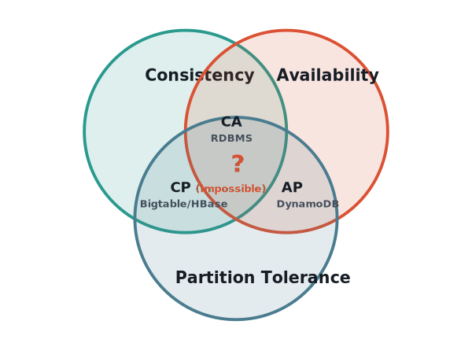
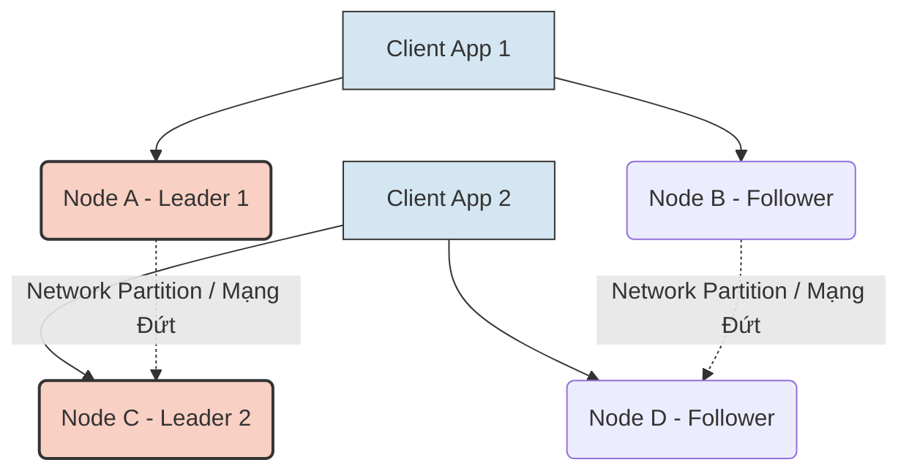

## Bài toán đứt gãy mạng trong hệ thống phân tán

Khi vận hành một Data Pipeline quy mô lớn đa khu vực (multi-region) với hàng nghìn Server, sự cố đứt gãy mạng (Network Partition) giữa các cụm máy chủ là điều không thể tránh khỏi do các yếu tố vật lý như lỗi router, rớt gói tin mạng, hoặc đứt cáp quang biển. Khi sự cố này xảy ra, hệ thống phân tán buộc phải đưa ra một quyết định kiến trúc đầy tính sống còn:

1. **Bảo vệ tính nhất quán (Consistency):** Hệ thống từ chối nhận thêm dữ liệu (ghi) và từ chối cung cấp dữ liệu (đọc) để ngăn chặn sự sai lệch thông tin giữa các node, đồng nghĩa với việc hệ thống bị gián đoạn hoạt động (Downtime).
2. **Bảo vệ tính sẵn sàng (Availability):** Hệ thống tiếp tục nhận dữ liệu ở các node đang hoạt động, chấp nhận rủi ro dữ liệu bị xung đột hoặc người dùng nhận được dữ liệu cũ (Stale Data) khi truy vấn.

Sự đánh đổi bắt buộc này chính là cốt lõi của **Định lý CAP (CAP Theorem)** do Eric Brewer công bố năm 2000 [1], và được Seth Gilbert và Nancy Lynch của MIT chứng minh toán học sau đó [2]. Đối với một Data Engineer, CAP không đơn thuần là một lý thuyết học thuật viển vông, mà là kim chỉ nam kỹ thuật quan trọng nhất để thiết kế và lựa chọn cơ sở dữ liệu phù hợp với đặc thù của từng bài toán nghiệp vụ.

## Định lý CAP: Tam giác Bất khả thi (The Impossible Triangle)


*Hình: Biểu đồ Venn minh họa Định lý CAP và các hệ thống đại diện.*

Định lý CAP phát biểu rằng: Trong một hệ thống phân tán (Distributed System) có lưu trữ và nhân bản dữ liệu (Replication), bạn chỉ có thể đảm bảo **tối đa 2 trong 3 thuộc tính** sau đây tại cùng một thời điểm:

- **C - Consistency (Tính nhất quán):** Dù người dùng truy vấn vào bất kỳ server (node) nào trong cụm cluster, họ cũng phải nhận được dữ liệu mới nhất (dữ liệu vừa được ghi thành công gần nhất) hoặc nhận được một thông báo lỗi nếu dữ liệu chưa kịp đồng bộ. Nói cách khác, hệ thống phân tán mang lại cảm giác nó đang hoạt động như một máy chủ duy nhất.
- **A - Availability (Tính sẵn sàng):** Mọi yêu cầu (Đọc/Ghi) gửi đến hệ thống đều phải nhận được phản hồi thành công (không báo lỗi server - non-error response), dù một số server trong hệ thống đang bị "chết" hoặc không thể liên lạc. Tuy nhiên, thuộc tính này không đảm bảo dữ liệu trả về là mới nhất.
- **P - Partition Tolerance (Chịu đứt gãy mạng):** Hệ thống vẫn tiếp tục hoạt động dù mạng kết nối (network) giữa các server bị đứt gãy hoàn toàn khiến các server không thể giao tiếp và đồng bộ dữ liệu với nhau.

### Tại sao "P" là yếu tố bắt buộc?

Trong thực tế vận hành các hệ thống Cloud (AWS, GCP, Azure) hoặc On-premise quy mô lớn, **sự cố đứt gãy mạng chắc chắn sẽ xảy ra** [5]. Các nguyên nhân có thể kể đến như lỗi switch mạng, rớt mạng chập chờn, hoặc quá tải CPU khiến node rơi vào trạng thái "tạm ngưng" (Garbage Collection Pause) làm đứt phiên làm việc.

Kỹ sư dữ liệu không có quyền "chọn hoặc không chọn" **P**. Thuộc tính **P** là bắt buộc để hệ thống phân tán không bị sụp đổ hoàn toàn khi có sự cố hạ tầng. Bởi vì **P là bắt buộc**, sự đánh đổi thực sự trong Định lý CAP khi mạng đứt gãy chỉ là sự lựa chọn giữa hai phương án: **CP (Consistency + Partition Tolerance)** hoặc **AP (Availability + Partition Tolerance)**. Kiến trúc **CA** trên thực tế không tồn tại trong hệ thống mạng phân tán (nó chỉ tồn tại ở các cơ sở dữ liệu truyền thống chạy trên một máy chủ đơn lẻ - Single-Node RDBMS như PostgreSQL hay MySQL cục bộ).

---

## Phân biệt: Consistency trong CAP và Consistency trong ACID

Một trong những sự nhầm lẫn phổ biến nhất trong giới kỹ sư hệ thống dữ liệu là nhầm lẫn chữ **"C"** trong **CAP** và chữ **"C"** trong **ACID** (tiêu chuẩn của RDBMS truyền thống). Chúng mang ý nghĩa hoàn toàn khác nhau:

- **Consistency trong ACID (Mức cơ sở dữ liệu):** Đề cập đến **tính toàn vẹn của dữ liệu (Data Integrity)** khi một giao dịch (Transaction) thực thi. Nó đảm bảo dữ liệu không vi phạm các ràng buộc (Constraints) như Khóa ngoại (Foreign Key), Unique constraint, hoặc các Trigger. Ví dụ: Nếu tài khoản A chuyển tiền cho tài khoản B, tổng số tiền của hệ thống trước và sau giao dịch phải giữ nguyên.
- **Consistency trong CAP (Mức hệ thống phân tán):** Đề cập đến **sự đồng bộ dữ liệu giữa các máy chủ (Node Synchronization)**. Nó đảm bảo mọi Client kết nối tới bất kỳ máy chủ nào trong hệ thống phân tán đều nhìn thấy cùng một phiên bản dữ liệu (hoặc báo lỗi nếu không thể). 

Hiểu đơn giản, ACID Consistency là quy định "dữ liệu phải đúng logic nghiệp vụ", còn CAP Consistency là quy định "dữ liệu ở mọi nơi phải giống nhau y hệt". Bạn có thể có một hệ thống RDBMS tuân thủ chuẩn ACID nhưng lại không đạt Consistency của CAP (ví dụ khi áp dụng mô hình Master-Slave Asynchronous Replication, đọc từ Slave có thể nhận dữ liệu cũ).

---

## Kiến trúc CP (Consistency + Partition Tolerance)

Khi sự cố phân mảnh mạng xảy ra, hệ thống kiến trúc CP chọn cách ngắt kết nối các node không đồng bộ kịp để bảo vệ tính toàn vẹn của dữ liệu. Hệ thống thà báo lỗi (`500 Internal Server Error`, `Timeout`) chứ quyết không trả về dữ liệu bị cũ (Stale Data).

- **Công cụ đại diện:** Google Bigtable [4], Apache HBase, MongoDB, Zookeeper, etcd, CockroachDB.
- **Use-case trong Data Engineering:** Hệ thống Core Banking, giao dịch tài chính (Financial Ledger), hệ thống quản lý kho, ví điện tử, quản lý Metadata (như Hive Metastore), hay các dịch vụ đối soát (Reconciliation) nơi mà sự chính xác của dòng tiền quan trọng hơn việc hệ thống phản hồi tức thì.

### Code Example: MongoDB Write Concern (CP Behavior)

MongoDB là một cơ sở dữ liệu NoSQL hệ CP mặc định hoạt động theo mô hình Strongly Consistent (nếu cấu hình Replica Set đúng). Để đảm bảo tính nhất quán cao nhất, Data Engineer thiết lập `w: "majority"`. Khi đó, lệnh ghi chỉ được xem là thành công nếu hơn một nửa số node đã ghi dữ liệu vào đĩa cứng.

```javascript
// Cấu hình Write Concern mức "majority" trong MongoDB
db.transactions.insertOne(
   { 
      transaction_id: "TXN12345", 
      amount: 5000, 
      status: "COMPLETED" 
   },
   { writeConcern: { w: "majority", wtimeout: 5000 } }
);
```

Nếu có sự cố mạng xảy ra khiến cụm MongoDB mất đi quá nửa số node (không đủ majority để tạo thành tập hợp quá bán), câu lệnh trên sẽ bị treo và trả về một lỗi sau 5 giây (`wtimeout`). Hệ thống hy sinh tính Sẵn sàng (Availability) để đảm bảo Tính Nhất quán (Consistency), ngăn chặn việc một node thiểu số tiếp tục ghi dữ liệu dẫn đến mâu thuẫn.

---

## Kiến trúc AP (Availability + Partition Tolerance)

Khi sự cố mạng chia cắt các datacenter, hệ thống AP vẫn tiếp tục nhận các yêu cầu đọc và ghi trên các node đang sống, bất chấp việc chúng đang bị cô lập khỏi phần còn lại của hệ thống. Hệ thống chấp nhận việc trả về dữ liệu cũ, và dựa vào cơ chế **Eventual Consistency (Nhất quán cuối cùng)** để ngầm đồng bộ lại dữ liệu sau khi kết nối mạng được khôi phục.

- **Công cụ đại diện:** Amazon DynamoDB [3], Apache Cassandra, CouchDB, Riak.
- **Use-case trong Data Engineering:** Hệ thống thu thập Clickstream (hành vi người dùng), Log Analytics, Giỏ hàng thương mại điện tử (Shopping Cart - như Amazon), đếm lượt xem (View Counter), hệ thống Recommendation (Gợi ý sản phẩm), và hệ thống IoT Sensor Ingestion. Trong các hệ thống này, việc người dùng thỉnh thoảng thấy số lượt "Like" không chính xác vài giây ít nguy hiểm hơn nhiều so với việc ứng dụng bị sập, từ chối người dùng thêm hàng vào giỏ.

### Code Example: Cassandra Consistency Levels (AP Behavior)

Apache Cassandra cho phép nhà phát triển tinh chỉnh tính linh hoạt của hệ thống (tunable consistency) thông qua thông số `ConsistencyLevel`. Với mô hình AP đề cao tốc độ và chống chịu lỗi, chúng ta thường để mức độ đọc/ghi là `ONE`.

```java
// Cấu hình Write Consistency Level là ONE trong Cassandra bằng Java DataStax Driver
Statement statement = new SimpleStatement("INSERT INTO user_clicks (user_id, page, timestamp) VALUES (?, ?, ?)", 
    "user_789", "/home", System.currentTimeMillis());

// Chỉ cần 1 node Replica xác nhận là thao tác ghi thành công và trả phản hồi cho Client ngay.
// Nếu mạng bị đứt, dữ liệu vẫn được ghi cục bộ và chờ đồng bộ cho các node khác sau thông qua Hinted Handoff.
statement.setConsistencyLevel(ConsistencyLevel.ONE);
session.execute(statement);
```

Khi dùng `ConsistencyLevel.ONE`, hệ thống đạt mức Available cao nhất. Tuy nhiên, dữ liệu của bạn có thể trả về lỗi thời (stale) nếu có một truy vấn Đọc (Read) kết nối đến một node khác trước khi node này kịp sử dụng giao thức Gossip để lan truyền (đồng bộ) dữ liệu mới đi khắp cluster.

### Các Mô Hình Nhất Quán Trong Kiến Trúc AP

Trong thiết kế AP, để khắc phục nhược điểm "dữ liệu cũ", các Data Engineer có thể áp dụng các mô hình nới lỏng (relaxed consistency models):
1. **Causal Consistency (Nhất quán nhân quả):** Các thao tác có liên quan đến nhau (Nhân - Quả) sẽ được hiển thị đúng thứ tự. Ví dụ: Nếu User A bình luận, User B trả lời bình luận đó, hệ thống đảm bảo luôn hiển thị bình luận của A trước bình luận B ở bất kỳ truy vấn nào.
2. **Eventual Consistency (Nhất quán cuối cùng):** Hệ thống hoàn toàn không quan tâm thứ tự, các node độc lập cập nhật và dùng cơ chế **Gossip Protocol**, **Read Repair** (sửa dữ liệu sai lúc đọc), hoặc **Anti-Entropy** (dùng Merkle Trees) để tự động hàn gắn dữ liệu ngầm ở dưới.

---

## Xử lý Xung đột Split-Brain và Cơ chế Quorum

Một rủi ro cấp độ kiến trúc cực kỳ nghiêm trọng khi đứt gãy mạng là hiện tượng **Split-Brain** [5].

Ví dụ: Bạn có một cụm Kafka hoặc Zookeeper gồm 4 node (A, B, C, D) đang điều phối Cluster. Mạng bị đứt ở giữa: Nhóm (A, B) không nhìn thấy Nhóm (C, D). Cả hai nhóm đều nghĩ rằng nửa kia đã "chết". Do cấu hình sai, Nhóm (A, B) tự bầu A làm Leader; Nhóm (C, D) cũng tự bầu C làm Leader. 
Hệ quả là hệ thống chạy với **hai Leader song song** (não bị chẻ đôi - Split Brain), cùng tiếp nhận dữ liệu thao tác từ Client dẫn đến hỏng hóc cấu trúc lưu trữ (Data Corruption) nghiêm trọng mà không thể tự hợp nhất được nữa.


*Sơ đồ: Hiện tượng Split-Brain khi Cluster phân rã thành hai nhóm cô lập nhưng cùng có Leader độc lập.*

### Giải pháp Quorum (Đa số) và Công thức Toán học

Để ngăn chặn Split-Brain, các hệ thống bắt buộc sử dụng nguyên lý đồng thuận **Quorum (Đa số)**. Quorum yêu cầu hệ thống phải luôn duy trì số node tham gia bỏ phiếu là số lẻ (3, 5, 7, 9) và tuân theo công thức kinh điển để đảm bảo Strong Consistency (Nhất quán mạnh):

**`W + R > N`**

- `N`: Tổng số node trong Replica.
- `W`: Số node cần xác nhận Ghi (Write Quorum) thành công.
- `R`: Số node cần tham gia vào quá trình Đọc (Read Quorum).

**Kịch bản phân giải Split-Brain:**
Nếu ta có một cụm 5 nodes (N=5), và cấu hình W=3, R=3. Quá trình đứt gãy cáp mạng phân tách hệ thống thành một cụm 3 node và một cụm 2 node.
- Nhóm 3 node nhận ra mình vẫn đủ `majority` (đạt W=3, tức là $> 5/2$) nên nó tiếp tục nhận dữ liệu, duy trì hoạt động.
- Nhóm 2 node nhận ra mình không đủ đa số nên nó sẽ tự động khoá lại (chuyển sang trạng thái Read-only) hoặc tắt hẳn để tránh nhận lệnh Ghi mâu thuẫn. 
Nhờ cơ chế Quorum, bài toán Split-Brain bị chặn đứng hoàn toàn. Data Engineer luôn nằm lòng quy tắc: *Triển khai Cluster cho Zookeeper/Kafka Controller/etcd phải luôn là số lẻ (3, 5, 7 node).*

---

## Bức tranh lớn hơn: Từ CAP đến PACELC Theorem

CAP Theorem có một lỗ hổng gây tranh cãi: Nó chỉ đề cập đến hệ thống **trong lúc xảy ra sự cố mạng (Partition)**. Vậy trong điều kiện bình thường không đứt mạng, hệ thống vận hành theo nguyên lý nào? Sự ra đời của định lý **PACELC** (do Daniel Abadi công bố năm 2010) đã lấp đầy hoàn toàn khoảng trống lý thuyết này.

PACELC phát biểu theo công thức phân nhánh:
- Khi có sự cố đứt gãy mạng (**P**), bạn phải chọn giữa Availability (**A**) và Consistency (**C**). (Giống hệt định lý CAP).
- Nhưng (**E**lse - trong điều kiện bình thường, không đứt mạng), bạn phải đối mặt với sự đánh đổi giữa Latency (**L** - Độ trễ) và Consistency (**C**).

**Ví dụ thực tiễn:** 
- **Cassandra** là hệ thống theo cấu hình **PA/EL**. Khi mạng đứt (P), nó chọn Availability (A). Nhưng khi mạng bình thường (E), nó lại ưu tiên phản hồi siêu nhanh - Low Latency (L) - thay vì bắt Client phải chờ đồng bộ hóa ngay lập tức toàn bộ các node (C).
- **HBase** hoặc **MongoDB** lại thuộc nhóm **PC/EC**. Dù mạng có đứt hay mạng bình thường mượt mà, chúng luôn luôn ưu tiên Consistency (C), chấp nhận thời gian trả về kết quả (Latency) chậm hơn để đảm bảo dữ liệu toàn vẹn.

*(Xem thêm bài viết chuyên sâu về định lý PACELC trong cùng chủ đề để hiểu rõ hơn cách hệ thống đánh đổi Độ trễ).*

---

## Kinh nghiệm Thực chiến (Best Practices) cho Data Engineer

Khi xây dựng Data Platform hay Data Lakehouse hiện đại, bạn không bao giờ dùng một công cụ duy nhất để giải quyết tất cả. Thay vào đó, bạn sẽ kết hợp nhiều công cụ với cấu hình CAP khác nhau tùy thuộc vào nghiệp vụ ở từng Layer:

1. **Ingestion Layer (Tầng thu thập dữ liệu):**
   - Sự ổn định và thông lượng (Throughput) là vua. Nếu sự kiện click chuột hay log ứng dụng không được ghi nhận, dữ liệu có thể mất vĩnh viễn. 
   - **Lựa chọn:** Cấu hình **AP** cho các Message Broker/Event Streaming (Kafka với `acks=1` hoặc `acks=0`) để tối đa hoá tốc độ tiếp nhận.

2. **Storage / Processing Layer (Tầng lưu trữ và xử lý tính toán):**
   - Đảm bảo dữ liệu phân tích không bị sai. Các framework tính toán phân tán (Apache Spark, Apache Flink) cần đọc dữ liệu chuẩn xác nhất để thực hiện Aggregation, JOIN, hoặc cấp phát số liệu tài chính.
   - **Lựa chọn:** Sử dụng kiến trúc **CP** (HDFS, Amazon S3 theo chuẩn Strongly Consistent mới nhất, HBase) hoặc sử dụng các cơ chế ACID Transaction mạnh mẽ của Delta Lake / Apache Iceberg.

3. **Serving Layer (Tầng phục vụ truy vấn):**
   - Đối với API phục vụ người dùng cuối trực tiếp hoặc Dashboard cho phân tích viên, thời gian phản hồi (Latency) và Availability (không sập web) thường quan trọng hơn độ chính xác tuyệt đối ngay tại thời gian thực (trừ API lõi của mảng tài chính).
   - **Lựa chọn:** Thường sử dụng các hệ thống **AP** như Redis Cluster, Elasticsearch, hoặc Cassandra, chấp nhận cập nhật dữ liệu với một độ trễ nhỏ (Eventual Consistency) miễn là truy vấn trả về < 10ms.

Tóm lại, trong ngành kỹ thuật dữ liệu, nguyên lý **"One size does not fit all"** luôn đúng. Định lý CAP nhắc nhở các kỹ sư rằng không có "cơ sở dữ liệu hoàn hảo". Hiểu rõ các Trade-offs (sự đánh đổi), biết khi nào cần Nhất quán và khi nào cần Sẵn sàng, mới là kỹ năng quan trọng nhất để tạo nên một Senior Data Engineer thực thụ.

---

## Tài Liệu Tham Khảo

- [1] [Towards Robust Distributed Systems](https://www.cs.berkeley.edu/~brewer/cs262b-2004/PODC-keynote.pdf) - Brewer, E. A. (Tài liệu gốc của tác giả Eric Brewer công bố tại hội nghị PODC 2000).
- [2] [Perspectives on the CAP Theorem](https://groups.csail.mit.edu/tds/papers/Gilbert/Brewer2.pdf) - Gilbert, S., & Lynch, N. (Bản chứng minh toán học định lý CAP của MIT, xuất bản trên IEEE Computer).
- [3] [Dynamo: Amazon's Highly Available Key-value Store](https://www.allthingsdistributed.com/files/amazon-dynamo-sosp2007.pdf) - DeCandia, G., et al. (Whitepaper của Amazon giải thích việc chọn kiến trúc AP và Eventual Consistency để cứu hệ thống giỏ hàng).
- [4] [Bigtable: A Distributed Storage System for Structured Data](https://static.googleusercontent.com/media/research.google.com/en//archive/bigtable-osdi06.pdf) - Chang, F., et al. (Whitepaper của Google giải thích kiến trúc CP của Bigtable, nền tảng của hệ thống HBase).
- [5] [Designing Data-Intensive Applications](https://dataintensive.net/) - Martin Kleppmann (Sách: Chương 8 và 9 mổ xẻ trực tiếp về Network Faults, Split-Brain và Consensus Quorum - Cuốn sách gối đầu giường của mọi Data Engineer).
