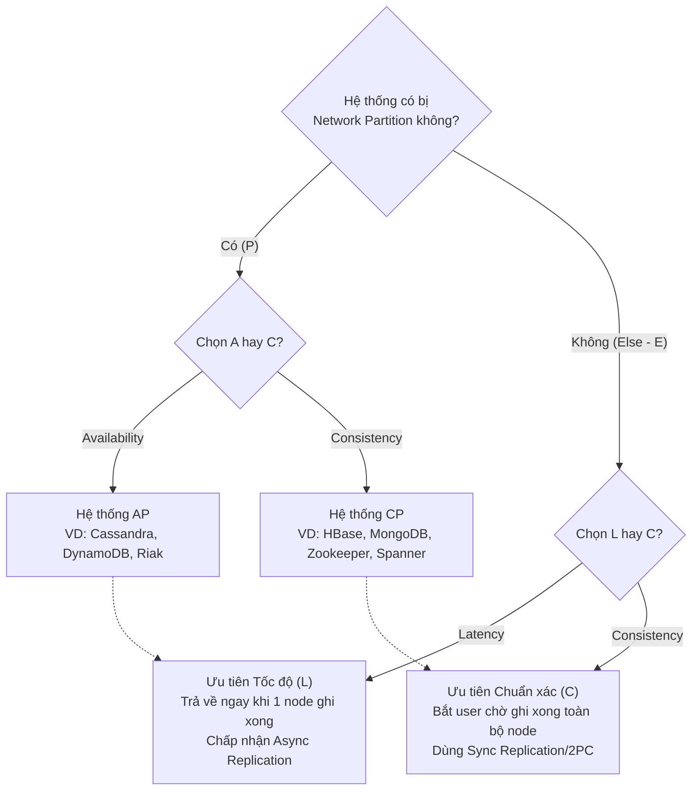

Một trong những bài học đắt giá nhất đối với một Kỹ sư Hệ thống Dữ liệu (Data Engineer) là việc nhận ra rằng cơ sở dữ liệu không bao giờ hoàn hảo. Khi quy mô hạ tầng của bạn mở rộng ra hàng trăm node, vượt qua các ranh giới địa lý (multi-region/multi-datacenter), sự cố về mạng (Network Partition) không còn là câu hỏi "Có xảy ra hay không?", mà là **"Khi nào thì xảy ra?"**.

Để thiết kế một hệ thống Data Pipeline hoặc một Data Warehouse sống sót qua các thảm họa này, **Định lý CAP (CAP Theorem)** và bản nâng cấp của nó là **PACELC**, đóng vai trò là những bộ quy tắc vật lý không thể bị phá vỡ. Đứng dưới góc độ của một Staff Engineer, chúng ta không dùng CAP để tranh luận lý thuyết, mà dùng nó để đưa ra các quyết định cấu hình (Configuration Trade-offs) định đoạt sống còn của hệ thống.

---

## 1. Tam Giác Bất Khả Thi CAP và Sự Bắt Buộc của "P"

Định lý CAP, được Eric Brewer đưa ra vào năm 2000, khẳng định rằng trong một hệ thống dữ liệu phân tán, bạn chỉ có thể đạt được tối đa 2 trong 3 thuộc tính sau:

1.  **Consistency (C - Tính Nhất quán):** Mọi thao tác Đọc (Read) đều nhận được bản ghi mới nhất vừa được Ghi (Write) thành công, hoặc nhận được báo lỗi. Không bao giờ có chuyện user này đọc thấy dữ liệu cũ, user kia thấy dữ liệu mới (No Stale Data).
2.  **Availability (A - Tính Sẵn sàng):** Mọi request không báo lỗi (non-failing node) đều nhận được phản hồi, dù đó có thể là dữ liệu cũ (Stale data). Hệ thống không bao giờ được phép chặn user.
3.  **Partition Tolerance (P - Chịu đứt gãy mạng):** Hệ thống vẫn tiếp tục vận hành bình thường dù các bản tin bị rớt, hoặc mất kết nối mạng toàn phần giữa một số node với nhau (Ví dụ: Đứt cáp quang giữa Datacenter A và B).

**Sự ngộ nhận chết người thường gặp:** Rất nhiều tài liệu trên mạng nói rằng bạn có thể tự do chọn CA, CP, hoặc AP. Điều này là **HOÀN TOÀN SAI LẦM** đối với thiết kế hệ thống mạng phân tán (Distributed Systems).
Trong mạng máy tính thực tế, cáp mạng bị đứt, switch router bị quá tải, hay các chu kỳ GC Pause dài của Java JVM đều sẽ gây ra hiện tượng đứt mạng cục bộ (Partition - P). Việc từ chối "P" đồng nghĩa với việc hệ thống của bạn chỉ có thể chạy trên 1 máy chủ vật lý duy nhất (Single-node RDBMS). 

Do đó, **P là điều hiển nhiên bắt buộc phải có**. Khi sự cố P xảy ra, một Staff Engineer chỉ có một quyền chọn duy nhất: Đánh đổi **C** (tắt hệ thống để bảo vệ tính toàn vẹn dữ liệu) hay đánh đổi **A** (tiếp tục phục vụ user bằng dữ liệu cũ/rác).

---

## 2. Split-Brain và Nguyên Lý Quorum Toán Học

Thảm họa kinh hoàng nhất khi đứt gãy mạng (Partition) xảy ra được gọi là **Split-Brain** (Phân mảnh não).

Hãy tưởng tượng một cụm Elasticsearch hoặc Kafka có 4 node. Mạng đột ngột đứt ngang, chia đôi thành 2 cụm (2 node mỗi bên). Nếu hệ thống được cấu hình ưu tiên Availability (A), mỗi bên sẽ tưởng bên kia đã chết và tự bầu một Leader mới. Cả hai Leader song song nhận dữ liệu ghi (Write) từ các user khác nhau. 
Kết quả? Dữ liệu phân tách thành 2 dòng thời gian (Timeline) và bị hỏng vĩnh viễn (Data Corruption). Khi mạng kết nối lại, hệ thống không thể tự merge 2 timeline này.

### Quorum: Phương trình Toán học chặn đứng Split-Brain

Để đảm bảo Consistency (C) khi bị chia cắt, hệ thống bắt buộc phải cấu hình nguyên tắc **Quorum (Đa số)**. Phương trình Quorum kinh điển:
**`W + R > N`**

-   `N`: Tổng số node (Replication factor). Phải luôn là số lẻ (3, 5, 7) để tránh hòa phiếu.
-   `W`: Số node tối thiểu phải xác nhận Ghi (Write) thành công.
-   `R`: Số node phải truy vấn để Đọc (Read) thành công.

**Thực chiến: Cấu hình Kafka (Hệ thống CP / Strong Consistency)**
Giả sử bạn triển khai một topic Kafka lưu trữ giao dịch tài chính với `N=3`.
Để hệ thống hoàn toàn chống mất dữ liệu và tránh Split-Brain, bạn bắt buộc phải cấu hình:

```properties
# 1. Server config (Kafka broker)
# Yêu cầu ít nhất 2 replicas phải đồng bộ mới cho phép Ghi
min.insync.replicas=2

# 2. Producer config (Client)
# Producer phải chờ tất cả in-sync replicas (ISR) phản hồi
acks=all
```

Phân tích toán học: `W=2` (Leader + ít nhất 1 Follower phải ghi xong mới báo Success). `R` trong Kafka mặc định chỉ đọc từ Leader nên `R=1` là đủ. (`2 + 1 > 3` thỏa mãn Quorum).
Khi mạng bị đứt, nếu một bên chỉ còn 1 broker, nó sẽ không thỏa mãn `min.insync.replicas=2`. Lệnh ghi của Producer sẽ lập tức bị từ chối bằng một Exception. Kafka đã chủ động **hy sinh Tính Sẵn Sàng (A) để bảo toàn Tính Nhất Quán (C)**.

---

## 3. Kiến Trúc AP (Availability) trong Thực Chiến

Tuy nhiên, không phải bài toán nào cũng cần sự hoàn hảo. Đối với các hệ thống Tracking Hành vi người dùng (Clickstream, Giỏ hàng) hoặc hệ thống IoT Ingestion, việc "không bao giờ bỏ sót sự kiện" quan trọng hơn việc "dữ liệu phải chính xác tới từng mili-giây". Đó là đất diễn của các hệ thống ưu tiên Availability (AP) như Apache Cassandra, Amazon DynamoDB.

**Thực chiến: Cấu hình Cassandra bằng CQL (Cassandra Query Language)**
Cassandra cho phép bạn chỉnh độ nhất quán (Tunable Consistency) trên từng câu Query.

```sql
-- Cấu hình Keyspace với Replication Factor = 3 (N=3)
CREATE KEYSPACE user_tracking 
WITH replication = {'class': 'NetworkTopologyStrategy', 'us-east': 3};

-- Khi insert sự kiện click của user, ta chỉ cần 1 node xác nhận (W=1) 
-- Việc này tăng tối đa tốc độ ghi (Low Latency) và Sẵn sàng (Availability), 
-- nhưng đánh đổi lại, dữ liệu có thể bị cũ nếu đọc ngay lập tức.
CONSISTENCY ONE;
INSERT INTO user_tracking.events (user_id, event_type, ts) 
VALUES (123, 'click', toTimestamp(now()));

-- Để đọc chính xác, ta ép hệ thống phải đọc từ Quorum (R=2)
-- Phương trình W(1) + R(2) = 3 (Không lớn hơn N). Dữ liệu có thể bị Stale!
CONSISTENCY QUORUM;
SELECT * FROM user_tracking.events WHERE user_id = 123;
```

Cassandra áp dụng triết lý **Eventual Consistency** (Nhất quán cuối cùng). Ngay cả khi mạng rớt, các tính năng nền tảng như *Hinted Handoff* (ghi nháp tạm thời sang node khác), *Read Repair* (sửa chữa dữ liệu ngầm khi truy vấn), và *Gossip Protocol* sẽ âm thầm lan truyền và đồng bộ lại trạng thái. Người dùng có thể thấy số view video hiển thị chậm một chút, nhưng server không bao giờ quăng lỗi HTTP 500.

---

## 4. PACELC Theorem: Bức Tranh Toàn Cảnh Về Độ Trễ

CAP có một lỗ hổng lý thuyết rất lớn: Nó chỉ giải thích hành vi của hệ thống *khi bị đứt mạng*. Vậy nếu mạng hoàn toàn bình thường (không có Partition), hệ thống đánh đổi điều gì? 
Vào năm 2010, Giáo sư Daniel Abadi từ Yale đã công bố **PACELC** để bù đắp lỗ hổng này.

Công thức PACELC:
-   **P** (Partition): Nếu có đứt mạng, bạn chọn **A** (Availability) hay **C** (Consistency)?
-   **E** (Else): Nếu bình thường (Không có sự cố), bạn chọn **L** (Latency - Độ trễ thấp) hay **C** (Consistency - Đồng bộ mạnh)?

### PACELC Decision Tree



**Phân loại Hệ cơ sở dữ liệu theo PACELC:**
1.  **Cassandra / DynamoDB (PA/EL):** Khi đứt mạng chọn Sẵn sàng (PA). Khi mạng bình thường, chọn Độ trễ siêu thấp (EL) bằng cách không bắt các node phải đồng bộ toàn phần ngay lập tức. Cực kỳ phù hợp cho High-throughput Data Ingestion.
2.  **HBase / MongoDB / TiDB (PC/EC):** Khi đứt mạng chọn Nhất quán (PC). Khi bình thường cũng chọn Nhất quán (EC), luôn ưu tiên tính toàn vẹn dữ liệu. Bắt buộc dùng cho giao dịch tài chính (Financial Ledger) hoặc Core Banking.

---

## 5. Cạm Bẫy (Gotchas) Dành Cho Staff Engineer

1.  **Hiểu lầm C của CAP và C của ACID:** Chữ C trong ACID (Relational DB) nói về *ràng buộc logic* (Foreign key, Unique Constraint). Chữ C trong CAP nói về *đồng bộ bit mức độ vật lý* giữa các máy chủ phân tán (Linearizability). Đừng nhầm lẫn khi phỏng vấn System Design!
2.  **Sự đánh đổi không phải là Nhị phân (Binary):** Các hệ thống hiện đại không bắt bạn chọn Trắng/Đen. Ví dụ, Azure CosmosDB cho phép **Tunable Consistency** với 5 mức độ: *Strong, Bounded Staleness (chỉ cho phép cũ tối đa 5 giây hoặc 100 phiên bản), Session, Consistent Prefix, Eventual*. Tùy vào Use-case mà bạn vặn nút điều chỉnh.
3.  **Ảo tưởng về Cloud Network:** Hạ tầng AWS/GCP cực kỳ bền bỉ nhưng sự kiện AWS re:Invent hàng năm vẫn có các bài mổ xẻ sự cố đứt toàn bộ một AZ (Availability Zone) vì lý do chập điện, đứt cáp. Đừng bao giờ hardcode Data Pipeline của bạn dựa trên giả định ngây thơ là "Mạng không bao giờ rớt".

---

## Nguồn Tham Khảo [References]
- [Towards Robust Distributed Systems - Eric Brewer (2000)](https://people.eecs.berkeley.edu/~brewer/cs262b-2004/PODC-keynote.pdf)
- [Problems with CAP, and Yahoo’s little known NoSQL system (PACELC) - Daniel Abadi (2010)](http://dbmsmusings.blogspot.com/2010/04/problems-with-cap-and-yahoos-little.html)
- [Designing Data-Intensive Applications - Martin Kleppmann](https://dataintensive.net/) (Chương 9: Consistency and Consensus)
