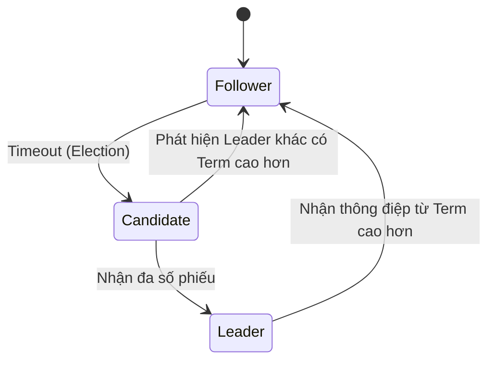

Các thuật toán đồng thuận (Consensus Algorithms) như Raft hay Paxos là trái tim của các hệ thống cơ sở dữ liệu và message queue phân tán hiện đại (như Apache Kafka, Zookeeper, etcd, MongoDB, Cassandra). Chúng giải quyết bài toán cốt lõi: **Làm thế nào để một cụm máy chủ (cluster) đi đến một quyết định thống nhất về trạng thái dữ liệu, ngay cả khi một số máy chủ bị hỏng, mạng bị đứt đoạn, hoặc tin nhắn bị trễ?**

Trong Kỹ thuật Dữ liệu (Data Engineering), sự đồng thuận đảm bảo tính toàn vẹn và nhất quán của dữ liệu. Nếu không có thuật toán đồng thuận, hệ thống có thể rơi vào trạng thái "Split-brain" (não chia đôi), nơi hai phần của cụm đều tự nhận mình là Leader và ghi nhận các luồng dữ liệu xung đột nhau, dẫn đến dữ liệu bị hỏng vĩnh viễn (Data Corruption).

## 1. Bài toán Đồng thuận Phân tán (Distributed Consensus)

Đồng thuận phân tán là quá trình nhiều node trong mạng cùng đồng ý về một "giá trị" hoặc một "chuỗi các hành động". Để một thuật toán đồng thuận được coi là an toàn và hoạt động tốt, nó phải thoả mãn 3 tính chất:
1. **Agreement (Sự thống nhất):** Tất cả các node bình thường (non-faulty nodes) phải đồng ý cùng một giá trị.
2. **Validity (Tính hợp lệ):** Giá trị được đồng ý phải được đề xuất bởi một node trong hệ thống (không phải giá trị rác).
3. **Termination (Tính hoàn tất):** Mọi node bình thường cuối cùng đều phải đi đến một quyết định (không bị treo vĩnh viễn).

Trong môi trường thực tế (Asynchronous Network), định lý FLP (Fischer, Lynch, Paterson) đã chứng minh rằng không có thuật toán đồng thuận nào có thể đảm bảo cả 3 tính chất trên nếu có dù chỉ 1 node bị lỗi. Do đó, Paxos và Raft phải đánh đổi: Chúng ưu tiên **An toàn (Safety)** và hy sinh **Liveness** (có thể bị treo tạm thời nếu mạng quá bất ổn).

## 2. Thuật toán Paxos: Nền tảng lý thuyết

Được Leslie Lamport giới thiệu vào năm 1989, Paxos là thuật toán đồng thuận phân tán đầu tiên được chứng minh toán học là an toàn tuyệt đối trong môi trường mạng không đáng tin cậy (Fail-stop model).

### Cơ chế hoạt động của Paxos
Paxos chia các node thành 3 vai trò (một node có thể kiêm nhiệm nhiều vai trò):
- **Proposer:** Đề xuất một giá trị.
- **Acceptor:** Bỏ phiếu (Vote) cho giá trị được đề xuất.
- **Learner:** Ghi nhận và lưu trữ giá trị đã đạt được đồng thuận.

Quá trình đồng thuận của Basic Paxos diễn ra qua 2 giai đoạn (Phases):
- **Phase 1 (Prepare/Promise):** Proposer sinh ra một mã định danh (Proposal ID) lớn hơn mọi ID trước đó và gửi yêu cầu `Prepare(ID)` tới đa số Acceptors. Nếu ID lớn hơn mọi ID mà Acceptor từng thấy, Acceptor trả lời `Promise` (hứa không nhận ID nhỏ hơn nữa).
- **Phase 2 (Accept/Accepted):** Khi Proposer nhận được đa số `Promise`, nó gửi yêu cầu `Accept(ID, Value)`. Các Acceptors ghi nhận giá trị này và báo cho Learner.

### Tại sao Paxos lại khó triển khai?
- Basic Paxos chỉ đồng thuận được **một giá trị duy nhất**. Để tạo ra một chuỗi log ghi nhận dữ liệu (Replicated Log), người ta phải ghép nhiều vòng Paxos lại với nhau thành **Multi-Paxos**.
- Bài báo gốc của Lamport cực kỳ hàn lâm và trừu tượng. Việc chuyển đổi từ lý thuyết Paxos sang một hệ thống phần mềm thực tế (như Google Spanner hay Chubby) đòi hỏi các kỹ sư phải tự giải quyết hàng tá các edge-cases không có trong lý thuyết.

## 3. Thuật toán Raft: Sinh ra để con người có thể hiểu được

Vì Paxos quá phức tạp, Diego Ongaro và John Ousterhout từ Đại học Stanford đã tạo ra Raft vào năm 2014 với mục tiêu tối thượng: **Dễ hiểu (Understandability)** nhưng vẫn an toàn tương đương Paxos.

Raft phân rã bài toán đồng thuận thành 3 vấn đề phụ độc lập:
1. **Leader Election (Bầu cử Leader):** Chọn ra một máy chủ độc quyền xử lý các yêu cầu ghi dữ liệu.
2. **Log Replication (Sao chép Log):** Leader đồng bộ hoá dữ liệu tới các Follower.
3. **Safety (Tính an toàn):** Đảm bảo log không bị ghi đè sai lệch nếu có Leader mới.

*Hình: Vòng đời chuyển đổi trạng thái của các node trong thuật toán Raft.*

### Cơ chế Bầu cử (Leader Election)
Trong Raft, mọi node bắt đầu là **Follower**. Nếu một Follower không nhận được heartbeat (tín hiệu sống) từ Leader trong một khoảng thời gian ngẫu nhiên (Election Timeout), nó sẽ tự ứng cử làm **Candidate**, tăng "nhiệm kỳ" (Term) lên 1 và gửi yêu cầu xin phiếu (RequestVote) tới các node khác. 
Nếu nó nhận được đa số phiếu (Quorum), nó trở thành **Leader**. Việc dùng khoảng thời gian timeout ngẫu nhiên (Randomized Timeout) giúp hạn chế tình trạng 2 node cùng ứng cử dẫn đến hoà phiếu (Split Vote).

### Sao chép Log (Log Replication)
Khi Client gửi dữ liệu cho Leader, Leader ghi dữ liệu vào log nhưng chưa commit. Nó gửi log này cho các Follower (AppendEntries). Khi đa số Follower phản hồi đã nhận được, Leader chính thức commit log, áp dụng vào State Machine và báo lại cho Client.

## 4. So sánh & Đánh đổi (Trade-offs)

| Tiêu chí | Paxos / Multi-Paxos | Raft |
| :--- | :--- | :--- |
| **Tính dễ hiểu & Triển khai** | Cực kỳ phức tạp. Thường được tùy biến mạnh tay bởi các tập đoàn (Google, AWS). | Rất trực quan. Thư viện chuẩn hoá có sẵn trên mọi ngôn ngữ. |
| **Cấu trúc Leader** | Peer-to-peer hoặc có Leader (Multi-Paxos). Mọi node đều có thể đề xuất (Propose). | Strong Leader. Chỉ Leader mới được phép tương tác ghi dữ liệu với Client. |
| **Luồng dữ liệu (Data Flow)** | Dữ liệu có thể đi theo nhiều chiều, các node đàm phán độc lập. | Dòng chảy một chiều (One-way): Từ Leader xuống Follower. |
| **Hiệu năng & Scalability** | Rất cao nếu được tối ưu riêng lẻ. Ít nút thắt cổ chai ở Leader. | Leader có thể trở thành nút thắt cổ chai mạng (Network Bottleneck) nếu chịu tải quá lớn. |

**Hệ sinh thái:**
- **Raft:** etcd (Kubernetes), Consul, CockroachDB, TiDB, Neo4j, Apache Kafka (KRaft mode).
- **Paxos:** Google Spanner, Amazon DynamoDB, Apache Cassandra (Lightweight Paxos), Neo4j (bản cũ).

## Tài Liệu Tham Khảo
* [In Search of an Understandable Consensus Algorithm (Raft) - Diego Ongaro, John Ousterhout](https://raft.github.io/raft.pdf)
* [Paxos Made Simple - Leslie Lamport](https://lamport.azurewebsites.net/pubs/paxos-simple.pdf)
* [Designing Data-Intensive Applications - Martin Kleppmann (Part 2: Distributed Data)](https://dataintensive.net/)
* [The Part-Time Parliament (Original Paxos) - Leslie Lamport](https://lamport.azurewebsites.net/pubs/lamport-paxos.pdf)
* **Apache Kafka: KIP-500 (Replace ZooKeeper with a Self-Managed Metadata Quorum)**
