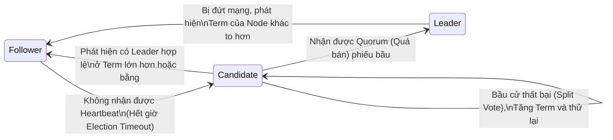

Một hệ cơ sở dữ liệu phân tán (như Apache Kafka, Cassandra, hay etcd) có thể được ví như một dàn nhạc giao hưởng khổng lồ với hàng chục nhạc công (Các Node/Server). Nếu không có một nhạc trưởng (Leader) kiểm soát nhịp điệu và bản phổ, dàn nhạc sẽ trở nên hỗn loạn. Quá trình chọn ra nhạc trưởng và thống nhất tuyệt đối về bản nhạc mà mọi người phải chơi cùng nhau được gọi là **Bài toán Đồng thuận Phân tán (Distributed Consensus)**.

Đối với một Kỹ sư Hệ thống hoặc Data Engineer cấp cao, việc hiểu rõ sự khác biệt giữa Raft và Paxos không phải để trả lời phỏng vấn học thuật, mà để biết cách cấu hình, xử lý sự cố (Troubleshooting) và phục hồi thảm họa (Disaster Recovery) khi cụm Broker Kafka của công ty đột nhiên "treo" (Stalled) hoặc gặp hội chứng "Split-Brain" (Đa nhân cách).

---

## 1. Nền Tảng Lý Thuyết: FLP Impossibility (Sự Bất Khả Thi FLP)

Năm 1985, ba nhà khoa học máy tính Fischer, Lynch, và Paterson đã chứng minh một định lý chấn động nền tảng khoa học máy tính: **Định lý FLP (FLP Impossibility)**.

Định lý phát biểu rằng: Trong một môi trường mạng bất đồng bộ (Asynchronous network - nơi thông điệp có thể bị kẹt hoặc trễ với thời gian không thể đoán trước), **KHÔNG CÓ BẤT KỲ thuật toán đồng thuận nào** có thể đảm bảo 100% cả hai yếu tố sau nếu có dù chỉ 1 node bị chết (Crash):

1. **Safety (Tính An toàn):** Hệ thống không bao giờ đồng thuận ra 2 kết quả trái ngược nhau. Nếu Node A ghi là $X=5$, thì Node B tuyệt đối không được ghi là $X=10$. (Tránh Split-Brain).
2. **Liveness (Tính Sống sót):** Hệ thống chắc chắn sẽ hoàn tất việc đưa ra quyết định (Không bị treo vĩnh viễn) sau một khoảng thời gian hữu hạn.

Vì sự khắc nghiệt của định lý FLP, tất cả các thuật toán đồng thuận thực tiễn (Bao gồm cả Paxos và Raft) đều chọn **Đánh đổi Liveness để bảo vệ Safety**. 
Nghĩa là: Trong tình huống mạng tồi tệ (Bão mạng - Network Partition), cụm Cluster thà "đóng băng" (Từ chối phục vụ, báo lỗi Timeout cho Client) chứ tuyệt đối không bao giờ ghi sai dữ liệu gây mất tính nhất quán.

---

## 2. Paxos: Đỉnh Cao Hàn Lâm nhưng Cay Đắng Thực Tiễn

Do Leslie Lamport (Người đoạt giải Turing) sáng tạo năm 1989, Paxos là thuật toán đầu tiên vượt qua được môi trường bất đồng bộ để đảm bảo Safety tuyệt đối. 

Cơ chế của nó cực kỳ phức tạp, liên quan đến việc các Node có thể đóng nhiều vai trò cùng lúc (Proposer - Người đề xuất, Acceptor - Người biểu quyết, Learner - Người ghi nhận) và tương tác qua 2 pha bắt tay (2-Phase Commit mở rộng):
- **Pha 1 (Prepare / Promise):** Xin quyền phát biểu.
- **Pha 2 (Accept / Accepted):** Chốt hạ giá trị.

**Hạn chế kỹ thuật "Chết người" của Paxos:**
Paxos gốc (Basic Paxos) được toán học chứng minh là hoàn hảo, nhưng nó chỉ đồng thuận được **Một giá trị duy nhất**. Để tạo ra một chuỗi Log dữ liệu dài vô tận (Replicated State Machine) cho Database, ta cần **Multi-Paxos**. 

Lamport không hướng dẫn chi tiết cách lập trình Multi-Paxos. Hậu quả là các kỹ sư tại Google (Spanner, Chubby) hay AWS (Dynamo) phải tự "chế" ra hàng tá biến thể phức tạp (Custom implementations). Code trở nên vô cùng rối rắm, cực kỳ khó Maintain và Debug khi có Bug xảy ra trên Production.

---

## 3. Raft: Chế Ngự Sự Phức Tạp (Understandability)

Nhận thấy sự bế tắc của Paxos trong giới kỹ sư, năm 2014, Diego Ongaro và John Ousterhout (Đại học Stanford) tạo ra **Raft**. Mục tiêu tối thượng của Raft: Tạo ra một thuật toán đồng thuận dễ hiểu, dễ lập trình, dễ Debug, nhưng an toàn tương đương Paxos.

Thay vì để các Node ngang hàng nhau đàm phán hỗn loạn như Paxos, Raft chia nhỏ bài toán bằng thiết chế **"Strong Leader" (Lãnh đạo độc tài)**.

Raft phân chia bài toán thành 3 thành phần cốt lõi: Leader Election, Log Replication, và Safety.

### 3.1. Bầu Cử Nhạc Trưởng (Leader Election)
Mọi Node trong Raft tại mọi thời điểm chỉ có thể nằm ở 1 trong 3 trạng thái: `Follower` (Lính lác), `Candidate` (Ứng cử viên), hoặc `Leader` (Lãnh đạo).

**Sự thiên tài của Randomized Timeout:**
Để tránh việc 5 Node cùng nổi dậy tranh cử cùng một phần nghìn giây (Gây ra Split Vote - Hòa phiếu và kẹt hệ thống), Raft gán cho mỗi Node một bộ đếm lùi **ngẫu nhiên** (Ví dụ: Từ 150ms đến 300ms). Node nào đếm về 0 trước sẽ "cướp cờ" trở thành Candidate và xin phiếu. Sự ngẫu nhiên này giải quyết hoàn hảo bài toán Liveness.

**Term (Nhiệm kỳ):**
Hoạt động như một Đồng hồ Logic (Logical Clock). Mỗi lần bầu cử là một Nhiệm kỳ mới. Node nào có số Term cao hơn luôn luôn có tiếng nói quyết định (Node cũ phải nhường ngôi).

### 3.2. Sao Chép Log (Log Replication)
Chỉ duy nhất Leader mới có quyền giao tiếp với Client.
1. Leader nhận lệnh (Ví dụ: `SET X=5`) từ Client, ghi vào Local Log của nó (Nhưng chưa Commit).
2. Leader phát bản tin `AppendEntries` kèm dữ liệu tới toàn bộ Follower.
3. Khi nhận được xác nhận `ACK` từ đa số (Quorum, ví dụ 3/5 Node).
4. Leader chính thức `Commit` dữ liệu đó, áp dụng (Apply) vào State Machine, và trả kết quả HTTP 200 cho Client. Đồng thời báo cho Follower biết để Commit theo.

### 3.3. Xử Lý Lỗi Khét Tiếng: Partitioned Candidate (Pre-Vote Phase)
Đây là "Bóng ma" của Raft gốc mà các Staff Engineer phải cấu hình fix lỗi:
**Tình huống:** Cụm 5 Node, Node 5 bị đứt cáp mạng, rớt khỏi cụm. Cụm 4 Node còn lại vẫn hoạt động bình thường ở `Term = 10`.
Node 5 bị cô lập, không nhận được Heartbeat từ Leader, nên nó tự động tăng Term lên `11` và kêu gọi bầu cử. Vài ngày sau, nó đạt đến `Term = 9999` vì cứ bầu cử thất bại liên tục.
**Thảm họa:** Khi cáp mạng sửa xong, Node 5 kết nối lại. Theo luật của Raft: *Node thấy Term to hơn phải hạ cấp (Step down)*. Leader hiện tại (Term 10) nhìn thấy Term 9999 của Node 5, lập tức từ chức! Toàn bộ hệ thống bị treo để bầu cử lại, dù Node 5 mang dữ liệu cũ rích và cuối cùng cũng không được bầu.

**Cách Khắc phục (Pre-Vote Architecture):**
Các hệ thống hiện đại như Zookeeper hay KRaft tích hợp cơ chế **Pre-Vote**. Trước khi Node 5 tăng Term thật, nó phải gửi một bản tin "thăm dò" (Pre-Vote). Vì mạng bị đứt, nó không bao giờ nhận đủ số phiếu ảo, nên nó **không bao giờ được phép tăng Term**. Cụm chính vẫn an toàn tuyệt đối.

---

## 4. Cuộc Cách Mạng KIP-500: Apache Kafka và KRaft

Ví dụ vĩ đại nhất của sự dịch chuyển sang thuật toán Raft trong ngành Dữ liệu lớn chính là Apache Kafka.

- **Kỷ nguyên Zookeeper:** Trước đây, Kafka dựa vào Zookeeper (Sử dụng thuật toán ZAB - Một biến thể của Paxos) để lưu trữ Metadata và chọn Leader. Zookeeper chạy trên một Process Java riêng biệt, tạo ra một nút thắt cổ chai khổng lồ. Nó khiến Kafka bị giới hạn ở mức 200,000 Partitions toàn cụm.
- **Kỷ nguyên KRaft (Kafka Raft Metadata):** Kể từ bản cập nhật KIP-500, Kafka "giết chết" Zookeeper. Nó nhúng thuật toán Raft trực tiếp vào thẳng lõi của các Broker. Metadata không lưu trên Zookeeper nữa, mà được lưu thành một Event-log ngay trong nội bộ Kafka.
**Kết quả:** Hệ thống giảm một nửa chi phí hạ tầng [Không cần Server nuôi Zookeeper], phục hồi lỗi siêu tốc (Vài Mili-giây thay vì vài Phút), và Scale khả năng lưu trữ lên hàng triệu Partitions.

---

## 5. Tổng Kết Đánh Đổi Hệ Thống (Systemic Trade-offs)

| Đặc điểm Hệ thống | Paxos (Spanner, DynamoDB gốc) |" Raft (Kafka KRaft, etcd, Consul) "|
| :--- | :--- | :--- |
| **Vai trò Lãnh đạo** | Có thể là Multi-Leader hoặc ngầm định. Mọi Node đều có thể đề xuất (Propose) giá trị mới. |" Cực đoan (Strong Leader). Mọi luồng Write bắt buộc phải đi qua Leader duy nhất. "|
| **Bảo trì & Debug** | Cực khó. Khi có lỗi đồng thuận, gần như bắt buộc phải có chuyên gia cấp Staff/Principal để đọc Dump memory. |" Dễ hiểu. Log tuyến tính, dễ mô phỏng. Trạng thái rõ ràng, thư viện chuẩn hóa (như Hashicorp Raft). "|
|" **Hiệu năng (Performance)** "| Cao, độ trễ thấp do các luồng có thể chạy song song (Ít xung đột khóa). |" Dễ bị thắt cổ chai tại Leader (Leader Bottleneck) do Leader phải gánh toàn bộ Disk I/O và Network Egress. "|
| **Hội chứng Split-Brain** | Khắc phục hoàn toàn bằng Quorum. | Khắc phục hoàn toàn bằng Quorum và Term. |

Đồng thuận phân tán là trái tim của kiến trúc dữ liệu hiện đại. Việc thấu hiểu sự đánh đổi giữa Paxos và Raft giúp bạn làm chủ các cấu hình hệ thống (Tuning Timeouts, Quorum Sizing, Pre-vote), từ đó thiết kế ra các Data Platform bất tử trước mọi biến cố hạ tầng.

---

## Nguồn Tham Khảo (References)
1. **Stanford University:** [In Search of an Understandable Consensus Algorithm (Raft) - Diego Ongaro, John Ousterhout](https://raft.github.io/raft.pdf)
2. **Microsoft Research:** [The Part-Time Parliament (Original Paxos) - Leslie Lamport](https://lamport.azurewebsites.net/pubs/lamport-paxos.pdf)
3. **Confluent Blog / KIP-500:** [Replace ZooKeeper with a Self-Managed Metadata Quorum (KRaft)](https://cwiki.apache.org/confluence/display/KAFKA/KIP-500)
4. Sách *Designing Data-Intensive Applications* - Martin Kleppmann (Chương 9: Consistency and Consensus).
