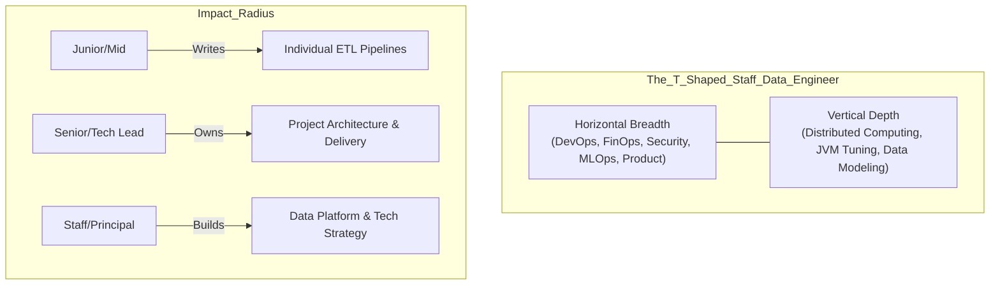

Lịch sử ngành dữ liệu đã trải qua sự tiến hóa mạnh mẽ: từ những quản trị viên cơ sở dữ liệu (DBA) quản lý các máy chủ Oracle khép kín, đến những lập trình viên ETL nhào nặn dữ liệu bằng SSIS/Informatica, và hiện tại là kỷ nguyên của các **Kỹ sư Dữ liệu (Data Engineer)** - những người đóng vai trò Software Engineer mang trọng trách xây dựng Hệ thống Phân tán (Distributed Systems) khổng lồ.

Nếu Data Scientist tập trung vào việc *đặt ra giả thuyết toán học*, Data Engineer lại giải quyết câu hỏi mang tính sinh tồn: **"Làm sao để chạy mô hình AI đó trên khối lượng 500 Terabyte dữ liệu mỗi ngày mà không làm cháy server, sập hệ thống mạng và đốt hàng triệu đô la phí Cloud?"**

Bài viết này mổ xẻ vai trò Data Engineer, không phải ở cấp độ gõ SQL qua ngày, mà ở góc nhìn của một **Staff Data Engineer** — người thiết kế kiến trúc, chịu trách nhiệm về FinOps và dẫn dắt công nghệ (Tech Lead).

---

## 1. T-Shaped Engineer & Sự chuyển dịch sang Platform Engineering

Một Kỹ sư Dữ liệu cấp cao không viết từng dòng ETL thủ công. Họ mang tư duy **T-Shaped Engineer**: Có chuyên môn cực sâu (Vertical Depth) về Hệ thống phân tán (Spark/Kafka), nhưng sở hữu kiến thức rộng (Horizontal Breadth) về DevOps, Security, FinOps và Product.

Ở cấp độ Staff, công việc chuyển dịch từ việc "Viết Pipeline" sang "Xây dựng Data Platform" (Nền tảng dữ liệu nội bộ). Bạn xây dựng các con đường cao tốc (Paved Roads) với các mẫu thiết kế chuẩn (Standardized Patterns), CI/CD, và công cụ Self-service để các team khác (Analysts, Scientists) tự deploy sản phẩm dữ liệu của họ một cách an toàn.



---

## 2. Trách Nhiệm Cốt Lõi (Core Responsibilities)

### 2.1 Kiến Trúc Hạ Tầng (Infrastructure as Code - IaC)
Một Data Platform không được tạo ra bằng cách click chuột trên Console AWS/GCP. Nó được lập trình. Kỹ sư dữ liệu hiện đại viết mã bằng **Terraform** để cấp phát hệ thống.

Ví dụ, cấu hình một Bucket S3 đi kèm chiến lược FinOps (Lifecycle rules) để tiết kiệm chi phí:
```hcl
# Terraform: Khởi tạo S3 Data Lake với FinOps Tagging và Lifecycle
resource "aws_s3_bucket" "datalake_bronze" {
  bucket = "company-datalake-bronze-zone"
  
  # Bắt buộc Tagging để phục vụ tính toán chi phí (Chargeback)
  tags = {
    Environment = "Production"
    Team        = "Data-Platform"
    CostCenter  = "CC-12345"
  }
}

resource "aws_s3_bucket_lifecycle_configuration" "bronze_lifecycle" {
  bucket = aws_s3_bucket.datalake_bronze.id
  rule {
    id     = "archive-to-glacier"
    status = "Enabled"
    transition {
      days          = 30
      storage_class = "STANDARD_IA" # Tiết kiệm 40% phí lưu trữ
    }
    transition {
      days          = 365
      storage_class = "GLACIER" # Chuyển kho lạnh, tiết kiệm 80%
    }
  }
}
```

### 2.2 Data Contracts và Shift-Left Quality
Hệ thống lớn luôn có dị thường. Một kỹ sư bình thường sửa luồng dữ liệu khi nó bị hỏng. Một Staff Engineer thiết lập **Data Contracts** (Hợp đồng dữ liệu) tại nguồn (Shift-Left), chặn đứng dữ liệu rác (Schema drift, null fields) trước khi nó chảy vào Lakehouse.

```yaml
# Ví dụ: Data Contract dùng Great Expectations (gx)
name: transactions_table_contract
expectation_suite_name: core_financial_rules
expectations:
  - expectation_type: expect_column_values_to_not_be_null
    kwargs:
      column: transaction_id
  - expectation_type: expect_column_values_to_be_between
    kwargs:
      column: amount
      min_value: 0.01
      max_value: 1000000.00 # Cảnh báo nếu có giao dịch tỷ đô bất thường
```

### 2.3 FinOps: Quản Trị Chi Phí Máy Tính 
Trong kỷ nguyên Cloud Consumption-based (Snowflake, Databricks, BigQuery), FinOps là kỹ năng cốt lõi. Một truy vấn `SELECT *` không có phân vùng (Partition) trên BigQuery quét nhầm 10 Petabyte có thể đốt của công ty \$50,000 chỉ trong 10 giây.

Staff Engineer phải thiết lập **Cost Guardrails** (Rào chắn chi phí), ép buộc Partitioning, và cấu hình Autoscaling / Spot Instances để tối ưu.

---

## 3. Những Bài Toán "Khoai" Nhất Trong Nghề [Hardcore Engineering Challenges]

Bạn sẽ hiểu thực tế công việc của Data Engineer thông qua các sự cố đẫm mồ hôi và nước mắt sau:

### 3.1 Nỗi ám ảnh Network Shuffle & OOMKilled
Khi chạy Apache Spark để `JOIN` hai bảng dữ liệu khổng lồ (vd: 10 tỷ dòng), các Node phải trao đổi dữ liệu cho nhau qua mạng (Shuffle). 

**Thảm họa:** Dữ liệu bị lệch (Data Skewness - ví dụ 90% giao dịch của cả nước dồn vào mã `customer_id` của tập đoàn mẹ). Gần như toàn bộ 9 tỷ bản ghi sẽ bị dồn (Shuffle) về **một Executor Node duy nhất**. Node này sẽ nhanh chóng cạn kiệt bộ nhớ Heap, kích hoạt Garbage Collector liên tục, và cuối cùng văng lỗi `OOMKilled` (Exit code 137).

**Cách Staff Engineer giải quyết:** Đừng chỉ tăng RAM. Hãy thiết kế lại thuật toán. Sử dụng **Salting** (Thêm random suffix vào khóa) để băm nhỏ khối dữ liệu lệch, hoặc dùng **Broadcast Hash Join** nếu một trong hai bảng đủ nhỏ để nhét vừa RAM của mọi Node, triệt tiêu hoàn toàn Network Shuffle.

### 3.2 Backfilling và Idempotency (Tính Lũy Đẳng)
Do logic kinh doanh thay đổi, CEO yêu cầu tính toán lại toàn bộ doanh thu của 5 năm qua. Bạn không thể cho hệ thống dừng hoạt động (Downtime). 

Bạn phải thiết kế pipeline tuân thủ nguyên tắc **Idempotency**: Chạy đi chạy lại 100 lần kết quả vẫn giữ nguyên, không bao giờ bị Duplicate dữ liệu. Giải pháp là luôn dùng cơ chế `MERGE/UPSERT` của Delta Lake/Iceberg, kết hợp pattern **Write-Audit-Publish (WAP)** (Ghi ra bảng nháp -> Kiểm tra -> Tráo đổi con trỏ sang bảng thật).

### 3.3 State Management trong Streaming (The Eventual Consistency Nightmare)
Khi xử lý luồng sự kiện Real-time (ví dụ Kafka + Flink để tính doanh thu theo giờ), mạng 4G của user ở vùng sâu có thể rớt, khiến sự kiện mua hàng lúc 2:00 chiều tới tận 4:00 chiều mới bay lên Server (Late data). 

Làm sao hệ thống tính đúng doanh thu của khung giờ 2:00-3:00? Kỹ sư phải vận dụng **Watermarking** trong Apache Flink.

```java
// Flink Java: Khai báo Watermark chấp nhận độ trễ (Late data) tối đa 2 giờ
DataStream<Transaction> stream = env.addSource(kafkaSource)
    .assignTimestampsAndWatermarks(
        WatermarkStrategy
            .<Transaction>forBoundedOutOfOrderness(Duration.ofHours(2)) // Allowed Lateness
            .withTimestampAssigner((event, timestamp) -> event.getEventTime())
    );
```
*Đánh đổi (Trade-off):* Chấp nhận chờ thêm 2 tiếng để có con số chính xác tuyệt đối (Consistency), hay chốt sổ ngay lập tức để có báo cáo nhanh (Low Latency) nhưng sai số? Đó là quyết định của Staff Engineer.

---

## 4. Các Chuyên Môn Phân Hóa Cấp Cao

Trong các Tech Unicorns (Uber, Netflix), vai trò này phân mảnh rất sâu:
- **Platform Data Engineer:** Tập trung vào hạ tầng (Kubernetes, Terraform, Kafka clusters), đảm bảo Uptime 99.99%. Rất gần với DevOps/SRE.
- **Data Pipeline/Product Engineer:** Chuyên viết các Data Application phức tạp bằng Scala/Java/Python, tối ưu thuật toán phân tán (MapReduce, Graph Processing).
- **Analytics Engineer (dbt Engineer):** Đứng giữa Business và Data, siêu việt về SQL, mô hình hóa dữ liệu (Dimensional Modeling / Data Vault) và thi hành các bài test chất lượng dữ liệu.

---

## 5. Tổng Kết

Đầu tư vào Data Engineering không còn là lựa chọn mà là sự sống còn. Để trở thành một Kỹ sư Dữ liệu xuất sắc ở tầm vóc Staff/Tech Lead, đừng chỉ học thuộc các công thức SQL. Hãy đào sâu tìm hiểu Hệ điều hành, kiến trúc Bộ nhớ JVM, cách ổ cứng đọc ghi I/O (Columnar vs Row-based), cách các gói tin di chuyển trong mạng TCP/IP, và nghệ thuật đánh đổi giữa Độ trễ (Latency), Băng thông (Throughput) và Chi phí Tài chính (FinOps).

---

## 6. Nguồn Tham Khảo (References)
1. **Fundamentals of Data Engineering** - Joe Reis & Matt Housley (O'Reilly). Cuốn sách định nghĩa lại nghề Data Engineer hiện đại.
2. **Designing Data-Intensive Applications** - Martin Kleppmann. Sách gối đầu giường về hệ thống phân tán.
3. [The Rise of the Data Engineer][https://medium.com/@maximebeauchemin/the-rise-of-the-data-engineer-91be18f1e603] - Maxime Beauchemin (Tác giả Apache Airflow).
4. [FinOps Foundation](https://www.finops.org/] - Cẩm nang quản trị chi phí Cloud ở quy mô Enterprise.
