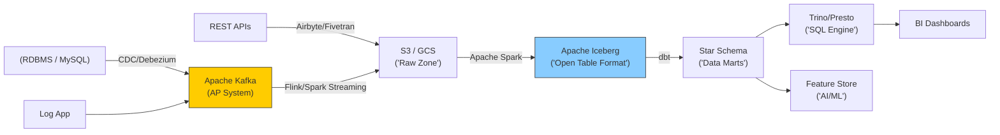

Một hệ thống dữ liệu (Data Platform) là bộ não của một doanh nghiệp kỹ thuật số. Khi quy mô vươn tới hàng trăm Terabyte/Petabyte, câu hỏi đặt ra không còn là "Dùng tool nào?" mà là **"Làm sao để thiết kế một kiến trúc (Architecture) có thể mở rộng vô hạn, chịu lỗi cao, phi tập trung mà vẫn kiểm soát được chất lượng và chi phí?"**

Dưới góc nhìn của một Kỹ sư Kiến trúc Dữ liệu (Staff Data Engineer), Data Engineering không phải là bộ môn viết SQL. Nó là bộ môn của **Hệ thống phân tán (Distributed Systems)**.

---

## 1. Nền Tảng Lý Thuyết: Định lý CAP & PACELC

Trước khi chọn bất kỳ công nghệ nào (Kafka, Cassandra, Spark), bạn phải hiểu Định lý CAP (CAP Theorem). Trong một hệ thống phân tán, bạn chỉ có thể chọn tối đa 2 trong 3 đặc tính:
- **Consistency (C - Tính nhất quán):** Mọi Node đều trả về cùng một dữ liệu mới nhất.
- **Availability (A - Tính khả dụng):** Mọi request đều nhận được phản hồi (không bị timeout).
- **Partition Tolerance (P - Khả năng chịu chia cắt):** Hệ thống vẫn sống khi mạng nội bộ giữa các Node bị đứt.

Vì sự cố mạng (P) là không thể tránh khỏi trên Cloud, bài toán thực tế luôn là sự đánh đổi giữa **CP (Nhất quán nhưng có thể sập)** và **AP (Luôn sống nhưng dữ liệu có thể cũ/sai lệch)**.

Ví dụ: Nếu bạn xây dựng hệ thống thu thập log nhấp chuột (Clickstream), bạn chọn **AP** (Kafka/Cassandra) vì rớt vài click không sao, nhưng hệ thống không được sập. Nếu bạn xây dựng bảng kế toán tài chính, bạn chọn **CP** (HDFS/Iceberg) vì thà hệ thống báo lỗi còn hơn tính sai tiền của khách.

Mở rộng hơn, định lý **PACELC** phát biểu: Ngay cả khi mạng hoạt động bình thường (Else - E), bạn vẫn phải đánh đổi giữa Độ trễ (Latency - L) và Tính nhất quán (Consistency - C).

---

## 2. Bản Đồ Vòng Đời Dữ Liệu (Modern Data Lifecycle)

Một Data Pipeline quy mô lớn không đơn giản chỉ là mũi tên A sang B, nó là một mạng lưới đa tầng.



- **Ingestion (Thu thập):** Xu hướng hiện nay là loại bỏ việc truy vấn định kỳ (Batch query) vào DB nguồn gây quá tải. Thay vào đó, ta sử dụng **CDC (Change Data Capture)** qua Debezium. Debezium đọc trực tiếp file log giao dịch (WAL/Binlog) của DB và đẩy từng lệnh Insert/Update/Delete vào Kafka với độ trễ tính bằng mili-giây mà không làm chậm DB gốc.
- **Storage & Table Formats:** Thay vì dump file CSV hay JSON rác vào S3 (tạo ra Data Swamp - đầm lầy dữ liệu), chuẩn mực mới là sử dụng các Open Table Formats như **Apache Iceberg, Delta Lake, Hudi**. Chúng mang tính chất CP (Consistency/Partition Tolerance) của cơ sở dữ liệu (ACID, Time-Travel) xuống tầng lưu trữ file Parquet rẻ tiền.
- **Compute (Tách rời Lưu trữ):** Đọc dữ liệu từ Iceberg qua các công cụ truy vấn phân tán (Distributed SQL Engine) như Trino/Presto hay Spark, giúp chia tách hoàn toàn chi phí lưu trữ (S3 rẻ) và sức mạnh tính toán (Compute Node đắt).

---

## 3. Distributed Processing: Từ MapReduce đến Apache Spark

Thập kỷ trước, Hadoop **MapReduce** thống trị thế giới dữ liệu. Nó giải quyết bài toán xử lý song song bằng cách chia nhỏ dữ liệu (Map), lưu xuống đĩa cứng (Disk I/O), rồi gom lại (Reduce). Đánh đổi: MapReduce quá an toàn và chịu lỗi cực tốt (vì ghi mọi thứ xuống đĩa cứng HDFS), nhưng tốc độ thảm họa.

**Apache Spark** ra đời và viết lại luật chơi bằng khái niệm **RDD (Resilient Distributed Datasets)** và xử lý trên RAM (In-Memory Processing). Spark từ chối việc ghi dữ liệu trung gian xuống đĩa cứng. Thay vào đó, nó ghi nhớ "Gia phả" (Lineage) của dữ liệu. Nếu một Node RAM bị sập, Spark sẽ nhìn vào Lineage DAG và tính toán lại phần bị mất từ đầu. Tốc độ Spark nhanh hơn MapReduce từ 10 đến 100 lần.

---

## 4. ELT Đánh Bại ETL Trong Kỷ Nguyên Đám Mây

Tại sao mọi người chuyển từ **ETL (Extract, Transform, Load)** sang **ELT (Extract, Load, Transform)**?

Trong thập niên 2000, Data Warehouse phần cứng (Teradata, Oracle) vô cùng đắt đỏ. Bạn không thể bắt chúng gánh vác khối lượng tính toán khổng lồ cho việc Transform. Do đó, kỹ sư phải mua một server vật lý đứng giữa (Informatica) để Transform dữ liệu trước khi đẩy vào kho (ETL).

Ngày nay, với Cloud Data Warehouse (Snowflake, BigQuery), khả năng scale CPU là gần như vô hạn. Việc kéo dữ liệu raw tải thẳng vào Data Warehouse (Load), sau đó tận dụng chính sức mạnh song song của BigQuery để chạy các câu lệnh SQL khổng lồ biến đổi dữ liệu (Transform), nhanh hơn, rẻ hơn và dễ bảo trì hơn. Công cụ **dbt (data build tool)** sinh ra chính là để tối ưu hóa khâu Transform (chữ T) ngay bên trong Data Warehouse.

**Trade-off (Sự đánh đổi):** ELT linh hoạt, nhưng nếu team Data Analyst lạm dụng sức mạnh của BigQuery để viết các câu SQL `JOIN` khổng lồ vô tội vạ, bạn sẽ đối mặt với thảm họa FinOps (Chi phí Compute bùng nổ). ETL cứng nhắc hơn, nhưng chi phí Compute của Spark/EMR (nhất là khi dùng Spot Instances) lại rẻ hơn BigQuery rất nhiều.

---

## 5. Hiện Thực Hóa (Code & Configuration snippets)

Là Staff Engineer, bạn phải đảm bảo hệ thống không chỉ chạy được mà còn phải bền vững, an toàn (Shift-left Quality) và tối ưu chi phí (FinOps).

### 5.1 Hạ tầng dưới dạng Code (IaC) với Terraform
Dựng S3 Data Lake đi kèm chính sách Data Lifecycle để tự động xóa/lưu trữ lạnh dữ liệu rác, cắt giảm hóa đơn AWS hàng tháng.

```hcl
# Terraform: Định nghĩa S3 bucket làm Data Lake (Raw zone)
resource "aws_s3_bucket" "data_lake_raw" {
  bucket = "company-data-lake-raw-zone-prod"
}

# Bật versioning để bảo vệ dữ liệu chống xóa nhầm (Disaster Recovery)
resource "aws_s3_bucket_versioning" "raw_versioning" {
  bucket = aws_s3_bucket.data_lake_raw.id
  versioning_configuration {
    status = "Enabled"
  }
}

# FinOps: Dữ liệu thô sau 90 ngày tự động chuyển sang lưu trữ lạnh (Glacier)
resource "aws_s3_bucket_lifecycle_configuration" "raw_lifecycle" {
  bucket = aws_s3_bucket.data_lake_raw.id
  rule {
    id     = "archive_old_raw_data_to_glacier"
    status = "Enabled"
    transition {
      days          = 90
      storage_class = "GLACIER" # Tiết kiệm 80% chi phí lưu trữ
    }
  }
}
```

### 5.2 Data Contracts [Hợp đồng dữ liệu]
Không đẩy rác vào Data Lake. Thiết lập Data Contract bằng Great Expectations để chặn luồng dữ liệu (Fail-fast) ngay từ đầu.

```yaml
# Data contract chặn đứng bảng users nếu có Null hoặc ID trùng
name: core_users_table_contract
dataset: warehouse.core.users
rules:
  - column: user_id
    checks:
      - is_not_null
      - is_unique
  - column: age
    checks:
      - is_greater_than_or_equal: 18
      - is_less_than: 120
  - column: email
    checks:
      - is_valid_email_pattern # Đảm bảo chuẩn hóa Format trước khi phân tích
```

---

## 6. Kết Luận

Kiến trúc Kỹ thuật Dữ liệu không ngừng tiến hóa để đáp ứng nhu cầu khổng lồ của AI và Machine Learning. Một Data Engineer hiện đại đang dịch chuyển từ việc viết code Python chuyển đổi chuỗi đơn thuần sang việc thiết kế mạng lưới phân tán (Software Engineering for Data), tối ưu chi phí (FinOps), hiểu rõ giới hạn vật lý của định lý CAP, và thiết kế hệ sinh thái theo kiến trúc mở (Open Table Formats / Data Lakehouse).

---

## Nguồn Tham Khảo (References)
- Sách nền tảng: **[Designing Data-Intensive Applications - Martin Kleppmann][https://dataintensive.net/]**. Cuốn sách bắt buộc phải đọc về hệ thống phân tán và định lý CAP.
- Sách chuyên ngành: **Fundamentals of Data Engineering - Joe Reis & Matt Housley**. Định nghĩa nghề Data Engineer hiện đại.
- Sách về phân tán kiến trúc tổ chức: **Data Mesh: Delivering Data-Driven Value at Scale - Zhamak Dehghani**.
- Hệ thống định dạng bảng: [Apache Iceberg: The open table format for analytic datasets](https://iceberg.apache.org/].
