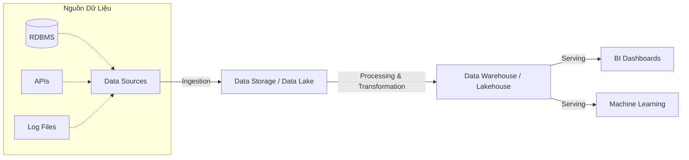
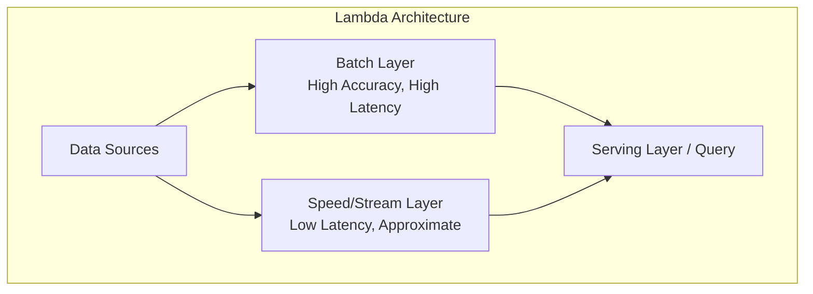

Trong kỷ nguyên số, chúng ta thường nghe nhiều về trí tuệ nhân tạo (AI), học máy (Machine Learning) hay những bảng dashboard phân tích kinh doanh (BI). Tuy nhiên, để những mô hình AI có thể dự đoán chính xác hay những biểu đồ phân tích mang lại giá trị thực tế, tất cả đều phải dựa trên một nguồn dữ liệu sạch, đáng tin cậy và được cập nhật liên tục. Đó chính là nhiệm vụ cốt lõi của **Data Engineering (Kỹ thuật Dữ liệu)**.

Data Engineering là ngành khoa học về việc thiết kế, xây dựng và duy trì các hệ thống kiến trúc để thu thập, xử lý, lưu trữ và chuẩn bị dữ liệu ở quy mô lớn (Big Data). Nó bao trùm toàn bộ vòng đời dữ liệu từ việc kéo dữ liệu từ nhiều nguồn khác nhau (Ingestion), chuyển đổi và làm sạch theo logic kinh doanh (Transformation), cho đến tối ưu hóa cấu trúc lưu trữ để phục vụ mục đích phân tích (Storage Optimization).

Một kỹ sư dữ liệu giỏi không chỉ cần biết code mà còn phải am hiểu sâu sắc về hệ thống phân tán, các giới hạn vật lý của phần cứng (network, memory, disk I/O), và làm thế nào để đảm bảo dữ liệu luôn duy trì được tính nhất quán và toàn vẹn trong mọi hoàn cảnh.

---

## 1. Vòng Đời Dữ Liệu (Data Lifecycle)

Một hệ thống Data Engineering hoàn chỉnh thường phải giải quyết các bài toán sau trong vòng đời dữ liệu, hay còn gọi là quá trình xây dựng **Data Pipeline**.



1. **Thu thập dữ liệu (Data Ingestion):**
   Quá trình trích xuất dữ liệu từ các hệ thống nguồn khác nhau như cơ sở dữ liệu quan hệ (PostgreSQL, MySQL, Oracle), hệ thống NoSQL (MongoDB, Cassandra), API của bên thứ ba (Salesforce, Facebook Ads, Google Analytics), log file ứng dụng, hoặc các luồng sự kiện (event streams) thông qua IoT. Dữ liệu ở giai đoạn này thường ở dạng thô (raw) và chưa được tổ chức hoàn chỉnh, đôi khi có chứa lỗi hoặc các thông tin không liên quan.

2. **Lưu trữ dữ liệu (Data Storage):**
   Dữ liệu thô sau khi được thu thập sẽ cần một nơi lưu trữ an toàn và tối ưu hóa cho mục đích xử lý về sau. Ở giai đoạn này, dữ liệu có thể được đưa vào Data Lake (Hồ dữ liệu) với chi phí rẻ để lưu trữ định dạng gốc trước khi áp dụng bất kỳ phép biến đổi nào. Điều này đảm bảo rằng chúng ta không bao giờ mất thông tin nguyên bản trong trường hợp cần xử lý lại (re-processing) bằng logic mới trong tương lai.

3. **Xử lý và Chuyển đổi (Data Processing & Transformation):**
   Đây là trái tim của hệ thống Data Engineering, nơi thực hiện việc làm sạch dữ liệu (data cleansing), chuẩn hóa định dạng dữ liệu (normalization), kết hợp dữ liệu từ nhiều nguồn khác nhau (joining), loại bỏ dữ liệu trùng lặp (deduplication) và áp dụng các quy tắc kinh doanh (business logic) phức tạp. Quá trình này tạo ra bộ dữ liệu có cấu trúc cao, đáng tin cậy và sẵn sàng cho việc sử dụng ở giai đoạn cuối.

4. **Phục vụ dữ liệu (Data Serving):**
   Cung cấp dữ liệu đã qua xử lý cho các hệ thống đích (downstream) để ứng dụng vào thực tế. Đích đến có thể là các công cụ Business Intelligence (Tableau, PowerBI, Metabase, Looker) phục vụ Data Analyst báo cáo cho Ban Giám đốc, hay là các Data Catalog và Feature Store phục vụ cho việc huấn luyện mô hình của Data Scientist, hoặc cung cấp dưới dạng các Data API (Reverse ETL) để đẩy ngược kết quả phân tích về hệ thống CRM/Marketing tự động hóa.

---

## 2. Các Kiến Trúc Xử Lý Dữ Liệu (Batch vs Streaming)

Tùy vào yêu cầu nghiệp vụ về độ trễ (latency) và chi phí tài nguyên, dữ liệu có thể được xử lý qua hai mô hình chính, hoặc kết hợp cả hai:

### Batch Processing (Xử lý theo lô)
Dữ liệu được thu thập và xử lý theo từng cụm hoặc khoảng thời gian định trước (ví dụ: xử lý định kỳ mỗi đêm lúc 2:00 AM, hoặc chạy mỗi 4 tiếng một lần). Mô hình này rất hiệu quả và tiết kiệm chi phí cho các tác vụ đòi hỏi khối lượng dữ liệu khổng lồ nhưng không yêu cầu thời gian phản hồi tức thì.
- **Công cụ nổi bật:** Apache Spark, Hadoop MapReduce, dbt, AWS Glue.
- **Ứng dụng:** Tổng hợp báo cáo doanh thu cuối ngày, tính toán lương thưởng cho nhân viên hàng tháng, dự báo doanh số (forecasting) dài hạn.

### Streaming / Real-time Processing (Xử lý luồng)
Dữ liệu được xử lý liên tục, một cách gần như ngay lập tức khi nó vừa được sinh ra. Mô hình này đòi hỏi hệ thống phải có độ trễ cực thấp (thường tính bằng milliseconds), đồng thời phức tạp hơn nhiều trong việc xử lý các tình huống như dữ liệu đến trễ (late-arriving data) hoặc trùng lặp (duplicates).
- **Công cụ nổi bật:** Apache Kafka, Apache Flink, Spark Structured Streaming, Google Cloud Dataflow.
- **Ứng dụng:** Phát hiện gian lận thẻ tín dụng (Fraud Detection) ngay khi quẹt thẻ, gợi ý sản phẩm thời gian thực (Real-time Recommendations) theo click của người dùng, giám sát cảnh báo lỗi hệ thống liên tục.

> [!NOTE] 
> Để kết hợp ưu điểm của cả hai phương pháp xử lý, các kiến trúc sư dữ liệu thường sử dụng **Lambda Architecture** (duy trì song song cả batch layer để đảm bảo độ chính xác tuyệt đối, và speed layer để phản hồi nhanh) hoặc **Kappa Architecture** (loại bỏ hoàn toàn batch layer, mọi thứ đều được xử lý như một stream liên tục).



---

## 3. Kiến Trúc Lưu Trữ Dữ Liệu Hiện Đại

Việc chọn đúng cấu trúc lưu trữ là quyết định mang tính chiến lược đối với một Data Platform. Dưới đây là 3 thế hệ lưu trữ dữ liệu phổ biến nhất trên thị trường hiện nay:

| Tiêu Chí | Data Warehouse (Kho Dữ Liệu) | Data Lake (Hồ Dữ Liệu) | Data Lakehouse (Hồ - Kho Dữ Liệu) |
| :--- | :--- | :--- | :--- |
| **Bản chất** | Cơ sở dữ liệu tối ưu cho phân tích (OLAP), lưu trữ dữ liệu có cấu trúc chặt chẽ. | Nơi lưu trữ tập trung khối lượng lớn dữ liệu thô ở mọi định dạng (cấu trúc, bán cấu trúc, phi cấu trúc) với chi phí thấp. | Kết hợp tính năng quản lý, ACID của Data Warehouse trên nền tảng lưu trữ linh hoạt, chi phí rẻ của Data Lake. |
| **Định dạng dữ liệu** | Có cấu trúc (Relational DB tables) | Đa dạng (CSV, JSON, XML, Parquet, Hình ảnh, Âm thanh, Video) | Chủ yếu là các định dạng mở lưu trữ theo cột như Parquet, ORC, Avro kết hợp với các siêu dữ liệu (metadata). |
| **Sơ đồ (Schema)** | Schema-on-write (Phải thiết kế và xác định sơ đồ trước khi ghi dữ liệu) | Schema-on-read (Xác định sơ đồ một cách linh hoạt tại thời điểm đọc dữ liệu) | Linh hoạt, hỗ trợ ACID transactions mạnh mẽ trên Data Lake bằng các chuẩn mở (Iceberg, Delta Lake, Hudi) |
| **Đối tượng sử dụng chính**| Data Analysts, Business Users, C-Level | Data Scientists, Data Engineers | Cả Data Analysts, Data Scientists và Data Engineers |
| **Các công cụ tiêu biểu** | Snowflake, Google BigQuery, Amazon Redshift, Teradata | Amazon S3, Google Cloud Storage (GCS), Azure Data Lake Storage (ADLS), HDFS | Databricks (Delta Lake), Apache Iceberg, Apache Hudi |

---

## 4. ETL vs ELT: Sự Chuyển Dịch Kiến Trúc Trong Đám Mây (Cloud)

### ETL (Extract, Transform, Load)
Trong mô hình truyền thống lâu đời này, dữ liệu được trích xuất (Extract) từ nguồn, sau đó được **chuyển đổi (Transform) tại một máy chủ xử lý (processing server) trung gian** tách biệt, và cuối cùng mới được tải (Load) vào Data Warehouse. Kiến trúc ETL thường phổ biến ở thời đại hệ thống on-premise, khi tài nguyên lưu trữ và tính toán của Data Warehouse vô cùng đắt đỏ và có giới hạn, do đó việc Transform phải được thực hiện ở bên ngoài để giảm tải cho kho dữ liệu chính.

### ELT (Extract, Load, Transform)
Với sự bùng nổ của các Cloud Data Warehouse hiện đại, vốn sở hữu sức mạnh tính toán khổng lồ và khả năng mở rộng đàn hồi (như BigQuery, Snowflake, Redshift), mô hình ELT đã lên ngôi và trở thành tiêu chuẩn mới. Dữ liệu được trích xuất và **tải trực tiếp (Load) vào Data Warehouse ở dạng thô**, sau đó toàn bộ quá trình **chuyển đổi (Transform) được thực hiện trực tiếp bên trong Data Warehouse** bằng các câu lệnh SQL mạnh mẽ. Điều này giúp tăng tốc độ pipeline, giảm độ phức tạp của hạ tầng.

> [!TIP]
> Các công cụ nổi bật như **dbt (data build tool)** sinh ra chính là để phục vụ cho chữ "T" (Transform) trong kiến trúc ELT. Nó cho phép các kỹ sư dữ liệu và nhà phân tích viết các phép biến đổi bằng ngôn ngữ SQL quen thuộc, kết hợp với các macro của Jinja templating, từ đó mang áp dụng các nguyên tắc Software Engineering (như testing, version control) vào việc viết SQL.

---

## 5. Ví Dụ Thực Tế: Kiến Trúc Data Pipeline Cho Ứng Dụng E-commerce

Hãy cùng xem xét một hệ thống thương mại điện tử (E-commerce) thực tế, nơi chúng ta cần thu thập dữ liệu giao dịch từ PostgreSQL và dữ liệu clickstream từ ứng dụng Web/Mobile để phân tích hành vi người dùng một cách toàn diện.

### A. Mô Hình Kiến Trúc End-to-End

```mermaid
graph LR
    DB[("PostgreSQL\nTransactions")] -->|Airbyte ("Batch")| S3[("Amazon S3\nRaw Data Zone")]
    Web["Web/App Clickstream"] -->|Kafka ("Stream")| S3
    
    S3 -->|Apache Spark| S3_Clean[("Amazon S3\nClean Zone")]
    
    S3_Clean -->|Snowpipe / COPY INTO| WH[("Snowflake\nData Warehouse")]
    WH -->|dbt ("Transform")| WH_Marts[("Data Marts\nStar Schema")]
    
    WH_Marts --> Tableau["Tableau Dashboards"]
    WH_Marts --> ML["Machine Learning Models"]
    
    subgraph "Orchestration, Quality & Governance"
    Airflow["Apache Airflow"]
    GreatExpectations["Great Expectations"]
    end
```

### B. Code Example: Viết DAG bằng Apache Airflow

Để điều phối một pipeline có độ phức tạp cao, chạy nhiều công cụ khác nhau như trên, chúng ta sử dụng **Apache Airflow** – công cụ Orchestration (điều phối) tiêu chuẩn công nghiệp hiện nay. Dưới đây là một đoạn code ví dụ bằng Python định nghĩa một DAG (Directed Acyclic Graph) để thiết lập trình tự các tác vụ (tasks) thực thi hàng ngày:

```python
from airflow import DAG
from airflow.operators.python_operator import PythonOperator
from airflow.providers.airbyte.operators.airbyte import AirbyteTriggerSyncOperator
from airflow.providers.dbt.cloud.operators.dbt import DbtCloudRunJobOperator
from datetime import datetime, timedelta

# Định nghĩa các tham số mặc định cho toàn bộ DAG
default_args = {
    'owner': 'data_engineering_team',
    'depends_on_past': False,
    'start_date': datetime(2026, 6, 1),
    'email_on_failure': True,
    'email_on_retry': False,
    'retries': 2,
    'retry_delay': timedelta(minutes=5),
}

with DAG(
    'ecommerce_daily_pipeline',
    default_args=default_args,
    description='Pipeline ETL xử lý dữ liệu E-commerce cốt lõi hàng ngày',
    schedule_interval='0 2 * * *', # Chạy vào 2:00 sáng mỗi ngày
    catchup=False,
    tags=['ecommerce', 'daily', 'core_pipeline']
) as dag:

    # Task 1: Trigger Airbyte để đồng bộ dữ liệu giao dịch từ Postgres sang Data Lake (S3)
    sync_postgres_to_s3 = AirbyteTriggerSyncOperator(
        task_id='sync_postgres_to_s3',
        airbyte_conn_id='airbyte_default',
        connection_id='a7b28c52-xxxx-yyyy-zzzz-your-connection-id',
        asynchronous=False,
    )

    # Task 2: Chạy Apache Spark Job để làm sạch dữ liệu thô (Deduplication, Anonymization)
    def submit_spark_cleansing_job():
        # Đoạn code giả lập gọi Spark Submit hoặc AWS EMR Serverless API
        print("Đang khởi tạo Cluster và chạy Spark job làm sạch dữ liệu...")
        return "Spark Job Completed Successfully!"
        
    spark_clean_data = PythonOperator(
        task_id='spark_clean_data',
        python_callable=submit_spark_cleansing_job,
    )

    # Task 3: Chạy dbt để transform dữ liệu trực tiếp trong Snowflake thành Star Schema
    dbt_transform_models = DbtCloudRunJobOperator(
        task_id="dbt_transform_models",
        dbt_cloud_conn_id="dbt_cloud_default",
        job_id=98765, # ID của dbt Cloud Job đã cấu hình sẵn
        check_interval=60, # Poll status mỗi 60 giây
        timeout=3600, # Timeout sau 1 giờ
    )

    # Thiết lập Dependencies (Thứ tự thực thi)
    # Pipeline chạy tuần tự: Đồng bộ -> Làm sạch -> Transform Data Marts
    sync_postgres_to_s3 >> spark_clean_data >> dbt_transform_models
```

---

## 6. Best Practices Thực Tiễn Trong Data Engineering

Để xây dựng các hệ thống dữ liệu không chỉ có khả năng mở rộng (scalable) mà còn dễ dàng bảo trì (maintainable) và tin cậy, một Data Engineer dày dạn kinh nghiệm thường tuân thủ nghiêm ngặt các nguyên tắc sau:

1. **Data Quality & Testing (Kiểm soát chất lượng dữ liệu):**
   - Đừng bao giờ tin tưởng mù quáng vào dữ liệu từ các hệ thống nguồn (Garbage in, Garbage out). Hãy luôn thiết lập các chốt chặn kiểm tra (Data Contracts) thông qua các bài test tự động. Ví dụ: cột `user_id` không bao giờ được phép mang giá trị Null, hay cột `revenue` (doanh thu) phải là số dương.
   - Các công cụ hỗ trợ mạnh mẽ: *Great Expectations, dbt tests, Soda Data Quality*.

2. **Idempotency (Tính luỹ đẳng):**
   - Một nguyên tắc bất di bất dịch của Data Pipeline: Khi một đường ống bị lỗi và được chạy lại (re-run) nhiều lần cho cùng một khung thời gian (time-window), nó phải luôn cho ra kết quả cuối cùng giống hệt nhau, tuyệt đối không được gây ra tình trạng nhân đôi dữ liệu (duplicate records).
   - Mẹo thực hành: Luôn sử dụng các câu lệnh `MERGE`, `UPSERT` thay vì `INSERT` bừa bãi, và luôn xoá dữ liệu cũ của partition trước khi ghi đè lại (Overwrite partition).

3. **Data Governance & Cataloging (Quản trị & Danh mục dữ liệu):**
   - Khi công ty phát triển, số lượng bảng dữ liệu (tables) có thể lên tới hàng ngàn. Nếu không quản trị, hệ thống Data Lake của bạn sẽ nhanh chóng biến thành một "Data Swamp" (Đầm lầy dữ liệu) - nơi không ai dám đụng vào vì không hiểu ý nghĩa của các bảng. Việc quản lý từ khóa (metadata), ghi chú rõ ràng (data dictionary), kiểm soát phân quyền (RBAC) và theo dõi lineage (gia phả luồng dữ liệu - bảng nào sinh ra từ bảng nào) là việc bắt buộc.
   - Công cụ hỗ trợ tiêu biểu: *Amundsen, DataHub, Atlan, Collibra*.

4. **CI/CD và Tự Động Hóa Triển Khai (DataOps):**
   - Data Engineering ngày nay đã rất gần với Software Engineering chuẩn mực. Mọi đoạn code xử lý dữ liệu (SQL, Python, Scala), file cấu hình hạ tầng (Terraform, YAML) đều cần được lưu trữ và version control trên Git.
   - Phải thiết lập hệ thống tự động kiểm thử (Continuous Integration) mỗi khi có Pull Request mới, và tự động triển khai (Continuous Deployment) lên môi trường Production (ví dụ qua GitHub Actions hoặc GitLab CI). Điều này giảm thiểu tối đa các lỗi do thao tác thủ công (human errors).

5. **Thiết kế vì khả năng phục hồi (Design for Failure):**
   - Hãy thiết kế hệ thống với giả định rằng: Mọi thứ đều có thể hỏng hóc ở một thời điểm nào đó. Máy chủ sẽ bị sập mạng, hệ thống nguồn API của bên thứ ba sẽ rate-limit hoặc timeout. Data Pipeline cần có cơ chế retry tự động với exponential backoff, có thông báo (alert) về Slack/Email qua PagerDuty rõ ràng kèm log lỗi để kỹ sư xử lý ngay lập tức.

---

## Tại sao Data Engineering lại là vị trí "hot" nhất hiện nay?

Trong khi vị trí Data Scientist (Nhà khoa học dữ liệu) từng được ví là "nghề quyến rũ nhất thế kỷ 21" theo Harvard Business Review, thực tế tại phần lớn các doanh nghiệp hiện nay lại cho thấy một bức tranh khác. Hầu hết các công ty tham vọng trở thành tổ chức "Data-Driven" (điều hành dựa trên dữ liệu) lại gặp vô vàn khó khăn khi đối mặt với dữ liệu bị phân mảnh (data silos), định dạng phi cấu trúc hỗn độn, hệ thống thường xuyên quá tải không thể truy vấn ở tốc độ cao, và dữ liệu cung cấp cho báo cáo sai lệch dẫn đến quyết định kinh doanh sai lầm.

Vai trò của người Data Engineer chính là đứng đằng sau hậu trường, xây dựng nền móng vững chắc – thiết lập những "đường ống nước" (pipeline) mạnh mẽ, bảo mật, tự động và tiết kiệm chi phí – để dòng chảy dữ liệu có thể liên tục lưu thông. Họ là những người biến rác thải kỹ thuật số thô sơ thành những "mỏ vàng" tri thức, tạo ra nguồn năng lượng cho các thuật toán và lợi thế cạnh tranh cho toàn bộ tổ chức. Xin hãy nhớ rằng, **không có một Data Engineering vững mạnh, mọi nỗ lực về AI/Machine Learning hay Advanced Analytics chỉ như những "lâu đài xây trên cát"**.

---

## Tài Liệu Tham Khảo Mở Rộng Dành Cho Kỹ Sư Dữ Liệu
* Sách nền tảng: [Designing Data-Intensive Applications - Martin Kleppmann (Phần 2: Distributed Data)](https://dataintensive.net/) - Cuốn sách gối đầu giường của bất kỳ Data Engineer/Backend Engineer nào.
* Sách chuyên ngành: **Fundamentals of Data Engineering - Joe Reis & Matt Housley** - Sách cập nhật toàn diện nhất về thực trạng Data Engineering hiện đại.
* Mô hình hoá dữ liệu: [The Data Warehouse Toolkit - Ralph Kimball](https://www.kimballgroup.com/data-warehouse-business-intelligence-resources/books/data-warehouse-dw-toolkit/) - Kinh thánh về thiết kế Dimensional Modeling (Star Schema).
* Luận văn nền tảng: [CAP Theorem and PACELC - Daniel Abadi](http://dbmsmusings.blogspot.com/2010/04/problems-with-cap-and-yahoos-little.html) - Lý thuyết về sự đánh đổi trong hệ thống phân tán.
* Bài báo kinh điển: [MapReduce: Simplified Data Processing on Large Clusters - Google](https://research.google.com/archive/mapreduce.html) - Khởi nguồn cho kỷ nguyên Big Data và Hadoop.
