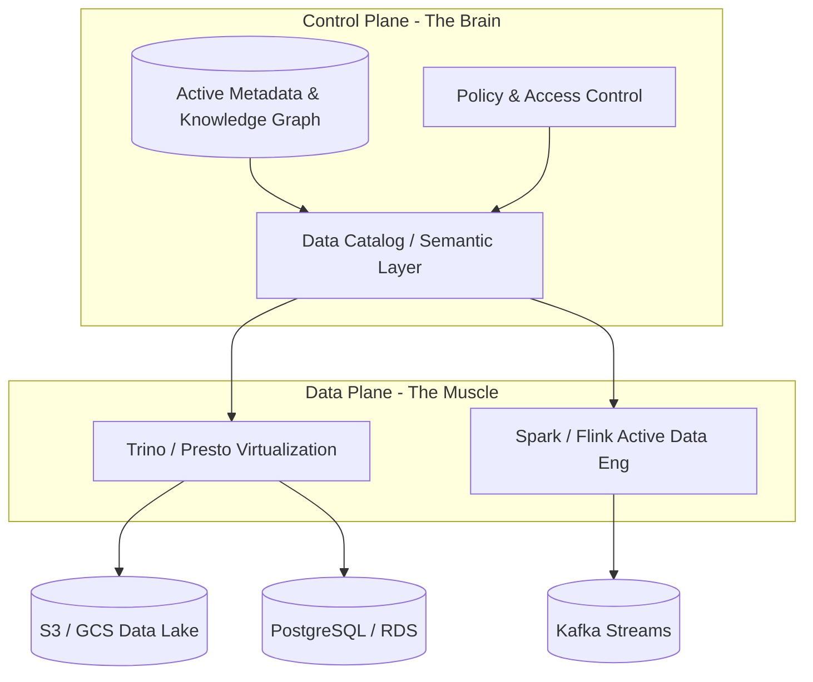

Data Fabric thường bị giới Vendor (Gartner, IBM, Microsoft) biến thành một *Buzzword* (thuật ngữ sáo rỗng) về "AI-driven data integration". Tuy nhiên, dưới góc độ System Architecture và Data Engineering thực chiến, **Data Fabric** bản chất là một **Unified Control Plane (Lớp điều khiển hợp nhất)** được xây dựng dựa trên Active Metadata, Knowledge Graphs, và Data Virtualization.

Nó sinh ra để giải quyết bài toán **Data Gravity** (Lực hấp dẫn dữ liệu) trong môi trường Multi-Cloud / Hybrid. Thay vì cố gắng gom vật lý mọi thứ về một Centralized Data Lake/Warehouse (điều ngày càng bất khả thi do chi phí mạng, luật compliance, và độ trễ), Data Fabric tạo ra một lớp trừu tượng (Logical Layer) cho phép truy cập, bảo mật, và quản trị dữ liệu *In-place* (Ngay tại nơi nó sinh ra).

*(Lưu ý: Đừng nhầm lẫn giữa khái niệm kiến trúc "Data Fabric" và nền tảng SaaS thương mại "Microsoft Fabric").*

---

## 1. Kiến Trúc Hệ Thống: Control Plane vs. Data Plane

Một hệ thống Data Fabric thực sự phải tách biệt hoàn toàn giữa **Control Plane** (Bộ não: nơi quản lý Metadata, Security, Policy) và **Data Plane** (Cơ bắp: nơi thực thi tính toán thực tế).



### 1.1. Control Plane: Active Metadata & Knowledge Graph
Trái tim của Data Fabric là một **Knowledge Graph** (ví dụ: Neo4j, TigerGraph] kết nối Technical Metadata (Schema, Data Types), Business Metadata (Glossary, Ownership), và Operational Metadata (Query logs, Data Lineage).

Điều làm nên sự khác biệt là chữ **Active** (Chủ động). Các Data Catalog truyền thống (như Amundsen) chỉ thụ động chờ người dùng vào tra cứu. *Active Metadata* liên tục thu thập logs từ Query Engine, dùng Machine Learning (AI) phân tích hành vi, và *tự động* thực thi hành động (Active Data Engineering).

*Ví dụ:* Nếu hệ thống phát hiện bảng `users` trên PostgreSQL có Access Pattern liên tục bị JOIN với bảng `orders` trên S3 nhưng Latency rất cao, Active Metadata Engine sẽ tự động kích hoạt một pipeline Spark chạy ngầm, tạo ra một Materialized View kết hợp sẵn (Pre-computed) lưu vào Redis, và tự động điều hướng các câu query tiếp theo vào Redis để giảm tải.

### 1.2. Data Plane: Data Virtualization & Query Federation
Data Fabric không tự thực thi truy vấn. Nó dựa dẫm vào các Distributed SQL Engine mạnh mẽ như **Trino (Presto)** hoặc **Starburst** để làm lớp Data Virtualization. Người dùng viết 1 câu SQL duy nhất, Engine sẽ tự chia nhỏ câu query, đẩy xuống các DB bên dưới, kéo kết quả về bộ nhớ RAM của Worker và JOIN chúng lại.

Ví dụ cấu hình Trino làm Data Virtualization kết nối PostgreSQL:
```properties
# etc/catalog/postgres.properties
connector.name=postgresql
connection-url=jdbc:postgresql://db.us-east-1.internal:5432/core
connection-user=fabric_svc
connection-password=${ENV:DB_PASSWORD}
# Quan trọng: Predicate Pushdown để giảm Network I/O
allow-drop-table=false
join-pushdown.strategy=EQUALITY_AND_NONEQUALITY
```

---

## 2. Systemic Trade-offs: Khó Khăn Kỹ Thuật & FinOps

Không có viên đạn bạc. Triển khai Data Virtualization/Federation trong Data Fabric kéo theo những Trade-off vô cùng tàn khốc về mặt vật lý.

### 2.1. Network I/O vs. Storage Cost (Bài toán FinOps)
Trong kiến trúc ETL truyền thống, bạn tốn chi phí Storage (Vì phải copy/nhân bản dữ liệu về Lake). Trong Data Fabric, bạn tiết kiệm Storage, nhưng phải trả giá bằng **Cross-Region / Cross-AZ Network Data Transfer**.

> **Sự cố thực tế (FinOps Incident):** 
> Một Data Analyst chạy câu query JOIN giữa bảng `customers` (nằm ở RDS `us-east-1`) và `clickstream_logs` (S3 ở `us-west-2`) thông qua Trino (nằm ở `us-east-1`). Thay vì đẩy màng lọc (Filter) xuống S3, Trino đã kéo toàn bộ 500GB log thô từ bờ Tây sang bờ Đông nước Mỹ qua NAT Gateway / VPC Peering để lọc trong RAM. 
> *Hậu quả:* Hóa đơn AWS tăng vọt 5,000 USD trong một ngày chỉ cho Egress Network, đồng thời gây nghẽn băng thông rớt mạng cục bộ.

**Giải pháp (Mitigation):**
- Bắt buộc cấu hình **Dynamic Filtering** và **Predicate Pushdown** sâu nhất có thể ở Connector level.
- Áp dụng Rule Engine trong Control Plane: Tự động từ chối (Reject/Kill) các truy vấn Federation có dấu hiệu quét vượt quá 50GB qua biên giới Region.

### 2.2. OOM (Out Of Memory) trong Distributed Joins
Khi Federation Engine phải JOIN hai tập dữ liệu khổng lồ từ hai nguồn khác biệt (Heterogeneous), dữ liệu phải được kéo về Memory của các Worker Nodes để thực hiện Hash Join. 

Nếu xảy ra Data Skew (Dữ liệu bị lệch phân phối), một Worker sẽ phải gánh quá nhiều dữ liệu và chết vì OOM. Spark xử lý việc này tốt vì nó có thể Spill-to-Disk (Ghi tạm ra đĩa). Trino ưu tiên tốc độ (In-memory streaming) nên rất dễ Crash toàn bộ Query. 

Cấu hình tối ưu sinh tồn cho Trino Spilling:
```properties
# config.properties
spill-enabled=true
spill-order-by=true
spill-window-operator=true
max-spill-per-node=1TB
query.max-memory-per-node=16GB
```

---

## 3. Sự Giao Thoa: Data Fabric và Data Mesh

Nhiều Kỹ sư nhầm lẫn giữa Data Mesh và Data Fabric hoặc coi chúng là đối thủ. Thực tế, chúng giải quyết vấn đề ở hai trục khác nhau và bổ trợ hoàn hảo cho nhau:
- **Data Mesh:** Giải quyết bài toán **Tổ chức (Organizational)**. Chia nhỏ quyền sở hữu dữ liệu về các Domain (Domain-Driven Design). Coi dữ liệu là một Sản phẩm (Data as a Product).
- **Data Fabric:** Giải quyết bài toán **Kỹ thuật (Technical)**. Tự động hóa quá trình khám phá, kết nối, và bảo mật dữ liệu.

*Tổ hợp hoàn hảo:* **Sử dụng Data Fabric làm nền tảng hạ tầng (Self-serve Data Platform) để hiện thực hóa mô hình Data Mesh.** 
Các Domain không cần tự xây dựng các công cụ ETL, Catalog, hay Access Control từ số 0. Họ chỉ cần viết một file YAML khai báo Data Product, Data Fabric sẽ lo phần còn lại.

```yaml
# Ví dụ khai báo Data Product trên hệ thống Fabric
apiVersion: fabric.data.com/v1
kind: DataProduct
metadata:
  name: user_recommendations
  domain: personalization
spec:
  sources:
    - type: kafka
      topic: raw.clickstream
    - type: postgres
      table: public.users
  virtualization:
    engine: trino
    query: >
      SELECT u.user_id, u.segment, c.event_type
      FROM postgres.public.users u
      JOIN kafka.raw.clickstream c ON u.user_id = c.user_id
  policies:
    - role: "data_scientist"
      action: "read"
      row_level_filter: "region = 'US'" # Tự động nhúng Row-level security
```

---

## 4. Operational Excellence: Tự Động Vá Lỗi Schema Drift

Một trong những nỗi đau lớn nhất của Data Engineering là **Schema Drift** (Team Upstream đổi cấu trúc Database khiến Pipeline vỡ nát). Data Fabric giải quyết bằng Active Metadata:
1. Team Backend đổi cột `age` (INT) trong MySQL thành `dob` (DATE).
2. Hệ thống Debezium / CDC stream ném ra *Schema Change Event*.
3. Schema Registry của Control Plane bắt được Event này.
4. Active Metadata Engine (với AI) phân tích và nhận diện đây là sự thay đổi ngữ nghĩa tương đồng.
5. Hệ thống kích hoạt *Auto-healing*, tự động sửa lại Logical View ẩn bên dưới lớp Virtualization:
   `CREATE OR REPLACE VIEW fabric.users AS SELECT YEAR(CURRENT_DATE) - YEAR(dob) AS age ...`
6. Báo cáo BI Downstream của sếp vẫn chạy bình thường, không ai nhận ra hệ thống nguồn vừa thay đổi.

---

## 5. Tổng Kết

Dưới góc nhìn của một Staff Data Engineer, xây dựng Data Fabric không phải là quẹt thẻ mua một phần mềm đóng gói từ Vendor. Đó là quá trình lắp ráp một hệ sinh thái phức tạp đòi hỏi sự am hiểu sâu sắc về:
- Phân tán hệ thống (Distributed Systems / Query Optimizers).
- Quản trị Tri thức (Knowledge Graphs / Semantics).
- Chi phí hạ tầng (Cloud FinOps / Networking).

Data Fabric rất tuyệt vời trong việc xóa nhòa ranh giới vật lý, nhưng hãy luôn cảnh giác với hóa đơn Network I/O ẩn đằng sau những câu truy vấn "Ảo hóa" tưởng chừng như vô hại của người dùng.

## Nguồn Tham Khảo [References]
* [Trino: The Definitive Guide - O'Reilly][https://www.oreilly.com/library/view/trino-the-definitive/9781098107703/]
* [Gartner: What Is a Data Fabric Design?][https://www.gartner.com/smarterwithgartner/data-fabric-architecture-is-key-to-modernizing-data-management-and-integration]
* [Designing Data-Intensive Applications - Martin Kleppmann](https://dataintensive.net/]
