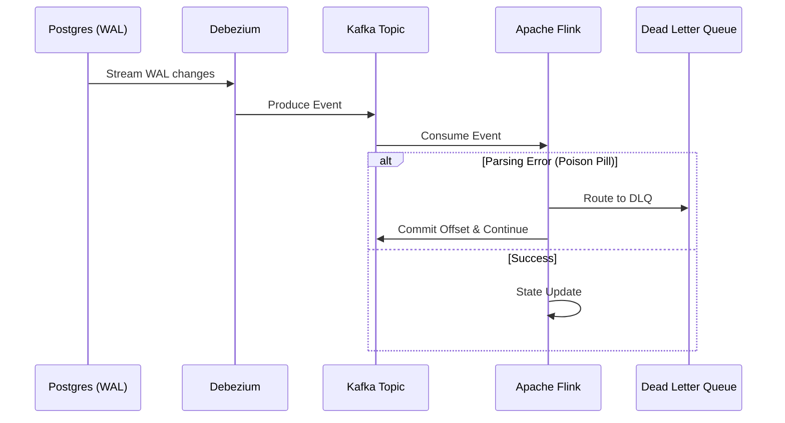

Data Lifecycle (Vòng đời dữ liệu) thường được mô tả qua lăng kính khá "hồng hào": Dữ liệu sinh ra -> Thu thập -> Lưu trữ -> Xử lý -> Sử dụng. Tuy nhiên, ở scale của các hệ thống phân tán (Distributed Systems) xử lý hàng triệu events/sec (như Uber, Netflix, LinkedIn), bức tranh này trở nên cực kỳ phức tạp.

Dưới góc nhìn của một Staff Engineer, quản lý vòng đời dữ liệu là quản lý các **Systemic Trade-offs**:
- **Latency vs. Throughput**: Làm sao đẩy hàng tỷ bản ghi mỗi ngày mà không làm sập Database nguồn?
- **Cost vs. Performance (FinOps)**: Lưu trữ Petabytes dữ liệu thế nào để truy vấn nhanh mà không đốt cháy ngân sách?
- **Consistency vs. Availability**: Làm sao đảm bảo Data Quality khi network partitions xảy ra?
- **Compliance vs. Utility**: Xóa dữ liệu thế nào cho đúng luật (GDPR) mà không làm vỡ các model Machine Learning?

Dưới đây là sơ đồ kiến trúc tổng thể của Vòng đời Dữ liệu hiện đại (dựa trên mô hình Kappa/Lambda Architecture):


---

## 1. Sinh ra (Generation): Nút thắt của Data Quality

Dữ liệu nguyên thủy (Raw Data) thường mang theo rất nhiều nợ kỹ thuật (Technical Debt). Theo nguyên lý GIGO (Garbage In, Garbage Out), sự lỏng lẻo ở đầu nguồn sẽ gây ra "hiệu ứng cánh bướm" làm sụp đổ toàn bộ downstream pipelines.

### Data Contracts: Xóa bỏ ranh giới Silo
Ở quy mô lớn, Backend Teams thường xuyên thay đổi Schema của DB mà không báo cho Data Teams. Hậu quả là Pipeline bị gãy (Schema Drift).
Giải pháp là **Data Contracts** - Hợp đồng dữ liệu. Dữ liệu sinh ra phải tuân thủ một IDL (Interface Definition Language) như Protobuf hoặc Apache Avro, được lưu trữ trên Schema Registry.

Ví dụ về một Data Contract bằng Protobuf:
```protobuf
syntax = "proto3";
package events;

message UserCheckout {
  // UUIDv7 cho phép sort theo timestamp, giảm thiểu B-Tree page splits trong OLTP DB
  string event_id = 1; 
  string user_id = 2;
  double total_amount = 3;
  int64 timestamp_ms = 4;
  
  // Không được phép xóa hoặc đổi type của các field hiện tại
  // Chỉ được phép append field mới (Backward Compatibility)
}
```

### Phân phối ID & Time Semantics
Trong hệ thống phân tán, việc tạo ID và ghi nhận Timestamp cực kỳ quan trọng:
- **ID Generation**: Không dùng Auto-increment (choke point ở DB). Sử dụng **Snowflake ID** (Twitter) hoặc **UUIDv7**. Chúng đảm bảo tính k-sorted (sắp xếp theo thời gian), giúp tối ưu hóa việc ghi (write-amplification) trên các engine LSM-Tree.
- **Time Semantics**: Phải phân biệt rõ **Event Time** (lúc user bấm nút) và **Processing Time** (lúc hệ thống nhận được). Xử lý trễ (Late data) do network lag đòi hỏi phải cấu hình Watermarks chuẩn xác trong các streaming engines.

---

## 2. Thu thập (Ingestion): Cơn ác mộng Backpressure

Ingestion là cuộc chiến bảo vệ hệ thống nguồn (Source) không bị quá tải bởi các tác vụ phân tích, đồng thời đảm bảo không mất mát dữ liệu (At-least-once hoặc Exactly-once delivery).

### Change Data Capture (CDC) với Debezium
Chạy `SELECT * FROM table` định kỳ (Batch) sẽ tạo ra các table locks và I/O spikes, giết chết OLTP DB. CDC đọc trực tiếp từ Write-Ahead Log (WAL ở Postgres, Binlog ở MySQL).

```yaml
# Cấu hình Debezium Connector cho Postgres
name: inventory-connector
config:
  connector.class: io.debezium.connector.postgresql.PostgresConnector
  database.hostname: 192.168.99.100
  database.port: 5432
  database.user: postgres
  database.password: postgres
  database.dbname: inventory
  database.server.name: dbserver1
  plugin.name: pgoutput
  # Snapshot mode: initial (chỉ lấy snapshot 1 lần rồi stream)
  snapshot.mode: initial
```

### Thiết kế Kafka Partitioning & Head-of-Line Blocking
Dữ liệu từ CDC thường được đẩy vào Kafka. Trade-off lớn nhất ở đây là chọn Partition Key:
- Nếu dùng `user_id` làm key: Đảm bảo thứ tự (Ordering) cho các event của cùng một user. Nhưng rất dễ gặp **Data Skew** (ví dụ: một user VIP có số lượng transaction gấp 100 lần user bình thường, làm nghẽn một partition).
- Giải pháp: Sử dụng Salting hoặc Composite Key.
- **Sự cố thực tế**: Khi một Consumer bị kẹt do xử lý một message lỗi (Poison Pill), nó sẽ block toàn bộ partition (Head-of-Line Blocking).
- **Fix**: Sử dụng Dead Letter Queue (DLQ) để đẩy các bad messages ra ngoài, cho phép consumer đi tiếp.



---

## 3. Lưu trữ (Storage): Physical Execution & Formats

Lưu trữ không chỉ là ném file vào S3. Cách bạn định dạng và tổ chức vật lý dữ liệu (Physical execution layout) quyết định 90% hiệu năng và chi phí của bước Xử lý (Processing).

### Row-based vs Column-based
Data Lakehouse tiêu chuẩn sử dụng **Parquet** hoặc **ORC** (Columnar format).
- Tại sao? Hệ thống phân tích (OLAP) thường chỉ quét vài cột (ví dụ: tính tổng doanh thu) trên hàng tỷ dòng. Columnar format cho phép **Column Pruning** (chỉ đọc những file segment chứa cột đó) và **Predicate Pushdown** (lọc dữ liệu ở tầng Storage trước khi đưa lên Compute).

### Open Table Formats: Giải quyết bài toán ACID trên Object Storage
S3/GCS là các hệ thống object storage, mang tính chất *immutable* (không thể update một dòng trong file, phải ghi đè cả file).
Apache Iceberg, Delta Lake, và Apache Hudi cung cấp lớp metadata ở trên, cho phép ACID transactions (Merge/Update/Delete) bằng kỹ thuật Copy-On-Write (COW) hoặc Merge-On-Read (MOR).

**Trade-offs: COW vs MOR (Apache Hudi/Iceberg)**
- **Copy-On-Write (COW)**: Khi update 1 dòng, ghi lại toàn bộ file mới. Phù hợp cho read-heavy workloads (vì file lúc nào cũng sạch). Gây ra Write Amplification lớn.
- **Merge-On-Read (MOR)**: Update được ghi vào các delta logs nhỏ. Khi đọc, engine sẽ merge base file và log file. Tối ưu cho write-heavy (streaming ingestion), nhưng Read Latency cao hơn. Đòi hỏi chạy quá trình Compaction định kỳ ngầm (background).

---

## 4. Xử lý (Processing): Khắc phục OOM và Data Skew

Ở tầng Compute (Spark/Trino), các kỹ sư thường xuyên phải chiến đấu với Out Of Memory (OOM) và Network Shuffle.

### Nỗi ám ảnh Network Shuffle
Khi thực hiện `GROUP BY` hoặc `JOIN` trên Spark, dữ liệu có cùng key phải được di chuyển qua network để nằm trên cùng một Executor. Quá trình này gọi là Shuffle. Nó tiêu tốn CPU (để serialize/deserialize), I/O (ghi ra disk) và Network băng thông.

**Sự cố Data Skew**: 
Khi một key (VD: `country = 'VN'`) chiếm 80% khối lượng dữ liệu, một Executor sẽ phải gánh 80% việc, trong khi các Executors khác ngồi chơi. Kết quả là Task chạy rất lâu hoặc chết vì OOM.
**Cách fix (Staff Engineer level):**
1. **Salting**: Thêm một số random (0-9) vào key bị skew (`VN_1`, `VN_2`) để phân tán dữ liệu ra nhiều Executors, sau đó aggregate lại ở bước 2 (Two-phase aggregation).
2. **Broadcast Join**: Nếu bảng một bảng rất to join với một bảng nhỏ (Dim table < 10MB), hãy broadcast bảng nhỏ lên bộ nhớ của tất cả các Executors để loại bỏ hoàn toàn quá trình Shuffle.

```scala
// Spark Scala: Tối ưu Broadcast Join
val largeFactDf = spark.read.parquet("s3://data-lake/sales")
val smallDimDf = spark.read.parquet("s3://data-lake/stores")

import org.apache.spark.sql.functions.broadcast
// Bỏ qua Shuffle, tăng tốc query lên 10x
val joinedDf = largeFactDf.join(broadcast(smallDimDf), "store_id")
```

---

## 5. Sử dụng (Serving): Low-latency vs High-throughput

Phục vụ dữ liệu cho ứng dụng (User-facing analytics) đòi hỏi Latency cực thấp (<100ms), điều mà Data Warehouse (BigQuery, Snowflake) không sinh ra để làm.

- **OLAP Engines (Apache Pinot, Apache Druid)**: Được thiết kế riêng cho User-facing analytics (như Dashboard của LinkedIn hay Uber Eats). Dữ liệu được index mạnh (Inverted Index, Star-Tree Index) và cache trên RAM/SSD của các node phục vụ.
- **Query Routing**: Kiến trúc hiện đại thường sử dụng một lớp Semantic Layer (như Cube.dev) ở giữa. Nếu query nhẹ/tần suất cao, nó route vào Redis/Pinot. Nếu query cực nặng quét lịch sử 5 năm, nó route về BigQuery/Trino.

---

## 6. Tiêu Hủy & FinOps (Archiving & Purging)

Giai đoạn cuối cùng thường bị bỏ quên cho đến khi hóa đơn Cloud hàng tháng lên tới hàng triệu đô la, hoặc công ty đối mặt với án phạt GDPR.

### FinOps: Storage Tiering & S3 Lifecycle
Việc lưu mọi thứ trên S3 Standard là một thảm họa FinOps. Dữ liệu lạnh phải được chuyển xuống Storage có chi phí thấp.

```terraform
# Cấu hình AWS S3 Lifecycle bằng Terraform để tối ưu chi phí
resource "aws_s3_bucket_lifecycle_configuration" "data_lake_lifecycle" {
  bucket = aws_s3_bucket.data_lake.id

  rule {
    id     = "archive_cold_data"
    status = "Enabled"

    filter {
      prefix = "raw_events/"
    }

    # Chuyển sang S3 Standard-IA sau 90 ngày (truy xuất ít)
    transition {
      days          = 90
      storage_class = "STANDARD_IA"
    }

    # Đóng băng xuống Glacier sau 365 ngày (chi phí cực rẻ)
    transition {
      days          = 365
      storage_class = "GLACIER"
    }

    # Xóa hoàn toàn sau 7 năm (Tuân thủ luật lưu trữ kế toán)
    expiration {
      days = 2555
    }
  }
}
```

### Crypto-shredding: Tuân thủ GDPR Right-to-be-Forgotten
Xóa vật lý một user khỏi Data Lake với định dạng Parquet (immutable) là một cơn ác mộng (vì bạn phải đọc file, lọc bỏ dòng của user đó, và ghi lại file mới). Nếu có hàng ngàn yêu cầu xóa mỗi ngày, cluster Compute của bạn sẽ quá tải.

**Giải pháp (Crypto-shredding)**: 
Khi Ingestion, mọi dữ liệu PII (Personally Identifiable Information) của user được mã hóa bằng một Encryption Key duy nhất của user đó, lưu trong một Key Management Service (KMS). 
Khi user yêu cầu "Quyền được lãng quên" (Right-to-be-Forgotten), hệ thống KHÔNG cần lục tìm file Parquet để xóa. Hệ thống chỉ cần **Xóa Key của user đó trong KMS**. Dữ liệu nằm lại trên S3 ngay lập tức trở thành một đống rác vô nghĩa mã hóa không thể đảo ngược. 

---

## Tổng kết

Vòng đời dữ liệu là một hệ sinh thái phức tạp. Một Staff Data Engineer không chỉ chọn công cụ (Kafka, Spark, Iceberg), mà là người hiểu sâu sắc về nội tại vật lý (cách bit ghi xuống ổ đĩa, cách packet đi qua mạng), tối ưu hóa kiến trúc theo Trade-offs (Cost vs Performance, Latency vs Throughput) và xây dựng hệ thống có khả năng tự phục hồi (resilient) trước những Incident ở quy mô lớn.

## Nguồn Tham Khảo (References)
* [Designing Data-Intensive Applications - Martin Kleppmann](https://dataintensive.net/)
* [Uber Engineering - Data Platform Architecture](https://www.uber.com/en-VN/blog/engineering/)
* [Netflix Tech Blog - Data Mesh & Lifecycle](https://netflixtechblog.com/)
* [LinkedIn Engineering Blog - Data Infrastructure](https://engineering.linkedin.com/blog/topic/data)
* [Apache Iceberg: The Definitive Guide](https://iceberg.apache.org/)
* [AWS Storage FinOps & Lifecycle Management](https://docs.aws.amazon.com/AmazonS3/latest/userguide/object-lifecycle-mgmt.html)
