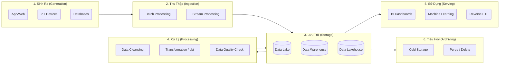

Data Lifecycle (Vòng đời dữ liệu) bao gồm các giai đoạn từ khi dữ liệu được tạo ra cho đến khi nó không còn giá trị sử dụng và bị loại bỏ. Trong kỷ nguyên dữ liệu lớn (Big Data), việc quản lý tốt vòng đời này không chỉ giúp tối ưu hóa chi phí lưu trữ mà còn đảm bảo chất lượng, tính bảo mật, và khả năng phục vụ cho việc ra quyết định. 

Nếu không thiết lập và quản trị một cách có hệ thống, một tổ chức có thể đối mặt với nhiều rủi ro nghiêm trọng:
- **Chi phí lưu trữ phình to:** Lưu giữ dữ liệu rác hoặc dữ liệu không còn sử dụng với định dạng và hạ tầng đắt đỏ.
- **Rủi ro pháp lý:** Vi phạm các bộ luật về quyền riêng tư như GDPR, CCPA do không thể theo vết hoặc xóa dữ liệu người dùng khi được yêu cầu.
- **Data Swamp (Đầm lầy dữ liệu):** Dữ liệu không được phân loại, định nghĩa (metadata) rõ ràng, không rõ nguồn gốc (lineage), dẫn đến tình trạng có dữ liệu nhưng không thể tin tưởng để ra quyết định.

Dưới đây là sơ đồ tổng quan về Vòng đời Dữ liệu trong một hệ thống hiện đại, từ điểm cực tả (Nguồn) đến điểm cực hữu (Tiêu hủy):



---

## 1. Sinh ra (Generation / Creation)


Dữ liệu có thể được sinh ra từ rất nhiều nguồn khác nhau. Ở giai đoạn này, dữ liệu thường ở trạng thái nguyên thủy (raw), chưa có cấu trúc nhất quán, và đôi khi chứa nhiều nhiễu (noise) hoặc bị lặp lại. Chất lượng dữ liệu ở bước này quyết định toàn bộ chất lượng của các bước sau, theo đúng nguyên lý GIGO (Garbage In, Garbage Out).

Các nguồn sinh ra dữ liệu phổ biến:
*   **Cơ sở dữ liệu giao dịch (OLTP):** Các hệ quản trị RDBMS như MySQL, PostgreSQL, Oracle ghi nhận các giao dịch mua bán, cập nhật thông tin tài khoản, xử lý đơn hàng. Đặc điểm của dữ liệu này là phải tuân thủ nghiêm ngặt tính ACID.
*   **Hệ thống theo dõi sự kiện (Event Tracking / Clickstream):** Các hành vi người dùng trên hệ thống Web/App (click chuột, cuộn trang, xem video, thêm vào giỏ hàng) được ghi nhận thông qua các SDK tích hợp sẵn (như Google Analytics, Snowplow, Segment). Chúng thường có định dạng JSON do cấu trúc linh hoạt.
*   **Thiết bị IoT và Cảm biến:** Dữ liệu đo đạc nhiệt độ, định vị GPS, tốc độ máy móc sản xuất được sinh ra liên tục dưới dạng chuỗi thời gian (Time-series data). Khối lượng từ nguồn này thường rất khổng lồ.
*   **Hệ thống bên thứ ba (Third-party APIs):** Dữ liệu kéo về từ các chiến dịch quảng cáo trên Facebook Ads, Google Ads, hệ thống thanh toán Stripe, phần mềm CRM như Salesforce hoặc HubSpot.

> [!TIP]
> **Best Practice:** Để giảm rủi ro hỏng hóc pipeline khi cấu trúc dữ liệu nguồn bị thay đổi, hãy thiết lập **Data Contracts** (Hợp đồng dữ liệu) giữa đội ngũ Software Engineering (Backend dev) và Data Engineering. Một Data Contract quy định rõ ràng schema, định dạng cột và phiên bản API, bất kỳ thay đổi nào cũng cần sự thông qua của cả hai bên.

---

## 2. Thu thập (Collection / Ingestion)

Đây là bước chịu trách nhiệm "hút" hoặc đưa dữ liệu từ các nguồn (sources) phân tán vào hệ thống lưu trữ trung tâm của tổ chức một cách đáng tin cậy và không làm ảnh hưởng đến hiệu năng của hệ thống nguồn.

### So sánh Batch Processing và Stream Processing

| Tiêu chí | Xử lý lô (Batch Processing) | Xử lý luồng (Stream Processing) |
| :--- | :--- | :--- |
| **Độ trễ (Latency)** | Cao (Từ vài giờ đến vài ngày) | Rất thấp (Vài mili-giây đến vài giây) |
| **Cơ chế hoạt động** | Gom một lượng lớn dữ liệu thành "lô" và xử lý theo chu kỳ định sẵn (VD: chạy lúc 2h sáng). | Xử lý từng bản ghi ngay khi nó vừa được sinh ra. Dữ liệu liên tục chảy như một dòng suối. |
| **Công cụ phổ biến** | Apache Airflow, AWS DMS, Fivetran, Airbyte, Apache NiFi | Apache Kafka, Amazon Kinesis, Apache Flink, Google Pub/Sub |
| **Use case điển hình** | Báo cáo tổng kết doanh thu cuối ngày, Đồng bộ toàn bộ dữ liệu lịch sử. | Phát hiện gian lận thẻ tín dụng (Fraud Detection), Recommendation theo thời gian thực. |
| **Chi phí** | Rẻ hơn, dễ triển khai, dễ theo dõi lỗi (debug). | Đắt đỏ, hệ thống phức tạp, khó xử lý khi gặp sự cố đứt gãy kết nối. |

### CDC (Change Data Capture)
CDC là một bước tiến quan trọng trong Ingestion. Thay vì chạy các câu lệnh SQL (như `SELECT * FROM table WHERE updated_at > ?`) gây quá tải cơ sở dữ liệu nguồn, công nghệ CDC (điển hình là **Debezium**) sẽ đọc trực tiếp từ transaction log (ví dụ: `binlog` của MySQL, `WAL` của PostgreSQL). Debezium bắt các thay đổi dữ liệu (INSERT, UPDATE, DELETE) ngay lập tức và đẩy chúng thành các sự kiện (events) vào hệ thống Kafka. 

```python
# Ví dụ: Một DAG đơn giản trong Apache Airflow để Ingestion theo lô (Batch)
from airflow import DAG
from airflow.operators.python import PythonOperator
from datetime import datetime, timedelta
import requests

def extract_api_to_s3():
    # Giả lập logic lấy dữ liệu qua API và ghi vào Data Lake (S3)
    response = requests.get('https://api.example.com/daily-sales')
    data = response.json()
    # Ghi file data.json vào S3 Bucket...
    print(f"Ingested {len(data)} records successfully.")

with DAG(
    'daily_sales_batch_ingestion',
    default_args={'retries': 3, 'retry_delay': timedelta(minutes=5)},
    schedule_interval='0 2 * * *', # Chạy vào lúc 2 giờ sáng mỗi ngày
    start_date=datetime(2026, 1, 1),
    catchup=False
) as dag:
    
    ingest_task = PythonOperator(
        task_id='extract_and_load_task',
        python_callable=extract_api_to_s3
    )
```

---

## 3. Lưu trữ (Storage)

Sau khi dữ liệu đã được thu thập, nó cần một "bến đỗ" vừa an toàn, linh hoạt lại có chi phí hợp lý để sẵn sàng cho xử lý. Sự tiến hóa của kho lưu trữ dữ liệu đi qua 3 mô hình chính:

*   **Data Lake (Hồ dữ liệu):** Nơi chứa tất cả dữ liệu thô (raw) theo nguyên bản định dạng ban đầu, thường dùng object storage (Amazon S3, Google Cloud Storage, Azure Data Lake). Data Lake chấp nhận mọi định dạng: từ phi cấu trúc (ảnh, video, audio) đến bán cấu trúc (JSON, XML). Tuy nhiên, nếu thiếu Data Governance (quản trị), nó dễ dàng trở thành "Data Swamp" (Đầm lầy dữ liệu), nơi không ai biết dữ liệu nào nằm ở đâu.
*   **Data Warehouse (Kho dữ liệu):** Môi trường lưu trữ dữ liệu có cấu trúc cao, tuân thủ schema nghiêm ngặt, chuyên biệt hóa tối đa cho việc chạy các câu lệnh SQL phân tích (OLAP). Các hệ thống nổi tiếng bao gồm Snowflake, Google BigQuery, Amazon Redshift.
*   **Data Lakehouse:** Là kiến trúc hiện đại nhất, kết hợp chi phí rẻ của Data Lake và khả năng hỗ trợ ACID transactions, schema enforcement của Data Warehouse. Lakehouse sử dụng các chuẩn Open Table Formats như **Apache Iceberg**, **Delta Lake**, **Apache Hudi** đặt ngay trên hạ tầng S3/GCS.

### Định dạng File phân tích (File Formats)
Với các tác vụ Data Engineering, việc lựa chọn định dạng file khi lưu tại Data Lake là yếu tố sống còn cho hiệu năng:
- **Định dạng theo hàng (Row-based):** CSV, JSON. Rất trực quan để con người đọc, nhưng cực kỳ chậm và lãng phí khi dùng cho phân tích.
- **Định dạng theo cột (Column-based):** **Parquet**, **ORC**. Dữ liệu được sắp xếp theo từng cột, cho phép hệ thống chỉ truy xuất đúng những cột được chọn (column pruning), đồng thời có khả năng nén (compression) siêu tốt nhờ dữ liệu cùng cột có kiểu giống nhau.

> [!WARNING]
> Luôn luôn chú ý cấu hình quyền truy cập (IAM/RBAC). Tuyệt đối không để bucket S3/GCS ở chế độ public, nhất là với các dữ liệu PII (Personally Identifiable Information - Thông tin định danh cá nhân). Áp dụng mã hóa tại trạng thái nghỉ (Encryption at rest).

---

## 4. Xử lý & Phân tích (Processing / Transformation)

Dữ liệu thô thường dơ, sai định dạng, bị lặp, thiếu trường hoặc nằm rải rác ở nhiều bảng. Giai đoạn Xử lý giúp làm sạch (cleansing), biến đổi (transformation), hợp nhất, và cấu trúc hóa dữ liệu thành các dạng dễ tiêu thụ.

### Sự dịch chuyển từ ETL sang ELT

- **ETL (Extract, Transform, Load):** Dữ liệu được kéo từ nguồn, đẩy qua một máy chủ trung gian (như Informatica, Talend) để xử lý tính toán, sau đó mới Load kết quả cuối cùng vào Warehouse. Mô hình này đang dần thoái trào vì máy chủ Transform trở thành nút thắt cổ chai (bottleneck) khi dữ liệu quá lớn.
- **ELT (Extract, Load, Transform):** Dữ liệu nguyên thủy được Load thẳng vào Data Warehouse. Sau đó, tận dụng khả năng mở rộng sức mạnh điện toán gần như vô hạn của Cloud Data Warehouse (như BigQuery, Snowflake), ta dùng trực tiếp SQL để Transform.

Công cụ dẫn dắt xu thế ELT hiện nay chính là **dbt (data build tool)**. dbt giúp Data Engineer và Data Analyst áp dụng các chuẩn mực phần mềm (Software Engineering principles) như version control (Git), test, và CI/CD vào việc phát triển SQL.

```sql
-- Ví dụ: Một dbt model chuyển đổi, làm sạch dữ liệu người dùng
-- File: models/marts/dim_users.sql
{{ config(materialized='table') }}

WITH raw_users AS (
    SELECT * FROM {{ source('raw_database', 'users') }}
),
cleaned_users AS (
    SELECT 
        user_id,
        -- Làm sạch trường email: Chuyển sang in thường và cắt khoảng trắng thừa
        LOWER(TRIM(email)) AS email, 
        DATE(created_at) AS signup_date,
        -- Chuyển đổi logic business
        CASE 
            WHEN age < 18 THEN 'Under 18'
            WHEN age BETWEEN 18 AND 35 THEN 'Young Adult'
            ELSE 'Adult'
        END AS age_group
    FROM raw_users
    WHERE is_active = TRUE
)
SELECT * FROM cleaned_users
```

### Data Quality & Lineage (Chất lượng dữ liệu và Dấu vết)
Chỉ một sự cố hỏng dữ liệu nhỏ cũng làm mất niềm tin của Ban lãnh đạo vào toàn bộ hệ thống báo cáo.
*   **Data Quality Checks:** Tích hợp kiểm thử tự động (sử dụng Great Expectations hoặc module test của dbt) để báo lỗi hoặc chặn pipeline ngay khi số lượng hàng không khớp, doanh thu xuất hiện số âm, hoặc khóa chính (primary key) bị trùng lặp.
*   **Data Lineage:** Vẽ sơ đồ trực quan nguồn gốc của từng cột dữ liệu, từ file raw ban đầu đi qua những bảng trung gian nào để ra được con số lợi nhuận trên Dashboard. Giúp việc tìm nguyên nhân gốc rễ (root-cause analysis) nhanh chóng khi có sự cố.

---

## 5. Sử dụng (Serving / Usage)

"Dữ liệu là dầu mỏ mới, nhưng nếu chưa được tinh chế, nó không thể dùng để chạy động cơ". Ở giai đoạn này, dữ liệu sạch (Single Source of Truth) sẽ phục vụ các tác vụ mang lại tiền bạc trực tiếp cho công ty.

*   **Business Intelligence (BI) & Dashboards:** Trực quan hóa dữ liệu qua các báo cáo động bằng Tableau, Power BI, Apache Superset, Metabase, Looker. Việc này hỗ trợ C-Level theo dõi KPI doanh nghiệp và đưa ra quyết định Data-driven.
*   **Machine Learning / AI:** Dữ liệu lịch sử chất lượng cao là nguyên liệu đầu vào lý tưởng cho các Data Scientists. Họ sử dụng nó để huấn luyện (train) các mô hình dự đoán hành vi khách hàng, phân loại rủi ro tín dụng (Credit Scoring), hoặc xây dựng hệ thống gợi ý (Recommendation Systems) tăng tỷ lệ chuyển đổi.
*   **Reverse ETL:** Dữ liệu sau khi xử lý trên Data Warehouse không nằm chết ở đó. Reverse ETL là khái niệm đưa những dữ liệu phân tích giá trị này (như Phân khúc khách hàng VIP, Điểm số khách hàng có nguy cơ rời bỏ - Churn Risk Score) đẩy ngược trở lại các phần mềm Vận hành (Operational tools) như Salesforce, Marketo, Facebook Ads thông qua các công cụ như Hightouch, Census. Điều này giúp bộ phận Marketing hoặc Sale ra hành động ngay lập tức (Actionable).

---

## 6. Lưu trữ dài hạn & Tiêu hủy (Archiving / Purging)

Mọi vật chất đều có lúc hết hạn sử dụng. Dữ liệu sẽ mất dần giá trị phân tích theo thời gian. Lưu giữ mọi thứ vô thời hạn trên các ổ đĩa SSD đắt tiền không chỉ gây lãng phí tài chính khổng lồ mà còn là hiểm họa tuân thủ luật pháp.

### Phân tầng Lưu trữ (Storage Tiering)
Chiến lược tối ưu chi phí là di chuyển dữ liệu một cách tự động tùy vào tần suất truy xuất:
*   **Hot Data:** Dữ liệu mới nhất (thường < 1-3 tháng), được lưu trên ổ cứng nhanh (SSD), chạy trực tiếp trên Warehouse.
*   **Warm Data:** Dữ liệu từ 3 tháng đến 1 năm, thỉnh thoảng cần query lại, có thể đẩy ra các phân vùng Standard của S3.
*   **Cold Data (Archiving):** Dữ liệu quá khứ (> 1 năm đến 7 năm). Được nén lại và chuyển sang dịch vụ lưu trữ lạnh chuyên biệt như **Amazon S3 Glacier** hoặc **Google Cloud Storage Archive**. Chi phí của lớp này rẻ đến khó tin (gần như bằng 0 so với Hot Data), nhưng bù lại, bạn sẽ phải chờ vài tiếng đồng hồ mới truy xuất được file.

### Tiêu hủy dữ liệu và Tuân thủ (Purging & Compliance)
Lưu ý quan trọng: Dữ liệu bị rò rỉ (Data Breach) tốn kém hơn rất nhiều so với giá trị nó mang lại sau 10 năm.
Các đạo luật quy định bảo vệ quyền riêng tư cá nhân như **GDPR** (Châu Âu) hay **CCPA** (California) cung cấp cho người dùng "Quyền được lãng quên" (Right to be forgotten). Doanh nghiệp bắt buộc phải có cơ chế xóa hoàn toàn thông tin người dùng khỏi tất cả các hệ thống (kể cả backup) nếu có yêu cầu.

> [!NOTE]
> Bạn có thể cấu hình **Object Lifecycle Management** trên nền tảng Cloud để tự động chuyển tiếp và xóa bỏ dữ liệu, thay vì thao tác bằng tay tiềm ẩn nhiều rủi ro quên sót.

```json
// Ví dụ: JSON cấu hình AWS S3 Lifecycle Policy
// Rule: Tự động chuyển log hệ thống sang Glacier sau 365 ngày
// và xóa vĩnh viễn (Expiration) file đó sau 2555 ngày (7 năm) để tuân thủ pháp lý
{
    "Rules": [
        {
            "ID": "ArchivingAndPurgingLogs",
            "Status": "Enabled",
            "Filter": {
                "Prefix": "system-logs/"
            },
            "Transitions": [
                {
                    "Days": 365,
                    "StorageClass": "GLACIER"
                }
            ],
            "Expiration": {
                "Days": 2555 
            }
        }
    ]
}
```

---

## Kết luận

Vòng đời dữ liệu không phải là một đường thẳng đi một chiều rồi kết thúc, mà thường là một quá trình lặp lại vòng quanh. Dữ liệu cũ bị đào thải đôi khi lại được tổng hợp để làm "Baseline" (điểm cơ sở) cho những mô hình dự đoán AI mới trong tương lai. 

Một Data Engineer xuất sắc không chỉ là người giỏi viết code để di chuyển dữ liệu từ A sang B. Họ là những kiến trúc sư hệ thống, am hiểu cách dữ liệu sinh ra, luân chuyển qua các bước một cách mượt mà, tối ưu hàng ngàn đô la chi phí hạ tầng, và quan trọng nhất, họ bảo vệ an toàn cho tài sản số quý giá nhất của tổ chức trước những rủi ro bảo mật và pháp lý.

## Tài Liệu Tham Khảo Thêm
* [Designing Data-Intensive Applications - Martin Kleppmann (Part 2: Distributed Data)](https://dataintensive.net/)
* [Data Engineering Zoomcamp - Data Lifecycle Management](https://github.com/DataTalksClub/data-engineering-zoomcamp)
* **Fundamentals of Data Engineering - Joe Reis & Matt Housley**
* **AWS Storage Lifecycle Policies Documentation**
* [Debezium - Change Data Capture for modern applications](https://debezium.io/)
* [dbt (data build tool) Docs - Software engineering principles in Data](https://docs.getdbt.com/)
