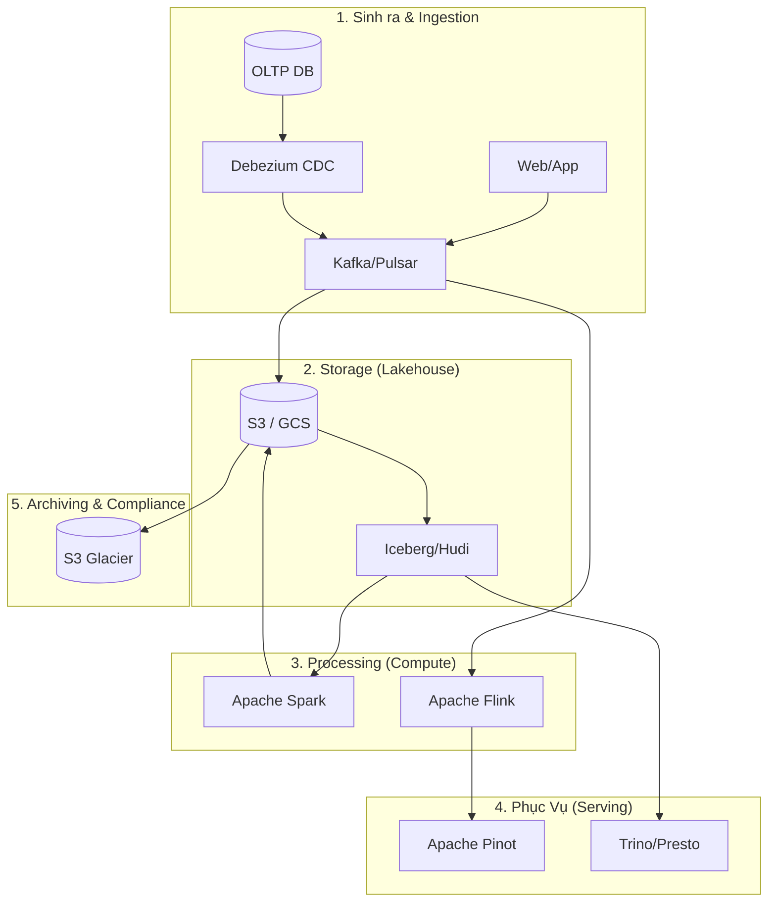

Data Lifecycle (Vòng đời dữ liệu) thường được mô tả qua lăng kính khá đơn giản: Dữ liệu sinh ra $\rightarrow$ Thu thập $\rightarrow$ Lưu trữ $\rightarrow$ Xử lý $\rightarrow$ Phục vụ. Tuy nhiên, ở scale của các hệ thống phân tán (Distributed Systems) xử lý hàng triệu events/giây, bức tranh này đòi hỏi một khung quản trị khắt khe gọi là **Data Lifecycle Management (DLM)**.

Dưới góc nhìn của một Kỹ sư Hệ thống (Staff Engineer), DLM là việc quản lý các **Systemic Trade-offs** xuyên suốt vòng đời:
- **Latency vs. Throughput**: Làm sao đẩy hàng tỷ bản ghi mỗi ngày mà không làm sập Database nguồn?
- **Cost vs. Performance (FinOps)**: Lưu trữ Petabytes dữ liệu thế nào để truy vấn nhanh mà không đốt cháy ngân sách đám mây?
- **Consistency vs. Availability**: Làm sao đảm bảo Data Quality khi hệ thống mạng gặp sự cố?
- **Compliance vs. Utility**: Xóa dữ liệu thế nào cho đúng luật (GDPR) mà không làm vỡ các mô hình Machine Learning?



---

## 1. Sinh ra và Thu thập (Generation & Ingestion)

Sự lỏng lẻo ở đầu nguồn sẽ gây ra "hiệu ứng cánh bướm" làm sụp đổ toàn bộ downstream pipelines (Nguyên lý Garbage In, Garbage Out).

### 1.1. Data Contracts: Xóa bỏ ranh giới Silo
Ở quy mô lớn, Backend Teams thường xuyên thay đổi Schema của Database (OLTP) mà không báo cho Data Teams. Hậu quả là Pipeline bị gãy (Schema Drift).
Giải pháp là **Data Contracts** - Hợp đồng dữ liệu. Dữ liệu sinh ra phải tuân thủ một Interface Definition Language (IDL) như Protobuf hoặc Apache Avro.

```protobuf
syntax = "proto3";
package events;

message UserCheckout {
  // UUIDv7 cho phép sort theo timestamp, giảm thiểu B-Tree page splits trong OLTP DB
  string event_id = 1; 
  string user_id = 2;
  double total_amount = 3;
  int64 timestamp_ms = 4;
  
  // Không được phép xóa hoặc đổi type của các field hiện tại
  // Chỉ được phép append field mới (Backward Compatibility)
}
```

### 1.2. Change Data Capture (CDC) & Backpressure
Chạy `SELECT * FROM table` định kỳ (Batch) sẽ tạo ra các table locks và I/O spikes, giết chết OLTP DB. CDC đọc trực tiếp từ Write-Ahead Log (WAL ở Postgres, Binlog ở MySQL) để thu thập dữ liệu với độ trễ thấp và an toàn.

```yaml
# Cấu hình Debezium Connector cho Postgres
name: inventory-connector
config:
  connector.class: io.debezium.connector.postgresql.PostgresConnector
  database.hostname: db.production.internal
  database.user: cdc_user
  database.dbname: inventory
  plugin.name: pgoutput
  snapshot.mode: initial
```

**Sự cố thực tế (Head-of-Line Blocking):** Khi đẩy dữ liệu vào Kafka, nếu một Consumer bị kẹt do xử lý một message lỗi (Poison Pill), nó sẽ block toàn bộ Kafka partition. Phải sử dụng **Dead Letter Queue (DLQ)** để đẩy các bad messages ra ngoài, cho phép consumer tiếp tục chạy.

---

## 2. Lưu trữ (Storage): Layout & Table Formats

Cách bạn định dạng và tổ chức vật lý dữ liệu (Physical execution layout) quyết định 90% hiệu năng và chi phí của hệ thống DLM.

### 2.1. Columnar Storage (Parquet/ORC)
Hệ thống phân tích (OLAP) thường chỉ quét vài cột (ví dụ: tính tổng doanh thu) trên hàng tỷ dòng. Columnar format (như Parquet) cho phép **Column Pruning** (chỉ đọc những segment chứa cột đó từ đĩa) và **Predicate Pushdown** (lọc dữ liệu ở tầng Storage trước khi đưa lên RAM).

### 2.2. Open Table Formats: COW vs MOR
S3/GCS là các hệ thống object storage, mang tính chất *immutable* (không thể update một dòng trong file, phải ghi đè cả file).
Apache Iceberg, Delta Lake, và Apache Hudi cung cấp lớp metadata ở trên, cho phép ACID transactions (Merge/Update/Delete).

*   **Copy-On-Write (COW)**: Khi update 1 dòng, ghi lại toàn bộ file mới. Phù hợp cho Read-heavy workloads. Gây ra Write Amplification lớn.
*   **Merge-On-Read (MOR)**: Update được ghi vào các delta logs nhỏ. Khi đọc, engine sẽ merge base file và log file. Tối ưu cho Write-heavy (streaming ingestion), đòi hỏi chạy Compaction định kỳ.

---

## 3. Xử lý (Processing): Khắc phục OOM và Data Skew

Ở tầng Compute (Apache Spark, Trino), rủi ro lớn nhất của Data Lifecycle là các job xử lý bị chết do tràn bộ nhớ (Out Of Memory - OOM).

### Nỗi ám ảnh Network Shuffle & Data Skew
Khi thực hiện `GROUP BY` hoặc `JOIN`, dữ liệu có cùng key phải được di chuyển qua network để nằm trên cùng một Node/Executor (Shuffle).
Khi một key (Ví dụ: `country = 'VN'`) chiếm 80% khối lượng dữ liệu, một Node sẽ phải gánh 80% việc, dẫn đến OOM. Hiện tượng này gọi là Data Skew.

**Cách khắc phục:**
1. **Salting**: Thêm một số ngẫu nhiên (random từ 0-9) vào key bị skew (thành `VN_1`, `VN_2`) để phân tán dữ liệu ra nhiều Nodes, sau đó Aggregate lại ở bước 2 (Two-phase aggregation).
2. **Broadcast Join**: Nếu một bảng rất to join với một bảng siêu nhỏ (Dimension table < 10MB), hãy broadcast bảng nhỏ lên bộ nhớ của tất cả các Nodes để loại bỏ hoàn toàn quá trình Shuffle qua mạng.

```scala
// Spark Scala: Tối ưu Broadcast Join
val largeFactDf = spark.read.parquet("s3://data-lake/sales")
val smallDimDf = spark.read.parquet("s3://data-lake/stores")

import org.apache.spark.sql.functions.broadcast
// Bỏ qua Shuffle, tăng tốc độ truy vấn lên hàng chục lần
val joinedDf = largeFactDf.join(broadcast(smallDimDf), "store_id")
```

---

## 4. Lưu trữ Dài hạn & Phá hủy (Archiving & Destruction)

Giai đoạn cuối cùng của DLM thường bị bỏ quên cho đến khi hóa đơn Cloud hàng tháng lên tới hàng triệu đô la, hoặc công ty đối mặt với án phạt pháp lý.

### 4.1. FinOps: Tiered Storage (S3 Lifecycle)
Việc lưu mọi thứ trên S3 Standard vĩnh viễn là một thảm họa FinOps. Dữ liệu lạnh (Cold Data) phải được chuyển xuống Tier có chi phí thấp.

```terraform
# Cấu hình AWS S3 Lifecycle bằng Terraform
resource "aws_s3_bucket_lifecycle_configuration" "data_lake_lifecycle" {
  bucket = aws_s3_bucket.data_lake.id

  rule {
    id     = "archive_cold_data"
    status = "Enabled"

    # Chuyển sang S3 Standard-IA sau 90 ngày (truy xuất ít)
    transition {
      days          = 90
      storage_class = "STANDARD_IA"
    }

    # Đóng băng xuống Glacier sau 365 ngày (chi phí cực rẻ)
    transition {
      days          = 365
      storage_class = "GLACIER"
    }

    # Hủy dữ liệu (Destruction) sau 7 năm để tuân thủ Data Minimization
    expiration {
      days = 2555
    }
  }
}
```

### 4.2. Tuân thủ GDPR: Crypto-shredding (Xóa Dữ Liệu An Toàn)
Đạo luật GDPR yêu cầu "Quyền được lãng quên" [Right to be Forgotten]. Việc tìm và xóa vật lý một User ra khỏi hàng vạn file Parquet (vốn là immutable) trên Data Lake là một cơn ác mộng I/O. Nếu có hàng ngàn yêu cầu xóa mỗi ngày, cụm Compute của bạn sẽ quá tải.

**Kỹ thuật Crypto-shredding:**
Khi Ingestion, mọi dữ liệu nhạy cảm (PII) của user được mã hóa bằng một Encryption Key duy nhất của chính user đó. Các Key này lưu tập trung trong hệ thống Key Management Service (KMS). 
Khi có yêu cầu xóa, hệ thống **KHÔNG CẦN chạm vào Data Lake**. Bạn chỉ cần **xóa Key của user đó trong KMS**. Dữ liệu PII còn sót lại trên Data Lake vĩnh viễn trở thành một chuỗi mã hóa vô nghĩa không thể giải mã, thỏa mãn hoàn toàn yêu cầu hủy dữ liệu của GDPR.

---

## Nguồn Tham Khảo
* [Designing Data-Intensive Applications - Martin Kleppmann][https://dataintensive.net/]
* [Uber Engineering - Data Platform Architecture][https://www.uber.com/en-VN/blog/engineering/]
* [Netflix Tech Blog - Data Mesh & Lifecycle][https://netflixtechblog.com/]
* [AWS Storage FinOps & Lifecycle Management](https://docs.aws.amazon.com/AmazonS3/latest/userguide/object-lifecycle-mgmt.html]
