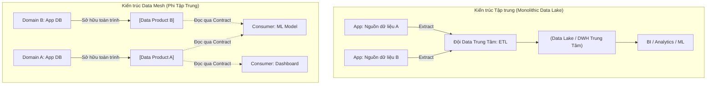

Data Mesh không phải là một công cụ phần mềm (như Spark hay Snowflake), mà là một **mô hình kiến trúc phân tán tổ chức-xã hội và công nghệ (socio-technical architecture)** được khởi xướng bởi Zhamak Dehghani vào năm 2019. Nếu mô hình Microservices đã giải phóng backend khỏi vòng kim cô của các hệ thống nguyên khối (Monolith), thì Data Mesh sinh ra để phá vỡ "cổ chai" của kiến trúc dữ liệu tập trung (Centralized Data Lake/Data Warehouse).

Dưới lăng kính của một Staff Engineer, chúng ta sẽ không nói về các khái niệm bề nổi. Chúng ta sẽ mổ xẻ cách Data Mesh vận hành ở tầng vật lý (Physical Execution), cách phân chia Control Plane vs Data Plane, Hợp đồng dữ liệu (Data Contracts), và những đánh đổi hệ thống (Systemic Trade-offs) cực kỳ khốc liệt khi phân tán dữ liệu.

---

## 1. Bản chất của nút thắt cổ chai trong kiến trúc tập trung

Trong kiến trúc Centralized (Data Warehouse / Lake truyền thống), toàn bộ vòng đời dữ liệu từ Ingestion (Thu thập), Transformation (Biến đổi) đến Serving (Phục vụ) đều bị quản lý bởi một đội ngũ Data Platform/Data Engineering duy nhất ở trung tâm.

-   **Vấn đề Kỹ thuật (Technical Bottleneck):** Đội Data trung tâm phải duy trì hàng ngàn DAGs trong Airflow và các model dbt khổng lồ. Khi một schema ở thượng nguồn (ví dụ: Service Order của đội E-Commerce) thay đổi, pipeline ở hạ nguồn sẽ gãy đổ. Đội Data trung tâm không hiểu business logic để sửa, còn đội E-Commerce (những người tạo ra lỗi) lại không có quyền truy cập pipeline để tự vá.
-   **Vấn đề Tổ chức (Organizational Bottleneck):** Đội Data trung tâm trở thành một hố đen (blackhole) chặn đứng tốc độ release của toàn bộ công ty. Mọi yêu cầu làm báo cáo mới đều phải xếp hàng chờ vài tháng.

Data Mesh giải quyết bài toán này bằng cách **phân quyền (Decentralization)** - đẩy quyền sở hữu dữ liệu (Data Ownership) ngược về các phòng ban nghiệp vụ (Domains) tạo ra dữ liệu đó.



---

## 2. Thiết kế hệ thống với 4 nguyên lý cốt lõi của Data Mesh

Để Data Mesh không trở thành "vạn sứ quân" rời rạc [Data Silos], kiến trúc này bị ràng buộc nghiêm ngặt bởi 4 nguyên lý. Dưới đây là cách implement thực tế ở mức hạ tầng.

### 2.1. Phân tán dữ liệu theo hướng Miền (Domain-driven Data Ownership)
Các domain team (Ví dụ: `Checkout`, `Payment`, `Recommendation`) phải tự chịu trách nhiệm extract, clean và serve dữ liệu của chính mình. 
**Thách thức Kỹ thuật:** Làm sao để domain team (vốn 100% là Backend Software Engineer) viết được Data Pipeline phức tạp?
**Giải pháp:** Platform team cung cấp SDK và Declarative Configurations thay vì bắt họ viết mã PySpark. 

### 2.2. Dữ liệu như một Sản phẩm (Data as a Product) & Data Contracts
Dữ liệu không phải là các file CSV/Parquet nằm lăn lóc trên S3. Một Data Product trong Mesh là một Node độc lập mang tính đóng gói cao (Encapsulated), bao gồm: Code (Pipeline), Data (Storage), Metadata, và Policies.

Để các Domain có thể giao tiếp với nhau mà không vỡ trận, chúng ta cần khái niệm **Data Contracts (Hợp đồng dữ liệu)**. Hợp đồng này ràng buộc Schema, SLA (Service Level Agreement), và Data Quality.

**Thực chiến: Định nghĩa Data Contract bằng YAML:**

```yaml
# data_contract.yml của domain 'payment'
dataset:
  name: payment_transactions
  owner: team-payment@company.com
  type: event_stream # Loại sản phẩm: Real-time stream

schema:
  - name: transaction_id
    type: string
    is_primary: true
  - name: amount
    type: double
    constraints:
      - min: 0
  - name: status
    type: string
    enum: [SUCCESS, FAILED, PENDING]

sla:
  freshness: "15m" # Dữ liệu cam kết có độ trễ tối đa 15 phút
  availability: "99.9%" # Uptime của endpoint
```

Trong hệ thống CI/CD, nếu backend engineer của domain Payment đổi `amount` từ kiểu `double` sang `int`, CI/CD pipeline sẽ đọc Data Contract này, phát hiện vi phạm tính tương thích ngược (Backward Incompatibility) và báo **Fail build ngay lập tức**. Đây là cốt lõi của "Computational Governance".

### 2.3. Hạ tầng dữ liệu tự phục vụ (Self-serve Data Infrastructure)
Không thể bắt mỗi domain tự build cụm Kafka hay tự vận hành AWS EMR. Đội ngũ Platform phải xây dựng một **Data Platform as a Service (DPaaS)**, chia làm 2 phần rõ rệt:
-   **Control Plane:** Quản lý metadata, phân quyền, đăng ký Data Product (thường là một UI Portal nội bộ như Backstage).
-   **Data Plane:** Nơi thực thi thực tế (Storage engine, Compute engine).

**Thực chiến: Infrastructure as Code (IaC) bằng Terraform**
Đội Platform viết các Terraform module chuẩn. Khi domain đăng ký một Data Product, CI/CD tự động chạy Terraform để cấp phát tài nguyên cô lập (Isolated Resources) cho họ.

```hcl
# Terraform module cho một Data Product
module "domain_data_product" {
  source = "./modules/data_product_mesh"

  domain_name       = "checkout"
  data_product_name = "orders_fact"
  
  # Cấp phát storage riêng rẽ (S3 Bucket độc lập)
  s3_bucket_name    = "company-mesh-checkout-orders-prod"
  
  # Cấp phát compute riêng (ví dụ: một namespace trên k8s cho Spark job)
  compute_namespace = "checkout-spark-jobs"
  
  # IAM roles cho việc write và read [Zero Trust Architecture]
  producer_role_arn = aws_iam_role.checkout_team_role.arn
  consumer_roles    = [
    aws_iam_role.marketing_team_role.arn, 
    aws_iam_role.ml_ops_team_role.arn
  ]
}
```

### 2.4. Quản trị tính toán liên kết (Federated Computational Governance]
Quản trị (Governance) trong Data Mesh phải được thực thi bằng Code (Computational) thay vì các quy trình giấy tờ thủ công.
Khi Domain Marketing (Consumer) xin quyền đọc dữ liệu của Domain Payment, Policy Engine (như Open Policy Agent - OPA, hoặc AWS Lake Formation) sẽ tự động kiểm tra xem họ có quyền hay không, và **tự động che mờ (Data Masking)** thông tin PII (như email, số thẻ tín dụng) trên luồng truy vấn (on-the-fly) trước khi trả kết quả.

---

## 3. Systemic Trade-offs & Real-world Scenarios

Không có viên đạn bạc trong kiến trúc phần mềm. Khi chuyển sang Data Mesh, bạn sẽ đối mặt với các bài toán hệ thống cực kỳ phức tạp.

### 3.1. Compute / Network Shuffle across Domains (Tắc nghẽn mạng)
Trong kiến trúc tập trung, việc `JOIN` hai bảng lớn diễn ra rất nhanh vì toàn bộ dữ liệu nằm chung một HDFS/S3 bucket và chung Data Catalog. 
Trong Data Mesh, `Data Product A` (nằm ở AWS Account 1) phải join với `Data Product B` (nằm ở AWS Account 2). 

-   **Sự cố thực tế:** Khi chạy Distributed Query (bằng Trino/Presto) cross-domain, hàng Terabyte dữ liệu bị đẩy qua lại giữa các mạng VPC. Lượng Network In/Out tăng đột biến gây ra **Network Shuffle Bottleneck** làm sập (OOM - Out of Memory) các node Trino Worker và tăng hóa đơn AWS Data Transfer.
-   **Khắc phục:** Áp dụng mô hình **Data Mesh Query Federation**. Bắt buộc đẩy các phép tính filter/aggregation xuống (Predicate Pushdown) tận Storage Layer của từng domain thay vì kéo dữ liệu thô về. Với các bảng Dimension nhỏ, sử dụng cơ chế Data Replication cục bộ (Cache).

### 3.2. Consistency vs Availability (CAP Theorem trong Mesh)
Giả sử domain Order cập nhật trạng thái đơn hàng (đảm bảo High Availability), nhưng hệ thống CDC (Change Data Capture) đẩy về Data Product của nhánh Order bị trễ (Lagging do tải cao). Nếu domain Marketing truy vấn vào thời điểm đó sẽ thấy dữ liệu không nhất quán (Inconsistency - đơn báo thành công nhưng trong kho data chưa có).
*Trade-off:* Trong Data Mesh, chúng ta **bắt buộc phải chấp nhận Eventual Consistency (Nhất quán cuối cùng)** trên toàn cục (Global Scope). Mọi Data Contract phải định nghĩa rõ độ trễ của SLA (như `freshness: 15m`) để Consumer tự có chiến lược xử lý dữ liệu trễ (Late Arriving Data).

### 3.3. Bài toán FinOps (Quản lý chi phí)
Trong Data Warehouse tập trung, hóa đơn cuối tháng là một cục tiền khổng lồ và rất khó truy vết team nào xài bao nhiêu.
Với Data Mesh, FinOps trở nên tường minh (transparent) hơn nhờ việc tách biệt Storage/Compute theo từng Domain (thông qua Resource Tagging).
-   **Trade-off:** Sự lãng phí tài nguyên cục bộ (Resource Underutilization). Domain A duy trì một cụm Spark chạy 20% công suất, Domain B duy trì cụm Spark khác chạy 30%.
-   **Giải pháp:** Sử dụng **Serverless Compute** cho Data Plane (ví dụ Databricks Serverless, Snowflake, AWS Athena) nơi tài nguyên vật lý được Cloud Provider dùng chung dưới nền, nhưng chi phí logical vẫn được tính (chargeback) về đúng query tag của domain đó.

---

## 4. Khi nào tuyệt đối KHÔNG NÊN dùng Data Mesh?

Dưới góc độ Staff Engineer, đừng chạy theo Hype. Data Mesh là "thuốc độc" đối với:
1.  **Startup / SMBs:** Tổ chức dưới 100 kỹ sư Software, dữ liệu dưới 100 TB. Sự phức tạp (Overhead) của việc duy trì Control Plane và Data Contracts sẽ làm công ty phá sản trước khi bạn thấy được lợi ích của việc phân tán. Hãy dùng Centralized Data Warehouse.
2.  **Định luật Conway (Conway's Law Mismatch):** Nếu cấu trúc tổ chức của bạn vẫn là "Command and Control" [Mệnh lệnh từ trên xuống, đùn đẩy trách nhiệm], không có văn hóa DevOps tự chủ (You build it, you run it), thì việc cố ép Data Mesh vào sẽ chỉ tạo ra các hòn đảo dữ liệu (Data Silos) tồi tệ và không thể giao tiếp.

---

## Nguồn Tham Khảo (References)
* [Data Mesh Principles and Logical Architecture - Zhamak Dehghani (MartinFowler.com]][https://martinfowler.com/articles/data-mesh-principles.html]
* [Data Mesh — A Data Movement and Processing Platform @ Netflix][https://netflixtechblog.com/data-mesh-a-data-movement-and-processing-platform-netflix-1288bcab2873]
* [DataMesh: How Uber laid the foundations for the data lake cloud migration][https://www.uber.com/en-VN/blog/data-mesh-foundations-cloud-migration/]
* [Intuit’s Data Mesh Strategy][https://medium.com/intuit-engineering/intuits-data-mesh-strategy-77864757c963]
* [Designing Data-Intensive Applications - Martin Kleppmann (Part 2: Distributed Data]](https://dataintensive.net/)
