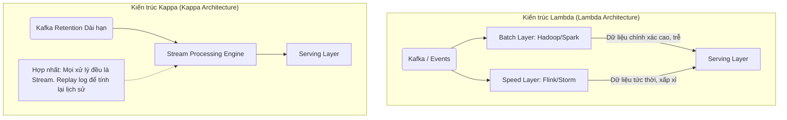
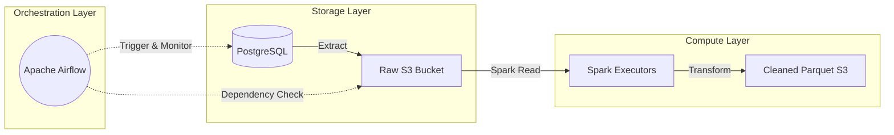

Hãy tưởng tượng dữ liệu trong doanh nghiệp giống như những mạch nước ngầm. Nước ngầm có ở khắp nơi (database, app logs, api), nhưng ở dạng thô, lẫn bùn đất và không thể uống ngay được. Để cung cấp nước sạch cho toàn thành phố, người ta cần một hệ thống xử lý phức tạp: trạm bơm (Extract), nhà máy lọc nước (Transform), và bể chứa trung tâm (Load). Trong kỷ nguyên số, **Data Pipeline** chính là hệ thống xử lý nước đó, đóng vai trò là "hệ tuần hoàn" bơm máu (dữ liệu) đến các bộ phận phân tích (BI) và Trí tuệ nhân tạo (AI) của toàn bộ công ty.

## 1. Bản chất thực sự của Data Pipeline

**Data Pipeline** (Đường ống dữ liệu) là một chuỗi các tác vụ (tasks) phần mềm được thiết kế để tự động hóa quá trình thu thập, di chuyển, xử lý và lưu trữ dữ liệu từ các hệ thống nguồn (Source) đến hệ thống đích (Destination) một cách đáng tin cậy và có thể mở rộng.

Nhìn dưới góc độ **Tiến hóa hệ thống (Evolution)**, Data Pipeline ra đời để giải quyết những hạn chế chết người của các đoạn script bash hay cron job thủ công (thường được gọi là "spaghetti code"). Trước đây, kỹ sư phải tự viết script copy dữ liệu từ server này sang server khác, nhưng khi khối lượng dữ liệu phình to lên hàng Terabytes hay Petabytes, các hệ thống cron job nguyên thủy bộc lộ vô số yếu điểm:
- **Không có tính chịu lỗi (Fault-Tolerance):** Nếu mất kết nối mạng 1 giây, script chết đứng và không thể tự động khôi phục hoặc chạy lại (retry) từ điểm thất bại.
- **Thiếu khả năng giám sát (Observability):** Khi dữ liệu đầu ra bị sai lệch, kỹ sư không biết lỗi bắt nguồn từ hệ thống nguồn đổi schema, hay do logic transform bị sai, do không có cảnh báo (alerting) và logs tập trung.
- **Không quản lý được phụ thuộc (Dependency Management):** Việc tính toán Bảng B yêu cầu dữ liệu từ Bảng A. Chron job chỉ dựa vào thời gian (vd: cho A chạy lúc 1h, B chạy lúc 2h), nếu A mất 2 tiếng để chạy thì B sẽ chạy sai vì lấy dữ liệu rỗng.

Một Data Pipeline hiện đại không chỉ đơn thuần di chuyển các byte dữ liệu mà còn quản lý chặt chẽ sự phụ thuộc lẫn nhau bằng cấu trúc đồ thị, đảm bảo chất lượng dữ liệu (Data Quality) và tối ưu hóa thời gian thực thi.

---

## 2. Các Thành Phần Cốt Lõi: Quá trình Extract - Transform - Load (ETL)

Mặc dù có nhiều biến thể trong kiến trúc, một pipeline tiêu chuẩn luôn xoay quanh 3 trụ cột chính:

### A. Extract (Trích xuất)
Thu thập dữ liệu từ nhiều nguồn khác nhau. Hệ thống nguồn có thể là CSDL quan hệ (PostgreSQL, MySQL), NoSQL (MongoDB, Cassandra), API từ bên thứ ba (Salesforce, Google Analytics), hay các file log phi cấu trúc.
Các chiến lược Extract phổ biến:
- **Full Extraction:** Kéo toàn bộ dữ liệu mỗi lần chạy. Phương pháp này dễ lập trình nhất nhưng tiêu tốn cực kỳ nhiều Network I/O và gây tải nặng cho DB nguồn. Thường chỉ áp dụng cho các bảng tra cứu (dimension tables) có kích thước rất nhỏ (< 1GB).
- **Incremental Extraction (Batch):** Chỉ trích xuất những bản ghi mới được thêm hoặc thay đổi kể từ lần chạy cuối cùng. Thường dựa vào cột mốc thời gian như `updated_at` hoặc `id` tăng tự động.
- **Change Data Capture - CDC (Streaming):** Kỹ thuật hiện đại nhất, đọc trực tiếp từ Transaction Log của cơ sở dữ liệu (ví dụ: `binlog` trong MySQL, `WAL` trong Postgres) bằng các công cụ như Debezium. Mọi thao tác Insert/Update/Delete đều được bắt lại và đẩy vào một Message Queue (như Kafka) theo thời gian thực với độ trễ tính bằng mili-giây.

### B. Transform (Biến đổi)
Đây là "trái tim" của hệ thống, nơi dữ liệu thô (raw data) được làm sạch và nhào nặn thành định dạng phục vụ phân tích. Quá trình này có thể vô cùng phức tạp:
- **Data Cleansing (Làm sạch):** Xóa dữ liệu trùng lặp (deduplication), xử lý các giá trị `NULL` hoặc ngoại lai (outliers), chuẩn hóa định dạng ngày tháng/tiền tệ.
- **Enrichment (Làm giàu):** Bổ sung thêm thông tin. Ví dụ: Join `IP_Address` từ web log với một hệ thống Geo-IP để tìm ra quốc gia của người dùng.
- **Aggregation (Tổng hợp):** Tính toán các chỉ số kinh doanh. Ví dụ: Tổng doanh thu, Số lượng active users mỗi giờ.
- **Masking/Anonymization (Ẩn danh hóa):** Mã hóa hoặc băm (hash) các thông tin nhận diện cá nhân nhạy cảm (PII) như mật khẩu, email, số thẻ tín dụng trước khi lưu trữ để tuân thủ luật bảo mật như GDPR hay PCI-DSS.

### C. Load (Tải)
Đưa dữ liệu đã xử lý vào hệ thống lưu trữ đích để các Data Analyst hoặc thuật toán Machine Learning có thể truy vấn.
- **Data Warehouse:** (Snowflake, Google BigQuery, Amazon Redshift) Phục vụ BI/Reporting với cấu trúc bảng Relational chặt chẽ, hỗ trợ truy vấn SQL cực nhanh qua kiến trúc Columnar.
- **Data Lake:** (Amazon S3, GCS, HDFS) Một "biển" lưu trữ mọi định dạng dữ liệu thô với chi phí cực rẻ.
- **Data Lakehouse:** (Databricks Delta Lake, Apache Iceberg, Apache Hudi) Sự kết hợp hoàn hảo hiện đại, mang lại tính năng giao dịch ACID và Time-travel của Warehouse lên trên nền tảng lưu trữ giá rẻ của Data Lake.

---

## 3. Bài toán Đánh đổi Kiến trúc: ETL hay ELT?

Sự ra đời của các Cloud Data Warehouse với khả năng mở rộng sức mạnh điện toán gần như vô hạn (Compute Scalability) đã làm nảy sinh một cuộc tranh luận lớn trong thiết kế: Nên dùng ETL truyền thống hay ELT hiện đại?

| Tiêu chí | ETL (Extract - Transform - Load) | ELT (Extract - Load - Transform) |
| :--- | :--- | :--- |
| **Bản chất tính toán** | Dùng một cụm server trung gian (Transform Server như Apache Spark/Hadoop) để xử lý dữ liệu ở lớp giữa trước khi ghi vào Kho. | Đẩy thẳng dữ liệu nguyên thủy (Raw) trực tiếp vào Storage của Warehouse. Sau đó, dùng sức mạnh xử lý (Compute) của chính Warehouse để biến đổi bằng câu lệnh SQL. |
| **Disk I/O & Network** | Yêu cầu Network I/O cao do dữ liệu phải đi từ Source -> Server Trung gian -> Destination. Rất dễ bị thắt cổ chai (Bottleneck) về RAM/CPU ở lớp giữa. | Giảm đáng kể Network I/O. Tận dụng sức mạnh xử lý song song khổng lồ MPP (Massively Parallel Processing) của Warehouse. |
| **Công cụ tiêu biểu** | Apache Spark, Apache Flink, AWS Glue. | **dbt (data build tool)**, Snowflake, BigQuery. |
| **Ưu điểm** | - Tiết kiệm chi phí lưu trữ ở đích (chỉ lưu những gì đã sạch).<br>- Giấu kín dữ liệu nhạy cảm trước khi nó lọt vào data warehouse. | - Pipeline Extract đơn giản, tốc độ Load cực nhanh.<br>- Dân chủ hóa dữ liệu (Mọi người đều có thể viết SQL thay vì phải học Scala/Java). |
| **Nhược điểm** | Rất khó và tốn kém khi cần mở rộng quy mô máy chủ Transform. Mã code logic thường phức tạp. | Tốn kém chi phí lưu trữ (do lưu cả rác). Đặc biệt, chi phí tính toán (Compute) sẽ tăng phi mã nếu các câu lệnh SQL không được tối ưu. |

---

## 4. Batch Processing vs Stream Processing: Cuộc chiến độ trễ

Thời gian dữ liệu đi từ nguồn tới lúc người dùng có thể nhìn thấy trên biểu đồ được gọi là **Data Latency**. Tùy thuộc vào yêu cầu nghiệp vụ, pipeline được thiết kế theo một trong hai mô hình hoặc kết hợp:

### Batch Processing (Xử lý theo lô)
Dữ liệu được thu thập lại thành một khối lượng lớn (Batch) và được xử lý định kỳ (ví dụ: chạy 1 lần vào mỗi đêm lúc 2h sáng).
- **Công cụ:** Apache Spark, Apache Airflow, dbt.
- **Use case:** Báo cáo tài chính cuối tháng, train mô hình Machine Learning định kỳ, phân tích hành vi người dùng ngày hôm trước.
- **Đặc điểm:** Độ trễ cao (vài giờ đến vài ngày). Dễ triển khai, dễ debug lỗi và chi phí vận hành thấp. Xử lý được các phép Join phức tạp trên toàn bộ tập dữ liệu lịch sử.

### Stream Processing (Xử lý luồng thời gian thực)
Dữ liệu được coi là một dòng chảy liên tục vô tận (unbounded data). Pipeline xử lý từng bản ghi ngay lập tức ngay khi nó vừa được sinh ra.
- **Công cụ:** Apache Kafka, Apache Flink, Spark Structured Streaming.
- **Use case:** Phát hiện gian lận giao dịch thẻ tín dụng (Fraud Detection) trong vòng 200ms, gợi ý sản phẩm realtime, cập nhật vị trí tài xế Grab/Uber.
- **Đặc điểm:** Độ trễ cực thấp (Sub-second). Vô cùng phức tạp trong việc triển khai. Khó xử lý các bài toán liên quan đến "sự kiện đến trễ" (late-arriving events) hay đồng bộ thứ tự (out-of-order).

#### Kiến trúc hệ thống: Lambda vs Kappa

Để giải quyết bài toán dung hòa giữa độ chính xác của Batch và tốc độ của Streaming, các kỹ sư thường dùng 2 pattern kiến trúc sau:



- **Kiến trúc Lambda:** Tồn tại hai nhánh song song. Tốc độ cao đi qua Speed Layer để phục vụ realtime dashboard, trong khi dữ liệu gốc vẫn ghi xuống Batch Layer để tính toán lại vào cuối ngày nhằm sửa chữa những sai sót của dữ liệu realtime. **Nhược điểm:** Phải bảo trì 2 bộ codebase (một viết cho luồng batch, một cho luồng stream).
- **Kiến trúc Kappa:** Loại bỏ hoàn toàn Batch Layer. Mọi xử lý đều được quy về một luồng Stream duy nhất. Nếu cần tính lại dữ liệu lịch sử, hệ thống sẽ phát lại (replay) toàn bộ log từ Kafka từ một mốc thời gian trong quá khứ thông qua engine stream đó.

---

## 5. Kiến trúc và Cơ chế dưới mui xe (Under the Hood)

Để hình dung tổng thể, dưới đây là kiến trúc pipeline cơ bản được điều phối qua một đồ thị **DAG** (Directed Acyclic Graph):



Nhìn từ góc độ **First Principles**, quá trình vận hành một Data Pipeline thực chất là bài toán chuyển dịch tài nguyên vật lý giữa CPU, RAM và Disk:
1. **Extract phase (Network & Disk I/O bound):** Tạo kết nối JDBC/ODBC, quét ổ đĩa (Disk Scan) ở hệ thống OLTP, chuyển dữ liệu thành packet truyền qua mạng. Nếu truy vấn không đánh Index tốt, thao tác này có thể kéo sập hệ thống nguồn.
2. **Transform phase (CPU & Memory bound):** Các công cụ phân tán như Spark kéo dữ liệu vào Heap Memory. Tại đây diễn ra các thao tác tốn kém nhất: `GroupBy`, `Join`, `Sort`. Trong quá trình này, dữ liệu liên tục được luân chuyển giữa các server vật lý khác nhau qua mạng (quá trình Shuffle) và ghi tạm ra Local Disk.
3. **Load phase (Disk I/O):** Dữ liệu được ghi ra đích (ví dụ S3) ở định dạng tối ưu cho hệ thống OLAP như Columnar formats (Parquet, ORC). Việc định tuyến cấu trúc thư mục (Partitioning) như `/year=2026/month=06/` cực kỳ quan trọng để tăng tốc độ truy vấn sau này.

---

## 6. Ví dụ Thực Tế: Xây dựng DAG với Apache Airflow

Một pipeline tốt cần được quản lý bằng code (Pipeline-as-Code). Dưới đây là một ví dụ bằng Python định nghĩa một luồng chạy ETL cơ bản trong Apache Airflow - công cụ điều phối (Orchestration) phổ biến nhất hiện nay.

```python
from airflow import DAG
from airflow.providers.postgres.operators.postgres import PostgresOperator
from airflow.providers.apache.spark.operators.spark_submit import SparkSubmitOperator
from airflow.operators.empty import EmptyOperator
from datetime import datetime, timedelta

# 1. Cấu hình mặc định chung (Chống lỗi và retry)
default_args = {
    'owner': 'data_platform_team',
    'depends_on_past': False,
    'start_date': datetime(2026, 6, 1),
    'email_on_failure': True,
    'retries': 3,
    'retry_delay': timedelta(minutes=5), # Tự động chạy lại sau 5p nếu lỗi mạng
}

# 2. Khởi tạo DAG chạy hàng ngày vào 2:00 sáng
with DAG(
    'daily_sales_etl_pipeline',
    default_args=default_args,
    description='Pipeline xử lý dữ liệu bán hàng mỗi đêm',
    schedule_interval='0 2 * * *',
    catchup=False,
    tags=['finance', 'sales']
) as dag:

    start_task = EmptyOperator(task_id='start')

    # 3. Task Extract: Kéo dữ liệu Incremental từ DB nguồn
    # Biến {{ ds }} là một macro của Airflow, đại diện cho ngày logic đang chạy
    extract_task = PostgresOperator(
        task_id='extract_incremental_sales',
        postgres_conn_id='source_postgres',
        sql="""
            INSERT INTO data_lake.raw_sales 
            SELECT * FROM public.sales 
            WHERE updated_at::date = '{{ ds }}';
        """
    )

    # 4. Task Transform: Đẩy job cho cụm Spark xử lý dữ liệu lớn
    transform_task = SparkSubmitOperator(
        task_id='spark_cleanse_and_aggregate',
        application='/opt/spark/scripts/sales_transform.py',
        conn_id='spark_cluster_default',
        application_args=['--execution_date', '{{ ds }}'],
        executor_cores=4,
        executor_memory='8g'
    )

    end_task = EmptyOperator(task_id='end')

    # 5. Khai báo sự phụ thuộc (Dependencies - DAG structure)
    # Task sau chỉ chạy khi Task trước đã hoàn thành thành công (Status = Success)
    start_task >> extract_task >> transform_task >> end_task
```

Trong ví dụ này, đặc tính **Observability** thể hiện rõ: nếu `extract_task` bị rớt do lỗi mạng, toàn bộ pipeline dừng lại, Airflow sẽ tự động chờ 5 phút để thử lại. `transform_task` sẽ không bị kích hoạt một cách lộn xộn, đảm bảo tính vẹn toàn dữ liệu.

---

## 7. Best Practices & Kịch bản Khắc phục Sự cố (Production Triage)

Trong môi trường thực tế, mọi Data Pipeline đều sẽ đối mặt với sự cố. Một kỹ sư dữ liệu giỏi là người thiết kế hệ thống có khả năng phòng thủ trước các tình huống sau:

### Nguyên tắc Vàng: Tính Luỹ Đẳng (Idempotency)
Luỹ đẳng có nghĩa là: **Một tác vụ chạy 1 lần hay 100 lần với cùng một tham số đầu vào (ví dụ: ngày giờ) thì kết quả lưu trữ ở đích luôn y hệt nhau, không bao giờ bị nhân đôi dữ liệu (duplication)**.
- **Thiết kế Sai:** `INSERT INTO target SELECT * FROM source`. Nếu script này chạy lại do lỗi mạng, dữ liệu ngày hôm đó sẽ bị nhập vào bảng đích gấp đôi.
- **Thiết kế Đúng:** Sử dụng chiến lược `UPSERT` (Cập nhật nếu đã tồn tại, chèn mới nếu chưa có) thông qua câu lệnh `MERGE` SQL, hoặc luôn xóa sạch phân vùng (Overwrite Partition) của ngày đó trước khi ghi lại toàn bộ.
Thiết kế Idempotent là nền tảng để thực hiện quá trình **Backfilling** (chạy bù/tính toán lại lịch sử khi logic kinh doanh thay đổi) một cách tự tin.

### Kịch bản Triage phổ biến

1. **Lỗi OOM (Out Of Memory) tại cụm xử lý:**
   - **Tình trạng:** Khi join một bảng quá lớn mà vượt quá dung lượng RAM được cấp phát, Spark/Hadoop sẽ Crash.
   - **Khắc phục:** Tối ưu bộ nhớ bằng cách: tăng cấp phát cấu hình RAM, điều chỉnh số lượng Paritions (`spark.sql.shuffle.partitions`), hoặc sử dụng các cơ chế Join khác như Broadcast Hash Join nếu một trong hai bảng rất nhỏ, hoặc Sort-Merge Join nếu cả hai bảng lớn.

2. **Data Skew (Lệch Dữ Liệu):**
   - **Tình trạng:** Dữ liệu trong thế giới thực hiếm khi phân bố đồng đều. Ví dụ, trong hệ thống log, 90% sự kiện có thể phát sinh từ thủ đô, còn các tỉnh khác rất ít. Khi thực hiện phép nhóm (`GROUP BY region`), một core CPU nhận xử lý data của thủ đô sẽ bị treo cứng nhiều giờ, trong khi các core khác rảnh rỗi.
   - **Khắc phục:** Kỹ thuật **Salting Key**. Thêm một tiền tố ngẫu nhiên vào khóa (key) bị lệch để băm dữ liệu rải đều ra nhiều CPU khác nhau trong quá trình Shuffle, sau đó mới gom nhóm lại lần hai (Two-stage Aggregation).

3. **Mạng rớt giữa chừng (Network Partition / Partial Write):**
   - **Tình trạng:** Đang ghi 100 file xuống Data Lake thì file thứ 50 bị đứt mạng. Pipeline thất bại nhưng để lại một nửa dữ liệu rác (Corrupted Data). Lần truy vấn sau sẽ đọc ra kết quả sai.
   - **Khắc phục:** Tuân thủ quy trình **Atomic Commit**. Ghi tất cả file vào một thư mục tạm `_staging/`. Chỉ khi toàn bộ file được ghi xong và xác thực, hệ thống mới thực hiện một thao tác đổi tên thư mục duy nhất vào thư mục sản xuất `/production/`. Nếu có lỗi, xóa thư mục `_staging` đi.

### Data Contracts và Data Quality
Một cơn ác mộng kinh điển của Data Engineer là Software Engineer (Backend) đổi tên cột trong Database hoặc thay đổi kiểu dữ liệu mà không thông báo.
- **Data Contracts (Hợp đồng dữ liệu):** Sử dụng các file định nghĩa schema (JSON Schema, Protobuf, Avro) để tạo ra ràng buộc giữa hệ thống sinh ra dữ liệu và pipeline. Nếu backend dev phá vỡ schema, CI/CD pipeline của họ sẽ fail ngay trước khi code lên production.
- **Kiểm thử dữ liệu (Data Quality Checks):** Tích hợp công cụ như *Great Expectations* vào pipeline để kiểm tra ngay lập tức các quy tắc: Tỉ lệ `NULL` cho phép là bao nhiêu? Giá trị doanh thu có nằm ngoài khoảng âm (âm tiền) hay không? Nếu vi phạm, dừng pipeline lại (Circuit Breaker) thay vì đưa "rác" vào kho báo cáo của ban giám đốc.

---

## 8. Tài Liệu Tham Khảo Mở Rộng

- **Uber Engineering Blog:** **Architecting Data Pipelines at Uber Scale** - Bài học về việc mở rộng theo chiều ngang cho hàng petabyte dữ liệu bằng Kafka và Hadoop.
- **AWS Architecture:** **ETL and ELT design patterns for lake house architecture** - Hướng dẫn đánh đổi kiến trúc giữa các dịch vụ Cloud.
- **Netflix Tech Blog:** **Data Pipeline Evolution at Netflix** - Hành trình chuyển đổi hệ thống xử lý phân tán từ Batch sang Streaming.
- **Kiến trúc Nền tảng:** [The Log: What every software engineer should know about real-time data's unifying abstraction](https://engineering.linkedin.com/distributed-systems/log-what-every-software-engineer-should-know-about-real-time-datas-unifying) - Bài viết huyền thoại của Jay Kreps (Người sáng lập Apache Kafka) về nền tảng tư duy Streaming.
- **Databricks Glossary:** [Medallion Architecture](https://www.databricks.com/glossary/medallion-architecture) - Giải thích khái niệm kiến trúc lưu trữ phân lớp Bronze / Silver / Gold trong Lakehouse.
- **Sách Chuyên Khảo:** [Designing Data-Intensive Applications (DDIA)](https://dataintensive.net/) của tác giả Martin Kleppmann - Đây được coi là sách "gối đầu giường" bất hủ cho bất kỳ ai muốn hiểu sâu về cơ chế phân tán, Replication, Partitioning và Stream vs Batch.