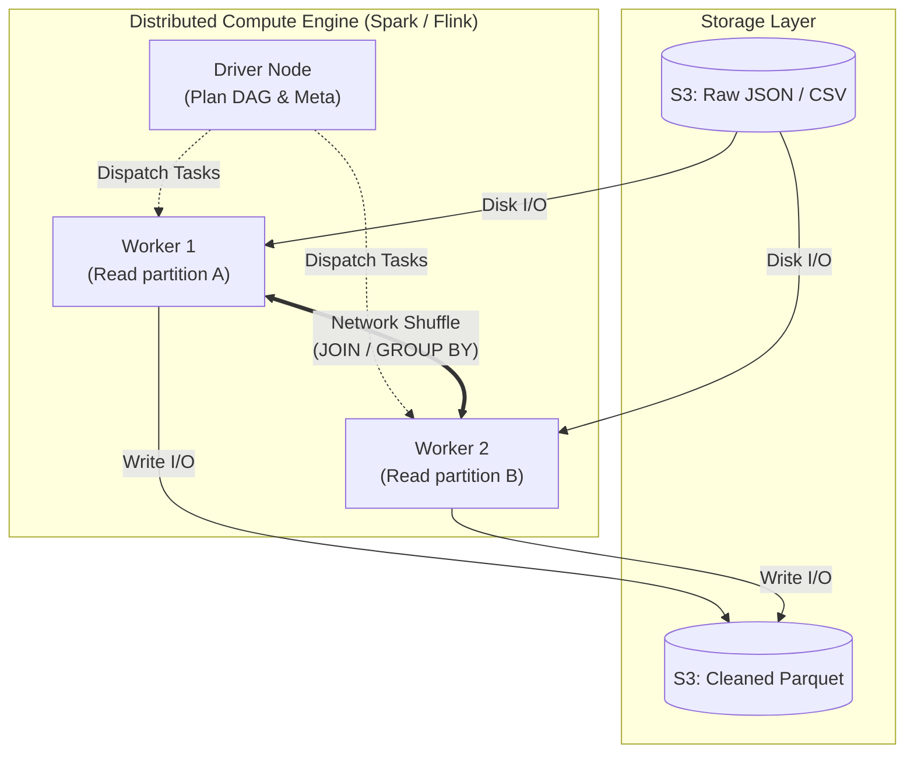

Ở quy mô nhỏ, Data Pipeline đơn giản là việc Copy dữ liệu từ điểm A sang điểm B. Khi khối lượng dữ liệu chạm ngưỡng hàng trăm Terabyte hay Petabyte, các Shell Script thủ công hay Cron Job đơn giản sẽ lập tức sụp đổ. Ở góc nhìn của một Staff Engineer, xây dựng Data Pipeline thực chất là giải quyết các bài toán cốt lõi của **Hệ thống phân tán (Distributed Systems)**: Quản trị tài nguyên (Compute & Memory), tính toán song song (Parallelism), xử lý trạng thái lưu (Checkpointing), và đảm bảo tính nhất quán (Idempotency) trong một mạng lưới các Node có rủi ro hỏng hóc bất cứ lúc nào.

Bài viết này mổ xẻ thiết kế kiến trúc, Trade-off hệ thống, và các kịch bản khắc phục sự cố thực tế ở môi trường Production.

---

## 1. Mổ xẻ Thực thi Vật lý (Physical Execution) & Nút thắt cổ chai

Khi bạn viết một câu lệnh `JOIN` hoặc `.groupBy()` trên Spark, Flink, hay dbt, Engine phân tán sẽ không thực thi code đó ngay lập tức. Nó sẽ biên dịch thành một đồ thị **DAG (Directed Acyclic Graph)** của các tác vụ vật lý (Physical Tasks). 

Sự khác biệt giữa một Pipeline chạy trong 5 phút và 5 tiếng nằm ở việc bạn hiểu **Physical Execution** đến đâu. Hệ thống phân tán bị giới hạn bởi 3 nút thắt chính:

1. **Network I/O & Shuffle Stage:** 
   Đây là Phase tốn kém nhất. Khi thực hiện `JOIN` hoặc `GROUP BY`, dữ liệu có cùng "Key" bắt buộc phải nằm trên cùng một Server vật lý. Nếu chúng đang nằm rải rác ở hàng nghìn Node khác nhau, hệ thống buộc phải đẩy dữ liệu qua mạng (Network Shuffle) và ghi tạm xuống Local Disk. Băng thông mạng (Network Bandwidth) và tốc độ Disk I/O tại các Worker Node sẽ quyết định sự sống còn của Job.
   
2. **Memory (Heap) & OOM (Out Of Memory):**
   Engine (ví dụ: JVM của Spark) kéo dữ liệu vào bộ nhớ để tính toán. Việc phân bổ RAM cho Executor (Core/Memory ratio) không hợp lý sẽ dẫn đến tình trạng Garbage Collection (GC) liên tục, gây "đóng băng" (Pause) tiến trình, hoặc tệ nhất là văng lỗi `OOMKilled` (Exit Code 137).

3. **Storage I/O (Tối ưu định dạng):**
   Ghi 1 tỷ dòng raw JSON xuống S3 sẽ mất hàng tiếng và đốt sạch tiền I/O. Nhưng ghi bằng định dạng **Columnar** (Parquet/ORC) kết hợp nén thuật toán Snappy/ZSTD, và chia thư mục logic (Partitioning) theo `year/month/day`, tốc độ ghi và đọc sau này (Predicate Pushdown) sẽ tăng gấp hàng trăm lần.



---

## 2. Các Mô Hình Kiến Trúc: Đánh đổi (Trade-offs) khốc liệt

Sự tiến hóa của Data Architecture đi từ Batch thuần túy sang các mô hình Hybrid nhằm dung hòa **Độ trễ (Latency)**, **Thông lượng (Throughput)** và **FinOps (Chi phí)**.

### 2.1. ETL vs. ELT: Cuộc chiến FinOps
- **ETL (Extract - Transform - Load):** Kéo dữ liệu thô, dùng cụm Spark/Hadoop để Transform, rồi mới Load vào Data Warehouse. Rất mạnh về bảo mật (Che giấu PII data trước khi load), tối ưu chi phí (Spot Instances của Spark rẻ hơn Warehouse Compute). Nhược điểm là code phức tạp (Scala/Python).
- **ELT (Extract - Load - Transform):** Đẩy thẳng Raw data vào Snowflake/BigQuery. Dùng sức mạnh MPP của Warehouse và dbt (SQL) để Transform. Cực kỳ linh hoạt, Time-to-market siêu nhanh. Tuy nhiên, nếu bạn `JOIN` một bảng 10TB với một bảng 5TB bằng SQL ELT, hóa đơn BigQuery cuối tháng có thể vượt qua mức \$50,000 USD (Compute Cost Nightmare).

### 2.2. Lambda vs. Kappa Architecture
- **Lambda Architecture:** Chạy 2 luồng song song. Batch Layer đảm bảo độ chính xác tuyệt đối (Consistency), Speed Layer phục vụ Streaming thời gian thực (Low Latency). Nhược điểm là kỹ sư phải viết Code 2 lần cho cùng một Logic.
- **Kappa Architecture:** Lấy Streaming làm cốt lõi. Mọi thứ đều là luồng sự kiện (Kafka). Nếu cần sửa lỗi dữ liệu quá khứ, chỉ cần Replay lại Kafka Log. Nhược điểm: Kafka đắt đỏ hơn S3 hàng chục lần, việc lưu Infinite Retention là thảm họa FinOps.

---

## 3. Các Nguyên lý Sống còn: Idempotency và Checkpointing

Trong hệ thống phân tán, sự cố (Node chết, Network Timeout) không phải là "Nếu" (If) mà là "Khi nào" (When). Pipeline phải được thiết kế để chịu lỗi.

### 3.1. Tính Luỹ Đẳng (Idempotency)
**Idempotency** là nguyên lý: *Một Pipeline chạy 1 lần hay chạy 100 lần (do Retry khi lỗi) thì kết quả cuối cùng (State) vẫn y hệt nhau, không bao giờ bị Duplicate dữ liệu.*

- **Thiết kế sai:** Dùng lệnh `INSERT INTO`. Nếu Pipeline chạy được 90%, chết, và Retry, 90% dữ liệu đó sẽ bị nhân đôi.
- **Thiết kế chuẩn Staff Engineer:** Luôn dùng `MERGE/UPSERT` (dựa trên Primary Key) hoặc Ghi đè toàn bộ phân vùng (Partition Overwrite). Áp dụng pattern **Write-Audit-Publish (WAP)** (Ghi ra bảng nháp -> Kiểm tra -> Tráo đổi con trỏ sang bảng thật bằng Iceberg/Delta Lake).

### 3.2. Checkpointing (Điểm neo trạng thái)
Trong Streaming (hoặc Long-running Batch), **Checkpointing** lưu lại trạng thái (State) và Offset (Vị trí đang đọc) xuống một nơi bền vững (HDFS/S3) theo định kỳ.

Nếu Cluster Flink/Spark bị sập, hệ thống khởi động lại và đọc từ Checkpoint gần nhất thay vì chạy lại từ đầu năm.

```python
# Cấu hình Checkpointing cực kỳ quan trọng trong Spark Structured Streaming
spark.conf.set("spark.sql.streaming.checkpointLocation", "s3://company-datalake/checkpoints/billing_stream/")

query = streaming_df \
    .writeStream \
    .format("delta") \
    .outputMode("append") \
    .option("checkpointLocation", "s3://company-datalake/checkpoints/billing_stream/") \
    .trigger(processingTime="1 minute") \
    .start("s3://company-datalake/silver/billing/")
```

---

## 4. Quản trị Sự cố Thực tế (Real-world Triage & Debugging)

Khi vận hành Pipeline Petabyte, lý thuyết màu hồng sẽ biến mất.

### Sự cố 1: Data Skew (Lệch Dữ Liệu) và OOM
**Triệu chứng:** Pipeline có 1000 tasks. 999 tasks chạy xong trong 2 phút, nhưng 1 task cuối cùng chạy mất 5 tiếng hoặc chết vì `OOMKilled`.
**Nguyên nhân gốc:** Khi bạn `GROUP BY merchant_id`, nếu hệ thống có một siêu thị khổng lồ (Siêu User) tạo ra hàng triệu giao dịch, toàn bộ dữ liệu của Key đó sẽ dồn về duy nhất 1 Core CPU của 1 Worker để tính toán. Core đó sẽ chết ngộp.
**Giải pháp (Salting Key):** Thêm một số ngẫu nhiên vào khóa bị lệch để băm dữ liệu ra nhiều Node (Map phase), tính toán cục bộ trước, sau đó gộp lại (Reduce phase).

```python
# Kỹ thuật Salting trên PySpark để chống Data Skew
import pyspark.sql.functions as F

# 1. Thêm Salt ngẫu nhiên (từ 0 đến 99) vào key
df_salted = df.withColumn("salted_key", F.concat(F.col("merchant_id"), F.lit("_"), F.randn() * 100 % 100))

# 2. Map-side aggregation: Group theo salted_key trước (phân tán tải ra 100 node)
df_partial = df_salted.groupBy("salted_key").agg(F.sum("revenue").alias("partial_revenue"))

# 3. Reduce-side aggregation: Cắt bỏ Salt và tính tổng lần cuối
df_final = df_partial \
    .withColumn("original_merchant_id", F.split(F.col("salted_key"), "_")[0]] \
    .groupBy("original_merchant_id") \
    .agg(F.sum("partial_revenue").alias("total_revenue"))
```

### Sự cố 2: Late-Arriving Events (Sự kiện đến trễ)
**Triệu chứng:** Điện thoại người dùng mất mạng 4G lúc 10h sáng. Họ đi vào vùng phủ sóng lúc 4h chiều và App bắn toàn bộ log offline lên Server. Nếu Pipeline 10h sáng đã đóng sổ, dữ liệu này sẽ bị rớt (Data Loss).
**Giải pháp (Watermarking):** Định nghĩa một khoảng thời gian trễ cho phép. Hệ thống Streaming sẽ giữ State trong RAM cho các Event, chờ đến khi Watermark vượt qua ngưỡng đó thì mới đóng kết quả. Nếu dữ liệu đến quá trễ (sau Watermark), lưu vào bảng Dead Letter Queue (DLQ).

---

## 5. Orchestration & Infrastructure as Code (IaC)

Điều phối một Data Pipeline hiện đại không thể thiếu hệ thống DAG-based như Apache Airflow hay Dagster. Dưới đây là Pattern viết Airflow DAG chuyên nghiệp (sử dụng KubernetesPodOperator để cô lập hoàn toàn môi trường thực thi, chống xung đột thư viện).

```python
from airflow import DAG
from airflow.providers.cncf.kubernetes.operators.kubernetes_pod import KubernetesPodOperator
from airflow.utils.dates import days_ago
from datetime import timedelta

# Cấu hình chuẩn Production với cơ chế Retry & SLA
default_args = {
    'owner': 'data_platform',
    'depends_on_past': False, # KHÔNG khóa pipeline nếu ngày hôm qua lỗi
    'email_on_failure': True,
    'retries': 3,
    'retry_delay': timedelta(minutes=5),
    'execution_timeout': timedelta(hours=2), # Tránh Zombie tasks giữ tài nguyên
}

with DAG(
    'core_billing_pipeline',
    default_args=default_args,
    description='Pipeline thanh toán lõi (Idempotent & K8s Isolated)',
    schedule_interval='0 1 * * *',
    start_date=days_ago(2),
    catchup=True, # Cho phép Backfill tự động (Idempotency in action)
    max_active_runs=2, # Giới hạn concurrency để không sập DB nguồn
) as dag:

    # Khởi chạy Spark Job trong một Pod độc lập trên Kubernetes
    process_billing = KubernetesPodOperator(
        namespace='data-processing',
        image="company.registry.io/spark-billing:v2.4.1",
        cmds=["spark-submit"],
        arguments=[
            "/app/jobs/billing_aggregation.py",
            "--date", "{{ ds }}", # Logic Date từ Airflow
            "--env", "production"
        ],
        name="billing-aggregation-task",
        task_id="run_spark_billing",
        get_logs=True,
        is_delete_operator_pod=True, # Dọn dẹp Pod sau khi chạy xong để tiết kiệm tiền
        resources={
            'request_memory': '16Gi',
            'request_cpu': '4',
            'limit_memory': '32Gi', # Phòng hờ OOM nhẹ
        }
    )
```

---

## 6. Nguồn Tham Khảo [References]

1. **Uber Engineering Blog:** [Architecting Data Pipelines at Uber Scale](https://www.uber.com/blog/architecting-data-pipelines-uber-scale/) - Bài học về việc mở rộng theo chiều ngang cho hàng Petabyte dữ liệu bằng Kafka và Apache Hudi.
2. **Netflix Tech Blog:** [Data Pipeline Evolution at Netflix](https://netflixtechblog.com/) - Hành trình chuyển đổi hệ thống xử lý phân tán từ Batch sang Streaming.
3. **Jay Kreps:** [The Log: What every software engineer should know about real-time data's unifying abstraction](https://engineering.linkedin.com/distributed-systems/log-what-every-software-engineer-should-know-about-real-time-datas-unifying) - Bài viết huyền thoại về nền tảng tư duy Streaming.
4. **Designing Data-Intensive Applications (DDIA)** của Martin Kleppmann - "Kinh thánh" cho System Design và Hệ thống Phân tán (Replication, Partitioning, Consistency, Idempotency).