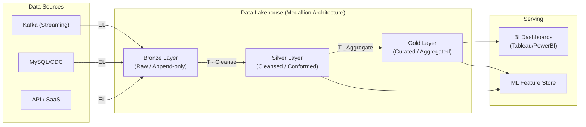

Thiết kế một **Data Platform** ở quy mô Petabyte không đơn thuần là việc chọn "dùng Kafka hay Kinesis", "dùng Snowflake hay BigQuery", hay chắp vá các công cụ mã nguồn mở lại với nhau. Ở góc nhìn của một Staff Data Engineer, thách thức thực sự nằm ở việc giải quyết các **Systemic Trade-offs** (Sự đánh đổi hệ thống): Cân bằng giữa Độ trễ (Latency) và Thông lượng (Throughput), Tính nhất quán (Consistency) và Tính khả dụng (Availability) (theo định lý CAP/PACELC), và tối ưu chi phí (FinOps) trong khi vẫn đảm bảo SLA khắt khe.

Bài viết này mổ xẻ các khuôn mẫu kiến trúc xử lý (Processing Patterns) như Lambda/Kappa, mô hình tổ chức dữ liệu Medallion, các quyết định thiết kế vật lý, và những bài học xương máu (Incidents) trong vận hành thực tế.

---

## 1. Sự tiến hóa của các Kiến trúc Xử lý (Processing Architectures)

Kiến trúc xử lý quyết định cách dữ liệu luân chuyển từ Nguồn (Source) tới Đích (Serving).

### 1.1. Lambda Architecture: Vững chãi nhưng cồng kềnh
Được giới thiệu bởi Nathan Marz (cha đẻ của Apache Storm), Lambda tách luồng dữ liệu thành hai nhánh song song để giải quyết giới hạn của các hệ thống Batch chậm chạp.
- **Batch Layer:** Lưu trữ dữ liệu thô (Master Dataset) không thể thay đổi (Immutable). Xử lý định kỳ (ví dụ chạy Spark mỗi đêm) để tạo ra các Batch View chính xác tuyệt đối.
- **Speed Layer:** Xử lý luồng dữ liệu theo thời gian thực (Real-time) để tạo ra các Real-time View với độ trễ thấp, nhưng có thể xấp xỉ hoặc sai sót do dữ liệu đến trễ (Late arriving).
- **Serving Layer:** Merge kết quả của Batch và Speed Layer để phục vụ Query.

**Trade-off:** Rất vững chãi (Robust), luôn có Batch Layer làm "Sự thật tối thượng" (Source of Truth). Tuy nhiên, **Chi phí bảo trì cực cao**. Kỹ sư phải viết và duy trì hai tập Codebase hoàn toàn khác nhau (một cho Batch Spark, một cho Flink/Storm streaming) nhưng phải đảm bảo sinh ra cùng một kết quả.

### 1.2. Kappa Architecture: Mọi thứ đều là Stream
Được Jay Kreps (CEO Confluent/cha đẻ Kafka) đề xuất. Kappa loại bỏ hoàn toàn Batch Layer, coi **Mọi dữ liệu đều là Stream**.
- Hệ thống chỉ có một luồng duy nhất sử dụng Stream Processing Engine (Flink/Kafka Streams).
- Khi cần tính toán lại dữ liệu lịch sử (Reprocessing), hệ thống đơn giản là **Replay (Phát lại)** dữ liệu từ Kafka Log (với Retention được set dài hạn, hoặc sử dụng Tiered Storage).

**Trade-off:** Giảm một nửa nỗ lực code (Chỉ duy trì 1 Codebase). Nhưng yêu cầu hạ tầng Streaming cực kỳ đắt đỏ và mạnh mẽ. Việc Replay 5 năm dữ liệu lịch sử qua Kafka tốn kém và chậm hơn rất nhiều so với việc Map-Reduce bằng Spark trên S3.

---

## 2. Kiến trúc Tổ chức Dữ liệu (Medallion Architecture)

Dù bạn dùng Lambda hay Kappa để "chạy" dữ liệu, bạn vẫn cần một cấu trúc Logic để tổ chức "Trạng thái" (State) của dữ liệu đó. **Medallion Architecture** (do Databricks phổ biến) là tiêu chuẩn vàng của Data Lakehouse hiện đại.



- **Bronze (Vùng Hạ cánh - Raw):** Lưu trữ dữ liệu thô gốc, nguyên bản định dạng (JSON/Parquet). Bắt buộc phải là Append-only (Chỉ thêm mới). Đây là kho lưu trữ vĩnh viễn (Immutable) dùng để khôi phục (Disaster Recovery).
- **Silver (Vùng Tinh chế - Cleansed):** Dữ liệu được làm sạch (Xóa Null, Parse ngày tháng, Deduplicate). Đây là "Single Source of Truth" (Nguồn sự thật duy nhất) của toàn doanh nghiệp, thường được tổ chức dưới dạng Open Table Format (Delta Lake / Iceberg). Các team Data Science sẽ lấy dữ liệu từ đây.
- **Gold (Vùng Kinh doanh - Curated):** Dữ liệu được Join, Group By và tạo thành các Bảng kích thước (Star Schema) phục vụ riêng cho các chỉ số BI (Doanh thu, MAU, Churn Rate).

---

## 3. Physical Execution & Khắc phục Sự cố Thực tế (Hard Engineering)

Kiến trúc trên giấy thường hoàn hảo cho đến khi đưa vào chạy dữ liệu thực tế ở quy mô Terabyte. Dưới đây là các "bài học máu xương" trong vận hành thực tế.

### 3.1. Nỗi ám ảnh "Data Skew" và "Network Shuffle"

**Sự cố:** Một job Spark xử lý 5TB dữ liệu hàng ngày đột nhiên bị treo ở task cuối cùng (99%) trong 4 tiếng đồng hồ, sau đó chết vì `Out Of Memory (OOM)`.
**Nguyên nhân gốc (Root Cause):** Dữ liệu bị lệch (Data Skew). Khi thực hiện `JOIN` hoặc `GROUP BY` trên cột `customer_id`, nếu một khách hàng (ví dụ bot hoặc tài khoản nội bộ) có 10 triệu giao dịch trong khi user bình thường chỉ có 10 giao dịch, toàn bộ 10 triệu bản ghi đó sẽ bị dồn (Shuffle) qua mạng tới **DUY NHẤT một Executor**. Node này sẽ nhanh chóng cạn kiệt bộ nhớ Heap và sập (OOMKilled).

**Giải pháp (Fix):**
1. **Salting:** Thêm một chuỗi số ngẫu nhiên vào khóa Join của bảng bị lệch để ép Spark phân tán khối lượng dữ liệu khổng lồ đó ra nhiều node.
2. **Adaptive Query Execution (AQE):** Bật tính năng AQE của Spark 3.x. Optimizer sẽ tự động phát hiện Skew Partition trong lúc chạy (Runtime) và tự động chia nhỏ nó ra.

```yaml
# spark-defaults.conf (Cấu hình Staff Engineer)
spark.sql.adaptive.enabled                 true
spark.sql.adaptive.skewJoin.enabled        true
spark.sql.adaptive.advisoryPartitionSizeInBytes 134217728 # 128MB per partition
spark.sql.shuffle.partitions               2000 # Cần Tuning dựa trên volume thực tế
spark.executor.memoryOverhead              2048 # Tránh YARN/Kubernetes kill container do thiếu RAM non-JVM
```

### 3.2. Vấn đề File Nhỏ (The Small Files Problem) trong Data Lake

Hệ thống Streaming (VD: Debezium -> Kafka -> S3) liên tục ghi hàng nghìn file Parquet dung lượng 10KB mỗi phút. Sau vài tháng, vùng Bronze chứa hàng trăm triệu file nhỏ. 

**Hậu quả:** Lệnh `SELECT count(*) FROM table` tốn 30 phút vì Query Engine (Trino/Spark) phải tốn nhiều thời gian, I/O mạng và CPU để thực hiện các lời gọi API `LIST` và `GET` Metadata tới AWS S3 hơn là thời gian thực sự đọc nội dung dữ liệu (Metadata Overhead Threshold).

**Giải pháp:** 
Thiết kế các Data Pipeline chạy **Compaction (Nén file)** định kỳ (thường vào giờ thấp điểm ban đêm). Bảng dưới đây minh họa cấu hình tối ưu Apache Iceberg:

```sql
-- Chuyển đổi hàng vạn file nhỏ thành các file 512MB chuẩn hóa
ALTER TABLE silver.user_events SET TBLPROPERTIES (
    'write.target-file-size-bytes'='536870912', -- 512 MB per file
    'write.distribution-mode'='hash',
    'format-version'='2' -- Hỗ trợ Row-level delete
);

-- Gọi thủ tục tối ưu hóa định kỳ (ví dụ qua Apache Airflow DAG)
CALL catalog.system.rewrite_data_files(
    table => 'silver.user_events',
    strategy => 'sort',
    sort_order => 'event_time DESC, user_id ASC'
);
```

---

## 4. Kiến Trúc Infrastructure as Code (IaC)

Một Staff Engineer không bao giờ cấu hình tài nguyên thủ công qua giao diện Web AWS/GCP (ClickOps). Bạn không thể kiểm soát Version, Review Code, hay tái tạo lại môi trường khi thảm họa xảy ra (Disaster Recovery). Mọi hạ tầng phải được lập trình bằng Terraform, Pulumi hoặc AWS CDK.

Dưới đây là một module Terraform định nghĩa Storage Bucket cho Data Lake với chính sách **Tiered Storage tự động (Data Lifecycle)**. Nó giúp giảm chi phí lưu trữ khổng lồ bằng cách tự động chuyển dữ liệu cũ sang kho lạnh (Glacier).

```hcl
resource "aws_s3_bucket" "data_lake_silver" {
  bucket = "company-datalake-silver-zone"
}

resource "aws_s3_bucket_lifecycle_configuration" "silver_lifecycle" {
  bucket = aws_s3_bucket.data_lake_silver.id

  rule {
    id     = "archive-old-data-to-glacier"
    status = "Enabled"

    filter {
      prefix = "historical_events/"
    }

    # Đổi sang Standard-IA (Infrequent Access) sau 90 ngày không đụng đến
    transition {
      days          = 90
      storage_class = "STANDARD_IA"
    }

    # Tự động đẩy xuống Glacier (cold storage siêu rẻ) sau 1 năm
    transition {
      days          = 365
      storage_class = "GLACIER"
    }
  }
}
```

---

## 5. FinOps: Tối Ưu Chi Phí Tính Toán [Compute Cost Optimization]

Khi cụm xử lý dữ liệu chạy hàng trăm node, hóa đơn Cloud có thể đốt hàng triệu đô la mỗi tháng. Tư duy Data Platform FinOps bao gồm:

1. **Sử dụng Spot Instances (Preemptible VMs):** Sử dụng AWS Spot Instances cho các Spark Worker Nodes. Do kiến trúc của Spark hỗ trợ Lineage và Fault Tolerance mạnh mẽ, nếu một Spot Node bị Cloud Provider thu hồi đột ngột, Spark Master sẽ tự động giao lại (Re-schedule) task cho node khác mà không làm hỏng toàn bộ pipeline. Tiết kiệm 70-80% chi phí Compute.
2. **Chuyển đổi kiến trúc sang ARM (Graviton):** Chuyển các workload (như Trino, Spark) từ kiến trúc x86 (Intel/AMD) sang chip ARM (AWS Graviton, GCP Axion). Điều này tăng mật độ tính toán trên mỗi watt điện, giảm chi phí trực tiếp thêm 20-30%.
3. **Autoscaling & Scale-to-Zero:** Định cấu hình HPA (Horizontal Pod Autoscaling) trong Kubernetes để tắt toàn bộ cluster ngoài giờ hành chính cho các môi trường Dev/Staging.

---

## 6. Tổng Kết

Xây dựng Kiến trúc Nền tảng Dữ liệu không đơn thuần là việc chọn Tooling. Bản chất công việc là giải quyết các bài toán về **Quản lý trạng thái phân tán (Distributed State Management)**, **Tối ưu hóa I/O mạng/đĩa**, cũng như **Quản trị chi phí (FinOps)** ở quy mô khổng lồ.

Là một Staff Engineer, giá trị của bạn nằm ở việc thấu hiểu tường tận từng cấu hình `spark.conf` ảnh hưởng đến cấp phát bộ nhớ ra sao, cách Data Lake phục hồi khi dữ liệu bị ghi lỗi (Concurrency Control), và đảm bảo mọi thành phần kiến trúc đều được tự động hóa bằng code và an toàn tuyệt đối.

---

## 7. Nguồn Tham Khảo (References)

1. **Databricks Blog:** [What is a Medallion Architecture?](https://www.databricks.com/glossary/medallion-architecture)
2. **Netflix TechBlog**: [Data Mesh - A Data Movement and Processing Platform](https://netflixtechblog.com/)
3. **Uber Engineering**: [Hudi: Uber's Open Source Data Lake](https://eng.uber.com/hoodie/) 
4. **Designing Data-Intensive Applications** - Martin Kleppmann (O'Reilly). Phân tích chuyên sâu về Lambda vs Kappa.
5. **AWS Well-Architected Framework**: [Data Analytics Lens](https://docs.aws.amazon.com/wellarchitected/latest/analytics-lens/analytics-lens.html). Hướng dẫn vận hành và bảo mật dữ liệu cấp độ đám mây.
