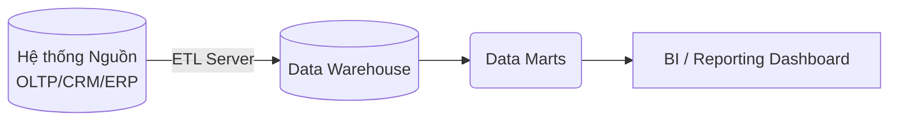
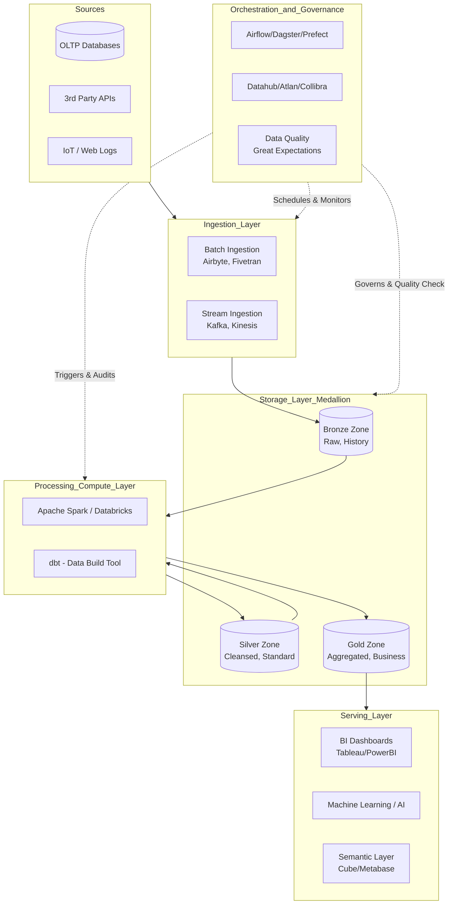
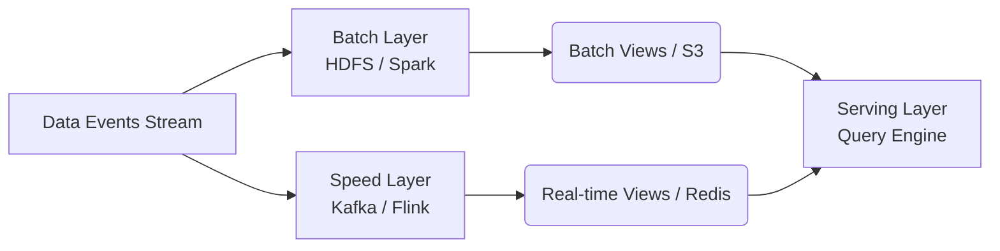

**Data Platform Architecture** là bộ khung thiết kế toàn diện bao gồm các công cụ và quy trình liên quan đến Ingestion (Thu thập), Storage (Lưu trữ), Processing (Xử lý), và Serving (Phân phối) dữ liệu. Mục tiêu của một kiến trúc tốt là phải đảm bảo tính mở rộng (Scalability), tính linh hoạt (Agility), độ tin cậy (Reliability), bảo mật (Security) và khả năng bảo trì cao.

Trong môi trường kinh doanh hiện đại, nơi dữ liệu được ví như "mỏ dầu mới", một nền tảng dữ liệu kiến trúc tốt giúp tổ chức phá vỡ các silo dữ liệu, tăng tốc độ đưa ra quyết định (time-to-insight), và hỗ trợ các ứng dụng phân tích nâng cao như Học máy (Machine Learning) hay Trí tuệ Nhân tạo (AI).

---

## 1. Sự tiến hóa của Nền tảng Dữ liệu (The Evolution of Data Platforms)

Kiến trúc dữ liệu đã trải qua nhiều giai đoạn phát triển để đáp ứng sự gia tăng không ngừng về khối lượng (Volume), tốc độ (Velocity), tính đa dạng (Variety) và tính xác thực (Veracity) của dữ liệu — thường được gọi là 4V của Big Data. Sự tiến hóa này diễn ra qua 3 thế hệ chính.

### 1.1. Thế hệ thứ nhất: Data Warehouse (DWH)

Data Warehouse truyền thống được thiết kế chủ yếu để lưu trữ dữ liệu đã được cấu trúc và làm sạch, phục vụ cho báo cáo tài chính, quản trị doanh nghiệp (BI - Business Intelligence). Dữ liệu thường được mô hình hóa theo dạng Dimensional Modeling (như Star Schema hoặc Snowflake Schema) của Ralph Kimball hoặc Enterprise Data Warehouse của Bill Inmon.

* **Đặc điểm nổi bật**: 
  * Dữ liệu có cấu trúc khắt khe (Relational Databases).
  * Mô hình **Schema-on-write**: Bắt buộc phải định nghĩa schema một cách chặt chẽ trước khi ghi dữ liệu. Bất kỳ sự sai lệch nào sẽ dẫn đến lỗi quá trình ghi.
  * Hỗ trợ truy vấn SQL với độ trễ thấp, tính toàn vẹn dữ liệu được đảm bảo thông qua ACID transactions.
* **Hạn chế**: 
  * Chi phí phần cứng, lưu trữ và bản quyền (license) cực kỳ đắt đỏ (điển hình như Teradata, Oracle Exadata).
  * Gần như vô dụng với dữ liệu bán cấu trúc (JSON, XML) hoặc phi cấu trúc (text, image, logs, video).
  * Quy trình ETL (Extract-Transform-Load) cực kỳ phức tạp, rườm rà. Thường xuyên bị tắc nghẽn cổ chai (bottleneck) ở máy chủ ETL do phải xử lý xong mới được Load vào Warehouse.



### 1.2. Thế hệ thứ hai: Data Lake

Để giải quyết bài toán dữ liệu lớn và đa dạng mà DWH không thể đảm đương, **Data Lake** ra đời. Khởi đầu thịnh vượng cùng hệ sinh thái Hadoop (HDFS, YARN, MapReduce) ở hệ thống On-Premise (đặt tại máy chủ vật lý công ty), và sau đó chuyển dịch mạnh mẽ lên Cloud Object Storage (Amazon S3, Google Cloud Storage - GCS, Azure Data Lake Storage - ADLS).

* **Đặc điểm nổi bật**: 
  * Lưu trữ mọi định dạng dữ liệu (Structured, Semi-Structured, Unstructured) ở dạng thô nguyên bản (raw data).
  * Mô hình **Schema-on-read**: Cứ lưu hết dữ liệu vào, chỉ cần gán cấu trúc cho dữ liệu tại thời điểm truy vấn. Rất linh hoạt.
  * Việc tách biệt hoàn toàn Compute (Tài nguyên tính toán) và Storage (Lưu trữ) trên Cloud giúp chi phí lưu trữ cực rẻ. Bạn có thể lưu petabytes dữ liệu với giá rất hợp lý.
* **Hạn chế**: 
  * Dễ biến thành **"Data Swamp"** (đầm lầy dữ liệu) nếu thiếu đi sự quản trị (Governance) và Metadata Catalog. Người dùng cuối không biết dữ liệu là gì và từ đâu tới.
  * Hiệu suất truy vấn SQL trực tiếp thấp do thiếu Indexing như DWH truyền thống.
  * Rất khó thực hiện các thao tác cập nhật, xóa (UPDATE/DELETE) hoặc đảm bảo tính nhất quán dữ liệu (ACID) khi nhiều người cùng ghi/đọc đồng thời.

### 1.3. Thế hệ thứ ba: Data Lakehouse

**Data Lakehouse** là mô hình lai (hybrid) tiên tiến nhất hiện nay, một bước đột phá kết hợp sự linh hoạt, chi phí rẻ của Data Lake với hiệu năng cao, khả năng quản lý chặt chẽ của Data Warehouse. Cốt lõi sức mạnh của Lakehouse nằm ở các **Định dạng bảng mở (Open Table Formats)**.

* **Đặc điểm nổi bật**: 
  * Hỗ trợ đầy đủ giao dịch ACID (Atomicity, Consistency, Isolation, Durability) ngay trên nền tảng Cloud Object Storage rẻ tiền.
  * Hỗ trợ **Time Travel** (truy vấn dữ liệu tại một thời điểm trong quá khứ), **Schema Evolution** (thay đổi cấu trúc bảng linh hoạt mà không cần viết lại toàn bộ bảng).
  * Khả năng phục vụ đồng thời cả báo cáo BI truyền thống bằng SQL lẫn huấn luyện ML (Machine Learning) bằng Python/Scala trên cùng một nguồn dữ liệu duy nhất (Single Source of Truth), loại bỏ hoàn toàn sự di chuyển dữ liệu dư thừa.

> **So sánh nhanh 3 Open Table Formats phổ biến hiện nay**:
> 
> | Tiêu chí | Delta Lake | Apache Iceberg | Apache Hudi |
> | --- | --- | --- | --- |
> | **Nguồn gốc phát triển** | Databricks | Netflix / Apple | Uber |
> | **Điểm mạnh cốt lõi** | Tích hợp hoàn hảo với hệ sinh thái Spark, dễ sử dụng "out-of-the-box" | Tách biệt hoàn toàn vật lý và logic (Hidden Partitioning), tối ưu query cực tốt cho dataset khổng lồ | Chuyên biệt tối ưu cho xử lý Streaming, Upsert/Delete cực mạnh và linh hoạt |
> | **Mức độ cộng đồng** | Rất lớn, được hậu thuẫn mạnh mẽ bởi Databricks | Tăng trưởng bùng nổ, được ủng hộ bởi Snowflake, AWS, Tabular | Phổ biến trong các hệ thống đòi hỏi độ trễ cực thấp về event streaming |

*Ví dụ minh họa về tính năng Time Travel siêu việt trong Delta Lake (Mã Python/Spark):*
```python
# Đọc phiên bản dữ liệu cách đây chính xác 2 ngày thay vì dữ liệu hiện tại
df = spark.read \
  .format("delta") \
  .option("timestampAsOf", "2023-10-01") \
  .load("/mnt/lakehouse/silver/users_table")
  
# Hoặc truy cập theo version ID cụ thể (ví dụ version 5 trước khi có update nhầm)
df_v5 = spark.read \
  .format("delta") \
  .option("versionAsOf", 5) \
  .load("/mnt/lakehouse/silver/users_table")

# Đảo ngược bảng về trạng thái của version 5
spark.sql("RESTORE TABLE delta.`/mnt/lakehouse/silver/users_table` TO VERSION AS OF 5")
```

---

## 2. Các Tầng Kiến trúc Cốt lõi (Core Layers of Modern Data Stack)

Một Data Platform hiện đại không phải là một khối monolith (nguyên khối) mà tuân theo nguyên tắc thiết kế Modularity. Hệ thống được chia thành các tầng độc lập để dễ dàng mở rộng theo chiều ngang (scale out), thay thế công cụ linh hoạt mà không ảnh hưởng toàn hệ thống (Vendor Agnostic).



### 2.1. Tầng Thu thập (Ingestion Layer)

Tầng Ingestion có nhiệm vụ "bơm" dữ liệu từ vô vàn hệ thống nguồn (Database, API, hệ thống File, IoT Logs) vào Data Platform một cách an toàn, tin cậy và ít tác động (low-impact) tới nguồn nhất có thể.

* **Batch Ingestion**: Chạy các job rút dữ liệu theo lịch trình cố định (vd: 1 giờ/lần, 1 ngày/lần vào lúc nửa đêm). Phù hợp với dữ liệu tĩnh, kích thước lớn mà doanh nghiệp không có yêu cầu báo cáo thời gian thực.
  * *Công cụ tiêu biểu*: Airbyte (Mã nguồn mở), Fivetran (Thương mại, cực kỳ ổn định), Meltano.
* **Streaming Ingestion & Change Data Capture (CDC)**: Thu thập dữ liệu liên tục theo thời gian thực (millisecond).
  * **CDC (Change Data Capture)**: Đây là một kỹ thuật cách mạng hóa tích hợp dữ liệu. Thay vì query trực tiếp lên Database nguồn bằng SELECT gây nặng tải, CDC đọc và lắng nghe các thay đổi trong transaction log của database (như binlog trong MySQL, WAL trong PostgreSQL) để đẩy event (INSERT/UPDATE/DELETE) ra ngay lập tức.
  * *Công cụ thực thi CDC*: Debezium (tiêu chuẩn vàng cho CDC mã nguồn mở), Kafka Connect.
  * *Event Streaming Platform*: Nơi chứa dữ liệu stream như Apache Kafka, Amazon Kinesis, Google Cloud Pub/Sub, Redpanda.

### 2.2. Tầng Lưu trữ (Storage Layer) & Medallion Architecture

Trong các thiết kế Lakehouse hiện đại (tiên phong bởi Databricks), dữ liệu thường được phân ranh giới thành các "Vùng" (Zone) tuân theo **Medallion Architecture** (Kiến trúc Huy chương vàng, bạc, đồng) nhằm phân tách rõ ràng trách nhiệm và vòng đời dữ liệu.

1. **Bronze Layer (Raw Zone)**: Chứa dữ liệu gốc (raw data) không qua chỉnh sửa, giữ y nguyên cấu trúc như hệ thống nguồn (landing area). Thường được lưu dưới định dạng JSON, Parquet. Tại vùng này, ta lưu giữ dữ liệu vĩnh viễn (History) để đề phòng trường hợp các logic xử lý về sau bị sai, chúng ta có thể luôn quay về Bronze để xử lý (replay) lại từ đầu.
2. **Silver Layer (Cleansed / Conformed Zone)**: Dữ liệu từ vùng Đồng được làm sạch, loại bỏ các bản ghi bị null vô lý, chuẩn hóa kiểu dữ liệu (data types), loại bỏ trùng lặp (deduplication). Đây chính là cái nôi của dữ liệu Master (Single Source of Truth) phục vụ đa mục đích cho toàn bộ doanh nghiệp.
3. **Gold Layer (Curated / Aggregated Zone)**: Dữ liệu từ vùng Bạc được Join, Group By, Aggregate và thiết kế model thành các Data Mart cụ thể phục vụ riêng cho các phòng ban kinh doanh (ví dụ: Marketing Data Mart, Sales Data Mart). Dữ liệu ở đây thường là Dimensional modeling (Fact/Dim), có dung lượng nhỏ hơn nhiều so với vùng Bạc và truy vấn siêu tốc độ trực tiếp ra các công cụ BI dashboards.

### 2.3. Tầng Xử lý và Tính toán (Processing & Compute Layer)

Thực hiện quá trình biến đổi dữ liệu khổng lồ (Transformation). Sự ra đời của kiến trúc Cloud Data Warehouse và Cloud Storage đã định hình lại quy trình từ **ETL sang ELT**.

* **ETL (Extract - Transform - Load)**: Dữ liệu được trích xuất, đưa vào máy chủ biến đổi trung gian (như Informatica, Talend, Pentaho) tính toán nặng nề rồi mới ghi vào kho lưu trữ cuối. Thường chậm do nghẽn cổ chai tại máy chủ Transform, không tận dụng được tài nguyên linh hoạt của Cloud.
* **ELT (Extract - Load - Transform)**: Đẩy thẳng dữ liệu thô nguyên bản (Extract-Load) vào Data Lake/Cloud Data Warehouse tốc độ cao. Sau đó mới dùng sức mạnh tính toán song song khổng lồ của chính hệ thống Warehouse/Lakehouse đó (như Snowflake, BigQuery, Spark) để thực hiện Transform ngược lại bằng SQL/Python.
  * **dbt (data build tool)**: Công cụ thống trị không thể chối cãi trong quy trình ELT hiện nay. Nó cho phép Data Analyst/Engineer viết các khối biến đổi chỉ bằng thuần SQL. Quan trọng hơn, dbt biến việc viết SQL trở thành một quy trình chuẩn Kỹ nghệ phần mềm (Software Engineering) với: quản lý version control (Git), Testing dữ liệu tự động, DRY (Don't Repeat Yourself) thông qua macro, và CI/CD tích hợp hoàn hảo.

*Ví dụ một dbt model SQL biến đổi dữ liệu từ Silver lên Gold, kèm cơ chế tự động reference:*
```sql
-- models/marts/marketing/dim_customers.sql

{{ config(
    materialized='incremental',
    unique_key='customer_id'
) }}

WITH silver_customers AS (
    SELECT * FROM {{ ref('silver_stg_customers') }}
    -- Cơ chế macro ref() giúp dbt tự hiểu DAG phụ thuộc
),
silver_orders AS (
    SELECT customer_id, count(order_id) as total_orders, sum(revenue) as clv
    FROM {{ ref('silver_stg_orders') }}
    GROUP BY 1
)

SELECT 
    c.customer_id,
    c.full_name,
    c.email_domain,
    COALESCE(o.total_orders, 0) as lifetime_orders,
    COALESCE(o.clv, 0) as customer_lifetime_value,
    CURRENT_TIMESTAMP() as updated_at
FROM silver_customers c
LEFT JOIN silver_orders o ON c.customer_id = o.customer_id


  -- Chỉ chạy trên dữ liệu khách hàng mới cập nhật
  WHERE c.updated_at > (select max(updated_at) from {{ this }})

```

### 2.4. Tầng Phân phối (Serving Layer)

Tầng cung cấp dữ liệu đã được tinh chế cho người dùng cuối (End-users) hoặc các hệ thống down-stream để tạo ra giá trị kinh doanh cuối cùng.

* **BI & Analytics**: Tableau, PowerBI, Apache Superset, Metabase, Looker. Dùng để tạo dashboard trực quan phục vụ cho C-Level và các phòng ban.
* **Semantic Layer / Headless BI**: Đây là xu hướng mới. Nó là một tầng ngữ nghĩa nằm trung gian giữa Data Warehouse và các công cụ BI. Nhiệm vụ của nó là định nghĩa các Metrics (Chỉ số kinh doanh) tại một nơi duy nhất. Ví dụ: định nghĩa `Doanh thu thuần (Net Revenue)` được code 1 lần tại Semantic Layer. Tất cả các tool BI khác (Tableau, Excel, PowerBI) gọi thông qua API sẽ nhận được kết quả tính toán nhất quán tuyệt đối, giải quyết bài toán "ai cũng mang một con số lên họp nhưng không khớp nhau". *Công cụ*: Cube.js, dbt Semantic Layer, MetricFlow.
* **Machine Learning & Data Science**: Cung cấp dữ liệu lịch sử chất lượng cao cho quá trình huấn luyện mô hình và hệ thống **Feature Store** (Kho lưu trữ đặc trưng) cho quá trình suy luận (Inference) thời gian thực.
* **Reverse ETL (ETL Ngược)**: Tích hợp dữ liệu quay lại vận hành. Đẩy ngược insight đã phân tích từ Data Warehouse trả lại thẳng vào các hệ thống phần mềm SaaS ứng dụng như Salesforce (cho Sales chốt deal), Hubspot (cho Marketing chạy campaign automation), Zendesk. *Công cụ*: Hightouch, Census, RudderStack.

---

## 3. Điều phối và Quản trị (Orchestration & Governance)

Một Data Platform dù trang bị công cụ xịn đến đâu, nếu không có sự điều phối nhịp nhàng và quản trị rõ ràng sẽ nhanh chóng sụp đổ trong sự hỗn loạn (chaos) khi số lượng đường ống (pipelines) phình to.

### 3.1. Data Orchestration (Điều phối Luồng công việc)

**Workflow Orchestration** đóng vai trò là "Nhạc trưởng". Nó giúp sắp xếp, lên lịch chạy định kỳ, quản lý dependency (sự phụ thuộc - task A chạy xong mới được chạy task B), theo dõi tình trạng, tự động retry khi lỗi, và gửi thông báo cảnh báo của hàng nghìn pipeline thông qua **DAGs (Directed Acyclic Graphs)**.

* **Apache Airflow**: Tiêu chuẩn công nghiệp phổ biến nhất và lâu đời nhất. Được sinh ra ở Airbnb. Mọi Pipeline được định nghĩa hoàn toàn bằng code Python (Configuration as Code). Hệ sinh thái Operators khổng lồ.
* **Dagster & Prefect**: Những giải pháp Data Orchestrator thế hệ mới, đang trỗi dậy mạnh mẽ. Chúng nhận ra điểm yếu của Airflow là chỉ quản lý việc "chạy Task" mà không hiểu "Dữ liệu bên trong task là gì". Dagster tập trung vào Software-Defined Assets, quản lý vòng đời và chất lượng của chính các bảng dữ liệu thay vì chỉ là các block code tĩnh, hỗ trợ local testing cực kỳ mượt mà.

*Ví dụ DAG Airflow định nghĩa luồng dữ liệu đơn giản:*
```python
from airflow import DAG
from airflow.operators.bash import BashOperator
from airflow.providers.snowflake.operators.snowflake import SnowflakeOperator
from airflow.providers.dbt.cloud.operators.dbt import DbtCloudRunJobOperator
from datetime import datetime, timedelta

default_args = {'owner': 'data_engineering', 'retries': 2, 'retry_delay': timedelta(minutes=5)}

with DAG('end_to_end_daily_sales', start_date=datetime(2023, 1, 1), schedule_interval='0 2 * * *', default_args=default_args) as dag:
    
    # 1. Thu thập dữ liệu API
    extract_api = BashOperator(
        task_id='extract_sales_from_stripe_api',
        bash_command='python /scripts/ingest_stripe.py'
    )
    
    # 2. Xử lý dbt job trên Snowflake
    transform_dbt = DbtCloudRunJobOperator(
        task_id='run_dbt_models_silver_to_gold',
        job_id=12345,
        account_id=67890
    )

    # 3. Chạy Data Quality Test bằng dbt
    test_dbt = DbtCloudRunJobOperator(
        task_id='run_data_quality_tests',
        job_id=12346,
        account_id=67890
    )

    # Định nghĩa luồng chạy (Dependency) rõ ràng
    extract_api >> transform_dbt >> test_dbt
```

### 3.2. Data Governance & Observability (Quản trị & Giám sát Hệ thống)

Khi dữ liệu trở thành sinh mệnh của công ty, Quản trị dữ liệu là khâu sống còn để đảm bảo dữ liệu đáng tin cậy, tuân thủ pháp lý (GDPR, CCPA, PDPA) và có thể sử dụng dễ dàng.

* **Data Catalog (Danh mục dữ liệu/Từ điển dữ liệu)**: Giống như "Google" dành cho dữ liệu nội bộ. Trả lời các câu hỏi: "Bảng doanh thu chi tiết nằm ở database nào?", "Cột này ý nghĩa là gì?", "Ai là Data Owner chịu trách nhiệm?". *Công cụ*: Amundsen, DataHub (từ LinkedIn), Atlan.
* **Data Lineage (Phả hệ dữ liệu)**: Vẽ ra bản đồ luồng chảy của dữ liệu từ những hệ thống nguồn ban đầu, xuyên qua tầng tầng lớp lớp SQL, cho đến tận biểu đồ cuối cùng trên màn hình CEO. Đây là công cụ không thể thiếu khi cần debug lỗi (Root Cause Analysis) hoặc phân tích mức độ ảnh hưởng trước khi sửa code (Impact Analysis).
* **Data Quality (Chất lượng dữ liệu)**: Tư duy "Rác vào thì Rác ra" (Garbage In - Garbage Out) luôn đúng. Hệ thống kiểm tra chất lượng tự động sẽ ngăn chặn những file lỗi, bị null dữ liệu quan trọng, hay thay đổi volume bất thường lọt vào tầng Gold.
  * *Công cụ phổ biến*: Great Expectations, Monte Carlo, SodaSQL.

---

## 4. Các Mẫu Kiến Trúc Dữ Liệu Phổ Biến (Architectural Patterns)

Tùy vào quy mô doanh nghiệp, độ phức tạp của bài toán kinh doanh và yêu cầu về độ trễ, Data Engineer có thể chọn áp dụng các pattern thiết kế kiến trúc khác nhau.

### 4.1. Lambda Architecture

Kiến trúc kinh điển và bền bỉ, thiết kế để giải quyết bài toán lớn bằng cách tách biệt hoàn toàn luồng **Batch (Xử lý theo lô)** và luồng **Speed (Xử lý thời gian thực/Streaming)**.

* **Cách hoạt động**: 
  1. Dữ liệu event mới sinh ra được đẩy song song vào cả Batch Layer và Speed Layer.
  2. **Speed Layer** (vd: Apache Flink/Storm) xử lý ngay lập tức với các thuật toán tối giản để đưa ra kết quả phân tích nhanh nhất (độ trễ thấp). Kết quả có thể không chính xác 100% nhưng kịp thời.
  3. **Batch Layer** (vd: Apache Spark/Hadoop) chạy định kỳ chậm rãi (ví dụ mỗi đêm) xử lý lại toàn bộ lịch sử dữ liệu với thuật toán đầy đủ và độ chính xác tuyệt đối.
  4. **Serving Layer** tiến hành hợp nhất kết quả từ Batch (dữ liệu cũ chính xác) và Speed (dữ liệu mới tạm thời) trả về cho người dùng.
* **Ưu điểm**: Khả năng chịu lỗi (fault-tolerant) tuyệt vời. Cân bằng hoàn hảo giữa tốc độ cập nhật real-time và độ chính xác dữ liệu sâu. Nếu luồng Speed sập, dữ liệu vẫn không mất vì luồng Batch sẽ tính toán bù lại vào hôm sau.
* **Nhược điểm**: Nỗi ác mộng về chi phí phát triển và bảo trì. Các kỹ sư phải duy trì hai bộ code bằng hai công nghệ khác nhau (ví dụ: một bộ code Scala trên Spark cho Batch và bộ Java trên Flink cho Streaming) nhưng phải xử lý logic kinh doanh y hệt nhau.



### 4.2. Kappa Architecture

Loại bỏ hoàn toàn kiến trúc Batch. Kappa được đề xuất bởi Jay Kreps (CEO của Confluent, cha đẻ Kafka) nhằm khắc phục nhược điểm "hai bộ code" của Lambda. Toàn bộ dữ liệu được xem như những sự kiện (streams of events) không hồi kết. 

* **Cách hoạt động**: Chỉ dùng một Stream-processing engine duy nhất (như Apache Flink) xử lý liên tục 24/7. Nếu cần cập nhật một thuật toán mới hoặc tính lại dữ liệu cũ, đơn giản là khởi tạo một luồng stream mới và ra lệnh cho hệ thống Kafka "Replay" (chạy lại từ đầu) toàn bộ log event lịch sử đi qua engine này.
* **Ưu điểm**: "Đơn giản là sự tối thượng". Chỉ cần duy trì một luồng code duy nhất (Single Codebase), giảm chi phí bảo trì và tránh sai lệch logic giữa Batch và Stream.
* **Nhược điểm**: Yêu cầu nền tảng hạ tầng lưu trữ log cực kỳ khủng khiếp (ví dụ cụm Kafka siêu lớn có khả năng retention vô hạn - Tiered storage). Một số thuật toán Machine Learning hoặc các phép join lịch sử phức tạp vốn cần quét toàn bộ bảng một lúc sẽ rất khó cài đặt trên nền tảng luồng vô tận.

### 4.3. Data Mesh (Lưới Dữ Liệu)

Khác biệt hoàn toàn với Lambda hay Kappa (những kiến trúc thuần túy giải quyết vấn đề bằng **Kỹ thuật - Technical**), **Data Mesh** do Zhamak Dehghani (ThoughtWorks) sáng tạo lại là một cuộc cách mạng về **Tổ chức & Triết lý (Organizational & Sociotechnical)**.

Thay vì xây dựng một cục Data Platform tập trung nguyên khối (Centralized Monolithic) quản lý bởi một nhóm Data Engineer trung tâm — nơi thường xuyên trở thành nút thắt cổ chai dự án, Data Mesh đề xuất phân tán quyền lực về các **Domain Teams** (Nhóm kinh doanh ví dụ: Product, Marketing, Sales).

* **4 Nguyên tắc trụ cột của Data Mesh**:
  1. **Domain Ownership (Quyền sở hữu theo miền)**: Team nào sinh ra dữ liệu thì team đó sở hữu, hiểu rõ và quản lý dữ liệu từ đầu đến cuối. Marketing tự viết pipeline dữ liệu marketing.
  2. **Data as a Product (Dữ liệu như một Sản phẩm)**: Dữ liệu chia sẻ không phải là các file thô vứt bừa bãi, nó là một "Sản phẩm nội bộ" cần có chất lượng cam kết (SLA), có tài liệu đầy đủ (Documentation) phục vụ cho khách hàng nội bộ.
  3. **Self-serve Data Infrastructure Platform (Hạ tầng dữ liệu tự phục vụ)**: Một team Data Platform chuyên trách tạo ra các công cụ, template dùng chung để các Domain team dễ dàng deploy data pipeline chỉ bằng vài click, mà không cần hiểu sâu hạ tầng Kubernetes hay Terraform bên dưới.
  4. **Federated Computational Governance (Quản trị liên kết tự động)**: Các quy định về bảo mật, định dạng chuẩn được lập trình thành code (Policy as Code) để áp dụng tự động trên toàn mạng lưới mesh, thay vì các cuộc họp hội đồng duyệt thủ công chậm chạp.

### 4.4. Data Fabric

Data Fabric hướng tiếp cận giải quyết sự phân tán dữ liệu thông qua công nghệ. Thay vì tổ chức lại đội ngũ như Mesh, Data Fabric tập trung tạo ra một lớp mạng lưới tự động dệt (fabric) liền mạch kết nối mọi nguồn dữ liệu bất kể nó nằm ở đâu (On-premise cũ kỹ, Cloud hiện đại, Multi-Cloud). Kiến trúc này sử dụng mạnh mẽ **Active Metadata** (Metadata động) kết hợp AI/Machine Learning để hệ thống tự động nhận diện, khám phá điểm chung và tích hợp dữ liệu (Data Virtualization) trả về cho người dùng mà không cần sao chép di chuyển dữ liệu vật lý quá nhiều.

---

## 5. Thực Tiễn Tốt Nhất & Tình Huống Triển Khai (Best Practices & Use Cases)

Việc vận hành nền tảng dữ liệu tại quy mô lớn (Petabyte scale) có thể "ngốn" ngân sách khổng lồ nếu không kiểm soát tốt kiến trúc ngay từ đầu.

### 5.1. Tối ưu hóa Lưu trữ và Truy vấn (Performance & Cost)
* **Phân vùng dữ liệu (Partitioning)**: Chiến lược chia nhỏ file. Phân vùng dữ liệu vật lý theo cột thường xuyên truy vấn (như ngày tháng: `year=2023/month=10/day=01`). Khi query, query engine sẽ bỏ qua hàng vạn file không thuộc vùng cần tìm (Partition Pruning), tiết kiệm rất nhiều chi phí quét dữ liệu trên Cloud.
* **Sử dụng Định dạng cột (Columnar Formats)**: Luôn lưu trữ Data Lake ở định dạng Parquet hoặc ORC. Chúng nén dữ liệu cực đỉnh và thiết kế lưu theo cột, khi thực hiện `SELECT customer_name` hệ thống chỉ đọc đúng vùng nhớ chứa tên, nhanh gấp hàng trăm lần so với đọc nguyên một dòng dài thòng như định dạng CSV.
* **Tối ưu hóa bố cục tệp (File Compaction & Z-Ordering)**: Cứ sau một khoảng thời gian ingestion streaming sinh ra hàng triệu file nhỏ (small files problem), cần có Batch Job định kỳ ghép chúng thành file lớn (Compaction khoảng 100MB-1GB) kết hợp thuật toán sắp xếp đa chiều (Z-Ordering) để hệ thống đọc mượt mà nhất.

### 5.2. Quản lý Bảo mật và Quyền Truy Cập (Security & Access Control)
* **RBAC (Role-Based Access Control)**: Cấp quyền kinh điển dựa trên vai trò nhóm. (Ví dụ: Nhóm Analyst chỉ có quyền SELECT vào vùng Gold, Nhóm Engineer có toàn quyền INSERT/UPDATE từ tầng Bronze tới Silver).
* **ABAC (Attribute-Based Access Control)**: Kiểm soát tinh vi dựa trên thuộc tính động. Có khả năng che giấu dữ liệu nhạy cảm (Data Masking) trực tiếp khi query. (Ví dụ: Tự động dùng sao (*) che cột Số điện thoại thẻ tín dụng `****-****-****-1234` nếu user truy vấn không thuộc phòng Chăm sóc Khách hàng).

### 5.3. Tách biệt Môi trường Phát triển (Environment Separation & CI/CD)
Tương tự phát triển phần mềm, Dữ liệu cũng phải có vòng đời kiểm thử. Luôn duy trì các môi trường **Development (Dev), Staging (Test), và Production (Chạy thật)** độc lập.
* Mọi thay đổi về code dữ liệu (dbt SQL, Airflow Python) đều phải mở Pull Request.
* Tích hợp hệ thống CI/CD (GitHub Actions/GitLab CI). Khi có PR, tự động tạo một schema tạm, chạy dbt build mẫu để kiểm tra xem có hỏng logic hay lỗi syntax không. Pass hết test mới được phép merge vào nhánh chính (Main) deploy lên Production.

### 5.4. Tình huống thực tế (Real-world Scenario): Hệ thống Gợi ý E-commerce Thời gian thực
Để hình dung rõ hơn, giả sử bạn là Kiến trúc sư thiết kế Data Platform cho một sàn thương mại điện tử cần hệ thống gợi ý (Recommendation System) hiển thị sản phẩm tương tự ngay lập tức khi user vừa click xem một món đồ.

* **Ingestion (Thu thập)**: Mọi click chuột (Clickstream) của user trên web/app được gắn mã định danh gửi thẳng vào **Apache Kafka** thông qua một REST API siêu nhẹ.
* **Processing (Xử lý Real-time Streaming)**: Một cụm **Apache Flink** đọc trực tiếp từ topic Kafka đó theo thời gian thực (millisecond). Nó tính toán xem session hiện tại user đang tìm giày hay áo, làm giàu dữ liệu (enrich) bằng cách join cực nhanh với thông tin giá/tồn kho sản phẩm được lưu sẵn trên **Redis Cache** (để đảm bảo không bị nghẽn).
* **Serving (Phân phối Model)**: Flink đẩy các đặc trưng (features) vừa tính toán xong vào một **Feature Store**. Một mô hình Học sâu (Deep Learning Model) đang chạy trên Kubernetes phục vụ qua API sẽ gọi vào Feature Store lấy dữ liệu dự đoán và trả về danh sách sản phẩm gợi ý lên màn hình người dùng trong tổng thời gian dưới 50ms.
* **Storage (Batch lưu trữ lịch sử)**: Song song với luồng Streaming, Kafka sử dụng Connector (S3 Sink) âm thầm đẩy raw event data dạng json về lưu trữ siêu rẻ ở **Bronze Layer** (Amazon S3). Nửa đêm, các job **Apache Spark** chạy batch pipeline lọc lỗi, làm sạch, nối với dữ liệu đơn hàng thành công trong ngày (Orders từ MySQL), và tạo ra một bảng tổng hợp `user_daily_activity_facts` siêu sạch chuẩn lưu ở **Gold Layer** (Snowflake). Sáng hôm sau, Data Analyst và Ban Giám đốc mở màn hình PowerBI lên sẽ thấy biểu đồ hành vi mua sắm cập nhật chuẩn xác.

---

## Tài Liệu Tham Khảo Mở Rộng

1. [Designing Data-Intensive Applications - Martin Kleppmann](https://dataintensive.net/) — Đây được xem là cuốn "Kinh thánh" gối đầu giường của bất kỳ Data/Software Engineer nào. Phần 2 về Phân tán Dữ liệu giải thích gốc rễ các khái niệm cực kỳ sâu sắc.
2. **Data Mesh: Delivering Data-Driven Value at Scale - Zhamak Dehghani** — Sách gốc định nghĩa lại toàn bộ triết lý thiết kế đội ngũ dữ liệu của tương lai.
3. [The Log: What every software engineer should know about real-time data's unifying abstraction - Jay Kreps](https://engineering.linkedin.com/distributed-systems/log-what-every-software-engineer-should-know-about-real-time-datas-unifying) — Bài viết nền tảng định hình tư duy xây dựng Apache Kafka và Streaming.
4. [Delta Lake: High-Performance ACID Table Storage over Cloud Object Stores (VLDB 2020)](https://databricks.com/wp-content/uploads/2020/08/p975-armbrust.pdf) — Paper học thuật chi tiết về cơ chế nội tại của một Lakehouse.
5. [CAP Theorem and PACELC - Daniel Abadi](http://dbmsmusings.blogspot.com/2010/04/problems-with-cap-and-yahoos-little.html) — Kiến thức xương sống khi lựa chọn các loại Database và Hệ thống phân tán.
6. [Dynamo: Amazon's Highly Available Key-value Store (SOSP 2007)](https://www.allthingsdistributed.com/files/amazon-dynamo-sosp2007.pdf) — Nền tảng thiết kế NoSQL từ gã khổng lồ Amazon.
7. [Time, Clocks, and the Ordering of Events in a Distributed System - Leslie Lamport](https://lamport.azurewebsites.net/pubs/time-clocks.pdf) — Paper đạt giải thưởng Turing kinh điển về đồng hồ logic trong hệ thống phân tán.
