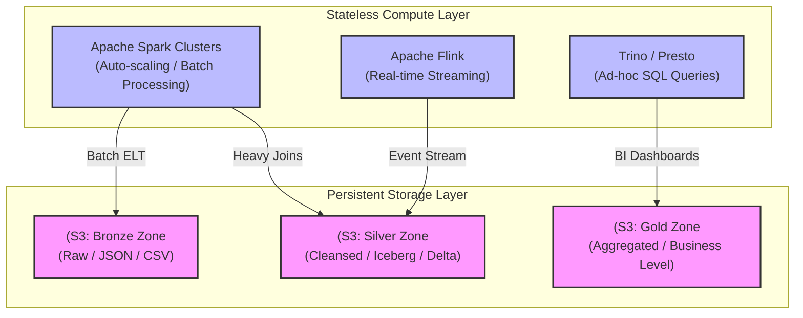
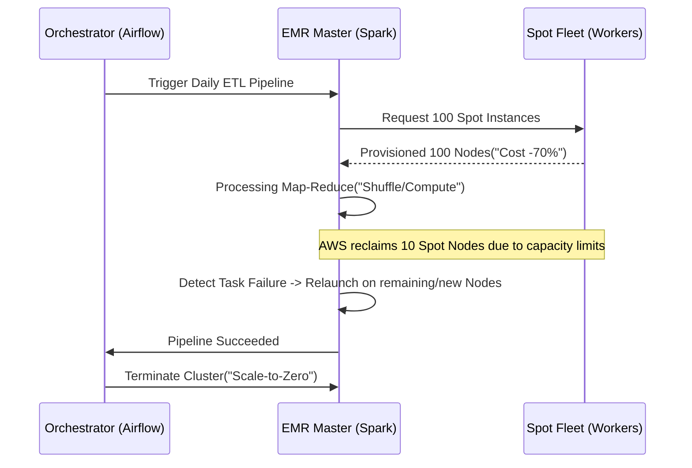

Thiết kế một **Data Platform** ở quy mô Petabyte không đơn thuần là việc nối các công cụ mã nguồn mở lại với nhau. Ở góc nhìn của một Staff Data Engineer, thách thức thực sự nằm ở việc giải quyết các trade-offs hệ thống (Systemic Trade-offs): Cân bằng giữa Latency và Throughput, Consistency và Availability (theo định lý CAP/PACELC), và tối ưu chi phí (FinOps) trong khi vẫn đảm bảo SLA/SLO khắt khe.

Bài viết này mổ xẻ kiến trúc nền tảng dữ liệu hiện đại, đi sâu vào các quyết định thiết kế (design decisions), các sự cố thực tế (incidents) và cấu hình vật lý.

---

## 1. Sự phân tách Computing và Storage (Decoupling)

Sự tiến hóa từ Data Warehouse truyền thống (như Teradata, Oracle) sang Data Lake và hiện tại là **Data Lakehouse** (Delta Lake, Apache Iceberg, Hudi) được thúc đẩy bởi một nguyên lý cốt lõi: **Decoupling Compute and Storage** (Tách biệt tính toán và lưu trữ).

Khi Compute và Storage bị trói buộc (Coupled), bạn phải scale cả hai cùng lúc. Nếu CPU của bạn đạt 100% nhưng đĩa cứng mới dùng 10%, bạn vẫn phải mua thêm các node đắt tiền chứa cả CPU lẫn Disk. 

Kiến trúc hiện đại lưu trữ trạng thái (State) ở Object Storage (S3, GCS) vô cùng rẻ, trong khi Compute (Spark, Trino, Presto) trở thành các cluster phi trạng thái (Stateless) có thể tự động scale-out (hoặc scale-to-zero) dựa trên lượng workload.



---

## 2. Systemic Trade-offs: Cân nhắc Thiết kế cốt lõi

### 2.1. Latency vs. Throughput

Một sai lầm phổ biến là cố gắng ép hệ thống xử lý stream (Kafka + Flink) vào mọi bài toán. Trong hệ thống phân tán, **Latency (Độ trễ)** và **Throughput (Thông lượng)** thường nghịch đảo với nhau.

- **Streaming (Low Latency, Lower Throughput-per-cost):** Kafka processing xử lý từng event hoặc micro-batch. Chi phí network I/O và CPU overhead rất cao vì không tận dụng được vectorization. Phù hợp cho hệ thống Fraud Detection, Real-time Bidding.
- **Batching (High Latency, High Throughput):** Đọc file Parquet 1GB trên S3 bằng Spark. Tận dụng triệt để CPU Cache, Columnar Storage và Vectorized Execution. Trễ 1 giờ nhưng chi phí phần cứng rẻ hơn 10-20 lần so với Streaming.

### 2.2. Consistency vs. Availability (Eventual Consistency)

Khi ghi dữ liệu vào Data Lake (S3), Cloud Storage cung cấp tính nhất quán (Consistency) tương đối, nhưng các hệ thống siêu dữ liệu (Metadata) hoặc các Catalog như AWS Glue / Hive Metastore có thể gặp độ trễ. 

Sự ra đời của **Open Table Formats** (Apache Iceberg, Delta Lake) sử dụng *Optimistic Concurrency Control (OCC)* để giải quyết vấn đề ACID trên nền S3. Tuy nhiên, nếu có hai job Spark cùng ghi đè lên một partition, job commit sau sẽ bị lỗi (Write Conflict) và phải retry. Đây là sự đánh đổi kinh điển: Hệ thống tăng độ chính xác (Consistency) bằng cách hy sinh tính khả dụng một phần (Availability - task thất bại phải chạy lại).

---

## 3. Physical Execution & Khắc phục Sự cố Thực tế (Hard Engineering)

Kiến trúc trên giấy thường hoàn hảo cho đến khi đưa vào chạy dữ liệu thực tế ở quy mô Terabyte. Dưới đây là các "bài học máu xương" trong vận hành thực tế.

### 3.1. Nỗi ám ảnh "Data Skew" và "Network Shuffle"

**Sự cố:** Một job Spark xử lý 5TB dữ liệu hàng ngày đột nhiên bị treo ở task cuối cùng (99%) trong 4 tiếng đồng hồ, sau đó chết vì `Out Of Memory (OOM)`.

**Nguyên nhân gốc (Root Cause):** Dữ liệu bị lệch (Data Skew). Khi thực hiện `JOIN` hoặc `GROUP BY` trên cột `customer_id`, nếu một khách hàng (ví dụ tài khoản nội bộ công ty hoặc bot) có 10 triệu giao dịch trong khi user bình thường chỉ có 10 giao dịch, toàn bộ 10 triệu bản ghi đó sẽ bị dồn (shuffle) về qua mạng (Network Shuffle) tới một Executor (Physical Node) duy nhất. Node này sẽ nhanh chóng cạn kiệt bộ nhớ Heap và sập.

**Giải pháp (Fix):**
1. **Salting:** Thêm một chuỗi số ngẫu nhiên vào khóa join của bảng bị lệch để ép Spark phân tán khối lượng dữ liệu khổng lồ đó ra nhiều node.
2. **Adaptive Query Execution (AQE):** Bật tính năng AQE của Spark 3.x. Optimizer sẽ tự động phát hiện Skew Partition trong lúc chạy (runtime) và tự động chia nhỏ nó ra.

```yaml
# spark-defaults.conf
spark.sql.adaptive.enabled                 true
spark.sql.adaptive.skewJoin.enabled        true
spark.sql.adaptive.advisoryPartitionSizeInBytes 134217728 # 128MB
spark.sql.shuffle.partitions               2000 # Cần Tuning dựa trên volume thực tế (200MB/partition là lý tưởng)
spark.executor.memoryOverhead              2048 # Tránh OOM do container bị YARN/Kubernetes OOMKilled
```

### 3.2. Vấn đề File Nhỏ (The Small Files Problem)

Hệ thống Streaming (VD: Debezium -> Kafka -> S3) liên tục ghi hàng nghìn file JSON/Parquet dung lượng 10KB mỗi phút. Sau vài tháng, S3 bucket chứa hàng trăm triệu file nhỏ. 

**Hậu quả:** Lệnh `SELECT count(*) FROM table` tốn 30 phút vì hệ thống (Trino/Spark) phải tốn nhiều thời gian và CPU để thực hiện các lời gọi API `LIST` và `GET` metadata tới S3 hơn là thời gian thực sự đọc nội dung dữ liệu (Metadata Overhead Threshold).

**Giải pháp:** 
Thiết kế các Data Pipeline chạy Compaction định kỳ (thường vào giờ thấp điểm ban đêm). Bảng dưới đây minh họa cấu hình tối ưu Iceberg table properties:

```sql
-- Chuyển đổi hàng vạn file nhỏ thành các file 512MB chuẩn hóa
ALTER TABLE gold.user_events SET TBLPROPERTIES (
    'write.target-file-size-bytes'='536870912', -- 512 MB per file
    'write.distribution-mode'='hash',
    'format-version'='2' 
);

-- Gọi thủ tục tối ưu hóa định kỳ (ví dụ qua Apache Airflow DAG)
CALL catalog.system.rewrite_data_files(
    table => 'gold.user_events',
    strategy => 'sort',
    sort_order => 'event_time DESC, user_id ASC'
);
```

---

## 4. Kiến Trúc Infrastructure as Code (IaC)

Một Data Platform Staff Engineer không bao giờ cấu hình tài nguyên thủ công qua giao diện Web (ClickOps) vì không thể kiểm soát version hay tái tạo lại môi trường khi thảm họa xảy ra (Disaster Recovery). Mọi hạ tầng phải được lập trình (Infrastructure as Code - IaC) bằng Terraform hoặc Pulumi.

Dưới đây là một module Terraform định nghĩa Storage Bucket cho Data Lake với chính sách Tiered Storage tự động (Data Lifecycle). Nó giúp giảm chi phí lưu trữ khổng lồ bằng cách tự động chuyển dữ liệu cũ sang kho lạnh (Glacier).

```hcl
resource "aws_s3_bucket" "data_lake_silver" {
  bucket = "company-datalake-silver-zone"
}

resource "aws_s3_bucket_lifecycle_configuration" "silver_lifecycle" {
  bucket = aws_s3_bucket.data_lake_silver.id

  rule {
    id     = "archive-old-data-to-glacier"
    status = "Enabled"

    filter {
      prefix = "historical_events/"
    }

    # Đổi sang Standard-IA (Infrequent Access) sau 90 ngày không đụng đến
    transition {
      days          = 90
      storage_class = "STANDARD_IA"
    }

    # Tự động đẩy xuống Glacier (cold storage siêu rẻ) sau 1 năm
    transition {
      days          = 365
      storage_class = "GLACIER"
    }
  }
}
```

---

## 5. FinOps: Tối Ưu Chi Phí Tính Toán (Compute Cost Optimization)

Khi cụm xử lý dữ liệu chạy hàng trăm node, hóa đơn Cloud có thể đốt hàng triệu đô la mỗi tháng. Tư duy Data Platform FinOps bao gồm:

1. **Sử dụng Spot Instances (Preemptible VMs):** Sử dụng AWS Spot Instances cho các Spark Worker Nodes. Do kiến trúc của Spark hỗ trợ Lineage và Fault Tolerance mạnh mẽ, nếu một Spot Node bị Cloud Provider thu hồi đột ngột, Spark Master sẽ tự động giao lại (re-schedule) task cho node khác mà không làm hỏng toàn bộ pipeline. Tiết kiệm 70% chi phí Compute.
2. **Chuyển đổi kiến trúc sang ARM (Graviton):** Chuyển các workload (như Trino, Spark) từ kiến trúc x86 (Intel/AMD) sang chip ARM (AWS Graviton, GCP Axion). Điều này tăng mật độ tính toán trên mỗi watt điện, giảm chi phí trực tiếp thêm 20-30%.
3. **Autoscaling & Scale-to-Zero:** Tắt toàn bộ cluster ngoài giờ hành chính cho các môi trường Dev/Staging.



---

## 6. Tổng Kết

Xây dựng Kiến trúc Nền tảng Dữ liệu không đơn thuần là việc chọn "dùng Kafka hay Kinesis", "dùng Snowflake hay BigQuery". Bản chất công việc là giải quyết các bài toán về **quản lý trạng thái phân tán (distributed state management)**, **tối ưu hóa I/O mạng và đĩa**, cũng như **quản trị chi phí (FinOps)** ở quy mô khổng lồ.

Là một Staff Engineer, giá trị của bạn nằm ở việc thấu hiểu tường tận từng cấu hình `spark.conf` ảnh hưởng đến cấp phát bộ nhớ ra sao, cách Data Lake phục hồi khi dữ liệu bị ghi lỗi, và đảm bảo mọi kiến trúc đều được tự động hóa bằng code và an toàn tuyệt đối.

---

## Nguồn Tham Khảo (References)

1. **Netflix Engineering Blog**: [Data Mesh - A Data Movement and Processing Platform](https://netflixtechblog.com/) - Cách Netflix xây dựng kiến trúc Data Mesh và decoupling execution (Genie) khỏi metadata (Metacat).
2. **Uber Engineering**: [Hudi: Uber's Open Source Data Lake](https://eng.uber.com/hoodie/) - Lịch sử ra đời của Apache Hudi để giải quyết bài toán upsert dữ liệu chuyến đi theo thời gian thực tại Uber.
3. **Airbnb Engineering**: [Data Quality at Airbnb](https://medium.com/airbnb-engineering) - Cách Airbnb xây dựng framework kiểm soát chất lượng dữ liệu ở quy mô lớn và tối ưu hóa Apache Druid cho phân tích độ trễ cực thấp.
4. **Designing Data-Intensive Applications** - Martin Kleppmann (O'Reilly). Sách gối đầu giường của bất kỳ Data Engineer nào.
5. **AWS Well-Architected Framework**: [Data Analytics Lens](https://docs.aws.amazon.com/wellarchitected/latest/analytics-lens/analytics-lens.html). Hướng dẫn vận hành và bảo mật dữ liệu cấp độ đám mây.
