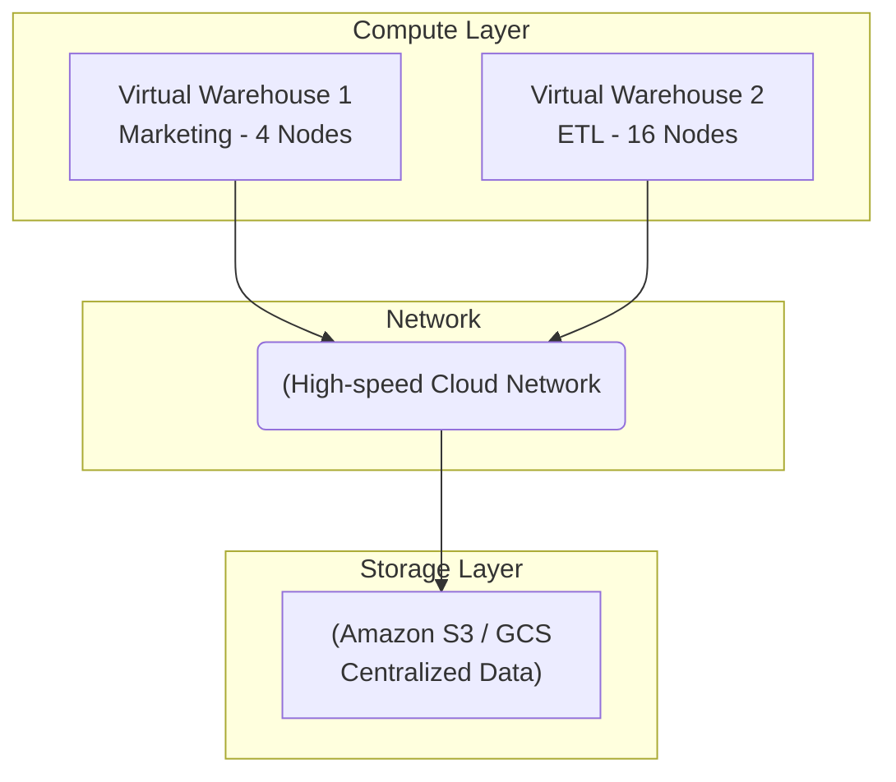

Data Warehouse (DWH) ở quy mô enterprise không chỉ đơn thuần là Kimball hay Inmon, mà là bài toán thiết kế một cỗ máy phân tán (Distributed System) đủ sức scan hàng Petabyte dữ liệu, thực thi các phép JOIN phức tạp với hàng tỷ dòng mà không bị sập (OOM - Out of Memory) hay tắc nghẽn mạng (Network Bottleneck). Bài viết này sẽ mổ xẻ các hệ thống DWH hiện đại (Snowflake, BigQuery, Redshift) dưới góc nhìn Physical Execution, Storage, và FinOps.

## 1. Kiến trúc Vật lý: Shared-Nothing vs. Separation of Compute and Storage

Sự tiến hóa của DWH có thể chia làm hai giai đoạn kiến trúc:

### 1.1. Shared-Nothing (Kiến trúc cổ điển của MPP)
Các DWH thế hệ trước (Teradata, Redshift đời đầu) sử dụng mô hình **Shared-Nothing**. Mỗi node trong cụm (Cluster) sở hữu CPU, RAM và Disk riêng biệt. Dữ liệu được băm (hash) và chia đều xuống ổ cứng của từng node.
*   **Trade-off:** Tốc độ Disk I/O cực cao vì data nằm ở Local Disk. Tuy nhiên, nó dẫn đến vấn đề **Coupling of Compute and Storage**. Nếu bạn chỉ hết dung lượng đĩa cứng, bạn vẫn phải mua thêm một Node mới (gồm cả CPU, RAM rất đắt tiền) $\rightarrow$ Lãng phí tài nguyên khủng khiếp.
*   **Độ bền bỉ (Availability):** Khi một node chết, dữ liệu trên ổ cứng của nó mất tính khả dụng tạm thời, toàn cụm phải chờ cơ chế re-replication hoạt động, ảnh hưởng nghiêm trọng tới SLA của các query đang chạy.

### 1.2. Separation of Compute and Storage (Kiến trúc Cloud-Native)
Snowflake và BigQuery tạo ra cuộc cách mạng bằng cách tách rời hoàn toàn Tầng tính toán (Compute) và Tầng lưu trữ (Storage).
*   **Storage Layer:** Sử dụng Object Storage siêu rẻ và bền bỉ (Amazon S3, GCS). Dữ liệu nằm ở dạng Immutable Files.
*   **Compute Layer:** Các cluster phi trạng thái (Stateless Virtual Warehouses). Chúng fetch dữ liệu từ S3 qua mạng để tính toán.
*   **The Catch (Điểm yếu chí mạng):** Tốc độ đọc từ S3 qua mạng chậm hơn rất nhiều so với Local NVMe. Để bù đắp, Snowflake sử dụng **Local SSD Caching** trên Compute node và cơ chế **Micro-partitioning**.



## 2. Thực thi Truy vấn: Kẻ thù mang tên "Network Shuffle"

Trong OLTP, dữ liệu cho một query nằm gọn ở một node. Trong OLAP MPP, khi JOIN 2 bảng khổng lồ (VD: Bảng `sales` 10 tỷ dòng và `users` 50 triệu dòng), các node phải gửi dữ liệu cho nhau qua mạng. Đây gọi là **Shuffle**. Network bandwidth luôn là nút thắt cổ chai lớn nhất.

### 2.1. Collocated Join (Hoàn hảo)
Nếu cả 2 bảng được phân phối (Distributed) trên cùng một khóa (ví dụ `user_id`), dữ liệu của `user_id = 123` ở cả bảng `sales` và `users` đều nằm chung trên Node A. Phép JOIN diễn ra hoàn toàn trong RAM của Node A (Local Join). Không có Network Shuffle.
*   **Action:** Trong Redshift, bạn định nghĩa `DISTKEY` cẩn thận.
```sql
-- DDL Example in Redshift for Collocation
CREATE TABLE users (user_id INT, name VARCHAR) DISTKEY(user_id);
CREATE TABLE sales (txn_id INT, user_id INT, amount DECIMAL) DISTKEY(user_id);
```

### 2.2. Broadcast Join (Dành cho bảng nhỏ)
Nếu bảng `users` nhỏ (vài chục MB đến vài GB), Master Node sẽ copy toàn bộ bảng `users` và gửi (broadcast) đến tất cả các Compute nodes. Các node sẽ build một Hash Table từ bảng `users` trên RAM, sau đó stream bảng `sales` để quét qua (Hash Join).
*   **Rủi ro OOM:** Nếu bảng `users` quá lớn so với RAM của từng node, node sẽ bị Out of Memory và query bị hủy. 

### 2.3. Shuffle Hash Join (Nặng nề nhất)
Nếu cả 2 bảng đều khổng lồ, toàn bộ cụm phải thực hiện **Hash Partitioning** qua mạng: Mỗi node đọc một phần của bảng A và B, băm khóa JOIN, rồi gửi data chứa khóa đó tới một Node đích được chỉ định.
*   **Data Skew Incident:** Nếu dữ liệu bị lệch (Ví dụ: Một `user_id` ẩn danh thực hiện tới 30% tổng số giao dịch), Node chịu trách nhiệm xử lý cái hash của `user_id` đó sẽ phải gánh 30% khối lượng công việc, trong khi các Node khác ngồi chơi (CPU idle). Kết quả: Node đó OOM hoặc Disk Spill (tràn RAM phải ghi tạm xuống đĩa), query chạy chậm đi 100 lần. 

## 3. Storage Level: Vectorized Execution & Compression

### 3.1. CPU Vectorization (SIMD)
Ngày xưa, database engine xử lý từng row một (Volcano Iterator Model). Việc lặp qua hàm `next()` cho hàng tỷ row sinh ra CPU overhead khủng khiếp.
Các DWH hiện đại sử dụng **Vectorized Execution**. Dữ liệu được nạp vào CPU Cache theo từng khối (Batch) dạng cột, ví dụ 1024 giá trị nguyên liên tiếp. CPU sử dụng tập lệnh SIMD (Single Instruction, Multiple Data) để cộng/nhân toàn bộ mảng đó trong một chu kỳ xung nhịp (clock cycle) duy nhất.

### 3.2. Columnar Compression Đỉnh Cao
Để nhét vừa vào CPU Cache và giảm I/O mạng, DWH dùng các thuật toán nén chuyên biệt, không phải GZIP thông thường, mà là các bộ nén cho phép "Thao tác trực tiếp trên dữ liệu đã nén" (Operate on Compressed Data).
*   **Run-Length Encoding (RLE):** Nếu cột "Trạng thái" có giá trị: `['Thành công', 'Thành công', 'Thành công'...]` 1 triệu lần liên tiếp, DWH chỉ lưu 1 bản ghi: `(Thành công, 1000000)`. Rất đỉnh nếu dữ liệu được SORT (sắp xếp) theo cột này.
*   **Dictionary Encoding:** Ánh xạ các chuỗi string dài thành các số nguyên (Integer).
```sql
-- Snowflake Clustering Key để tối ưu RLE và Data Skipping
ALTER TABLE sales CLUSTER BY (date_id, region_id);
```

## 4. Operational & FinOps: Kiểm soát chi phí

Một Staff Engineer không chỉ làm query chạy nhanh, mà còn phải ngăn hóa đơn AWS/Snowflake nổ tung cuối tháng.
1. **Dấu chân Zombie (Orphaned Compute):** Compute cluster chạy liên tục không tự động suspend khi hết việc. Trên Snowflake, luôn set `AUTO_SUSPEND = 60` (giây).
2. **Result Cache (Tối ưu hóa bảng Dashboard):** Các query cho BI Dashboards thường giống hệt nhau mỗi khi user F5. DWH hiện đại cache kết quả trực tiếp. Lần gọi thứ 2 tốn 0$ compute. Đảm bảo Dashboard không tự sinh ra các parameter ngẫu nhiên phá hỏng Cache Hit Ratio.
3. **Spill to Disk:** Monitoring liên tục metric `Bytes spilled to remote storage`. Nếu chỉ số này cao, tức là RAM của Warehouse không đủ lớn, bạn CẦN nâng cấp Warehouse Size (Scale Up - từ L lên XL), chứ không phải tăng số lượng node (Scale Out).

## 5. Nguồn Tham Khảo (References)
*   [The Snowflake Elastic Data Warehouse - SIGMOD 2016](https://dl.acm.org/doi/10.1145/2882903.2903741)
*   [Amazon Redshift Deep Dive - Tuning and Best Practices](https://aws.amazon.com/blogs/big-data/top-10-performance-tuning-techniques-for-amazon-redshift/)
*   [MonetDB/X100: Hyper-Pipelining Query Execution (Vectorized Execution)](https://stratos.seas.harvard.edu/files/stratos/files/x100.pdf)
