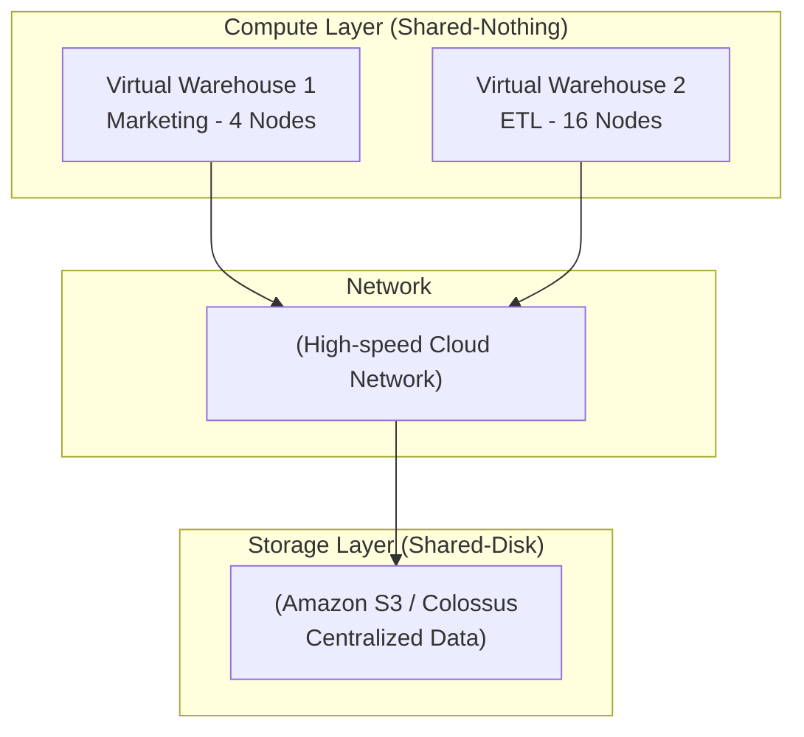

Data Warehouse (DWH) ở quy mô enterprise không chỉ đơn thuần là mô hình hóa dữ liệu (Kimball hay Inmon), mà là bài toán thiết kế một cỗ máy phân tán (Distributed System) đủ sức scan hàng Petabyte dữ liệu, thực thi các phép JOIN phức tạp với hàng tỷ dòng mà không bị sập (OOM - Out of Memory) hay tắc nghẽn mạng (Network Bottleneck). 

Bài viết này sẽ mổ xẻ các hệ thống DWH hiện đại (Snowflake, BigQuery, Redshift) dưới góc nhìn Physical Execution (Thực thi vật lý), Storage (Lưu trữ), và FinOps (Tối ưu chi phí).

---

## 1. Kiến trúc Vật lý: Sự tiến hoá của Hệ thống phân tán

Sự tiến hóa của DWH đi qua các mô hình kiến trúc xử lý tài nguyên khác nhau.

### 1.1. Shared-Nothing (Kiến trúc cổ điển của MPP)
Các DWH thế hệ trước (Teradata, Amazon Redshift đời đầu) sử dụng mô hình **Shared-Nothing** trong kiến trúc MPP (Massively Parallel Processing). 
Mỗi node (máy chủ) trong cụm (Cluster) sở hữu CPU, RAM và Disk riêng biệt. Dữ liệu được băm (hash) và chia đều xuống ổ cứng cục bộ (Local Disk) của từng node.

*   **Trade-off:** Tốc độ Disk I/O cực cao vì data nằm ở Local Disk. Tuy nhiên, nó dẫn đến vấn đề **Coupling of Compute and Storage** (Gắn chặt tính toán và lưu trữ). Nếu bạn chỉ hết dung lượng đĩa cứng, bạn vẫn phải mua thêm một Node mới (gồm cả CPU, RAM đắt tiền) $\rightarrow$ Lãng phí tài nguyên khủng khiếp.
*   **Độ khả dụng (Availability):** Khi một node chết, dữ liệu trên ổ cứng của nó mất tính khả dụng tạm thời, toàn cụm phải chờ cơ chế re-replication, ảnh hưởng SLA.

### 1.2. Separation of Compute and Storage (Kiến trúc Cloud-Native)
**Snowflake** và **Google BigQuery** tạo ra cuộc cách mạng bằng cách tách rời hoàn toàn Tầng tính toán (Compute) và Tầng lưu trữ (Storage). Đây là mô hình Hybrid: Dữ liệu chia sẻ chung (Shared-Disk) nhưng tính toán độc lập (Shared-Nothing Compute).

*   **Storage Layer:** Sử dụng Object Storage siêu rẻ và bền bỉ (Amazon S3, Google Colossus). Dữ liệu nằm ở dạng Immutable Files (Bất biến).
*   **Compute Layer:** Các cluster phi trạng thái (Stateless Virtual Warehouses trong Snowflake, hay Dremel execution engine trong BigQuery). Chúng fetch dữ liệu từ Storage qua mạng tốc độ cao để tính toán.
*   **The Catch (Điểm yếu chí mạng):** Tốc độ đọc từ S3 qua mạng chậm hơn rất nhiều so với Local NVMe. Để bù đắp, Snowflake sử dụng **Local SSD Caching** trên Compute node và cơ chế **Micro-partitioning**. BigQuery dùng Jupiter Network băng thông Petabit.



---

## 2. Thực thi Truy vấn: Kẻ thù mang tên "Network Shuffle"

Trong cơ sở dữ liệu OLTP truyền thống, dữ liệu cho một query thường nằm gọn trên một node. Nhưng trong OLAP MPP, khi JOIN 2 bảng khổng lồ (VD: Bảng `sales` 10 tỷ dòng và `users` 50 triệu dòng), các node phải gửi dữ liệu cho nhau qua mạng. Đây gọi là quá trình **Shuffle**. Băng thông mạng luôn là nút thắt cổ chai lớn nhất.

### 2.1. Collocated Join (Trạng thái lý tưởng)
Nếu cả 2 bảng được phân phối (Distributed) trên cùng một khóa (ví dụ `user_id`), dữ liệu của `user_id = 123` ở cả bảng `sales` và `users` đều nằm chung trên Node A. Phép JOIN diễn ra hoàn toàn trong RAM của Node A (Local Join). Không có Network Shuffle.
*   **Action:** Trong Redshift, bạn định nghĩa `DISTKEY` cẩn thận.
```sql
-- DDL Example in Redshift for Collocation
CREATE TABLE users (user_id INT, name VARCHAR) DISTKEY(user_id);
CREATE TABLE sales (txn_id INT, user_id INT, amount DECIMAL) DISTKEY(user_id);
```

### 2.2. Broadcast Join (Dành cho bảng nhỏ - Dimension Tables)
Nếu bảng `users` nhỏ (vài chục MB đến vài GB), Master Node sẽ copy toàn bộ bảng `users` và gửi (broadcast) đến tất cả các Compute nodes. Các node sẽ build một Hash Table từ bảng `users` trên RAM, sau đó stream bảng `sales` qua (Hash Join).
*   **Rủi ro OOM:** Nếu bảng `users` vượt quá dung lượng RAM khả dụng của từng node, node sẽ bị Out of Memory và query bị hủy. 

### 2.3. Shuffle Hash Join (Nặng nề nhất)
Nếu cả 2 bảng đều khổng lồ, toàn bộ cụm phải thực hiện **Hash Partitioning** qua mạng: Mỗi node đọc một phần của bảng A và B, băm khóa JOIN, rồi gửi data chứa khóa đó tới một Node đích được chỉ định.
*   **Data Skew Incident:** Nếu dữ liệu bị lệch (Ví dụ: Một `user_id` ẩn danh thực hiện tới 30% tổng số giao dịch), Node chịu trách nhiệm xử lý hash của `user_id` đó sẽ phải gánh 30% khối lượng công việc, trong khi các Node khác ngồi chơi (CPU idle). Kết quả: Node đó OOM hoặc Disk Spill (tràn RAM phải ghi tạm xuống đĩa), query chạy chậm đi 100 lần. 

---

## 3. Storage Level: Columnar Storage, Compression & Vectorized Execution

### 3.1. Columnar Storage & Compression
Thay vì lưu từng hàng (Row-based) như MySQL/PostgreSQL, DWH lưu dữ liệu theo cột (Columnar). Điều này cho phép:
1. **Giảm I/O:** Chỉ đọc đúng những cột cần dùng trong lệnh `SELECT`.
2. **Nén Đỉnh Cao (Compression):** Dữ liệu trong một cột thường có cùng kiểu và độ lặp lại cao. DWH dùng các thuật toán nén chuyên biệt cho phép "Thao tác trực tiếp trên dữ liệu đã nén".
   *   **Run-Length Encoding (RLE):** Nếu cột "Trạng thái" có giá trị: `['Thành công', 'Thành công'...]` 1 triệu lần liên tiếp, DWH lưu: `[Thành công, 1000000]`. Rất đỉnh nếu dữ liệu được SORT theo cột này.
   *   **Dictionary Encoding:** Ánh xạ các chuỗi string dài thành các số nguyên (Integer).

```sql
-- Cấu hình Snowflake Clustering Key để tối ưu RLE và Data Skipping
ALTER TABLE sales CLUSTER BY (date_id, region_id);
```

### 3.2. CPU Vectorization (SIMD)
Ngày xưa, database engine xử lý từng row một (Volcano Iterator Model). Việc lặp qua hàm `next()` cho hàng tỷ row sinh ra CPU overhead khủng khiếp.
Các DWH hiện đại (ClickHouse, Snowflake) sử dụng **Vectorized Execution**. Dữ liệu được nạp vào CPU Cache theo từng khối (Batch) dạng cột, ví dụ 1024 giá trị nguyên liên tiếp. CPU sử dụng tập lệnh kiến trúc SIMD (Single Instruction, Multiple Data) để cộng/nhân toàn bộ mảng đó trong một chu kỳ xung nhịp duy nhất.

---

## 4. Operational & FinOps: Kiểm soát chi phí

Một Kỹ sư hệ thống xuất sắc không chỉ làm query chạy nhanh, mà còn phải ngăn hóa đơn AWS/Snowflake nổ tung cuối tháng.

1. **Dấu chân Zombie (Orphaned Compute):** Compute cluster chạy liên tục không tự động suspend khi hết việc. Trên Snowflake, luôn cấu hình `AUTO_SUSPEND = 60` (giây).
2. **Result Cache (Tối ưu hóa bảng Dashboard):** Các query cho BI Dashboards thường giống hệt nhau mỗi khi user F5. DWH hiện đại cache kết quả trực tiếp. Lần gọi thứ 2 tốn 0$ compute. Hãy đảm bảo công cụ BI không tự sinh ra các parameter ngẫu nhiên phá hỏng Cache Hit Ratio.
3. **Spill to Disk:** Monitoring liên tục metric `Bytes spilled to remote storage`. Nếu chỉ số này cao, tức là RAM của Warehouse không đủ lớn, bạn CẦN nâng cấp cấu hình Warehouse Size (Scale Up - từ L lên XL), chứ không phải tăng số lượng node (Scale Out).

---

## 5. Nguồn Tham Khảo (References)
*   [The Snowflake Elastic Data Warehouse - SIGMOD 2016][https://dl.acm.org/doi/10.1145/2882903.2903741]
*   [Google Dremel: Interactive Analysis of Web-Scale Datasets (BigQuery Engine]][https://research.google/pubs/pub36632/]
*   [Amazon Redshift Deep Dive - Tuning and Best Practices][https://aws.amazon.com/blogs/big-data/top-10-performance-tuning-techniques-for-amazon-redshift/]
*   [MonetDB/X100: Hyper-Pipelining Query Execution (Vectorized Execution]](https://stratos.seas.harvard.edu/files/stratos/files/x100.pdf)
