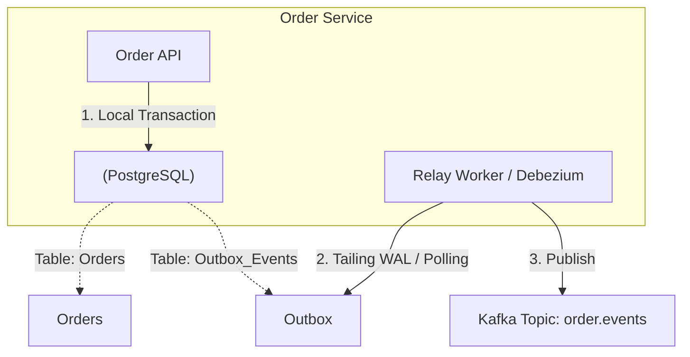

Event-Driven Architecture (EDA) trên giấy tờ rất đẹp: "Loose coupling, asynchronous, scalable". Nhưng trong thực chiến tại production, nó là cơn ác mộng của các kỹ sư với vô vàn lỗi dị thường: *Lạc mất message, message bị xử lý trùng lặp (Duplicate), thứ tự bị đảo lộn (Out-of-order), và hệ thống bị treo do Consumer Rebalance liên tục*. 

Dưới góc nhìn Staff Engineer, xây dựng hệ thống EDA đồng nghĩa với việc đối mặt với **Dual-Write Problem** và vòng đời khắc nghiệt của Distributed Logs.

## 1. Bài toán kinh điển: The Dual-Write Problem

Khi một Service thực hiện nghiệp vụ (ví dụ: Tạo đơn hàng), nó thường phải làm 2 việc:
1. Ghi dữ liệu vào Database của nó (ví dụ: PostgreSQL).
2. Phát ra một sự kiện (Publish Event) vào Message Broker (ví dụ: Kafka) để các service khác biết.

**Thảm họa:**
- Nếu bạn ghi DB thành công, nhưng ghi Kafka thất bại (do network chập chờn) $\rightarrow$ Các service khác không nhận được event. Hệ thống bất đồng bộ vĩnh viễn.
- Nếu bạn ghi Kafka trước, sau đó ghi DB thất bại $\rightarrow$ Các service khác đã xử lý event (Trừ tiền, Gửi email), trong khi Đơn hàng lại không tồn tại trong DB gốc!

### Giải pháp: Transactional Outbox Pattern
Tuyệt đối không bao giờ gọi `producer.send()` ngay giữa business logic. Hãy dùng pattern Outbox.



**Thực thi thực tế:**
Trong cùng một DB Transaction (ACID), bạn Insert vào bảng `Orders` VÀ Insert một dòng JSON chứa payload của sự kiện vào bảng `Outbox_Events`.
```sql
BEGIN;
INSERT INTO orders (id, status, total) VALUES ('123', 'CREATED', 500);
INSERT INTO outbox_events (aggregate_id, event_type, payload) 
VALUES ('123', 'OrderCreated', '{"id": "123", "total": 500}');
COMMIT;
```
Sau đó, một Background Worker (thường dùng **Debezium CDC - Change Data Capture**) sẽ đọc các row mới từ bảng Outbox (thông qua WAL của DB) và đẩy vào Kafka một cách bất đồng bộ với sự đảm bảo **At-Least-Once**.

## 2. Broker Internals: Log-based (Kafka) vs. AMQP (RabbitMQ)

Sự khác biệt cốt lõi quyết định kiến trúc:

*   **Smart Broker, Dumb Consumer (RabbitMQ):** Message được Broker phân phối (push), duy trì trạng thái xem ai đã đọc. Đọc xong là XÓA (ACK). Tốt cho Job Queues phân tán.
*   **Dumb Broker, Smart Consumer (Kafka):** Kafka chỉ là một ổ đĩa cứng phân tán (Distributed Append-only Log). Nó không quan tâm ai đọc. Message cứ nằm trên đĩa cho đến khi hết hạn (Retention Period). Các Consumer tự nhớ mình đã đọc tới đâu bằng cách lưu trữ một con số gọi là **Offset**. 
    *   *Trade-off:* Kafka cho Throughput khổng lồ và khả năng "Replay" (tua lại thời gian để xử lý lại event từ hôm qua). Nhưng nếu xử lý một message bị lỗi, Kafka không có sẵn cơ chế Retry/DLQ mềm dẻo như RabbitMQ.

## 3. Operational Risks: Consumer Group Rebalance Storm

Đây là sự cố phổ biến nhất làm sập hệ thống Kafka tại các công ty lớn.
Khi bạn có một topic với 30 Partitions và 30 Consumers đang chạy. Đột nhiên 1 Consumer bị treo (OOM hoặc Garbage Collection (GC) Pause).
1. Kafka Group Coordinator nhận thấy Consumer này ngừng gửi "Heartbeat". Nó đánh dấu Consumer đã chết.
2. Nó kích hoạt **Rebalance**: Tạm dừng TOÀN BỘ 29 Consumers còn lại, tính toán lại việc chia Partitions, rồi mới gán lại. Quá trình này hệ thống bị "đứng hình" (Stop-the-world).
3. Sau 30 giây, Consumer kia GC xong, sống lại, gửi Heartbeat. Coordinator lại Rebalance thêm lần nữa!
$\rightarrow$ Hệ thống bị kẹt trong vòng lặp Rebalance, độ trễ (Lag) tăng vọt lên hàng triệu message.

**Cách khắc phục:**
- Tuning các tham số timeout một cách cẩn thận, không dùng mặc định:
```properties
# Consumer Configs
session.timeout.ms=45000       # Chịu đựng GC pause dài hơn
heartbeat.interval.ms=15000    # Đừng gửi quá dày
max.poll.interval.ms=300000    # Nếu logic xử lý message mất tận 5 phút
```
- Sử dụng **Static Membership** (`group.instance.id`) trong Kafka 2.3+. Khi Consumer chết tạm thời, Coordinator giữ nguyên Partition của nó thay vì Rebalance ngay lập tức.

## 4. Xử lý Lỗi: Poison Pills và Dead Letter Queue (DLQ)

Trong kiến trúc Event-Driven, "Poison Pill" là một message có format bị hỏng (JSON thiếu ngoặc) hoặc chứa dữ liệu gây crash logic (Null Pointer Exception).
Vì Kafka xử lý theo thứ tự (Sequential), nếu một message gây crash, Consumer khởi động lại, lại đọc trúng message đó $\rightarrow$ Lặp vô hạn (Infinite Crash Loop). Toàn bộ Partition bị nghẽn tắc (Block).

**Giải pháp Chuẩn (Enterprise Grade DLQ Pattern):**
Consumer **không bao giờ** được phép throw Unhandled Exception ra ngoài vòng lặp Poll.
```java
// Mã giả Java cho Consumer an toàn
while (true) {
    ConsumerRecords records = consumer.poll(Duration.ofMillis(100));
    for (Record r : records) {
        try {
            processBusinessLogic(r);
        } catch (Exception e) {
            // Không được crash! Bắn message độc hại sang 1 Topic khác (DLQ)
            producer.send(new ProducerRecord("my_topic.DLQ", r.key(), r.value(), e.getMessage()));
            logger.error("Poison pill detected, moved to DLQ");
        }
    }
    consumer.commitSync(); // Vẫn commit offset để đi tiếp message sau!
}
```
Sau đó, các Kỹ sư có thể rảnh tay kiểm tra Topic `DLQ` để debug lỗi mà không làm gián đoạn luồng dữ liệu chính.

## 5. Idempotency (Tính Lũy Đẳng): The Golden Rule

Do hệ thống phân tán luôn đảm bảo **At-Least-Once Delivery** (nghĩa là Consumer có thể nhận 1 message tới 2-3 lần do lỗi mạng hoặc Rebalance), logic xử lý phía Consumer PHẢI là Idempotent (làm 1 lần hay 100 lần kết quả vẫn y hệt).
*   **Ví dụ sai:** `UPDATE account SET balance = balance - 50` $\rightarrow$ Chạy 2 lần mất 100$.
*   **Cách làm đúng:** Sinh ra một `Idempotency_Key` duy nhất cho mỗi Event. Tại DB của Consumer, tạo một bảng `processed_events`. Dùng constraints `UNIQUE` cho khóa này. 
```sql
-- Nếu xử lý trùng, DB sẽ ném lỗi Unique Constraint Violation. Ta catch lỗi này và bỏ qua an toàn.
INSERT INTO processed_events (event_id, processed_at) VALUES ('event-uuid-123', NOW());
UPDATE account SET balance = balance - 50 WHERE id = 'user_1';
```

## 6. Nguồn Tham Khảo (References)
*   [Confluent: The Transactional Outbox Pattern](https://developer.confluent.io/patterns/data-integration/transactional-outbox/)
*   [Apache Kafka Documentation - Consumer Group Protocols](https://kafka.apache.org/documentation/)
*   [Designing Data-Intensive Applications - Martin Kleppmann (Chapter 11: Stream Processing)](https://dataintensive.net/)
