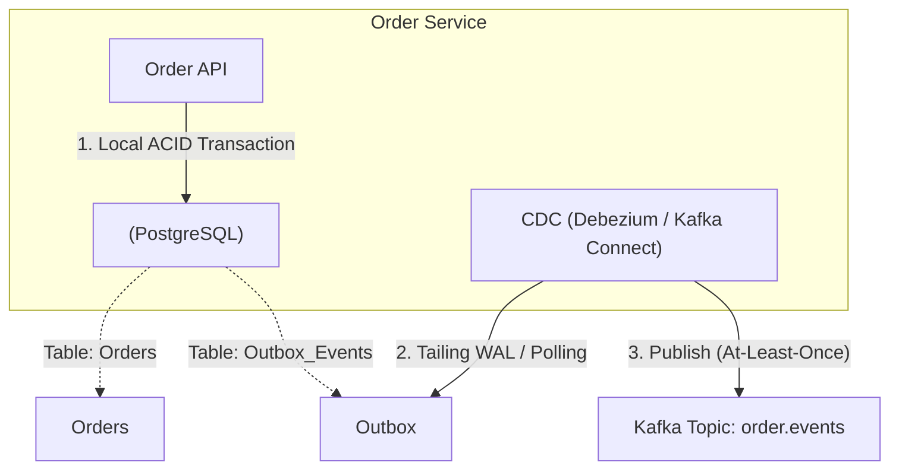

Event-Driven Architecture (EDA - Kiến trúc hướng sự kiện) trên giấy tờ luôn mang lại một viễn cảnh màu hồng: *"Loose coupling (Kết nối lỏng lẻo), Asynchronous (Bất đồng bộ), Highly Scalable (Dễ dàng mở rộng)"*. 

Tuy nhiên, trong thực chiến tại môi trường Production ở quy mô hàng ngàn Transactions/giây (TPS), nó nhanh chóng trở thành cơn ác mộng của các Kỹ sư phần mềm. Bạn sẽ phải đối mặt với vô vàn lỗi "tâm linh": *Lạc mất Message, Message bị xử lý trùng lặp (Duplicate), Thứ tự bị đảo lộn (Out-of-order), Hệ thống bị treo do Consumer Rebalance liên tục, và Dữ liệu rác (Poison Pills) làm sập toàn bộ Pipeline*.

Dưới góc nhìn System Design của một Staff Engineer, xây dựng hệ thống EDA không đơn giản là `producer.send()`. Bài viết này sẽ mổ xẻ những bài toán hóc búa nhất và cách các Big Tech giải quyết chúng.

---

## 1. Bài toán Kinh điển: The Dual-Write Problem

Khi một Microservice thực hiện một nghiệp vụ (ví dụ: Tạo đơn hàng thành công), nó thường phải làm 2 việc đồng thời:
1. Ghi dữ liệu vào Database của chính nó (ví dụ: PostgreSQL).
2. Phát ra một sự kiện (Publish Event) vào Message Broker (ví dụ: Kafka) để báo cho Service khác (Ví dụ: Service Gửi Email, Service Trừ Tồn Kho).

**Thảm họa Dual-Write (Ghi kép):**
- Nếu bạn gọi `INSERT` DB thành công, nhưng lệnh `producer.send()` tới Kafka bị thất bại (do Network chập chờn, Timeout) $\rightarrow$ Các Service khác không nhận được Event. Đơn hàng đã tạo nhưng kho không trừ, email không gửi. Dữ liệu bất đồng bộ vĩnh viễn.
- Ngược lại, nếu bạn Publish Kafka trước, rồi ghi DB thất bại $\rightarrow$ Email đã báo "Khách hàng mua thành công", nhưng Đơn hàng lại không hề tồn tại trong Database gốc!

### Giải pháp: Transactional Outbox Pattern kết hợp CDC
Để giải quyết bài toán này, tuyệt đối **không bao giờ** gọi `producer.send()` ngay giữa Business Logic. Hãy dùng **Outbox Pattern**.



**Thực thi Thực tế (SQL):**
Trong cùng một DB Transaction (ACID), bạn Insert vào bảng `Orders` VÀ Insert một dòng JSON chứa Payload của sự kiện vào một bảng phụ tên là `Outbox_Events`. Database đảm bảo cả 2 thao tác này "Cùng thành công, hoặc Cùng thất bại" (Atomicity).

```sql
BEGIN;

-- 1. Lưu Business Data
INSERT INTO orders (id, status, total) VALUES ('123', 'CREATED', 500);

-- 2. Lưu Event vào Outbox table
INSERT INTO outbox_events (aggregate_id, event_type, payload) 
VALUES ('123', 'OrderCreated', '{"id": "123", "total": 500, "status": "CREATED"}');

COMMIT;
```

Sau đó, một Background Process (thường dùng **Debezium CDC - Change Data Capture**) sẽ đọc các Row mới từ bảng Outbox (thông qua cơ chế đọc WAL/Binlog của Database) và đẩy nó vào Kafka một cách bất đồng bộ với sự đảm bảo **At-Least-Once Delivery**.

---

## 2. Distributed Transactions: Saga Pattern

Trong kiến trúc Monolith, bạn có thể dùng một cú `COMMIT` lớn cho 5 bảng khác nhau. Trong Microservices, dữ liệu bị phân mảnh ở 5 Database khác nhau. Làm sao để giữ tính nhất quán? Lời giải là **Saga Pattern**.

Saga chia một giao dịch (Transaction) lớn thành một chuỗi các Local Transactions nhỏ. Mỗi Service hoàn thành công việc của nó, sẽ bắn ra một Event (Dùng Outbox Pattern) để kích hoạt Service tiếp theo.

**Xử lý Lỗi (Failure Handling) với Compensating Transactions:**
Nếu ở bước thứ 3, Service Thanh toán báo lỗi (Thẻ từ chối). Nó sẽ bắn ra một Event `PaymentFailed`. Hệ thống KHÔNG THỂ "Rollback" theo kiểu Database truyền thống. Thay vào đó, nó phải kích hoạt các **Compensating Transactions (Giao dịch bù trừ)** để đảo ngược các tác vụ trước đó.

*   *Bước 1:* Order Service $\rightarrow$ Tạo Đơn Hàng (Status = PENDING). Bắn event `OrderCreated`.
*   *Bước 2:* Inventory Service $\rightarrow$ Nhận `OrderCreated`, Trừ tồn kho. Bắn event `InventoryReserved`.
*   *Bước 3:* Payment Service $\rightarrow$ Nhận `InventoryReserved`, Cà thẻ. **THẤT BẠI**. Bắn event `PaymentFailed`.
*   *Compensating 2:* Inventory Service $\rightarrow$ Nhận `PaymentFailed`, Cộng lại tồn kho đã trừ.
*   *Compensating 1:* Order Service $\rightarrow$ Nhận `PaymentFailed`, Update Order (Status = CANCELLED).

---

## 3. Rủi ro Vận hành: Consumer Group Rebalance Storm

Đây là sự cố phổ biến nhất làm sập hệ thống Kafka tại các công ty lớn.
Khi bạn có một Topic với 30 Partitions và 30 Consumers đang chạy. Đột nhiên 1 Consumer bị treo (Do OOM hoặc Stop-The-World Garbage Collection (GC) Pause của Java).

1. Kafka Group Coordinator nhận thấy Consumer này ngừng gửi tín hiệu "Heartbeat". Nó đánh dấu Consumer đã chết.
2. Nó kích hoạt quá trình **Rebalance**: Tạm dừng TOÀN BỘ 29 Consumers còn lại, tính toán lại việc chia Partitions cho 29 người, rồi mới gán lại (Assign). Trong lúc này, toàn bộ hệ thống bị "Đứng hình" (Stop-The-World).
3. Sau 30 giây, Consumer kia GC xong, "Tỉnh dậy" và gửi Heartbeat. Coordinator lại kích hoạt Rebalance thêm lần nữa!
$\rightarrow$ Kết quả: Hệ thống bị kẹt trong vòng lặp Rebalance vô tận. Không một Message nào được xử lý. Độ trễ (Lag) tăng vọt lên hàng triệu.

**Cách khắc phục:**
1. Tuning các tham số timeout một cách cẩn thận, không dùng mặc định:
```properties
# Consumer Configs
session.timeout.ms=45000       # Chịu đựng GC pause dài hơn (Mặc định thường quá ngắn)
heartbeat.interval.ms=15000    # Heartbeat không quá dày
max.poll.interval.ms=300000    # Đảm bảo logic xử lý message hoàn thành dưới 5 phút
```
2. Sử dụng tính năng **Static Membership** (`group.instance.id`) trong Kafka 2.3+. Khi Consumer chết tạm thời, Coordinator giữ nguyên Partition cho nó thay vì Rebalance ngay lập tức. Khi Consumer khởi động lại, nó được cấp lại ngay Partition cũ.

---

## 4. Xử lý Dữ liệu Độc hại: Poison Pills & Dead Letter Queue (DLQ)

Trong Event-Driven, "Poison Pill" (Viên thuốc độc) là một Message có Format bị hỏng (Ví dụ: JSON bị thiếu dấu ngoặc đóng `}`) hoặc chứa dữ liệu gây Crash logic (Null Pointer Exception).

Vì Kafka xử lý Message theo thứ tự (Sequential), nếu một Message gây crash, Consumer bị văng lỗi, tự động khởi động lại (Restart), nó sẽ lại đọc trúng Message độc hại đó $\rightarrow$ Lặp vô hạn (Infinite Crash Loop). Toàn bộ Partition bị nghẽn tắc (Blocked) vĩnh viễn, các Message khỏe mạnh phía sau xếp hàng không bao giờ được chạy.

**Giải pháp Chuẩn (Enterprise Grade DLQ Pattern):**
Quy tắc sống còn: Consumer **không bao giờ** được phép Throw Unhandled Exception ra ngoài vòng lặp `poll()`.

```java
// Mã giả Java cho Kafka Consumer an toàn (Sống chung với Poison Pills)
while (true) {
    ConsumerRecords records = consumer.poll(Duration.ofMillis(100));
    for (Record r : records) {
        try {
            // Xử lý logic nghiệp vụ
            processBusinessLogic(r);
        } catch (Exception e) {
            // BẮT LỖI TẠI CHỖ! Không được Crash! 
            // Bắn message độc hại sang một Topic "Thùng rác" (DLQ - Dead Letter Queue)
            ProducerRecord dlqRecord = new ProducerRecord(
                "my_topic.DLQ", r.key(), r.value(), e.getMessage() // Lưu lại Stacktrace
            );
            producer.send(dlqRecord);
            logger.error("Poison pill detected! Đã tống cổ vào DLQ.");
        }
    }
    // Vẫn commit offset để đánh dấu là "đã lướt qua" message này, để đi tiếp message sau!
    consumer.commitSync(); 
}
```
Sau đó, các Kỹ sư có thể rảnh tay kiểm tra Topic `DLQ` để phân tích Bug (Root Cause Analysis) mà không làm gián đoạn luồng dữ liệu chính của hệ thống.

---

## 5. Tính Lũy Đẳng (Idempotency): Quy tắc vàng

Do hệ thống mạng phân tán luôn chỉ đảm bảo được **At-Least-Once Delivery** (Giao hàng ít nhất một lần), đồng nghĩa với việc Consumer hoàn toàn có thể nhận 1 Event tới 2-3 lần (Do lỗi mạng lúc Commit Offset hoặc do Rebalance).
Do đó, Logic xử lý Database phía Consumer **BẮT BUỘC PHẢI CÓ TÍNH IDEMPOTENT (Lũy Đẳng)**. Làm 1 lần hay làm 100 lần kết quả vẫn y hệt nhau.

*   **Ví dụ Sai (Không Lũy Đẳng):** `UPDATE account SET balance = balance - 50` $\rightarrow$ Chạy trùng 2 lần, khách hàng mất 100$.
*   **Cách làm Đúng:** Sinh ra một mã `Idempotency_Key` duy nhất cho mỗi Event. Tại Database của Consumer, tạo một bảng `processed_events`. Đánh Index `UNIQUE` cho khóa này. 

```sql
BEGIN;
-- Nếu message bị xử lý trùng, câu lệnh INSERT này sẽ ném lỗi "Unique Constraint Violation".
-- Ta Catch lỗi này trong Code, coi như Message đã chạy rồi, và bỏ qua một cách an toàn.
INSERT INTO processed_events [event_id, processed_at] VALUES ('event-uuid-123', NOW());

-- Nếu Insert thành công, tiếp tục Business Logic
UPDATE account SET balance = balance - 50 WHERE id = 'user_1';
COMMIT;
```

---

## 6. Nguồn Tham Khảo (References)

1. **Confluent Blog:** [The Transactional Outbox Pattern for Microservices](https://developer.confluent.io/patterns/data-integration/transactional-outbox/)
2. **Saga Pattern:** [Microservices.io - Saga Pattern by Chris Richardson](https://microservices.io/patterns/data/saga.html)
3. **Apache Kafka Documentation:** [Consumer Group Protocols and Rebalance](https://kafka.apache.org/documentation/)
4. Tác giả Martin Kleppmann, sách *Designing Data-Intensive Applications* (Chương 11: Stream Processing).
