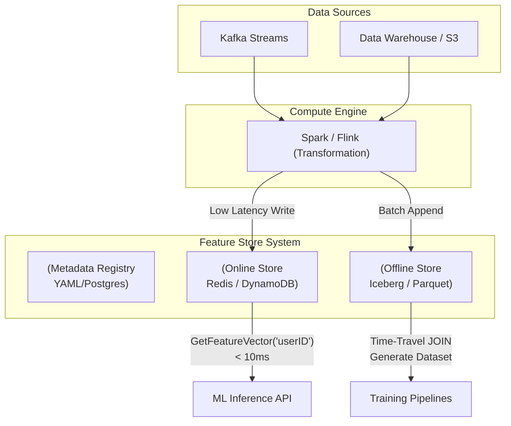

Khi đội ngũ Data Science phát triển từ 2 người lên 20 người, và các mô hình học máy [Machine Learning - ML] chuyển từ việc sinh dự đoán offline (Batch) sang dự đoán trong thời gian thực (Real-time serving), vòng đời dữ liệu sẽ bộc lộ những lỗ hổng chết người. **Feature Store** không chỉ là một cơ sở dữ liệu mới, mà là một nền tảng quản lý Vòng đời Đặc trưng (Feature Lifecycle) nhằm vá lại lỗ hổng giữa nghiên cứu và sản xuất.

Dưới góc độ kỹ thuật hệ thống (Hardcore Engineering), chúng ta hãy cùng phân tích kiến trúc vật lý, cách Feature Store giải quyết các sai lệch dữ liệu, và các rủi ro vận hành (OOM, Lag).

---

## 1. Bản chất sự cố: Online-Offline Skew và Data Leakage

Đưa một mô hình ML lên production không khó ở phần thuật toán, mà khó ở phần kỹ thuật dữ liệu.

### 1.1. Online-Offline Skew (Lệch pha môi trường - Training-Serving Skew)
Nhà khoa học dữ liệu viết code Python/Pandas trên Jupyter: `df['click_rate'] = df['clicks'] / df['impressions'].fillna(0]`.
Kỹ sư Backend sau đó viết lại code đó trên Go/Java cho production API: `clickRate := float64(clicks) / math.Max(float64(impressions), 0.001)`.

Chỉ một khác biệt siêu nhỏ trong cách xử lý phép chia cho số 0 (Divide by zero) cũng khiến đặc trưng (Feature) đầu vào ở Production khác hoàn toàn so với lúc huấn luyện. Lỗi ngầm (Silent failure) này khiến mô hình suy luận sai lệch dần theo thời gian mà hệ thống monitoring truyền thống (đo latency/throughput) không thể bắt được.

### 1.2. Time-Travel Joins & Data Leakage (Rò rỉ tương lai)
Khi huấn luyện mô hình dự đoán khả năng khách hàng hủy gói (Churn Prediction) vào ngày `01-07-2023`, bạn cần ghép (Join) nhãn (label) `Churned=True` với các đặc trưng của khách hàng TẠI THỜI ĐIỂM CHÍNH XÁC đó.

Nếu bạn truy vấn Data Warehouse trực tiếp: Lấy `user_balance` (số dư) hiện tại của khách hàng ở thời điểm chạy query (ví dụ năm 2024), mô hình đã được "nhìn thấy tương lai". Nó sẽ học rất giỏi lúc train, nhưng dự đoán cực tệ lúc test. Hiện tượng này gọi là **Data Leakage**.

**Feature Store giải quyết bằng "Point-in-Time Correctness" (AS OF Joins):**
Feature Store duy trì một nhật ký sự kiện của mọi giá trị. Khi bạn yêu cầu Training Data, nó thực hiện một phép JOIN lịch sử phức tạp (Time-travel):
*Với mỗi sự kiện trong bảng Entity (User id, Timestamp T), tìm giá trị Feature F của User đó có Timestamp mới nhất nhưng phải **nhỏ hơn hoặc bằng T**.*

---

## 2. Kiến trúc Physical: Dual-Storage (Lưu trữ kép)

Để đáp ứng 2 tải công việc đối nghịch (Quét hàng tỷ dòng Offline vs. Phục vụ với độ trễ <10ms Online), Feature Store bắt buộc phải áp dụng kiến trúc Dual-Storage.



### 2.1. Offline Store (Phục vụ Huấn luyện - Training)
*   **Storage Backend:** HDFS, S3 (định dạng Parquet) hoặc Data Warehouse (BigQuery, Snowflake). Gần đây, Apache Iceberg hoặc Delta Lake được ưa chuộng nhờ khả năng Time-travel native.
*   **Đặc điểm:** Tối ưu thông lượng đọc (High Throughput). Lưu trữ toàn bộ lịch sử giá trị của Feature theo thời gian (Append-only). Chịu trách nhiệm tạo dataset khổng lồ cho việc Training.

### 2.2. Online Store (Phục vụ Suy luận thời gian thực - Inference)
*   **Storage Backend:** Các cơ sở dữ liệu In-memory hoặc NoSQL độ trễ thấp như Redis, DynamoDB, hoặc Cassandra.
*   **Đặc điểm:** Tối ưu độ trễ (Ultra-low Latency). Chỉ lưu trữ trạng thái **mới nhất (Latest state)** của mỗi Entity. Truy vấn theo dạng Key-Value (VD: Nhập `User_ID`, trả về Feature Vector). Bỏ qua hoàn toàn dữ liệu cũ.

---

## 3. Quản trị Cấu hình dưới dạng Mã (Configuration as Code)

Để xóa bỏ sự bất đồng bộ giữa Data Scientist và Backend, Feature Store ép buộc mọi người định nghĩa logic bằng Metadata tập trung. 

**Feast** (Standalone Feature Store) và **Hopsworks** (End-to-end MLOps Platform) là hai cái tên tiêu biểu. Feast đóng vai trò như một thư viện nhẹ nhàng kết nối các hạ tầng có sẵn, trong khi Hopsworks cung cấp giải pháp toàn diện bao gồm cả Spark/Flink.

**Ví dụ cấu hình bằng Python SDK của Feast:**

```python
# Feast Configuration (feature_repo.py)
from feast import Entity, FeatureView, Field
from feast.types import Float32, Int64
from datetime import timedelta

# 1. Định nghĩa thực thể User (Khóa chính)
user = Entity(name="user", join_keys=["user_id"])

# 2. Định nghĩa FeatureView kết nối cả Offline và Online
user_stats_fv = FeatureView(
    name="user_transaction_stats",
    entities=[user],
    ttl=timedelta(days=30], # Quan trọng: Dữ liệu quá 30 ngày sẽ bị xóa khỏi Online Store
    schema=[
        Field(name="daily_transactions", dtype=Int64),
        Field(name="total_spend", dtype=Float32),
    ],
    online=True,  # Bật đồng bộ lên Redis
    source=bigquery_source # Trỏ tới bảng BQ (Offline Store)
)
```
Mã này là Single Source of Truth. Training pipeline và Inference API đều gọi chung một định danh `user_transaction_stats`.

---

## 4. Rủi ro Vận hành (Operational Incidents)

Làm hệ thống ML không chỉ có màu hồng. Sau đây là các rủi ro hệ thống chí mạng:

### 4.1. Sự cố bùng nổ RAM (Redis OOM)
**Nguyên nhân:** Các Data Scientists thường tạo ra hàng ngàn Features (để thử nghiệm), bật flag `online=True` vô tội vạ cho toàn bộ tập khách hàng (kể cả khách hàng đã ngừng hoạt động 10 năm). Redis là In-Memory DB, lưu vài tỷ keys sẽ lập tức hết RAM, kích hoạt tiến trình OOM-Killer của hệ điều hành, làm sập toàn bộ Online Store.

**Khắc phục (FinOps & Arch):**
- **Cấu hình TTL (Time-To-Live):** Bắt buộc mọi FeatureView phải cấu hình TTL. Nếu một thực thể không có tương tác trong 30 ngày, Redis phải tự động xóa nó.
- **Eviction Policies:** Sử dụng cấu trúc lưu trữ `Hash` trong Redis thay vì chuỗi `String` riêng lẻ, giúp tiết kiệm tới 40% memory overhead. 
- Xây dựng quy trình CI/CD tự động quét và hạ cấp (Archive) các Features không được Inference API gọi trong 30 ngày.

### 4.2. Độ trễ Kép (Materialization Lag)
Dữ liệu batch từ Offline Store được đồng bộ sang Online Store định kỳ qua Job Materialization (Ví dụ: Airflow chạy Job mỗi đêm 1 lần). Do đó, Online Store luôn hiển thị dữ liệu "cũ" (trễ vài tiếng). Nếu mô hình phát hiện gian lận (Fraud Detection) cần tính năng "số giao dịch trong 5 phút qua", Materialization sẽ hoàn toàn vô dụng.

**Khắc phục bằng Streaming Feature Store:** 
Dùng Kafka + Flink để tính toán Sliding Windows [Tổng chi tiêu trong 1 giờ qua, tính từng giây] và ghi *trực tiếp* vào Online Store với độ trễ mili-giây, đồng thời xả log về Offline Store cho mục đích huấn luyện sau này. Kiến trúc này giải quyết triệt để độ trễ, nhưng phức tạp gấp 3 lần và đòi hỏi cụm Stream-Processing luôn chạy (Always-on).

---

## Nguồn Tham Khảo
*   [Feast Architecture Documentation][https://docs.feast.dev/getting-started/architecture-and-components]
*   [Tecton - Point in Time Correctness & Data Leakage][https://www.tecton.ai/blog/point-in-time-correctness/]
*   [Hopsworks Feature Store][https://www.hopsworks.ai/]
*   [Uber Michelangelo: Machine Learning Platform](https://www.uber.com/en-VN/blog/michelangelo-machine-learning-platform/]
