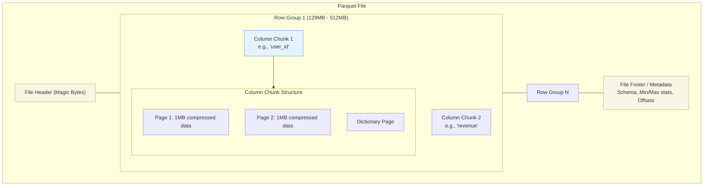

Data Lake không dùng cơ sở dữ liệu truyền thống, nó là một đại dương các file tĩnh (S3, GCS, ADLS). Vì Tốc độ mạng (Network I/O) và Tốc độ Đọc/Ghi đĩa (Disk I/O) là nút thắt cổ chai đắt đỏ nhất trong Data Engineering, việc chọn đúng, hiểu sâu và Tuning cấu hình vật lý của các File Formats quyết định hệ thống phân tán của bạn sẽ phản hồi trong 2 giây hay sập sau 2 tiếng.

Dưới góc nhìn của Staff Engineer, File Format không chỉ là đuôi mở rộng `.parquet` hay `.avro`. Nó là cách chúng ta bố trí dữ liệu trên ổ cứng để tối ưu hóa **L2/L3 Cache của CPU** và giảm thiểu số byte truyền qua mạng.

---

## 1. Columnar Storage Internals: Apache Parquet & ORC

Parquet và ORC là trái tim của hệ sinh thái OLAP hiện đại (Spark, Trino, Snowflake, BigQuery). Không giống như CSV hay JSON đọc tuần tự từ trên xuống dưới (Row-based), Columnar format được thiết kế phân tầng tinh vi để các Distributed Engines có thể đọc song song và "nhảy cóc" qua hàng Terabyte dữ liệu mà không cần load chúng vào RAM.

### 1.1. Cấu trúc vật lý của Parquet



1. **Row Group (Block):** File được chia ngang thành các khối dữ liệu khổng lồ (ví dụ 128MB). Một Row Group chứa đầy đủ các cột cho một khoảng dòng nhất định (ví dụ 10 triệu dòng đầu tiên). **Khả năng phân tán:** Spark có thể cử 10 Worker, mỗi Worker đọc 1 Row Group hoàn toàn độc lập qua mạng.
2. **Column Chunk:** Trong một Row Group, dữ liệu được chia nhỏ và gom nhóm theo cột. Nếu câu SQL của bạn là `SELECT sum(revenue)`, hệ thống chỉ tải qua mạng các Column Chunk của `revenue` và bỏ qua hoàn toàn `user_id`.
3. **Pages:** Đơn vị vật lý nhỏ nhất (thường 1MB) nơi chứa data thực sự đã được mã hóa (Encoding) và nén (Compression).

### 1.2. Sức mạnh tối thượng: Predicate Pushdown (Lọc từ gốc)
Trong phần `File Footer`, Parquet lưu trữ các chỉ số thống kê (Min, Max, Null count) cho TỪNG Column Chunk.
Khi bạn chạy lệnh: `SELECT * FROM sales WHERE event_date = '2026-12-01'`
- Query Engine (Trino/Spark) chỉ đọc phần Footer siêu nhẹ (vài KB).
- Nó kiểm tra: Row Group 1 có `event_date` mang giá trị (Min: '2026-01-01', Max: '2026-06-30'). Nó **Skip (Bỏ qua) hoàn toàn** Row Group 1 mà không cần tải nội dung của nó từ S3.
- Hiệu năng I/O (Disk và Network) giảm từ hàng Terabytes xuống chỉ còn vài Megabytes.

### 1.3. Cơ chế Nén và CPU Vectorization (SIMD)
Đây là nơi khoa học máy tính tỏa sáng. Columnar storage không chỉ giảm I/O, nó còn tối ưu hóa trực tiếp cho CPU.

- **Run-Length Encoding (RLE):** Vì dữ liệu trong 1 cột thường giống nhau (Homogeneous). Giả sử cột `status` chứa 1000 chữ "SUCCESS" liên tiếp. Thay vì lưu 1000 chữ đó, Parquet/ORC mã hóa thành `(SUCCESS, 1000)`. RLE tiết kiệm dung lượng khủng khiếp.
- **Dictionary Encoding:** Nếu cột `city` chỉ có 3 giá trị ('Hanoi', 'HCMC', 'DaNang'), hệ thống tạo một Dictionary (0='Hanoi', 1='HCMC', 2='DaNang') và lưu trữ cột dưới dạng chuỗi bit `0, 1, 2, 0, 1...`.
- **CPU Vectorization (SIMD - Single Instruction, Multiple Data):** Nhờ dữ liệu các cột được xếp liền kề nhau trên Memory (và đã được nén RLE/Dictionary dưới dạng số nguyên nguyên thủy), các Query Engine hiện đại (như Databricks Photon engine hoặc ClickHouse) sử dụng tập lệnh SIMD của CPU (như AVX-512) để thực hiện cộng/trừ/nhân/chia trên **cả ngàn giá trị cùng một chu kỳ xung nhịp CPU**, thay vì lặp qua từng dòng (Row-by-row). Điều này tăng tốc độ truy vấn lên hàng chục lần.

---

## 2. Row-Based Storage Internals: Apache Avro

Nếu Parquet là vua của OLAP (Đọc phân tích), thì **Avro là tiêu chuẩn vàng của Data Streaming (Kafka) và Dữ liệu hạ cánh (Landing Zone / OLTP)**.

### 2.1. Thiết kế Row-based và Ghi cực nhanh
Avro lưu trữ dữ liệu theo từng dòng (Row-based) liền kề nhau. Nó không tốn CPU để xoay ngang dữ liệu (Pivot) thành các cột như Parquet. Do đó, tốc độ Ghi (Write throughput) của Avro là cực kỳ nhanh, hoàn hảo cho việc hứng hàng triệu Event mỗi giây từ Kafka.

### 2.2. Schema Evolution (Tiến hóa cấu trúc) - Tính năng sát thủ
Không giống JSON hay CSV để mặc hệ thống tự đoán kiểu (Type inference - gây lỗi sập hệ thống khi data sai dị dạng), Avro lưu trữ tĩnh toàn bộ Schema (bằng định dạng JSON) ngay tại **File Header**. Dữ liệu bên dưới được ghi dưới dạng nhị phân Byte siêu tinh gọn (Binary format - không lưu tên trường hay ngoặc nhọn).

Khi hệ thống Microservices thay đổi, bảng dữ liệu thường bị thêm/bớt/đổi tên cột. Avro xử lý bài toán này cực kỳ tao nhã:
- Avro duy trì 2 schema: **Writer's Schema** (Schema lúc dữ liệu được ghi) và **Reader's Schema** (Schema hệ thống mong muốn khi đọc).
- Khi đọc, Avro tự động phân giải (Resolve) sự khác biệt. Nếu có cột mới, nó gán giá trị Default. Nếu cột bị xóa, nó bỏ qua.
- **Kết quả:** Không bao giờ bị lỗi "Column not found" làm sập các Spark Job ETL giữa đêm khuya.

```json
// Ví dụ Avro Schema cho phép Evolution
{
  "type": "record",
  "name": "UserEvent",
  "fields": [
    {"name": "user_id", "type": "string"},
    {"name": "event_type", "type": "string"},
    // Cột mới thêm vào sau 1 năm, có default null để tương thích ngược
    {"name": "new_feature_flag", "type": ["null", "boolean"], "default": null} 
  ]
}
```

---

## 3. Operational Risks: Kẻ thù số 1 - The Small Files Problem

Hệ thống Data Lake (S3, GCS) sinh ra để xử lý các file lớn (GBs). Tuy nhiên, các luồng Streaming (Flink, Spark Streaming) thường xả data xuống S3 liên tục mỗi giây để giảm thiểu Độ trễ (Latency). Điều này tạo ra hàng triệu file Parquet cực nhỏ (vài KB).

**Hậu quả thảm họa (Trade-off):**
1. **S3 Metadata Throttling (API Choke):** Gọi API S3 `ListObjects` cho 1 triệu file tốn phí HTTP Request khổng lồ và bị S3 bóp băng thông (Lỗi HTTP 503 Slow Down).
2. **Execution Overhead:** Mở/đóng 1 file mất vài chục ms (TCP handshake). Đọc 100,000 file x 10KB chậm hơn rất nhiều so với đọc 1 file x 1GB (Network Overhead). Spark Driver có thể bị OOM khi phải lưu Metadata của hàng triệu file nhỏ trong RAM để chia Task.

**Giải pháp (FinOps & Data Maintenance):**
Bạn phải chấp nhận chạy các Job gộp file (Compaction) định kỳ ngoài giờ hành chính.

*Cách 1: Chạy PySpark Compaction Job thủ công:*
```python
# Đọc hàng vạn file nhỏ trong partition ngày hôm qua
df_small = spark.read.parquet("s3://datalake/bronze/events/date=2026-06-28/")

# Gộp lại thành 4 file lớn (ví dụ mục tiêu mỗi file ~256MB)
# Coalesce an toàn hơn Repartition vì không gây Network Shuffle
df_large = df_small.coalesce(4)

# Ghi đè lại (Lưu ý: Cần khóa hệ thống hoặc ghi ra thư mục temp trước)
df_large.write.mode("overwrite").parquet("s3://datalake/bronze/events/date=2026-06-28/")
```

*Cách 2: Sử dụng Open Table Formats [Khuyên dùng]:*
Apache Iceberg và Delta Lake xử lý việc này một cách tự động và an toàn (ACID) bằng các lệnh `OPTIMIZE`.
```sql
-- Iceberg: Tự động gom file nhỏ thành file 512MB trong background
CALL catalog.system.rewrite_data_files(
    table => 'bronze.events',
    strategy => 'binpack',
    options => map('target-file-size-bytes', '536870912')
);
```

---

## 4. Tổng Kết

Hiểu rõ File Formats là kỹ năng phân biệt giữa một Junior Data Engineer (chỉ biết gọi hàm `.write.parquet()`) và một Staff Data Engineer. 
- Bạn chọn **Avro** cho luồng Streaming Ingestion để tối ưu Write Throughput và Schema Evolution.
- Bạn chọn **Parquet/ORC** cho lớp Data Warehouse (Silver/Gold zone) để tận dụng I/O Pushdown, Run-Length Encoding, và sức mạnh CPU Vectorization (SIMD) của các Query Engine hiện đại. 
- Và quan trọng nhất, bạn phải luôn có chiến lược đối phó với The Small Files Problem để không làm sập hạ tầng Cloud.

---

## Nguồn Tham Khảo (References)
1. **Apache Parquet Format Specifications:** [GitHub - parquet-format][https://github.com/apache/parquet-format]
2. **Databricks:** [The Small Files Problem and Delta Lake Optimization](https://docs.databricks.com/en/delta/tune-file-size.html]
3. **Designing Data-Intensive Applications (DDIA):** Sách kinh điển của Martin Kleppmann (Part 1: Storage and Retrieval - Column-Oriented Storage).
4. **ClickHouse CPU Vectorization:** Hiểu về sức mạnh của SIMD instructions trong Database xử lý phân tích.
