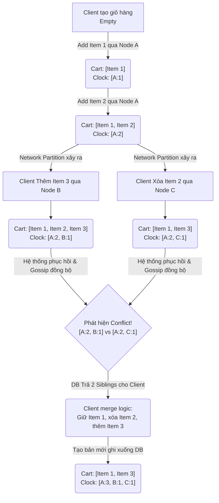

Để đạt được tính khả dụng cao (High Availability) theo định lý CAP, các hệ thống phân tán quy mô lớn (như Amazon Dynamo, Apache Cassandra, Riak, hoặc Uber Ringpop) đã từ bỏ kiến trúc Master-Slave (Single-Leader) truyền thống để chuyển sang kiến trúc Multi-Leader hoặc Leaderless (không có nút chủ). 

Nhưng khi không có nút chủ làm trung tâm quản lý (Single Point of Failure), làm sao hàng ngàn server biết được server nào đang sống, server nào đang chết, và dữ liệu nào là mới nhất? Đó là lúc **Gossip Protocol** và **Vector Clocks** xuất hiện. Việc hiểu sâu hai cơ chế này là điều kiện kiên quyết đối với các kỹ sư kiến trúc phân tán.

---

## 1. Gossip Protocol (Giao thức truyền miệng)

Gossip Protocol (hay còn gọi là Epidemic Protocol) lấy cảm hứng từ cách tin đồn lan truyền trong một văn phòng hay cách một loại virus lây lan trong cộng đồng. Trong các hệ thống phi tập trung (decentralized), đây là cách hiệu quả nhất để quảng bá trạng thái (state) và phát hiện lỗi (failure detection).

### 1.1. Cơ chế hoạt động cốt lõi

Cơ chế hoạt động cực kỳ đơn giản, thanh lịch nhưng lại vô cùng mạnh mẽ:

1. **Chu kỳ (Gossip Interval):** Cứ mỗi khoảng thời gian cố định (ví dụ: 1 giây), mỗi Server (Node) trong cụm sẽ khởi tạo một vòng Gossip.
2. **Chọn ngẫu nhiên (Random Peer Selection):** Node A chọn ngẫu nhiên một (hoặc một vài) Node B trong cụm (fanout).
3. **Trao đổi dữ liệu (Exchange):** Node A gửi trạng thái của nó (bao gồm cả danh sách các node nó biết là đang sống/chết và metadata) cho Node B.
4. **Hòa trộn (Merge):** Node B nhận thông tin, so sánh với trạng thái hiện tại của nó, cập nhật những thông tin mới hơn (dựa trên version hoặc timestamp nội bộ), và tiếp tục lan truyền.

**Kết quả:** Chỉ trong thời gian cực ngắn (Logarithmic time $\mathcal{O}(\log N)$), một sự kiện (ví dụ: Node X vừa chết hoặc vừa thêm node mới) sẽ lan truyền đến toàn bộ hàng ngàn node trong cụm mà không cần một server trung tâm (như ZooKeeper/etcd) đứng ra thông báo. Điều này giúp kiến trúc hệ thống cực kỳ bền bỉ (resilient) và chịu lỗi tốt (fault-tolerant).

### 1.2. Phân loại Gossip Protocols

Có ba cách tiếp cận chính trong Gossip Protocol, phục vụ các mục đích khác nhau trong hệ thống phân tán:

*   **Anti-Entropy (Chống hỗn loạn / Đồng bộ hóa nền):** Các node liên tục trao đổi toàn bộ nội dung của bảng dữ liệu (hoặc sử dụng **Merkle Trees** để so sánh phần khác biệt) nhằm đảm bảo toàn bộ hệ thống cuối cùng sẽ đạt trạng thái nhất quán (Eventual Consistency). Thường dùng để sửa lỗi dữ liệu ngầm (vd: Read-repair và Anti-entropy repair trong Cassandra).
*   **Rumor Mongering (Lan truyền tin đồn):** Khi một node có thông tin "nóng" (ví dụ: một node mới vừa tham gia cụm), nó sẽ gửi thông báo đến các node khác. Nếu node nhận đã biết tin đó rồi, node gửi sẽ "mất hứng" và dần dừng phát tán. Phù hợp cho việc lan truyền thay đổi trạng thái topology nhanh chóng.
*   **Aggregations (Tính toán tổng hợp):** Dùng để tính toán một giá trị chung (như trung bình, tổng, max/min) trên toàn cluster. Mỗi node trao đổi giá trị trung bình cục bộ của nó, sau thời gian ngắn, toàn bộ các node sẽ hội tụ về cùng một giá trị trung bình của cả hệ thống.

### 1.3. Minh họa bằng Mã nguồn (Python)

Dưới đây là một ví dụ đơn giản mô phỏng Gossip Protocol cho việc phát tán trạng thái các node trong mạng, cho thấy cách thông tin được đồng bộ ngẫu nhiên:

```python
import random
import time

class Node:
    def __init__(self, node_id, total_nodes):
        self.node_id = node_id
        self.total_nodes = total_nodes
        # Trạng thái ban đầu: tự biết mình đang sống ở version 1
        self.state = {node_id: {"status": "ALIVE", "version": 1}}
        
    def choose_random_peer(self, nodes):
        # Chọn ngẫu nhiên một node khác để gossip
        candidates = [n for n in nodes if n.node_id != self.node_id]
        return random.choice(candidates)
        
    def gossip(self, peer):
        print(f"[{time.time():.4f}] Node {self.node_id} gossiping to Node {peer.node_id}")
        peer.receive_gossip(self.state)
        
    def receive_gossip(self, peer_state):
        # Merge trạng thái từ peer vào trạng thái của mình dựa trên version lớn hơn
        for n_id, data in peer_state.items():
            if n_id not in self.state or data["version"] > self.state[n_id]["version"]:
                self.state[n_id] = data
                print(f"  -> Node {self.node_id} updated state for node {n_id}: {data}")

# Khởi tạo mạng gồm 5 nodes
nodes = [Node(f"N{i}", 5) for i in range(5)]

# Giả sử N0 có thông tin mới về một event: N99 vừa gia nhập mạng
nodes[0].state["N99"] = {"status": "ALIVE", "version": 1}

# Bắt đầu vòng lặp gossip mô phỏng
for round_num in range(3):
    print(f"\n--- Round {round_num + 1} ---")
    for node in nodes:
        peer = node.choose_random_peer(nodes)
        node.gossip(peer)
```

### 1.4. Ưu và Nhược điểm của Gossip Protocol

**Ưu điểm:**
- **Không có Single Point of Failure:** Mạng ngang hàng hoàn toàn (Peer-to-Peer).
- **Khả năng mở rộng tuyệt đối (Scalability):** Hoạt động mượt mà với vài chục đến hàng chục ngàn node.
- **Bền bỉ (Robustness):** Chịu đựng tốt trong môi trường mạng chập chờn (Network Partition), Packet Loss, và Node crashes.

**Nhược điểm:**
- **Overhead Băng thông:** Việc liên tục trao đổi dữ liệu định kỳ, nếu không có kỹ thuật tối ưu hóa bằng thuật toán băm (như Merkle Trees), sẽ tốn lượng băng thông mạng khổng lồ.
- **Độ trễ nhất quán:** Sẽ mất thời gian để tin đồn đi khắp cluster. Hoàn toàn không phù hợp nếu hệ thống yêu cầu độ nhất quán mạnh mẽ (Strong Consistency).

---

## 2. Vector Clocks (Đồng hồ Vector)

Trong kiến trúc Leaderless, giả sử hai người dùng cùng lúc (concurrently) cập nhật chung một row dữ liệu tại hai Data Center (DC) khác nhau. Khi hai DC này kết nối lại và đồng bộ hóa với nhau thông qua Gossip Protocol, hệ thống sẽ đối mặt với sự kiện **Xung đột dữ liệu (Data Conflict)**.

Để phân giải xung đột, làm sao biết bản ghi nào mới hơn? "Thời gian thực" (NTP / System Timestamp) là một lựa chọn tồi tệ trong hệ thống phân tán vì đồng hồ vật lý giữa các máy chủ không bao giờ chạy chính xác như nhau (Clock Skew) và các bước nhảy thời gian bất thình lình (Leap Seconds) có thể phá hỏng tính logic của dữ liệu.

Giải pháp vững chắc nhất là dùng **Đồng hồ Logic (Logical Clocks)**, cụ thể là **Vector Clocks**. Vector Clocks không đo thời gian bằng *Giờ:Phút:Giây*, mà đếm số lượng **Sự kiện (Events)** để thiết lập **Mối quan hệ nhân quả (Causality)**.

### 2.1. Cấu trúc và Quy tắc Vector Clocks

- Mỗi bản ghi trong Database được gắn một mảng (hoặc danh sách các cặp key-value) lưu số lần cập nhật bởi từng Node tham gia xử lý nó. Ví dụ: `[Node_A: 2, Node_B: 1, Node_C: 0]`.
- Cấu trúc này nói lên: "Để đạt được trạng thái hiện tại, bản ghi này đã trải qua 2 lần ghi nhận tại Node A, 1 lần tại Node B".

**Quy tắc Cập nhật (Write Rule):**
Khi một Node nhận một yêu cầu thay đổi dữ liệu, nó sẽ tự tăng bộ đếm của chính nó lên 1 trong Vector Clock của bản ghi đó.

**Quy tắc So sánh và Giải quyết Xung đột (Resolve Conflict):**
Khi 2 bản ghi với 2 Vector Clocks ($V_1$ và $V_2$) hội tụ:
1.  **Causality (Quan hệ Nhân quả - Kế thừa):** Nếu $\forall i: V_1[i] \ge V_2[i]$ và tồn tại ít nhất một $j$ sao cho $V_1[j] > V_2[j]$, thì $V_1$ là phiên bản **MỚI HƠN** $V_2$. Hệ thống yên tâm ghi đè $V_1$ lên $V_2$ mà không gặp rủi ro mất dữ liệu, vì $V_1$ là hậu duệ thừa kế trực tiếp từ $V_2$.
2.  **Concurrent (Xung đột đồng thời):** Nếu $V_1$ lớn hơn ở một số Node, nhưng $V_2$ lại lớn hơn ở các Node khác (ví dụ $V_1 = [A:2, B:1]$ và $V_2 = [A:1, B:2]$), thì đây là **Xung đột đồng thời (Concurrent Conflict)**. Hệ thống cơ sở dữ liệu sẽ KHÔNG tự ý phán xét cái nào thắng, mà giữ lại **CẢ HAI** phiên bản (gọi là Siblings) và trả về cho Application Layer để Client tự quyết định logic gộp (Merge).

### 2.2. Ví dụ Thực tế: Giỏ hàng Amazon (Shopping Cart)

Khái niệm này trở nên nổi tiếng nhờ bài báo về Amazon Dynamo (2007). Giỏ hàng e-commerce là nơi không được phép làm mất dữ liệu (ví dụ: làm rơi mất món hàng khách vừa thêm).



1. Ban đầu, User thêm 1 món hàng. Yêu cầu vào Node A. Trạng thái: `[A:1]`.
2. User thêm món thứ 2. Vẫn vào Node A. Trạng thái: `[A:2]`. (Ghi đè thành công do A:2 > A:1).
3. Do mạng chập chờn, yêu cầu "Thêm món 3" bị route sang Node B $\rightarrow$ Vector clock trở thành `[A:2, B:1]`.
4. Cùng lúc đó, từ điện thoại khác, User yêu cầu "Xóa món 2", request rơi vào Node C $\rightarrow$ Vector clock trở thành `[A:2, C:1]`.
5. Khi Node B và Node C nói chuyện với nhau, chúng so sánh `[A:2, B:1]` và `[A:2, C:1]`. Chẳng cái nào lớn hơn cái nào tuyệt đối $\rightarrow$ Conflict xảy ra. Cả hai đều không thể đè lên nhau vì sẽ gây mất Item 3 hoặc khôi phục lại Item 2.
6. Lần tới User xem giỏ hàng, DB ném cả hai giỏ lên tầng Application. Ứng dụng thực hiện merge (vd: lấy Union các thao tác) và ghi lại kết quả cuối cùng với Clock mới `[A:3, B:1, C:1]`.

### 2.3. Hạn chế của Vector Clocks & Giải pháp thay thế

Mặc dù giải quyết triệt để bài toán Causality, Vector Clocks có nhược điểm lớn được gọi là **State Bloat**.
Giả sử có 10,000 servers, một Vector Clock sẽ mang một mảng Metadata gồm 10,000 con số. Khi các server liên tục được thêm vào / gỡ ra khỏi cụm (elasticity), độ lớn của mảng Vector Clock ngày càng phình to, làm tiêu tốn bộ nhớ và kéo giảm hiệu năng mạng.

Để khắc phục, các kiến trúc sư đã đưa ra những phiên bản cải tiến:
- **Dotted Version Vectors (DVV) / Dotted Causal Container:** Được áp dụng mạnh mẽ trong Riak DB. Giúp nén dữ liệu metadata, giảm thiểu tối đa kích thước dữ liệu cần truyền tải và giảm tỷ lệ false-conflict của Vector Clocks truyền thống.
- **Pruning (Cắt tỉa bộ nhớ):** Dynamo quy định một Vector Clock chỉ được phép dài tối đa là $N$ node (ví dụ: 10 node). Khi vượt quá, node cũ nhất sẽ bị cắt bỏ. Kỹ thuật này đổi tính toàn vẹn (có khả năng dẫn đến sai lệch conflict) lấy hiệu năng lưu trữ.
- **LWW (Last Write Wins):** Một trường phái khác không sử dụng Vector Clocks là Apache Cassandra. Cassandra dùng `Last-Write-Wins` dựa trên System Timestamp của Client (Ghi sau cùng thì đè ghi trước). Việc này bỏ qua hoàn toàn bài toán causality, cực kỳ dễ gặp rủi ro mất dữ liệu ngầm (Silent Data Loss), nhưng bù lại kiến trúc siêu tối giản, không cần metadata và tốc độ xử lý Write cực kỳ khủng khiếp. Tùy thuộc vào Use Case để chọn phương án nào.

### 2.4. Mã nguồn minh họa thuật toán so sánh (Go)

Việc so sánh 2 vector clock có thể được lập trình dễ dàng như sau trong ngôn ngữ Go:

```go
package main

import "fmt"

// Định nghĩa VectorClock là một map ánh xạ NodeID -> Counter
type VectorClock map[string]int

// Compare trả về: 
//  1 (vc1 > vc2), 
// -1 (vc1 < vc2), 
//  0 (Bằng nhau hoàn toàn), 
//  2 (Xung đột/Concurrent)
func Compare(vc1, vc2 VectorClock) int {
	isGreater := false
	isLess := false

	// Lấy tất cả các keys từ cả 2 vector để đem so sánh
	allKeys := make(map[string]bool)
	for k := range vc1 { allKeys[k] = true }
	for k := range vc2 { allKeys[k] = true }

	for k := range allKeys {
		val1 := vc1[k] // Nếu key không tồn tại trong map, Go sẽ trả về default là 0, đúng với logic của VC
		val2 := vc2[k]

		if val1 > val2 {
			isGreater = true
		} else if val1 < val2 {
			isLess = true
		}
	}

	if isGreater && isLess {
		return 2 // Xung đột đồng thời (Concurrent)
	} else if isGreater {
		return 1 // vc1 thừa kế vc2
	} else if isLess {
		return -1 // vc2 thừa kế vc1
	}
	return 0 // Hai vector y hệt nhau
}

func main() {
	vc1 := VectorClock{"A": 2, "B": 1}
	vc2 := VectorClock{"A": 1, "B": 2}
	vc3 := VectorClock{"A": 3, "B": 1}

	fmt.Println("So sánh VC1 [A:2, B:1] và VC2 [A:1, B:2]: Kết quả là", Compare(vc1, vc2), "-> Conflict")
	fmt.Println("So sánh VC3 [A:3, B:1] và VC1 [A:2, B:1]: Kết quả là", Compare(vc3, vc1), "-> Thừa kế (VC3 win)")
}
```

---

## 3. Kiến Trúc Kết Hợp trong Hệ Thống Thực Tế

Sự kết hợp hoàn hảo giữa thuật toán Gossip để truyền tải thông điệp và Vector Clocks để kiểm soát tính nhân quả là bệ phóng giúp các hệ thống NoSQL thống trị các bài toán **Eventual Consistency** trên quy mô hành tinh.

*   **Riak KV / Amazon DynamoDB:** Sử dụng Gossip Protocol để trao đổi bảng định tuyến Ring (Consistent Hashing Ring). Sử dụng Vector Clocks (hoặc DVV) để giải quyết các xung đột tại mức bản ghi (Row/Item level) đảm bảo không mất mát thao tác của người dùng.
*   **Apache Cassandra:** Sử dụng Gossip Protocol cho Cluster Membership (thông báo Node Up/Down), Schema synchronization và Load Balancing. Quyết định không dùng Vector Clocks vì tập trung vào Big Data và Time-Series Data, thay vào đó chọn thiết kế LWW.
*   **HashiCorp Consul / Serf:** Dùng thuật toán SWIM (Scalable Weakly-consistent Infection-style Process Group Membership Protocol), một biến thể cải tiến của Gossip. SWIM tách luồng thông báo Lỗi (Failure Detection) và luồng lan truyền dữ liệu (Dissemination) thành hai thành phần độc lập giúp đạt độ trễ thấp và giảm cực mạnh băng thông tiêu thụ so với Gossip nguyên thủy.

Hiểu sâu sắc những khái niệm về Gossip Protocol và Vector Clocks sẽ giúp bạn nắm trong tay chìa khóa để kiến trúc các hệ thống phân tán đạt chuẩn Masterless, Scalability vô hạn, và khả năng hoạt động ổn định bất chấp mọi sự cố cháy nổ tại các Data Centers.

---

## Tài Liệu Tham Khảo
* [Designing Data-Intensive Applications - Martin Kleppmann (Part 2: Distributed Data)](https://dataintensive.net/)
* [Dynamo: Amazon's Highly Available Key-value Store (SOSP 2007)](https://www.allthingsdistributed.com/files/amazon-dynamo-sosp2007.pdf)
* [Time, Clocks, and the Ordering of Events in a Distributed System - Leslie Lamport (1978)](https://lamport.azurewebsites.net/pubs/time-clocks.pdf)
* [Cassandra Architecture - Gossip Protocol](https://cassandra.apache.org/doc/latest/cassandra/architecture/dynamo.html#gossip)
* [SWIM: Scalable Weakly-consistent Infection-style Process Group Membership Protocol](https://www.cs.cornell.edu/projects/Quicksilver/public_pdfs/SWIM.pdf)
* [Why Vector Clocks are Easy - Riak Documentation](https://docs.riak.com/riak/kv/2.2.3/learn/concepts/causality/index.html)
