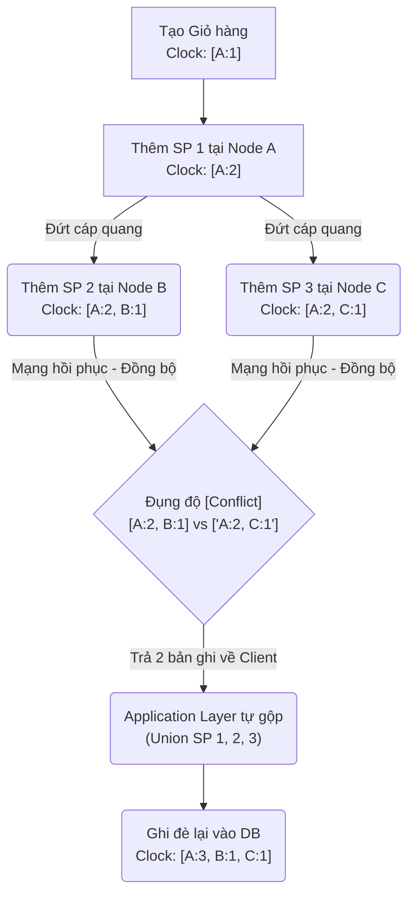

Để đạt được tính khả dụng tuyệt đối (100% High Availability) bất chấp đứt cáp mạng, cháy Data Center hay sập toàn bộ Availability Zone, các hệ cơ sở dữ liệu lớn mạnh nhất thế giới (Amazon Dynamo, Apache Cassandra, Riak) đã từ bỏ mô hình Master-Slave (Single Leader) truyền thống. Kiến trúc Masterless (hoặc Leaderless) - Nơi mọi Node đều bình đẳng và có quyền nhận lệnh Ghi/Đọc - trở thành giải pháp tối thượng.

Tuy nhiên, khi không có một "Ông chủ" (Leader) phân xử, làm sao một hệ thống hàng ngàn Server đồng thuận được về trạng thái (Ai đang sống/chết? Ai giữ bản ghi mới nhất?). Kiến trúc này tồn tại được là nhờ hai phát minh kinh điển: **Gossip Protocol** (Giao thức truyền miệng) và **Vector Clocks** (Đồng hồ Vector). Bài viết này đi sâu vào kỹ thuật, rủi ro đánh đổi (Trade-offs) và toán học đằng sau chúng.

---

## 1. Sự thật trần trụi về Thời gian: Tại sao không dùng Timestamp?

Trong lập trình Web và SQL cơ bản, chúng ta thường phân xử phiên bản dữ liệu cái nào mới/cũ bằng cột `updated_at = NOW()`. Trong Hệ thống phân tán, đây là một thảm họa tồi tệ.

- **Clock Skew (Độ lệch đồng hồ vật lý):** Thời gian vật lý của 2 máy chủ nằm ở 2 Data Center khác nhau không bao giờ chạy khớp nhau hoàn toàn, cho dù bạn có đồng bộ qua NTP (Network Time Protocol). Server A có thể chạy nhanh hơn Server B vài Mili-giây (Thậm chí là vài chục Mili-giây nếu máy chủ bị quá tải CPU).
- **Khả năng bị đè dữ liệu (Silent Data Loss):** Khi có hai yêu cầu sửa dữ liệu đồng thời ở 2 Data Center độc lập. Vì Clock Skew, hệ thống chọn ghi nhận thao tác có Timestamp vật lý "Lớn hơn". Nó vô tình ghi đè và xóa mất hoàn toàn một thao tác hợp lệ của một End-user khác mà không hề ném ra bất kỳ báo lỗi nào. Dữ liệu của khách hàng bốc hơi một cách thầm lặng.

Do đó, năm 1978, Leslie Lamport đã phát minh ra hệ quy chiếu **Thời gian Logic [Logical Clocks]**. Thay vì đếm thời gian bằng Giây/Phút, hệ thống đếm số lượng Sự kiện (Events) để định hình Nhân quả (Causality).

---

## 2. Vector Clocks: Toán học của Nhân quả

Vector Clocks là một mảng dữ liệu (Array/List) ghi lại phiên bản sửa đổi (Counter) tại từng Node tham gia cập nhật một bản ghi cụ thể. Cấu trúc cơ bản là `[NodeID_1: Counter_1, NodeID_2: Counter_2, ...]`.

### 2.1. Luật Giải quyết Xung đột [Conflict Resolution Rules]

Khi hệ thống phân tán bị đứt mạng (Network Partition), hai khu vực bị cô lập có thể tiếp nhận hai yêu cầu sửa cùng một dòng dữ liệu (Ví dụ: Giỏ hàng của người dùng). Vector Clocks của dòng dữ liệu đó sẽ bị rẽ nhánh. Khi mạng khôi phục, hai vùng phải đồng bộ lại với nhau (Sync). Hệ cơ sở dữ liệu áp dụng quy tắc toán học để so sánh 2 Vector Clocks:

1.  **Causality (Tính kế thừa tuyệt đối):** Nếu phiên bản $V_1$ có mọi bộ đếm (Counters) tại mọi Node $\ge V_2$, và có ít nhất 1 Node có bộ đếm lớn hơn hẳn, thì chứng tỏ $V_1$ sinh ra sau và kế thừa $V_2$. Hệ thống âm thầm ghi đè $V_1$ lên $V_2$ một cách an toàn.
2.  **Concurrent (Xung đột song song):** Giả sử $V_1 = [NodeA:2, NodeB:1]$, và $V_2 = [NodeA:1, NodeB:2]$. 
    *   Node A có biến động lớn hơn trong $V_1$ (2 > 1].
    *   Node B lại có biến động lớn hơn trong $V_2$ (2 > 1).
    *   $\rightarrow$ Hệ thống cơ sở dữ liệu KHÔNG dám tự ý xóa bên nào cả. Nó giữ lại CẢ HAI bản ghi này, sinh ra trạng thái **Siblings** (Anh em song sinh). Sau đó, nó trả cả 2 bản ghi về cho Ứng dụng (Application Layer - Client) và bắt Client tự viết Code để trộn (Merge) chúng lại (Ví dụ: Lấy Union 2 giỏ hàng).

### 2.2. Sự cố Vận hành: Vector Clock State Bloat (Phình to bộ nhớ)

**The Problem (Vấn đề):** Trong một hệ thống Database khổng lồ, số lượng Node xử lý có thể lên tới hàng ngàn do Scaling up/down (Ví dụ Kubernetes Pods bị thay mới liên tục, mỗi Pod có 1 Node ID mới). Bảng Vector Clocks của một Record kích thước gốc chỉ 50 byte bỗng nhiên chứa chuỗi Metadata dài tới 10,000 phần tử (Tốn 100KB).
- Hậu quả: Băng thông mạng tắc nghẽn toàn diện vì phải truyền cục Metadata khổng lồ này, Database tràn RAM và ổ cứng (State Bloat).

**Cách khắc phục của Amazon Dynamo (Pruning):** Họ giới hạn Vector Clocks chỉ lưu tối đa 10 Node cập nhật gần nhất. Khi danh sách vượt quá 10, những Node cũ nhất sẽ bị cắt rớt (Truncation).
- *Trade-off (Đánh đổi):* Bằng việc cắt bỏ lịch sử cũ, tính an toàn nhân quả lý thuyết bị phá vỡ (Có thể vô tình sinh ra Conflict ảo). Amazon đánh đổi điều này lấy hiệu năng ổn định.

### 2.3. LWW (Last-Write-Wins) của Apache Cassandra
Đáng chú ý, **Apache Cassandra** đã thẳng thừng TỪ CHỐI sử dụng Vector Clocks do rủi ro phức tạp và làm chậm tốc độ Ghi. Họ chấp nhận dùng System Timestamp kết hợp khái niệm **Last-Write-Wins (LWW)** (Thằng nào có Timestamp to hơn thì ghi đè thắng).
- *Trade-off:* Tuy rủi ro làm rơi mất Data song song (Silent Data Loss), LWW giúp Cassandra cực kỳ phù hợp với dữ liệu Log Time-Series hoặc IoT Sensor, nơi rớt 1-2 điểm dữ liệu không phải thảm họa, nhưng hệ thống cần tối ưu tốc độ Ghi (Write-heavy) tới giới hạn vật lý của phần cứng ổ đĩa (Sequential IO).

---

## 3. Gossip Protocol & SWIM: Khám phá Topology Hệ thống

Để bảng Vector Clocks có thể so khớp và đồng bộ, các Node phải nói chuyện với nhau liên tục trong bóng tối (Background). Gossip hoạt động theo cơ chế **Lây nhiễm dịch bệnh (Epidemic)**.

### 3.1. Thuật toán $O(\log N)$ Thanh lịch
Mỗi giây (Tick), Node A chọn ngẫu nhiên một Node B trong cụm và ném cho nó một bảng băm (Hash Table) tóm tắt về "Những gì A biết về toàn cụm". Node B gộp (Merge) nó vào kiến thức của B, rồi lại truyền tiếp cho Node C.
Nhờ bản chất lây nhiễm theo cấp số nhân, tin tức về một Node bị rút phích cắm (Sập nguồn) lan truyền ra toàn bộ cụm 10,000 Node chỉ mất khoảng $\approx 14$ vòng ($O(\log_{"2"} 10000)$), tương đương vài giây. Không cần bất kỳ Server trung tâm nào quản lý danh sách Node.

### 3.2. Rủi ro Cảnh báo Giả (False Positives) trong Failure Detection
Khi mạng chập chờn (Packet Drop, Spikes), một Node hoàn toàn khỏe mạnh có thể chậm trả lời (Timeout) thông điệp PING của Gossip. Nếu ngay lập tức hệ thống ngây thơ đánh dấu nó là CHẾT, cụm sẽ kích hoạt quá trình tái cân bằng dữ liệu (Data Rebalancing) dời hàng Terabytes dữ liệu đi chỗ khác. Hậu quả là làm sập toàn bộ mạng và CPU của hệ thống (Cascading Failure).

**Giải pháp của Staff Engineer: Phi Accrual Failure Detector**
Thay vì trạng thái nhị phân (0 = Sống, 1 = Chết), các hệ thống như Cassandra đo đạc **Thời gian trễ trung bình của mạng** (Latency Distribution) bằng toán học thống kê. Nó cho ra một biến liên tục gọi là **Phi ($\Phi$)**, thể hiện *xác suất* Node đó thực sự đã chết.
- Nếu mạng đang bị nghẽn tắc chung toàn Datacenter, hệ thống sẽ giãn độ đo đạc (Tolerant).
- Chỉ khi $\Phi$ vượt ngưỡng do Kỹ sư định nghĩa (Ví dụ $\Phi=8$, tương đương xác suất Node còn sống chưa tới 1/1,000,000), hệ thống mới chính thức kết liễu Node đó.

### 3.3. Thuật toán SWIM: Tiến hóa của Gossip
Gossip thuần túy tốn cực kỳ nhiều Băng Thông (Bandwidth) do trao đổi thừa thãi toàn bộ trạng thái mạng liên tục. Thuật toán **SWIM (Scalable Weakly-consistent Infection-style Process Group Membership Protocol)** (Được dùng trong HashiCorp Consul) là phiên bản tối ưu:
- **Tách rời (Separation of Concerns):** Chia việc "Kiểm tra sống chết" (PING) và "Lan truyền tin đồn" [Piggybacking] làm hai cơ chế riêng biệt.
- Thông điệp Gossip cập nhật Topology được **ghép lén lút (Piggyback)** vào các gói tin TCP PING/ACK rất nhỏ, tiết kiệm hơn 90% Băng thông mạng so với Gossip truyền thống.

---

## 4. Nguồn Tham Khảo (References)
1. **Bài báo nền tảng của Amazon:** [Dynamo: Amazon's Highly Available Key-value Store (SOSP 2007]][https://www.allthingsdistributed.com/files/amazon-dynamo-sosp2007.pdf]
2. **Nguồn gốc Logical Clocks:** [Time, Clocks, and the Ordering of Events in a Distributed System - Leslie Lamport (1978]][https://lamport.azurewebsites.net/pubs/time-clocks.pdf]
3. **Thuật toán SWIM:** [SWIM Protocol Paper - Cornell University][https://www.cs.cornell.edu/projects/Quicksilver/public_pdfs/SWIM.pdf]
4. **Apache Cassandra Documentation:** [Cassandra Architecture: Gossip Protocol & LWW][https://cassandra.apache.org/doc/latest/cassandra/architecture/dynamo.html#gossip]
5. **Wikipedia:** [Vector clock][https://en.wikipedia.org/wiki/Vector_clock] và [Gossip protocol](https://en.wikipedia.org/wiki/Gossip_protocol]
