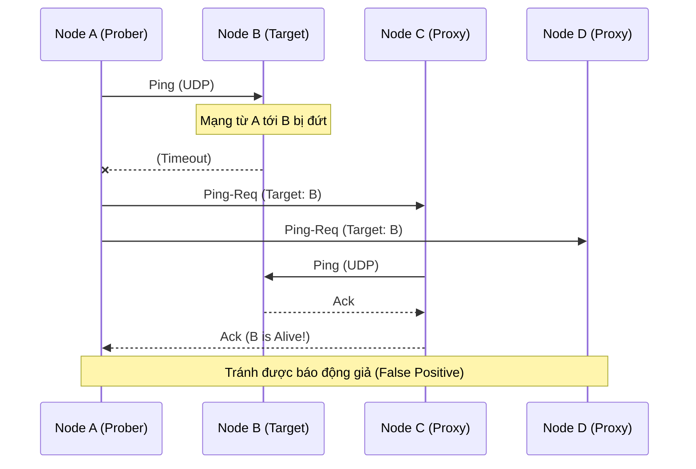

Gossip Protocol (hay Epidemic Protocol) là nền tảng giao tiếp ngang hàng (peer-to-peer) phi tập trung, đóng vai trò như "hệ thần kinh" của các hệ thống phân tán khổng lồ (Amazon Dynamo, Apache Cassandra, HashiCorp Consul). Ở góc độ Staff Engineer, chúng ta không chỉ dừng lại ở việc hiểu nó lây lan theo cấp số nhân $\mathcal{O}(\log N)$, mà phải đào sâu vào cách nó thực thi ở tầng mạng (Network Layer), cách xử lý các edge cases, và những cái bẫy (pitfalls) khi vận hành ở quy mô hàng ngàn node.

## 1. Physical Execution: Thực Thi Ở Tầng Mạng (Network Layer)

Giao tiếp trong Gossip thường xuyên vấp phải giới hạn vật lý của hạ tầng mạng.

### UDP vs TCP và Giới Hạn MTU
Hầu hết các Gossip framework (như Serf, Cassandra) ưu tiên sử dụng **UDP** cho việc lan truyền thông tin trạng thái (Rumor Mongering) thay vì TCP. 
- **Lý do:** TCP yêu cầu thiết lập 3-way handshake và duy trì state (connection overhead). Với một cluster 1,000 nodes, nếu dùng TCP mesh (full-mesh), số lượng connection bùng nổ theo công thức $\frac{N(N-1)}{2}$, gây cạn kiệt File Descriptors và RAM. UDP phi trạng thái (stateless) giải quyết triệt để vấn đề này.
- **Vấn đề MTU (Maximum Transmission Unit):** Gói tin UDP trong mạng LAN/VPC thường bị giới hạn ở 1500 bytes (trừ khi bật Jumbo Frames 9000 bytes). Khi cluster mở rộng, payload chứa trạng thái mạng (gossip digest) có thể vượt quá 1500 bytes. Nếu điều này xảy ra, IP Fragmentation sẽ chia nhỏ gói tin, làm tăng đáng kể rủi ro rớt (packet loss). Các hệ thống chuẩn mực phải tự implement cơ chế phân mảnh và ráp gói (fragment/reassembly) ở tầng Application.

## 2. Failure Detection: Từ Timeout Tĩnh Đến $\Phi$ Accrual

Việc định nghĩa một node "chết" (Down) trong mạng phân tán phức tạp hơn bạn nghĩ. Ping timeout (vd: `ping = 500ms`) không hiệu quả vì độ trễ mạng (network jitter) và GC Pauses (Stop-The-World) liên tục biến thiên.

Cassandra và Dynamo áp dụng **Phi ($\Phi$) Accrual Failure Detector**. Thay vì trả về kết quả nhị phân (Up/Down), nó theo dõi lịch sử thời gian phản hồi của heartbeat để tính toán phân phối chuẩn (Normal Distribution), từ đó đưa ra **xác suất** node đang chết.

Công thức:
$\Phi = -\log_{10}(1 - F(time\_since\_last\_heartbeat))$

- Khi $\Phi = 8$, xác suất phán đoán sai (false positive) chỉ là $10^{-8}$.

### Cấu hình thực tế (Cassandra `cassandra.yaml`)
```yaml
# Mức độ nhạy của Phi Accrual. 
# Mặc định là 8. Nếu mạng nội bộ (VPC) không ổn định hoặc GC pause cao, 
# cần tăng lên 10-12 để tránh tình trạng flapping (node bị đánh dấu Up/Down liên tục).
phi_convict_threshold: 8

# Khoảng thời gian giữa 2 vòng gossip (ms)
gossip_interval_ms: 1000
```

## 3. Cải Tiến Với SWIM Protocol (Consul, Serf)

Gossip truyền thống (Anti-Entropy) yêu cầu đồng bộ toàn bộ bảng băm (Merkle Tree), gây tốn kém CPU và Băng thông. **SWIM (Scalable Weakly-consistent Infection-style Process Group Membership)** giải quyết triệt để vấn đề Failure Detection qua 3 bước, tránh được rủi ro "báo động giả" do chập chờn mạng cục bộ.



**Trade-off:** SWIM giảm đáng kể *False Positives* nhưng bù lại làm tăng độ trễ phát hiện lỗi (Detection Time). Nếu thực sự Node B chết, Node A phải tốn thêm thời gian gửi `Ping-Req` qua C và D rồi mới dám kết luận.

## 4. Operational Risks & Systemic Trade-offs

### Gossip Storms (Bão Truyền Miệng)
Đây là ác mộng lớn nhất khi vận hành Gossip clusters. Xảy ra khi một cụm các node rơi vào trạng thái *flapping* (Up rồi Down liên tục) do GC Pauses hoặc CPU throttling. 
Hệ quả: Các trạng thái mới sinh ra liên tục (Epoch/Version increments), Gossip protocol phải liên tục broadcast các sự thay đổi này ra toàn mạng, làm bão hòa (saturate) card mạng (NIC) và CPU của toàn bộ cluster, khiến cả cluster sập dây chuyền.
- **Fix:** Phải implement Rate Limiting ở tầng Gossip và cơ chế "Quarantine" (cách ly) các node bị flap.

### FinOps: Chi Phí Inter-AZ Data Transfer
Trên AWS/GCP, traffic luân chuyển giữa các Availability Zones (AZ) bị tính phí (khoảng $0.01/GB). Với Gossip protocol truyền thống, các node chọn random target để rỉ tai, không quan tâm AZ. Nếu cluster có 1,000 nodes chia đều ra 3 AZ, $\frac{2}{3}$ lượng traffic gossip sẽ đi xuyên AZ, tạo ra hóa đơn Data Transfer khổng lồ mỗi tháng.
- **Fix:** Áp dụng **Topology-Aware Gossip**. Node ưu tiên (ví dụ: 90% xác suất) gossip với các node cùng AZ, và chỉ 10% gửi chéo AZ để tiết kiệm chi phí nhưng vẫn đảm bảo Eventual Consistency.

## 5. So Sánh: Gossip vs Consensus (Raft/Paxos)

Đừng dùng Gossip để làm Database Transaction.

| Tiêu chí | Gossip (SWIM/Anti-Entropy) | Consensus (Raft/Paxos) |
| :--- | :--- | :--- |
| **Consistency** | Eventual Consistency. Dữ liệu có thể lệch nhau vài giây. | Strong Consistency. Tuyệt đối đồng nhất (Linearizability). |
| **Băng Thông (Bandwidth)** | Tiết kiệm (lây lan $\mathcal{O}(\log N)$), nén payload (UDP). | Tốn kém (phải broadcast và nhận ACK từ Quorum). |
| **Use Cases Thực Tế** | Topology discovery, Failure detection, Routing tables. | Leader Election, Distributed Locks, Metadata lưu trữ. |

> **Hard Truth:** Kiến trúc hiện đại (như HashiCorp Nomad/Consul) luôn tách đôi: dùng Gossip để giám sát trạng thái sức khỏe (Health Check & Membership) vì nó scale tới vạn node, và dùng Raft cho Cấu hình cốt lõi (Cluster Metadata) giới hạn ở 3-5 node để đảm bảo an toàn.

## 6. Nguồn Tham Khảo (References)

* [SWIM: Scalable Weakly-consistent Infection-style Process Group Membership Protocol](https://www.cs.cornell.edu/projects/Quicksilver/public_pdfs/SWIM.pdf)
* [Phi Accrual Failure Detector (Naohiro Hayashibara et al.)](https://www.computer.org/csdl/proceedings-article/srds/2004/22390066/12OmNvT2y8G)
* [Cassandra Architecture: Gossip Protocol](https://cassandra.apache.org/doc/latest/cassandra/architecture/dynamo.html#gossip)
* [HashiCorp Serf Gossip Internals](https://www.serf.io/docs/internals/gossip.html)
