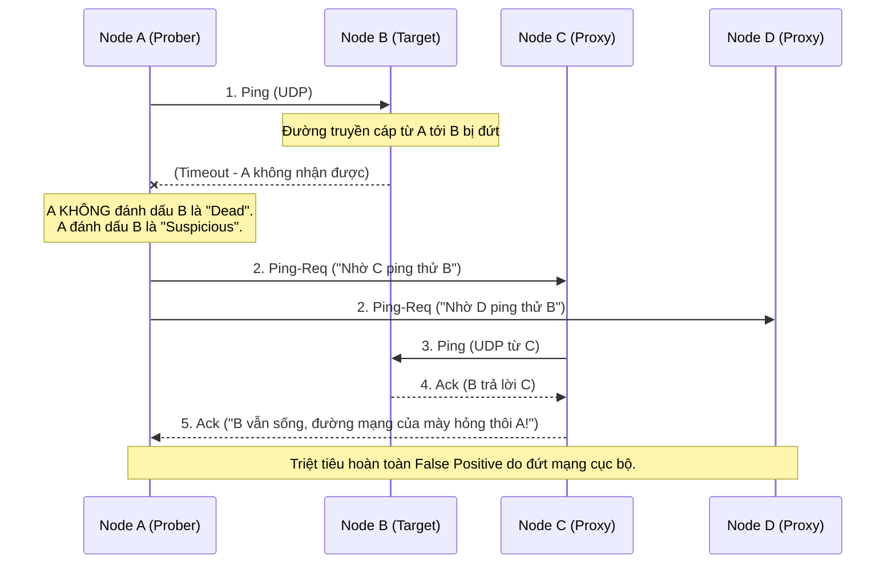

Gossip Protocol (hay Epidemic Protocol) là nền tảng giao tiếp ngang hàng (Peer-to-Peer) phi tập trung, đóng vai trò như "hệ thần kinh" của các hệ thống phân tán khổng lồ (Amazon Dynamo, Apache Cassandra, HashiCorp Consul). Thay vì có một Master node độc tài quản lý ai sống ai chết, thông tin trong mạng Gossip lây lan theo cấp số nhân $\mathcal{"O"}(\log N)$, giống hệt cách một bệnh dịch truyền nhiễm trong cộng đồng.

Ở góc độ Staff Engineer, chúng ta không chỉ dừng lại ở lý thuyết lây nhiễm, mà phải đào sâu vào cách nó thực thi ở tầng mạng vật lý (Network Layer), cách xử lý báo động giả (False Positives), và những cái bẫy FinOps khi vận hành cụm hàng ngàn node.

---

## 1. Cơ Chế Lan Truyền và Giới Hạn Tầng Mạng (Network Layer)

Gossip ưu tiên sự sẵn sàng (Availability) và tính phân mảnh (Partition Tolerance) - tức hệ Eventual Consistency trong định lý CAP.

### 1.1. UDP vs TCP: Bài toán bùng nổ kết nối
Hầu hết các Gossip framework chuẩn mực (như Serf, Cassandra) sử dụng **UDP** cho việc lan truyền thông tin trạng thái (Rumor Mongering) thay vì TCP. 
- **Tại sao không dùng TCP?** TCP yêu cầu thiết lập 3-way handshake và duy trì trạng thái (Connection state overhead). Với một cluster 1,000 nodes, nếu dùng TCP Full-mesh, số lượng TCP connections sẽ bùng nổ theo công thức $\frac{"N(N-1)"}{2} \approx 500,000$ connections. Hệ thống sẽ cạn kiệt File Descriptors và RAM. UDP phi trạng thái (Stateless) giải quyết triệt để vấn đề này.

### 1.2. Giới Hạn MTU và IP Fragmentation
Gói tin UDP trong mạng LAN hoặc VPC của AWS/GCP thường bị giới hạn kích thước MTU ở mức **1500 bytes** (trừ khi bạn chủ động bật Jumbo Frames 9000 bytes). 

Khi cụm mở rộng lên quá lớn, payload chứa toàn bộ trạng thái mạng (Gossip Digest) có thể phình to vượt quá 1500 bytes. Lúc này, Switch mạng sẽ tự động băm nhỏ gói tin (IP Fragmentation). Nhược điểm tàn khốc là: Chỉ cần *một mảnh* bị rớt mạng, toàn bộ gói tin UDP coi như bị hủy (Packet Loss). Các kiến trúc mạng phân tán chuẩn mực phải tự viết code chia nhỏ và ráp gói (Fragment/Reassembly) ở tầng Application thay vì phó mặc cho OS.

---

## 2. Failure Detection: Từ Timeout Ngây Thơ Đến $\Phi$ Accrual

Việc phán đoán một Node "đã chết" (Down) trong mạng phân tán khó hơn bạn nghĩ. Đặt một Ping Timeout tĩnh (ví dụ: `ping > 500ms thì coi như chết`) là một sự ngây thơ. Độ trễ mạng (Network Jitter) và các đợt dọn rác của Java (JVM Stop-The-World GC Pauses) luôn biến thiên liên tục.

Apache Cassandra và Amazon Dynamo áp dụng **Phi ($\Phi$) Accrual Failure Detector**. 
Thay vì trả về kết quả nhị phân (Đóng/Mở), nó thu thập lịch sử thời gian phản hồi (Heartbeats) để tính toán ra Phân phối chuẩn (Normal Distribution). Từ đó, nó đưa ra một **Xác suất** (Probability) rằng Node đó đang chết.

Công thức toán học:
$\Phi = -\log_{"10"}(1 - F(time\_since\_last\_heartbeat))$

- Khi $\Phi = 8$, xác suất hệ thống phán đoán sai (False Positive) chỉ là $10^{-8}$ (0.000001%).

*Cấu hình thực tế (`cassandra.yaml`):*
```yaml
# Mức độ nhạy của Phi Accrual (Mặc định là 8). 
# Nếu mạng nội bộ Cloud VPC của bạn thường xuyên bị chập chờn hoặc GC pause cao, 
# bạn CẦN tăng lên 10-12 để tránh tình trạng "Flapping" (node bị chẩn đoán Up/Down liên tục).
phi_convict_threshold: 8
gossip_interval_ms: 1000
```

---

## 3. Cuộc Cách Mạng SWIM Protocol (Consul, Serf)

Gossip truyền thống (Anti-Entropy) yêu cầu các node liên tục đồng bộ toàn bộ bảng băm (Merkle Tree), gây tốn kém CPU và băng thông mạng với độ phức tạp $\mathcal{"O"}(N^2)$ nếu không thiết kế khéo. 

**SWIM (Scalable Weakly-consistent Infection-style Process Group Membership)** - được sử dụng trong HashiCorp Consul - giải quyết triệt để bài toán này. Khối lượng tin nhắn của SWIM giữ ở mức hằng số $\mathcal{"O"}(1)$ trên mỗi Node, bất kể Cluster có 10 hay 10,000 Node.

SWIM giới thiệu trạng thái trung gian gọi là **Suspicion (Nghi ngờ)** để giảm thiểu "Báo động giả" do chập chờn mạng cục bộ.



**Trade-off (Sự đánh đổi):** Cơ chế Proxy Ping-Req của SWIM làm giảm False Positives, nhưng bù lại làm **tăng Thời gian Phát hiện Lỗi (Detection Time)**. Nếu Node B chết thật sự, Node A phải tốn thêm milliseconds để đi hỏi thăm vòng vo qua C và D rồi mới dám kết luận.

---

## 4. Operational Risks: Rủi Ro Vận Hành & FinOps

### 4.1. Gossip Storms (Bão Truyền Miệng)
Đây là cơn ác mộng lớn nhất khi vận hành hệ thống Gossip. Xảy ra khi một nhóm Node rơi vào trạng thái *Flapping* (Lên/Xuống liên tục) do CPU bị bóp nghẹt (Throttling) hoặc JVM GC Pauses.
- **Hệ quả:** Mỗi lần Node đổi trạng thái, một Version (Epoch) mới được sinh ra. Gossip Protocol phải lập tức rỉ tai broadcast sự thay đổi này ra toàn cụm. Hàng ngàn Node liên tục phát ra hàng triệu gói tin UDP, làm bão hòa Card mạng (NIC) và vắt kiệt CPU của toàn bộ Cluster $\implies$ Cluster sập dây chuyền.
- **Giải pháp:** Bắt buộc phải cài đặt **Rate Limiting** ở tầng Gossip và cơ chế Quarantine (Cách ly) các node bị Flap quá nhiều lần.

### 4.2. Bài toán FinOps: Chi Phí Cross-AZ Data Transfer
Trên AWS/GCP, Data Transfer luân chuyển giữa các Availability Zones (AZ) luôn bị tính phí (khoảng \$0.01/GB). Với Gossip ngây thơ, một Node sẽ Random chọn 1 Node khác để rỉ tai. Nếu Cluster có 3,000 Node chia đều 3 AZ, $\frac{"2"}{3}$ lượng traffic rỉ tai sẽ đi xuyên AZ, tạo ra hóa đơn Cloud hàng chục ngàn đô mỗi tháng chỉ cho việc... chào hỏi nhau.
- **Giải pháp:** Cấu hình **Topology-Aware Gossip**. Hệ thống sẽ tự động ưu tiên (ví dụ 90% xác suất) rỉ tai với các Node nằm trong *cùng 1 Rack/AZ*, và chỉ dành 10% xác suất gửi gói tin chéo AZ. Vừa tiết kiệm hàng tỷ đồng, vừa đảm bảo Eventual Consistency.

---

## 5. Gossip vs Consensus (Raft/Paxos)

**Tuyệt đối không dùng Gossip để làm Database Transaction (Giao dịch tài chính).**

| Tiêu chí | Gossip (SWIM / Anti-Entropy) |" Consensus (Raft / Paxos) "|
| :--- | :--- | :--- |
| **Tính Nhất Quán** | **Eventual Consistency.** Dữ liệu ở 2 Node có thể lệch nhau vài giây. |" **Strong Consistency.** Tuyệt đối đồng nhất (Linearizability). "|
| **Chi phí Băng thông** | Rất nhẹ (Lan truyền $\mathcal{"O"}[\log N]$, dùng UDP). |" Nặng nề (Phải Broadcast và đợi ACK từ Majority Quorum). "|
| **Khả năng Mở rộng** | Scale lên hàng chục vạn Node dễ dàng. |" Chỉ giới hạn ở cụm 3, 5, hoặc 7 Node (Quá nhiều Node sẽ làm giảm Write Latency). "|
| **Use Case Cốt lõi** | Cluster Membership, Failure Detection, Topology Discovery. | Leader Election, Distributed Locks, Quản lý Cấu hình Metadata. |

> **Thực tế Kiến trúc:** Các hệ thống hiện đại (như HashiCorp Consul / Nomad) sử dụng sức mạnh của cả hai. Chúng dùng **Gossip** để theo dõi sức khỏe của hàng chục vạn Worker Nodes, và dùng **Raft** cho cụm Server 5 Node ở giữa để lưu trữ các Cấu hình cốt lõi (Cluster State).

---

## Nguồn Tham Khảo (References)
* [SWIM: Scalable Weakly-consistent Infection-style Process Group Membership Protocol][https://www.cs.cornell.edu/projects/Quicksilver/public_pdfs/SWIM.pdf]
* [Phi Accrual Failure Detector (Naohiro Hayashibara et al.]][https://www.computer.org/csdl/proceedings-article/srds/2004/22390066/12OmNvT2y8G]
* [Cassandra Architecture: Gossip Protocol][https://cassandra.apache.org/doc/latest/cassandra/architecture/dynamo.html#gossip]
* [HashiCorp Serf Gossip Internals](https://www.serf.io/docs/internals/gossip.html]
