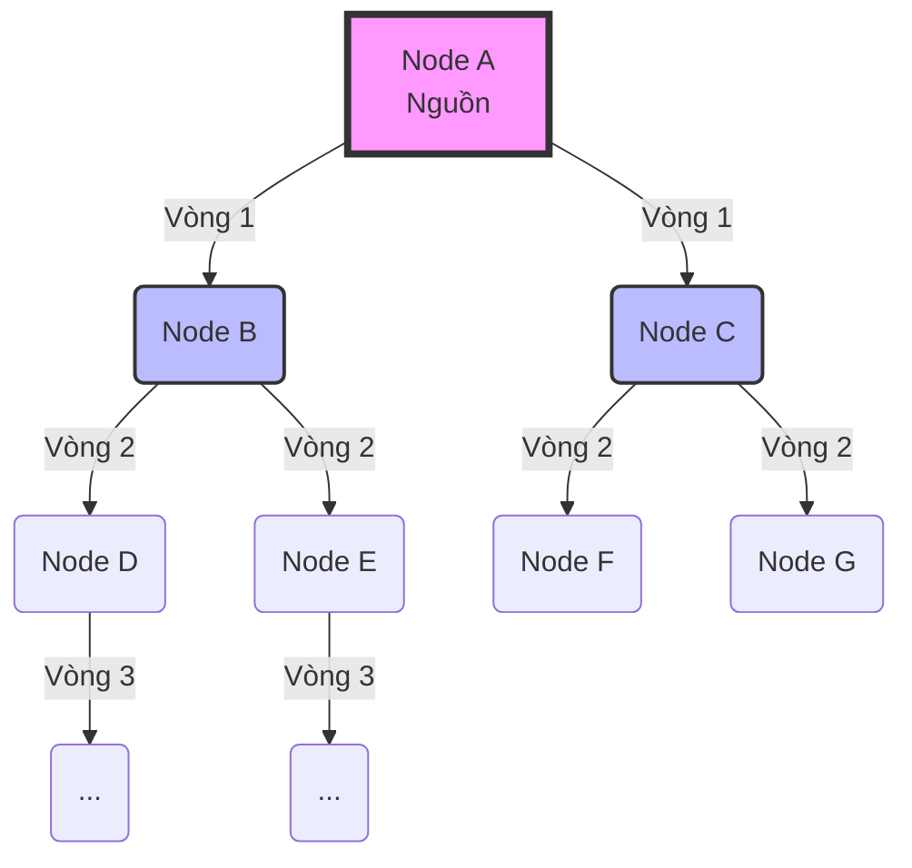

Gossip Protocol (Giao thức truyền miệng hay còn gọi là *Epidemic Protocol*) là một giao thức giao tiếp ngang hàng (peer-to-peer) lấy cảm hứng từ cách tin đồn (hoặc bệnh dịch) lây lan trong xã hội. Trong các hệ thống phân tán lớn, thay vì có một máy chủ trung tâm giám sát hay đồng bộ toàn bộ cụm, mỗi Node sẽ liên tục "rỉ tai" (gossip) tình trạng của mình hoặc dữ liệu mới cho một vài Node ngẫu nhiên xung quanh. Chỉ sau một khoảng thời gian cực ngắn $\mathcal{O}(\log N)$, toàn bộ mạng lưới hàng nghìn máy sẽ đạt được sự đồng thuận và biết được trạng thái của nhau.

## Tại sao cần Gossip Protocol?


Trong một hệ thống phân tán, duy trì sự nhất quán (consistency) và trạng thái (state) của các Node là một bài toán khó. Các phương pháp truyền thống như **Multicast** hay **Centralized Registry** (như ZooKeeper) gặp phải vấn đề lớn khi hệ thống mở rộng:

1. **Bottle-neck (Điểm nghẽn)**: Máy chủ trung tâm quá tải khi số lượng Node tăng lên hàng ngàn. Mọi thao tác cập nhật hay truy vấn cấu hình đều phải đi qua một điểm, tạo thành một nút thắt cổ chai về mặt hiệu năng.
2. **Single Point of Failure (SPOF)**: Nếu hệ thống trung tâm sập, toàn bộ mạng mất khả năng nhận thức trạng thái. Các node không biết ai đang hoạt động và ai đã ngắt kết nối.
3. **Network Partition (Phân mảnh mạng)**: Trong môi trường Cloud, việc mất kết nối giữa các Node xảy ra như cơm bữa. Các hệ thống tập trung khó linh hoạt khi một vùng (zone) mạng bị chia cắt.

Gossip Protocol giải quyết các vấn đề trên bằng thiết kế hoàn toàn phi tập trung (decentralized).

## Nền tảng Toán học và Mô hình Dịch tễ học (SIR Model)

Gossip Protocol mượn ý tưởng từ mô hình truyền nhiễm dịch bệnh SIR (Susceptible - Infectious - Recovered) trong toán học và sinh học:

- **Susceptible (Chưa nhiễm)**: Node chưa nhận được thông tin/tin đồn.
- **Infectious (Đang lây nhiễm)**: Node vừa nhận được thông tin và đang tích cực truyền bá thông tin đó cho các node khác.
- **Recovered/Removed (Đã khỏi/Ngừng lây)**: Node đã biết thông tin nhưng không còn muốn truyền bá nữa (ví dụ: do giới hạn TTL - Time to Live, hoặc do nhận thấy hầu hết các node xung quanh đều đã biết thông tin).

Mô hình này đảm bảo rằng thông tin được lan truyền theo cấp số nhân trong giai đoạn đầu và tự động dập tắt (converge) khi đa số mạng lưới đã nhận được dữ liệu, giúp tiết kiệm băng thông.

## Cơ chế hoạt động

Cơ chế cơ bản của Gossip bao gồm các bước sau:

1. **Khởi tạo**: Node A muốn chia sẻ thông tin (ví dụ: "Node X vừa mới bị sập" hoặc "Giá trị của key K đã đổi thành V").
2. **Chọn ngẫu nhiên**: Node A chọn ngẫu nhiên $k$ Node khác trong mạng (thường $k$ (fanout) là một số nhỏ như 3 hoặc 4). Việc chọn ngẫu nhiên giúp tránh các vòng lặp cố định và đối phó với tình trạng mất kết nối tốt hơn.
3. **Truyền tin**: Node A gửi thông tin đến $k$ Node này.
4. **Lan truyền**: Mỗi Node nhận được thông tin lại tiếp tục lặp lại quá trình trên: chọn ngẫu nhiên $k$ Node khác và truyền tiếp.
5. **Dừng lại**: Quá trình lây lan kết thúc khi tất cả các Node trong mạng đều nhận được thông tin (hoặc khi đạt đến giới hạn số vòng truyền - Time-To-Live).

Nhờ đặc tính lây lan theo cấp số nhân, thời gian để thông tin lan truyền đến toàn bộ $N$ Node trong mạng chỉ mất $\mathcal{O}(\log N)$ vòng (rounds).

### Sơ đồ luồng thông tin (Mermaid Diagram)



*Một ví dụ với fanout $k = 2$. Từ 1 Node ban đầu, ở vòng 1 lây cho 2 Node, vòng 2 lây cho 4 Node. Tốc độ lan truyền tăng theo cấp số nhân.*

## Phân loại Gossip Protocols

Gossip Protocol thường được chia làm 2 chiến lược chính tùy vào mục tiêu:

### 1. Anti-Entropy (Chống hỗn loạn)
Được sử dụng để đồng bộ toàn bộ dữ liệu giữa các Node để đảm bảo **Tính nhất quán cuối cùng (Eventual Consistency)**. Trong quá trình vận hành, một số cập nhật có thể bị rớt do lỗi mạng, Anti-Entropy là cơ chế giúp "hàn gắn" và sửa chữa các sai lệch này.
- Các Node định kỳ so sánh toàn bộ dữ liệu của mình với các Node ngẫu nhiên khác.
- Dùng cấu trúc dữ liệu như **Merkle Trees** (cây băm) để nhanh chóng phát hiện phần dữ liệu bị lệch và chỉ truyền các khối dữ liệu khác biệt nhằm tối ưu băng thông mạng. 
- **Ví dụ**: Dùng trong Amazon Dynamo hoặc Riak để phục hồi dữ liệu bị thiếu sau sự cố phân mảnh mạng (Network Partition).

> [!NOTE]
> **Merkle Tree là gì?**
> Merkle Tree là một cấu trúc cây mà mỗi leaf node chứa mã hash của một block dữ liệu, các non-leaf node chứa mã hash của các node con của nó. Khi hai máy chủ Anti-Entropy so sánh, chúng chỉ cần so sánh Root Hash trước. Nếu Root Hash giống nhau, dữ liệu đã đồng bộ. Nếu khác nhau, chúng so sánh dần xuống các node con để định vị chính xác block dữ liệu nào bị sai lệch mà không cần gửi toàn bộ dữ liệu qua mạng.

### 2. Rumor Mongering (Lan truyền tin đồn)
Dùng để truyền bá thông tin *mới* cập nhật nhanh nhất có thể (VD: trạng thái up/down của máy chủ).
- Khi một Node nhận được một tin nhắn mới (rumor), nó trở nên "nóng vội" (hot) và cố gắng nói cho các Node khác.
- Khi Node này liên tục gặp các Node *đã biết thông tin đó rồi*, nó sẽ mất đi sự "hứng thú" và ngừng lan truyền.
- Dùng cho việc gửi tín hiệu phát hiện lỗi (Failure Detection) hoặc sự kiện thành viên mạng (Membership Events).

## Các mô hình giao tiếp

Giữa hai Node tham gia vào Gossip, có ba cách để trao đổi dữ liệu:

* **Push Model**: Node đang có dữ liệu mới chủ động gửi nó cho các Node ngẫu nhiên. Hiệu quả cao trong giai đoạn đầu khi tin tức mới lan truyền. Tuy nhiên, ở giai đoạn cuối khi đa số các node đã biết thông tin, việc chọn ngẫu nhiên đa phần sẽ "push" vào những node đã có dữ liệu, gây lãng phí tài nguyên.
* **Pull Model**: Các Node định kỳ hỏi các Node ngẫu nhiên khác: "Có gì mới không, gửi cho tôi với?". Hiệu quả trong giai đoạn sau, khi hầu hết mạng đã biết tin đồn, việc tìm ra Node chưa biết bằng cách Push sẽ rất chậm, lúc này Node chưa biết đi "hỏi" (Pull) sẽ có xác suất trúng Node đã biết rất cao.
* **Push-Pull Model**: Kết hợp cả hai. Node A gửi một bản tóm tắt dữ liệu của mình cho Node B. Node B nhận được, so sánh, cập nhật dữ liệu của mình, và trả lại cho Node A những dữ liệu mà A còn thiếu. Thường là cách tốt nhất để đảm bảo tốc độ lan truyền nhanh nhất và tốn ít băng thông nhất, tuy tốn kém tài nguyên tính toán hơn một chút.

## Dive Deep: SWIM Protocol (Một biến thể nâng cao)

Nhiều hệ thống như HashiCorp Consul không dùng mô hình Gossip cơ bản mà sử dụng các biến thể tối ưu hơn, điển hình là **SWIM** (Scalable Weakly-consistent Infection-style Process Group Membership Protocol).

SWIM giải quyết vấn đề Failure Detection bằng một quy trình cực kỳ thông minh nhằm giảm thiểu tình trạng cảnh báo lỗi giả (false positive) do mạng chập chờn:

1. Định kỳ, Node A gửi thông điệp `ping` đến một Node B ngẫu nhiên.
2. Nếu B trả lời `ack`, A coi B đang sống.
3. Nếu A không nhận được `ack` (timeout), A chưa vội kết luận B chết. A sẽ gửi một thông điệp `ping-req(B)` tới $k$ node ngẫu nhiên khác (ví dụ: Node C và D).
4. C và D sẽ thay mặt A gửi `ping` tới B. Điều này giúp kiểm tra xem vấn đề là do node B thực sự sập, hay chỉ là đường truyền giữa A và B bị đứt đoạn.
5. Nếu C hoặc D nhận được `ack` từ B, chúng sẽ forward về cho A. B vẫn được coi là sống. Nếu tất cả đều timeout, B mới bị đánh dấu là "suspect" (khả nghi) và lan truyền tin đồn này đi.

## Implementations: Ví dụ giả mã (Python Simulator)

Dưới đây là một mô phỏng nhỏ bằng Python để thấy Gossip truyền thông tin nhanh như thế nào:

```python
import random

def simulate_gossip(num_nodes=1000, fanout=3):
    # Khởi tạo 1000 node, node 0 là người duy nhất biết tin đồn
    infected = {0}
    round_count = 0
    
    while len(infected) < num_nodes:
        round_count += 1
        newly_infected = set()
        
        # Mỗi node đã nhiễm tin đồn sẽ lây cho 'fanout' node khác
        for node in infected:
            for _ in range(fanout):
                target = random.randint(0, num_nodes - 1)
                newly_infected.add(target)
                
        infected.update(newly_infected)
        print(f"Round {round_count}: {len(infected)} nodes infected")

    return round_count

print(f"Total rounds to infect all: {simulate_gossip()}")
```

Chạy đoạn mã trên với 1,000 node và fanout là 3, thông tin sẽ lan đến toàn mạng chỉ trong khoảng **6-7 vòng**. Ngay cả khi nâng lên 100,000 node, số vòng lan truyền cũng chỉ tăng lên cỡ 11-13 vòng. Đây chính là sức mạnh của tăng trưởng logarit $\mathcal{O}(\log N)$.

## So sánh: Gossip vs Consensus Protocols (Raft/Paxos)

Gossip thường bị nhầm lẫn với các giao thức đồng thuận (Consensus). Dưới đây là bảng phân biệt:

| Đặc điểm | Gossip Protocol | Consensus (Raft / Paxos) |
| :--- | :--- | :--- |
| **Mục tiêu** | Lan truyền thông tin, đồng bộ cấu hình, phát hiện lỗi nhanh chóng. | Đạt được sự đồng thuận chặt chẽ về một chuỗi các sự kiện (state machine). |
| **Tính nhất quán** | **Eventual Consistency** (Nhất quán cuối cùng). Tại một thời điểm, các node có thể chứa dữ liệu khác nhau. | **Strong Consistency** (Nhất quán mạnh mẽ). Mọi thao tác đọc sau khi ghi thành công sẽ trả về dữ liệu mới nhất. |
| **Độ trễ (Latency)** | Thường khá nhanh do không cần chờ đa số (quorum) chấp nhận. | Chậm hơn, yêu cầu phải có phản hồi từ ít nhất $\frac{N}{2} + 1$ node. |
| **Khả năng mở rộng** | Tuyệt vời. Hoạt động tốt với hàng chục ngàn node. | Khá kém. Thường chỉ áp dụng cho cụm từ 3, 5, hoặc 7 node. |
| **Ví dụ** | Cassandra, DynamoDB, Consul, Bitcoin. | ZooKeeper, etcd, TiDB, CockroachDB. |

> [!TIP]
> Trong thực tế, các hệ thống kết hợp cả hai. Ví dụ: HashiCorp Consul dùng Raft để lưu trữ cấu hình cốt lõi (key-value) nhằm đảm bảo tính nhất quán cao, nhưng lại dùng Gossip (SWIM) để duy trì danh sách thành viên cụm và health checks nhằm dễ dàng mở rộng mạng lưới không giới hạn.

## Ứng dụng thực tế

Gossip Protocol là trái tim của rất nhiều hệ thống hạ tầng dữ liệu hiện đại:

* **Apache Cassandra / Amazon DynamoDB**: Sử dụng Gossip để khám phá cluster (cluster membership) và phát hiện lỗi (failure detection). Mỗi giây, các Node trong Cassandra gửi thông tin trạng thái của chúng và của các Node khác mà chúng biết, giúp toàn cụm nhận diện nhanh chóng Node nào đang up/down.
* **HashiCorp Consul / Serf**: Consul sử dụng giao thức **SWIM** (Scalable Weakly-consistent Infection-style Process Group Membership Protocol), một biến thể cải tiến của Gossip Protocol, để quản lý các thành viên trong cluster và health checking, giảm bớt tải cho hệ thống mạng.
* **Bitcoin / Blockchain networks**: Việc truyền các Block và Transaction mới cho các máy đào (miners) trên toàn cầu cũng dựa trên mô hình Gossip peer-to-peer.
* **Redis Cluster**: Các instance của Redis Cluster liên tục "gossip" với nhau qua cổng bus để cập nhật slot maps, tự động phát hiện lỗi và kích hoạt quy trình failover.

## Ưu và Nhược điểm

**Ưu điểm:**
- **Khả năng chịu lỗi xuất sắc (Highly Fault-Tolerant)**: Có thể mất kết nối mạng, các Node có thể sập ngẫu nhiên, thông tin vẫn có đường vòng để lây lan khắp mạng vì không có node nào là duy nhất.
- **Khả năng mở rộng (Scalable)**: Có thể hỗ trợ cluster từ vài chục đến hàng nghìn Node mà không làm tăng tải lên bất kỳ máy chủ cụ thể nào. Thời gian lây lan tăng theo logarit $\mathcal{O}(\log N)$.
- **Không có Single Point of Failure (No SPOF)**: Hệ thống hoạt động hoàn toàn phân tán (Decentralized).
- **Phân tán tải tự nhiên**: Không có một switch hoặc router cụ thể nào phải gánh toàn bộ băng thông của quá trình đồng bộ hóa.

**Nhược điểm:**
- **Tính nhất quán cuối cùng (Eventual Consistency)**: Không phù hợp cho các hệ thống yêu cầu tính nhất quán mạnh (Strong Consistency) cho các giao dịch tài chính cốt lõi. Một hệ thống có thể ở trạng thái "bất đồng" trong quá trình tin đồn chưa lây tới mọi Node.
- **Tốn băng thông mạng (Network Overhead)**: Cùng một thông tin có thể được truyền lại nhiều lần một cách dư thừa (redundancy), làm tốn tài nguyên mạng.
- **Khó gỡ lỗi (Hard to debug)**: Rất khó tái hiện hoặc theo dõi (trace) quá trình lan truyền thông tin trong một mạng có hàng trăm Node. Các hành vi bất thường (như flapping nodes) có thể tạo ra các luồng tin rác khổng lồ (gossip storms).

## Best Practices khi triển khai Gossip Systems

1. **Kiểm soát Tốc độ (Rate Limiting)**: Không nên để các node "rỉ tai" vô tội vạ. Hãy giới hạn số lượng tin nhắn gossip trong mỗi giây để tránh hiện tượng *Gossip Storms* có thể đánh sập cả đường truyền mạng nội bộ.
2. **Gossip Protocol qua UDP**: Thay vì dùng TCP (kết nối có trạng thái và tốn chi phí thiết lập handshake), Gossip thường được triển khai trên nền giao thức UDP để có tốc độ cao và chi phí thấp, kết hợp với ACK ở tầng ứng dụng nếu cần.
3. **Phân biệt Node Đáng Tin Cậy**: Trong một số hệ thống (như Cassandra), các máy chủ chia làm "Seed Nodes" và thông thường. Các Node mới tham gia mạng lưới sẽ liên hệ với Seed Node để khởi tạo quá trình Gossip, giúp tăng tốc độ "nhập hội".

## Tài Liệu Tham Khảo
* [Designing Data-Intensive Applications - Martin Kleppmann (Part 2: Distributed Data)](https://dataintensive.net/)
* [Dynamo: Amazon's Highly Available Key-value Store (SOSP 2007)](https://www.allthingsdistributed.com/files/amazon-dynamo-sosp2007.pdf)
* [SWIM: Scalable Weakly-consistent Infection-style Process Group Membership Protocol](https://www.cs.cornell.edu/projects/Quicksilver/public_pdfs/SWIM.pdf)
* [Cassandra Architecture: Gossip Protocol](https://cassandra.apache.org/doc/latest/cassandra/architecture/dynamo.html#gossip)
* [Serf Gossip Documentation](https://www.serf.io/docs/internals/gossip.html)
