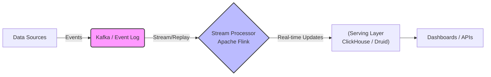

Được đề xuất bởi Jay Kreps (nhà sáng lập Apache Kafka) vào năm 2014, **Kappa Architecture** sinh ra để xóa sổ tầng Batch rườm rà của Lambda Architecture. Tuyên ngôn của nó rất đơn giản: **Mọi thứ đều là một luồng (Everything is a Stream)**. Dữ liệu lịch sử (Historical data) chỉ là một luồng sự kiện đã xảy ra trong quá khứ, vậy tại sao phải duy trì hai hệ thống code khác biệt (Hadoop cho Batch, Flink/Storm cho Stream)?

Tuy nhiên, đằng sau sự đơn giản về mặt khái niệm là những thách thức kỹ thuật khủng khiếp về State Management, Data Retention, và FinOps mà các Staff Data Engineer phải đối mặt khi hiện thực hóa.

## 1. Physical Execution: Các Thành Phần Cốt Lõi

Khác với Lambda, Kappa nén mọi logic xử lý vào một luồng duy nhất. Hệ thống lưu trữ sự kiện (Event Storage) như Kafka/Pulsar trở thành **Nguồn Chân Lý (Single Source of Truth - SSOT)** vĩnh viễn (Immutable Log).



### Immutable Log & Vấn Đề Lưu Trữ (FinOps)
Mô hình Kappa yêu cầu giữ lại **tất cả** dữ liệu lịch sử để có thể "Reprocess" (chạy lại) bất cứ khi nào cần. Nhưng lưu trữ dữ liệu vĩnh viễn trên Kafka (vốn dùng ổ cứng EBS tốc độ cao) là hành động "đốt tiền".
- **Giải pháp thực tế (KIP-405 Tiered Storage):** Hiện nay, Kafka hỗ trợ Tiered Storage. Dữ liệu mới/nóng lưu trên ổ Local SSD/EBS để phục vụ real-time với độ trễ mili-giây. Dữ liệu cũ (ví dụ: > 7 ngày) được tự động offload xuống Amazon S3 / GCS với chi phí rẻ hơn hàng chục lần.

## 2. Reprocessing: Khởi Tạo Lại Lịch Sử (The Hard Way)

Điểm ăn tiền của Kappa là cách xử lý khi bạn cần đổi logic code (ví dụ: phát hiện một bug tính toán sai từ 1 năm trước).

Quy trình Reprocessing (Replay):
1. Khởi tạo một job Flink mới (Version B) chứa code đã fix bug.
2. Trỏ Flink job này đọc dữ liệu từ Kafka tại vị trí `offset = earliest` (hoặc một timestamp nhất định).
3. Ghi kết quả tính toán vào một bảng mới (Table B) trên Serving Layer.
4. Job này sẽ chạy bứt tốc (burst) để "bắt kịp" (catch-up) với hiện tại.
5. Khi đã đồng bộ (Lag = 0), đổi routing ứng dụng sang Table B và khai tử Table A (Version A).

```sql
-- Ví dụ: Flink SQL config để đọc từ đầu cho Reprocessing
CREATE TABLE raw_events (
  user_id STRING,
  event_time TIMESTAMP(3),
  WATERMARK FOR event_time AS event_time - INTERVAL '5' SECOND
) WITH (
  'connector' = 'kafka',
  'topic' = 'clickstream',
  'properties.bootstrap.servers' = 'broker:9092',
  'scan.startup.mode' = 'earliest-offset' -- Bắt buộc cho Reprocessing
);
```

### Systemic Trade-off: Reprocessing Speed vs Compute Resources
Khi chạy lại luồng dữ liệu của 3 năm (vài Petabytes), Flink job sẽ cố kéo dữ liệu nhanh nhất có thể. Điều này dẫn đến **Network Spikes** và CPU throttling cho toàn bộ Kafka cluster, ảnh hưởng trực tiếp đến các real-time consumers khác.
- **Tuning:** Cần cấu hình Rate Limiting hoặc cô lập tài nguyên cho các Catch-up Jobs để tránh ddos chính hệ thống của mình.

## 3. Operational Risks: State Management & OOM

Đây là tử huyệt của kiến trúc Kappa. Stream Processing (đặc biệt là các phép Join hoặc Long-Window Aggregation) yêu cầu duy trì **State** (Trạng thái).

Ví dụ: Bạn cần tính tổng doanh thu của User trong 30 ngày. Hệ thống phải giữ lại thông tin (State) của User đó trong RAM suốt 30 ngày.
- Khi Replay lịch sử, State này phình to cực nhanh. Nếu dùng RAM (`HashMapStateBackend`), Job Manager / Task Manager sẽ ngay lập tức dính **Out Of Memory (OOM)** và sập.
- **Fix:** Phải cấu hình Flink sử dụng **RocksDB State Backend**. RocksDB ghi state xuống ổ đĩa cục bộ (Local Disk) dưới dạng SSTables và chỉ cache lên RAM, sau đó checkpoint định kỳ ra S3. Tuyệt đối không dùng RAM thuần túy cho Kappa.

```yaml
# flink-conf.yaml cho Production Kappa
state.backend: rocksdb
state.backend.incremental: true # Bắt buộc để checkpoint nhanh
state.checkpoints.dir: s3://my-bucket/flink-checkpoints/
```

## 4. Late Events & Watermarks (Sự Kiện Đến Trễ)

Ở môi trường Batch, do dữ liệu đã tĩnh (bounded), bạn chỉ việc count. Ở môi trường Stream, mạng di động có thể mất sóng, một event sinh ra lúc 8:00 AM nhưng 12:00 PM mới chui vào Kafka. Hệ thống xử lý thế nào?

Kappa giải quyết bằng **Watermarks** (Mốc nước thời gian logic). Watermark là một threshold nói với hệ thống rằng: "Tôi tin là không còn sự kiện nào cũ hơn thời điểm X nữa, hãy đóng Window và tính toán đi". 

*Trade-off cốt lõi:* 
- Nếu set Watermark quá ngắn (VD: trễ 1 phút): Hệ thống chạy nhanh (Low Latency), nhưng bỏ lỡ dữ liệu trễ -> **Độ chính xác thấp (Data Loss)**.
- Nếu set Watermark quá dài (VD: trễ 1 tiếng): Dữ liệu chính xác tuyệt đối, nhưng kết quả bị delay 1 tiếng -> **Mất đi tính Real-time**.

Kiến trúc Kappa buộc bạn phải thiết kế cơ chế Allowed Lateness, chấp nhận việc cập nhật lại bản ghi trong Serving Layer (như ClickHouse ReplacingMergeTree) khi có sự kiện trễ.

## 5. Kappa vs Lambda: Tóm Gọn Dưới Góc Nhìn Staff

1. **Lambda an toàn nhưng đắt đỏ:** Việc duy trì 2 codebase song song (Spark cho Batch, Flink/Kafka Streams cho Stream) tạo ra nợ kỹ thuật (Tech Debt) lớn. Việc hợp nhất (merge) kết quả tại Serving Layer luôn tiềm ẩn nguy cơ "double counting" (đếm trùng) ở ranh giới giao thoa.
2. **Kappa tinh gọn nhưng phức tạp về hạ tầng:** Một codebase duy nhất, dễ CI/CD. Tuy nhiên, nó đẩy mọi gánh nặng khó nhất của khoa học máy tính phân tán (State Management, Time skew, Checkpointing) về phía Stream Processor.

Với sự tiến bộ của Apache Flink và sự ra đời của các chuẩn Iceberg/Delta Lake, Streaming đang dần lấn át Batch. Kappa (hoặc các biến thể Lakehouse streaming) đang là thiết kế chuẩn mực (defacto) cho thập kỷ tới.

## Nguồn Tham Khảo (References)

* [Questioning the Lambda Architecture - Jay Kreps](https://www.oreilly.com/radar/questioning-the-lambda-architecture/)
* [Apache Flink State Backends (RocksDB)](https://nightlies.apache.org/flink/flink-docs-stable/docs/ops/state/state_backends/)
* [KIP-405: Kafka Tiered Storage](https://cwiki.apache.org/confluence/display/KAFKA/KIP-405%3A+Kafka+Tiered+Storage)
* [Streaming Systems: The What, Where, When, and How of Large-Scale Data Processing - Tyler Akidau](https://www.oreilly.com/library/view/streaming-systems/9781491983867/)
