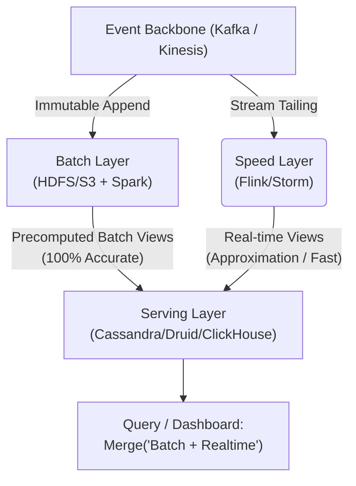

Vào đầu những năm 2010, giới Data Engineering bế tắc với một bài toán kinh điển: Các hệ thống Big Data (như Hadoop) tính toán rất chính xác nhưng quá chậm (Độ trễ tính bằng giờ), trong khi các hệ thống Real-time (như Storm) lại chạy cực nhanh nhưng thường xuyên tính sai hoặc rớt dữ liệu.

Kiến trúc **Lambda (Lambda Architecture)**, ra đời từ bộ não của Nathan Marz, là một thiết kế "dùng sức mạnh cơ bắp để giải quyết vấn đề". Nó tách hệ thống thành 2 luồng độc lập, chấp nhận sự phức tạp cực độ trong vận hành để lấy lại được cả hai tiêu chí: **Độ trễ thấp (Low Latency)** và **Độ chính xác tuyệt đối (High Accuracy)**. 

Tuy nhiên, ngày nay, Lambda đang dần nhường chỗ cho **Kappa Architecture** nhờ sự trưởng thành của Stateful Streaming. Dưới góc nhìn của một Staff Engineer, chúng ta sẽ mổ xẻ những đánh đổi (Trade-offs) đằng sau hai kiến trúc này.

---

## 1. Lambda Architecture: Thiết Kế Hai Ngả Đường

Lambda xử lý cùng một luồng sự kiện (Event Stream) đi qua hai con đường hoàn toàn song song.



### 1.1. Batch Layer (Tầng Chân Lý)
- **Nhiệm vụ:** Lưu trữ toàn bộ dữ liệu lịch sử (Master Dataset) ở dạng Append-only (Bất biến - Immutable). Định kỳ (ví dụ mỗi đêm lúc 00:00), hệ thống chạy các Heavy Jobs (như Spark) quét lại toàn bộ dữ liệu để tính ra các Batch Views chuẩn xác tuyệt đối.
- **Bản chất vật lý:** Sequential Disk I/O. Tối ưu cho Throughput cực lớn bất chấp Latency. Nếu có lỗi nghiệp vụ? Đơn giản là xóa View cũ, sửa code và chạy lại (Reprocessing) toàn bộ dữ liệu gốc từ S3.

### 1.2. Speed Layer (Tầng Tốc Độ)
- **Nhiệm vụ:** Chỉ xử lý phần dữ liệu mới nhất mà Batch Layer *chưa kịp tính*. Cung cấp Real-time Views ngay lập tức.
- **Bản chất vật lý:** In-memory computation. Để đạt tốc độ cao, nó thường sử dụng các thuật toán xấp xỉ (Approximation) như HyperLogLog, Bloom Filters, và có thể hy sinh một chút tính chính xác (ví dụ rớt message nếu cấu hình At-Most-Once).

### 1.3. Serving Layer (Tầng Hợp Nhất)
Đây là Database tốc độ cao (như Druid, Cassandra) nhận kết quả từ cả hai tầng trên. Khi người dùng query dashboard, Serving Layer sẽ gộp (Merge) dữ liệu của Batch View và Real-time View lại với nhau.

---

## 2. Nỗi Đau Vận Hành Của Lambda (Operational Tech Debt)

Trên lý thuyết, Lambda rất hoàn hảo. Trên thực tế, nó là một cơn ác mộng bảo trì.

### 2.1. Lỗi đếm trùng (Double Counting) và Cut-off Logic
Làm sao để Serving Layer gộp Batch View và Real-time View mà không bị đếm trùng (Double Counting)? 
Giả sử Batch job mất 3 tiếng (từ 00:00 đến 03:00) để tính xong dữ liệu của ngày hôm qua (đến 23:59:59). Trong 3 tiếng đó, Speed Layer vẫn đang liên tục nhồi dữ liệu mới vào bảng Real-time.
- **Giải pháp:** Phải áp dụng cơ chế **Cut-off Timestamp**. Khi Serving Layer nhận được Batch View mới, nó phải chủ động drop (hoặc filter) toàn bộ kết quả của Speed Layer nằm trong khoảng thời gian mà Batch View đã phủ.

**Mô phỏng SQL Logical Merge tại Serving Layer:**
```sql
-- Dữ liệu hiển thị = Batch (Chuẩn xác) + Realtime (Phần mới nhất mà Batch chưa tính)
SELECT 
    user_id, 
    SUM(clicks) as total_clicks
FROM (
    SELECT user_id, clicks FROM batch_views
    UNION ALL
    -- Chỉ lấy realtime từ thời điểm Batch kết thúc để tránh Double Counting
    SELECT user_id, clicks FROM realtime_views 
    WHERE event_time > (SELECT MAX(event_time) FROM batch_views)
)
GROUP BY user_id;
```
*Hệ quả:* Câu query rất nặng, tốn CPU, và nếu đồng hồ hệ thống (Clock drift) lệch nhau, dữ liệu sẽ bị sai.

### 2.2. Semantic Drift (Trôi dạt ngữ nghĩa) & Duy trì hai Codebase
Để tính ra cùng một chỉ số (ví dụ: `active_users_15m`), Data Engineer phải viết mã nguồn bằng hai framework khác biệt (Ví dụ: Spark SQL cho Batch, và Flink DataStream Java cho Speed Layer).
Khi Logic Business thay đổi, bạn phải update code ở cả 2 nơi. Việc đảm bảo ý nghĩa tính toán (Semantics) y hệt nhau giữa 2 engine là cực kỳ khó (đặc biệt khi dính đến xử lý Timezone, Null handling, hay Type casting). Lỗi xảy ra liên tục khi Batch ra kết quả A nhưng Real-time lại ra kết quả B.

---

## 3. Kappa Architecture: Sự Trưởng Thành Của Streaming

Đến năm 2014, Jay Kreps (Cha đẻ của Kafka) đề xuất **Kappa Architecture**. Ý tưởng rất đơn giản: **Tại sao không biến tất cả thành Stream?**

### 3.1. Triết lý Streaming-First
Kappa loại bỏ hoàn toàn Batch Layer. Tất cả dữ liệu (dù là Real-time hay Historical) đều được xử lý qua một Stream Engine duy nhất (như Apache Flink).
- Nền tảng của Kappa là một Event Log lưu trữ vĩnh viễn (Infinite Retention) như Apache Kafka.
- Khi cần Reprocessing (tính toán lại lịch sử do có bug), bạn chỉ cần bật một Stream Job mới, trỏ offset của Kafka về con số 0 (hoặc vài năm trước), và cho nó "replay" toàn bộ dữ liệu ở tốc độ cao nhất (Catch-up mode), sau đó chuyển hướng traffic sang View mới.

### 3.2. Điều kiện tiên quyết: Stateful Streaming & Exactly-Once
Kappa chỉ khả thi khi công nghệ Stream Engine trưởng thành. Ngày nay, Apache Flink cung cấp cơ chế **Exactly-once Processing** vô cùng mạnh mẽ thông qua thuật toán Distributed Checkpointing (Chandy-Lamport). Dữ liệu truyền qua Stream không còn bị sai, đếm trùng, hay rớt mạng nữa. Ta không cần một "Batch Layer" để vá lỗi cho Stream nữa.

### 3.3. Đánh Đổi (Trade-offs) Của Kappa
*   **Operational Vigilance (Giám sát vận hành 24/7):** Hạ tầng Streaming luôn bật (Always-on). Bạn phải quản lý Kafka Brokers, Zookeeper/KRaft, Flink TaskManagers, RocksDB State Backend. Nếu một job Flink bị OOMKilled, bạn phải can thiệp ngay trong đêm, thay vì "cứ để mai chạy lại" như Batch.
*   **Backfill khổng lồ:** Chạy replay 5 năm dữ liệu từ Kafka qua Flink rất tốn kém tài nguyên và không tối ưu (Sequential disk scan) bằng việc dùng Spark đọc Parquet/Iceberg trên S3.

---

## 4. Kỷ Nguyên Mới: Lakehouse & Unified Engines

Ngày nay, ranh giới giữa Lambda và Kappa đang bị xóa nhòa bởi các công nghệ hiện đại:
1. **Unified APIs (Apache Beam / Spark Structured Streaming):** Cho phép bạn viết code đúng 1 lần (Write once), sau đó deploy nó dưới dạng Stream chạy 24/7 hoặc Batch chạy mỗi đêm. Giải quyết triệt để lỗi Semantic Drift.
2. **Table Formats (Apache Iceberg / Hudi):** Cho phép Update/Delete và ACID transactions ngay trên Data Lake (S3/GCS). Bạn có thể đẩy Event Stream thẳng vào Data Lake với độ trễ 1 phút, và dùng Spark/Trino đọc liên tục giống hệt như một Database.

> **Takeaway cho Staff Engineer:** Không bao giờ mặc định chọn "Real-time" chỉ vì nó nghe ngầu. Sự phức tạp của hệ thống Streaming [Kafka/Flink] cao hơn Batch hàng chục lần. Hãy tính toán ROI (Return on Investment): Nếu Business không thể ra quyết định hành động trong vòng 5 giây, đừng tốn tiền xây hệ thống độ trễ 1 giây.

## Nguồn Tham Khảo (References)
* [Questioning the Lambda Architecture - Jay Kreps][https://www.oreilly.com/radar/questioning-the-lambda-architecture/]
* [Big Data: Principles and best practices of scalable realtime data systems - Nathan Marz][https://www.manning.com/books/big-data]
* [Designing Data-Intensive Applications - Martin Kleppmann (Part 2: Distributed Data]](https://dataintensive.net/)
