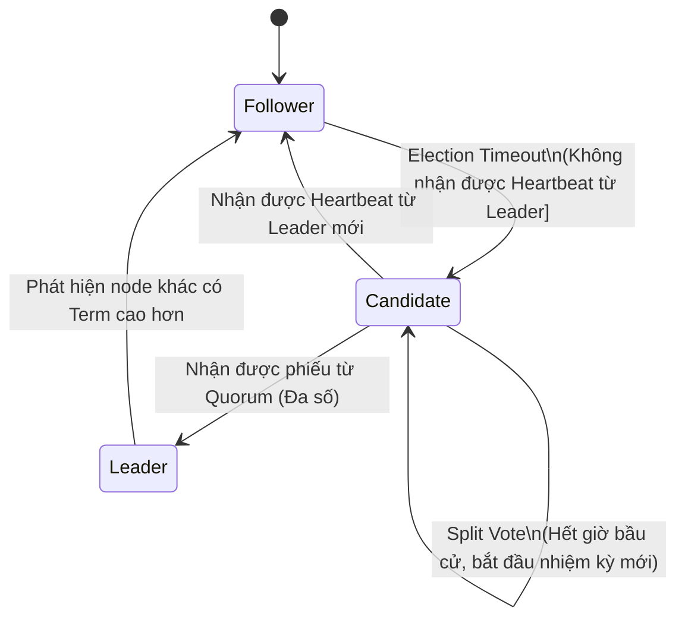
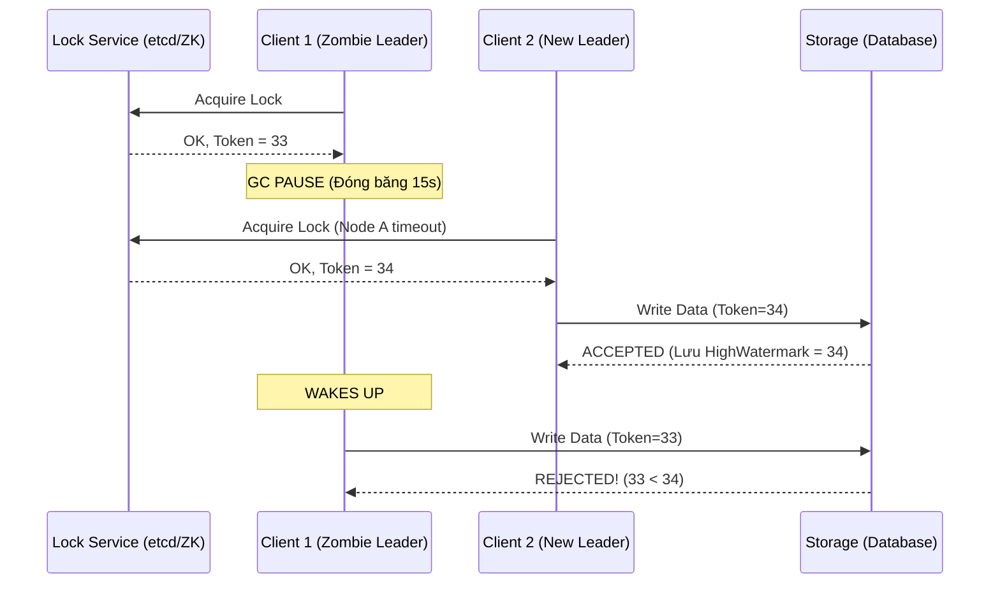

Trong các hệ thống phân tán quy mô lớn, khi hàng chục node (máy chủ) cùng chia sẻ chung một tài nguyên (ví dụ: cùng ghi vào một thư mục trên HDFS, hoặc cùng đóng vai trò Controller phân bổ tác vụ cho Worker), hệ thống sẽ nhanh chóng rơi vào hỗn loạn. Cơ chế **Leader Election (Bầu Cử Thủ Lĩnh)** ra đời để đảm bảo tại một thời điểm, chỉ duy nhất **một node** (Leader / Master) có quyền ra quyết định, các node còn lại (Followers / Standby) sẽ phục tùng và đồng bộ trạng thái.

Tuy nhiên, dưới góc độ của một Staff Engineer, bầu cử không đơn giản là gọi API `SETNX` (Set if Not eXists) vào Redis. Bầu chọn Leader thực chất là bài toán cốt lõi về **Consensus (Sự đồng thuận)**, liên quan mật thiết đến việc dung hòa tính đúng đắn của dữ liệu (Safety) và tính sẵn sàng của hệ thống (Liveness) trong một môi trường mạng đầy bất trắc.

---

## 1. Physical Execution: Thuật Toán Raft & Quorum

Các hệ thống cơ sở hạ tầng chuẩn mực hiện nay (Kubernetes dùng `etcd`, Kafka mới dùng `KRaft`, HashiCorp Consul) đều dựa trên các thuật toán đồng thuận như **Raft**, trong khi Hadoop/HBase/Kafka cũ dựa trên **ZooKeeper (ZAB Protocol)**.

### Quorum (Đa số) là nguyên tắc cốt lõi
Để trở thành Leader hợp pháp, một node phải thu thập được phiếu bầu từ một **Quorum (Đa số)**. Công thức tính Quorum luôn là: $\lfloor \frac{"N"}{2} \rfloor + 1$. 

-   Với cụm 3 nodes, Quorum = 2. Cụm chịu được tối đa 1 node chết.
-   Với cụm 5 nodes, Quorum = 3. Cụm chịu được tối đa 2 node chết.
-   *Systemic Trade-off:* Không bao giờ triển khai cụm với số lượng node **chẵn** [VD: 4 nodes]. Tại sao? Để đạt Quorum của 4 nodes, bạn cần 3 phiếu. Điều này có nghĩa là cụm 4 nodes cũng chỉ chịu được 1 node chết (giống hệt cụm 3 nodes) nhưng bạn lại tốn chi phí server cao hơn. Hơn nữa, số chẵn cực kỳ dễ dẫn đến **Split Vote** (Ví dụ: 2 node cùng nhận được 2 phiếu), gây bế tắc trong việc bầu chọn.

### Vòng đời Bầu cử của Raft (State Machine)



Trong Raft, mọi thứ được quản lý bằng **Term** (Nhiệm kỳ - một số nguyên đơn điệu tăng). Bất kỳ thông điệp nào từ một node có Term cũ hơn sẽ bị hệ thống thẳng thừng từ chối.

---

## 2. Operational Risks & Những Thảm Họa (Incidents) Thực Tế

Nhiều hệ thống tự chế (Home-grown) của các công ty Startup thường sử dụng Redis (Redlock) hoặc Database Relational để tự code cơ chế Leader Election. Kết cục thường là thảm họa khi chúng đụng độ phải các "kẻ thù vật lý" của hệ thống phân tán.

### Kẻ thù số 1: Network Partitions gây ra Split-Brain
Hãy tưởng tượng một cụm 5 nodes bị đứt cáp hoặc lỗi Switch, chia cụm thành 2 phe (Phe A có 2 nodes, Phe B có 3 nodes).
1.  Phe A (Giả sử Leader cũ nằm ở đây): Bị cắt mạng, không liên lạc được Phe B. Nó không còn nắm giữ Quorum -> Leader cũ bắt buộc phải tự động từ chức (Stepping down) trở thành Follower.
2.  Phe B (Chứa 3 nodes): Thấy Leader cũ mất tích, lập tức bầu ra Leader mới (Vì 3 nodes đủ đạt Quorum). Hệ thống vẫn sống sót an toàn.

Nếu bạn tự code Leader Election mà *không sử dụng luật Quorum* (ví dụ dùng cấu hình Active-Active lỏng lẻo ping lẫn nhau), cả 2 phe A và B sẽ đều tưởng đối phương đã chết, và tự xưng là Leader. Tình trạng này gọi là **Split-Brain (Phân mảnh não)**. Cả 2 Leader cùng ghi dữ liệu độc lập xuống Storage, phá nát tính toàn vẹn (Data Corruption). Vụ sập mạng lịch sử của GitHub năm 2012 cũng bắt nguồn một phần từ cấu hình Split-Brain trong MySQL HA.

### Kẻ thù số 2: Stop-The-World GC Pauses (Tạm dừng gom rác)
Martin Kleppmann đã chỉ ra một lỗ hổng chí mạng: Đồng hồ thời gian (Wall-clock) trong hệ thống phân tán là một lời nói dối. 

Hãy tưởng tượng Node A đang làm Leader hợp pháp. Đột nhiên, một đợt dọn rác bộ nhớ (Stop-the-world GC Pause) của Java/Go xảy ra, đóng băng *toàn bộ* tiến trình của Node A (kể cả các thread mạng) trong 15 giây.
1.  Node B và C không nhận được Heartbeat từ A -> Tưởng A đã chết -> Bầu B lên làm Leader mới. Node B bắt đầu xử lý ghi dữ liệu.
2.  GC Pause kết thúc, Node A "tỉnh lại". Đối với Node A, hệ điều hành không cho nó biết 15 giây đã trôi qua. Nó vẫn đinh ninh mình là Leader và cố gắng đẩy nốt tệp dữ liệu cũ xuống Storage (Database/S3).
3.  Hậu quả: Dữ liệu của Node A ghi đè lên dữ liệu mới của Node B, hệ thống bị hỏng hóc nghiêm trọng một cách thầm lặng (Silent Corruption).

---

## 3. The Ultimate Fix: Fencing Tokens (Hàng Rào Bảo Vệ)

Leader Election bằng ZooKeeper hay etcd chỉ bảo vệ việc "Ai là Leader", nhưng nó không thể ngăn cản một "Zombie Leader" (Node A sau khi tỉnh dậy từ GC Pause) gửi Request thẳng tới hệ thống Storage. Để giải quyết triệt để, tầng Storage/Database phải tham gia vào việc bảo vệ tính đúng đắn. Giải pháp tiêu chuẩn ngành là **Fencing Tokens**.

Cơ chế hoạt động của Fencing Tokens:
1.  Mỗi khi bầu Leader mới, hệ thống điều phối (ZooKeeper) cấp một mã Token (ví dụ: `zxid` - một số nguyên đơn điệu tăng).
    -   Node A làm Leader: Token = 33
    -   Node B được bầu làm Leader mới: Token = 34
2.  Bất kỳ lệnh Ghi (Write) nào của Leader gửi xuống Storage đều **bắt buộc** đính kèm Token này.
3.  Tầng Storage (DB) ghi nhớ Token cao nhất mà nó từng phục vụ. Khi Node A tỉnh dậy từ GC Pause, nó cố ghi dữ liệu với `Token=33`. Storage phát hiện ra nó đã phục vụ `Token=34` trước đó, lập tức **Từ chối (Reject)** giao dịch của Node A với lỗi `StaleTokenException`.

### Kiến trúc Fencing Tokens



### Thực chiến: Triển khai Fencing tại Database

Bên dưới là cách dùng SQL để hiện thực hóa Fencing Token trong bất kỳ Relational Database nào (như PostgreSQL):

```sql
-- Cấu trúc bảng có cột current_token để lưu High Watermark
CREATE TABLE cluster_config (
    id INT PRIMARY KEY,
    config_data JSONB,
    current_token BIGINT
);

-- Khi Leader muốn update dữ liệu, nó bắt buộc phải thỏa mãn điều kiện Fencing
UPDATE cluster_config 
SET 
    config_data = '{"state": "running"}', 
    current_token = 34
WHERE 
    id = 1 
    -- FENCING CONDITION:
    -- Chỉ cho phép ghi nếu Token cung cấp (34) >= Token hiện tại trong DB
    AND current_token <= 34;

-- Nếu Token của Zombie Leader là 33, điều kiện (current_token <= 33) sẽ False
-- Do current_token trong DB đã bị Leader mới set thành 34.
-- Kết quả: 0 rows affected. Code của application check số row affected = 0 sẽ throw Exception.
```

---

## 4. Tuning Leader Election trong Thực tế

Trong thực tế vận hành Kubernetes (`etcd`) hoặc Kafka (`ZooKeeper`), việc tinh chỉnh các thông số Election Timeout là bài toán đánh đổi giữa **Độ trễ phục hồi (Failover Time)** và **Tính ổn định của Cụm (Cluster Stability)**:

-   **Timeout quá thấp:** Hệ thống phản ứng lẹ (Fast Failover). Tuy nhiên, mạng chỉ cần chập chờn (Network Blip) vài chục mili-giây, hoặc Server chạy CPU spike nhẹ làm rớt Heartbeat, hệ thống sẽ đòi bầu lại Leader. Việc này lặp đi lặp lại gây ra hiện tượng **Flapping** làm sập toàn bộ Cụm.
-   **Timeout quá cao:** Hạn chế Flapping, nhưng khi Leader sập (Cúp điện thật), hệ thống bị đóng băng (Downtime) quá lâu để chờ thời gian Timeout kết thúc trước khi bầu chọn Leader mới.

```bash
# etcd.conf - Cấu hình mẫu cho mạng cloud nội bộ có độ trễ ping < 1ms
# Thời gian gửi Heartbeat: 100ms
ETCD_HEARTBEAT_INTERVAL=100

# Election timeout thường được cấu hình bằng 10 lần Heartbeat interval
# 1000ms = 1 giây là một con số an toàn để tránh Flapping do Network Blip
ETCD_ELECTION_TIMEOUT=1000
```

## Tổng Kết

Bầu chọn Leader trong hệ thống phân tán là một chiến trường khắc nghiệt, nơi các định lý vật lý và mạng máy tính bộc lộ rõ sự bất toàn. Hiểu rõ Raft/ZooKeeper giúp chúng ta không phát minh lại bánh xe bằng các giải pháp vá víu. Việc áp dụng bắt buộc **Fencing Tokens** ở tầng Storage chính là ranh giới phân biệt giữa một hệ thống "có vẻ chạy được" và một hệ thống chuẩn Enterprise [Data Integrity Guaranteed].

---

## Nguồn Tham Khảo (References)

* [Designing Data-Intensive Applications - Martin Kleppmann (Chapter 8 & 9]][https://dataintensive.net/]
* [In Search of an Understandable Consensus Algorithm (Raft Paper]][https://raft.github.io/raft.pdf]
* [How to do distributed locking - Martin Kleppmann (Phân tích lỗi của thuật toán Redlock]][https://martin.kleppmann.com/2016/02/08/how-to-do-distributed-locking.html]
* [KIP-500: Replace ZooKeeper with a Self-Managed Metadata Quorum (KRaft]](https://cwiki.apache.org/confluence/display/KAFKA/KIP-500%3A+Replace+ZooKeeper+with+a+Self-Managed+Metadata+Quorum)
