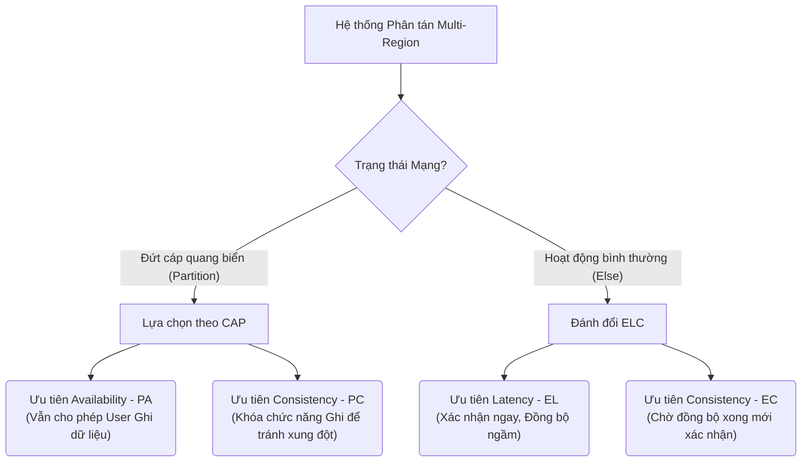

Nếu định lý CAP (Consistency - Availability - Partition Tolerance) là bài học vỡ lòng của System Design, thì PACELC chính là thứ phân loại giữa một Kỹ sư bậc trung (Mid-level) và một Kỹ sư nòng cốt (Staff/Principal Engineer). 

Định lý PACELC, được Daniel Abadi giới thiệu vào năm 2010, giải quyết một lỗ hổng thực tiễn chết người của định lý CAP: Hệ thống phân tán không chỉ phải đưa ra lựa chọn khó khăn khi mạng bị đứt (Partition), mà ngay cả trong điều kiện mạng hoạt động hoàn hảo **(Else - E)**, Kỹ sư vẫn phải liên tục đưa ra quyết định đánh đổi giữa **Độ trễ (Latency - L)** và **Tính nhất quán (Consistency - C)**.

Đối với Data Engineer xây dựng các hệ thống Data Platform đa vùng (Multi-region), PACELC là kim chỉ nam để thiết kế kiến trúc, định cấu hình *Quorum*, và xử lý *Replication Lag*.

---

## 1. Khám phá Giới hạn Vật lý: Vượt ranh giới của CAP

Định lý CAP thường gây ra một hiểu lầm cực kỳ phổ biến trong các buổi phỏng vấn: *"Trong điều kiện bình thường không có lỗi mạng, chúng ta có thể đạt được cả Consistency và Availability"*. 

Tuy nhiên, PACELC chỉ ra rằng Vật lý học có giới hạn. Tốc độ ánh sáng (Speed of Light) không cho phép dữ liệu truyền đi ngay lập tức (Instantaneous) giữa các Datacenter cách nhau hàng ngàn kilomet.

* **P** (Partition) -> **A**vailability or **C**onsistency (Đây chính là CAP)
* **E** (Else) -> **L**atency or **C**onsistency (Đây là phần mở rộng)



---

## 2. Systemic Trade-offs: Latency vs Consistency (EL vs EC)

Khi mạng hoàn toàn khỏe mạnh (E), mọi thao tác Ghi/Đọc (Write/Read) đều đụng phải bài toán đồng bộ dữ liệu (Data Replication). 

### 2.1. EC (Else + Consistency): Synchronous Replication
Mọi thay đổi dữ liệu phải được xác nhận (Acknowledge - Ack) bởi đa số (Quorum) hoặc toàn bộ các Node trong Cluster trước khi trả kết quả HTTP 200 về cho client. 

* **Kiến trúc áp dụng**: Google Spanner, CockroachDB, YugabyteDB.
* **Trade-off (Đánh đổi)**: Hệ thống bị phụ thuộc vào *Tail Latency* (Độ trễ đuôi) của Node chậm nhất. Nếu Node ở Mỹ (US-East-1) cần đồng bộ sang Châu Âu (EU-West-1) mất 90ms, thì End-user phải đợi >90ms cho một cú click chuột đơn giản.
* **Troubleshooting (Xử lý sự cố)**: Dễ gặp hiện tượng *Micro-outages*. Một Node ở Châu Âu bị chậm I/O ổ cứng sẽ làm tắc nghẽn toàn bộ Cluster. Các Thread Pool trên Node Mỹ cạn kiệt vì bị Blocked (Treo) để chờ Ack từ Châu Âu. Kỹ sư phải liên tục theo dõi metric `P99 Latency`.

### 2.2. EL (Else + Latency): Asynchronous Replication
Hệ thống lưu thay đổi ở Node tiếp nhận đầu tiên và trả kết quả thành công cho User ngay lập tức. Việc lan truyền dữ liệu (Gossip protocol, Replication log) sang các Node khác diễn ra âm thầm ở background.

* **Kiến trúc áp dụng**: Amazon DynamoDB, Apache Cassandra, ScyllaDB.
* **Trade-off (Đánh đổi)**: Mở ra **Cửa sổ bất nhất quán (Inconsistency Window)**. Xảy ra hiện tượng *Stale Read* (đọc dữ liệu cũ) hoặc *Dirty Read*. Người dùng vừa đổi Avatar xong, F5 lại web thì thấy Avatar cũ.
* **Troubleshooting (Xử lý sự cố)**: Cần thiết lập Monitor chặt chẽ trên metric `Replication Lag`. Nếu lag tăng vọt (ví dụ do CPU bị Throttled ở Follower node), nguy cơ mất dữ liệu vĩnh viễn (Data Loss) rất cao nếu Leader node bị crash và bốc cháy (Phá hủy ổ cứng) trước khi kịp gửi dữ liệu ngầm.

---

## 3. Thực chiến với Tunable Consistency (Quorum)

Các cơ sở dữ liệu NoSQL hiện đại (như Cassandra, ScyllaDB) không "hardcode" cứng một mô hình PACELC cho toàn hệ thống. Thay vào đó, chúng cung cấp **Tunable Consistency** (Tùy chỉnh tính nhất quán) trên *từng câu query*.

Đây là công thức cấu hình Quorum kinh điển mà mọi Data Engineer phải thuộc lòng:
`R (Read Quorum) + W (Write Quorum) > N (Replication Factor)` -> Sẽ đạt được **Strong Consistency (Tương đương EC)**.

Dưới đây là ví dụ thực tế sử dụng ngôn ngữ Apache Cassandra CQL, điều chỉnh Consistency Level để chuyển đổi linh hoạt giữa EL và EC tùy theo Business Logic.

```sql
-- Thiết lập Keyspace (Database) với Replication Factor = 3 
-- Triển khai phân tán trên 3 Data Centers ở 3 Châu lục khác nhau
CREATE KEYSPACE global_users 
WITH replication = {'class': 'NetworkTopologyStrategy', 'us-east': 1, 'eu-west': 1, 'ap-south': 1};

-- ========================================================
-- Tình huống 1: User Like 1 bài viết (Kiến trúc PA/EL)
-- ========================================================
-- Business: Tốc độ (Latency) là vua. Đánh đổi: Có thể đọc ra dữ liệu chưa cập nhật kịp.
CONSISTENCY ONE; 
-- Chỉ cần 1 node gần nhất báo thành công là được. Không cần chờ 2 node ở châu lục khác.
UPDATE user_profiles SET like_count = like_count + 1 WHERE user_id = 'A123';
SELECT like_count FROM user_profiles WHERE user_id = 'A123';

-- ========================================================
-- Tình huống 2: Giao dịch Thanh toán tiền (Kiến trúc PC/EC)
-- ========================================================
-- Business: Sai một ly đi một dặm. Đánh đổi: End-user phải chờ màn hình xoay xoay 200ms.
CONSISTENCY ALL; 
-- BẮT BUỘC cả 3 node ở 3 châu lục phải ghi dữ liệu xong mới trả về cho App.
UPDATE user_balances SET balance = balance - 100 WHERE user_id = 'A123';

-- ========================================================
-- Tình huống 3: Lựa chọn Cân bằng - Quorum (Được khuyên dùng)
-- ========================================================
CONSISTENCY QUORUM; 
-- Cần quá bán (2/3) nodes xác nhận. Cân bằng giữa Latency và Consistency.
```

---

## 4. Operational Risks & Cơn ác mộng Production

Lựa chọn mô hình PACELC không phù hợp sẽ dẫn đến những sự cố "nhớ đời" lúc 3 giờ sáng.

### 🚨 Sự cố 1: Split-Brain trong mô hình PC/EC
Trong hệ thống Kafka hoặc Elasticsearch, khi mạng cáp quang biển giữa 2 Availability Zones bị giật cục (Flapping/Network Partition). Nhóm Node A không gọi được Nhóm Node B. Do cả 2 nhóm đều tưởng nhóm kia đã chết, chúng tự động bầu (Elect) Leader mới cho riêng mình. 
**Kết quả:** Hệ thống có 2 Leaders cùng lúc nhận Write Request (Hội chứng Split-Brain). Dữ liệu bị phân mảnh và xung đột thảm khốc.
**Khắc phục (Fix):** Áp dụng thuật toán đồng thuận (Raft/Paxos) bắt buộc số node trong Cluster phải là số lẻ (3, 5, 7) và yêu cầu `Quorum` (quá bán) chặt chẽ để bầu Leader. Khi đứt mạng, nhóm nào không đủ túc số (Quorum) sẽ tự động đóng băng Ghi (Chấp nhận hi sinh Availability -> Chuyển sang PC) để bảo vệ Tính nhất quán.

### 🚨 Sự cố 2: "Bóng ma" dữ liệu (Zombie Data) trong PA/EL
Với hệ thống PA/EL như Cassandra, khi bạn chạy lệnh `DELETE` một dòng dữ liệu, hệ thống không xóa ngay mà tạo ra một `Tombstone` (Bia mộ) đè lên dòng đó. 
Giả sử hệ thống đang cấu hình EL (Ghi ONE, Đọc ONE) và một Node số 3 đang bị tắt nguồn bảo trì lúc Tombstone được tạo. Node 3 đã bỏ lỡ sự kiện xóa này.
Tuần sau, khi Node 3 được bật lại, dòng dữ liệu cũ vẫn còn nằm rành rành trên ổ cứng của nó. Khi Node 3 đồng bộ (Gossip) với các Node khác, nó lan truyền dữ liệu này. Dữ liệu đáng lẽ đã xóa lại "đội mồ sống dậy" (Zombie data).
**Khắc phục (Fix):** Data Engineer phải tuning thông số `gc_grace_seconds` cẩn thận (Mặc định là 10 ngày). Bạn bắt buộc phải chạy lệnh dọn dẹp `nodetool repair` định kỳ hàng tuần để đảm bảo quá trình Eventual Consistency kịp hội tụ trước khi Bia mộ bị xóa vĩnh viễn.

---

## 5. Định hình lại Data Platform qua lăng kính PACELC

Một Data Architect không bao giờ chọn Database dựa trên "Hype" [Xu hướng], mà chọn theo ma trận PACELC:

| Hệ quản trị CSDL | Phân loại PACELC |" Kiến trúc Cốt lõi & Sự đánh đổi (Trade-offs) "|
|---|---|---|
| **Cassandra, DynamoDB** | `PA/EL` |" Token Ring architecture, Consistent Hashing. Sẵn sàng cho user Đọc/Ghi 24/7 mọi lúc mọi nơi (PA). Khi mạng bình thường, ghi cực nhanh (EL) nhưng chấp nhận *Eventual Consistency*. "|
| **HBase, Bigtable** | `PC/EC` |" Single-Leader chặt chẽ. Khi rớt mạng, hệ thống đóng băng (Unavailable) để đảm bảo không sai lệch (PC). Khi bình thường, độ trễ khá cao vì phải đồng bộ (EC). "|
|" **MongoDB (Default)** "| `PA/EC` |" Replica Set với cấu hình `w: majority`. Cố gắng EC khi bình thường, nhưng khi có lỗi mạng, Node rớt mạng có thể đọc ra Stale Data (nếu cho phép `readPreference=secondary`). "|
| **Google Spanner** | `PC/EC` |" Sử dụng đồng hồ nguyên tử (TrueTime API) và Paxos. Đạt được Linearizability siêu việt trên phạm vi toàn cầu nhưng phải đánh đổi bằng độ trễ mạng vật lý thực tế (Commit Wait Time). "|

---

## 6. Góc nhìn FinOps (Chi phí) & Multi-Region

Từ góc độ Tối ưu Chi phí Đám mây (FinOps), việc ép buộc hệ thống chạy EC (Else Consistency) trong mô hình Active-Active Multi-Region là **tự sát về tài chính**.

1. **Cross-Region Data Transfer Cost:** Phí truyền tải dữ liệu giữa các AWS Regions (VD: `us-east-1` sang `eu-central-1`) khoảng \$0.02/GB. Nếu hệ thống write-heavy (100,000 TPS) và bắt buộc đồng bộ Synchronous, hóa đơn mạng sẽ lên tới hàng triệu Đô-la.
2. **Compute Idle Time:** Các CPU threads bị Block (Treo) chỉ để chờ I/O qua mạng WAN. Hiệu suất tính toán (CPU Utilization) thực tế chưa tới 10%, nhưng bạn vẫn phải Scale-out (Mua thêm Server) để xử lý lượng Request ồ ạt đổ vào.

**💡 Khuyến nghị Kiến trúc (Best Practice):** 
Hãy sử dụng mô hình **CQRS (Command Query Responsibility Segregation)** kết hợp Event-driven. 
- Phía Ghi (Command) sử dụng EC tại một Region duy nhất (Single-Leader) để tránh Conflict và Split-brain. 
- Phía Đọc (Query) phân bổ các Read-Replicas ở nhiều Region toàn cầu thông qua cơ chế EL (Asynchronous Replication). Chấp nhận Replication Lag khoảng 1-2 giây để đổi lấy việc tiết kiệm 80% ngân sách hạ tầng và mang lại trải nghiệm (Latency) siêu mượt cho người dùng cuối.

---

## Nguồn Tham Khảo (References)

1. **Daniel Abadi (Original Blog):** [Problems with CAP, and Yahoo’s little known NoSQL system][http://dbmsmusings.blogspot.com/]
2. **SOSP 2007 Paper:** [Dynamo: Amazon's Highly Available Key-value Store][https://www.allthingsdistributed.com/] - Bài báo định hình toàn bộ tư duy về PA/EL.
3. **OSDI 2012 Paper:** [Spanner: Google’s Globally-Distributed Database][https://static.googleusercontent.com/] - Kỳ quan của kiến trúc PC/EC.
4. **Apache Cassandra Docs:** [Architecture and Tunable Consistency](https://cassandra.apache.org/doc/latest/cassandra/architecture/dynamo.html#tunable-consistency]
5. **Martin Kleppmann:** Sách *Designing Data-Intensive Applications* (O'Reilly).
