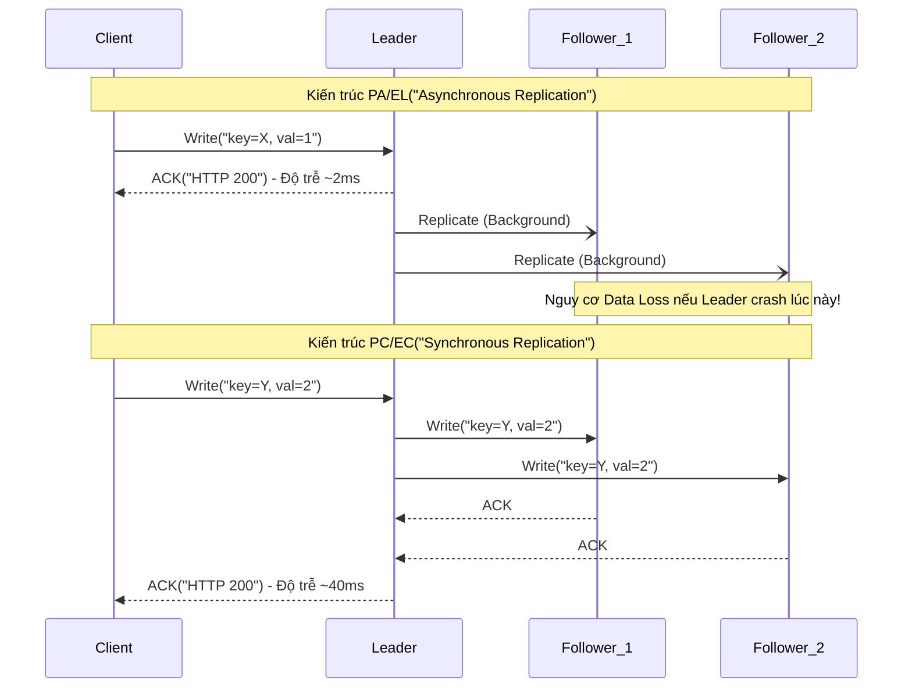

Định lý PACELC, được Daniel Abadi giới thiệu vào năm 2010, giải quyết một lỗ hổng thực tiễn của định lý CAP: Hệ thống phân tán không chỉ phải đưa ra lựa chọn khi xảy ra **Partition (P)**, mà ngay cả trong điều kiện mạng bình thường **(Else - E)**, kỹ sư vẫn phải liên tục đánh đổi giữa **Độ trễ (Latency - L)** và **Tính nhất quán (Consistency - C)**.

Đối với một Staff/Principal Engineer, PACELC không chỉ là lý thuyết học thuật, mà nó là bộ khung (framework) để thiết kế kiến trúc, định cấu hình *Quorum*, và xử lý *Replication Lag* trong các hệ thống Multi-region.

---

## 1. Physical Execution: Vượt ranh giới của CAP

CAP Theorem (nhấn mạnh vào **C**onsistency, **A**vailability, **P**artition tolerance) thường gây ra một hiểu lầm phổ biến: *“Trong điều kiện bình thường không có lỗi mạng, chúng ta có thể đạt được cả Consistency và Availability”*. 

Tuy nhiên, định lý PACELC chỉ ra rằng vật lý (Physical Execution) có giới hạn. Tốc độ ánh sáng không cho phép dữ liệu truyền đi ngay lập tức giữa các Datacenter cách nhau hàng ngàn kilomet.

* **P** (Partition) -> **A**vailability or **C**onsistency
* **E** (Else) -> **L**atency or **C**onsistency

```mermaid
flowchart TD
    A["Hệ thống Phân tán"] --> B{"Trạng thái Mạng?"}
    B -- Có sự cố (Partition) --> C["Lựa chọn theo CAP"]
    C --> D("Ưu tiên Availability - PA")
    C --> E("Ưu tiên Consistency - PC")
    B -- Hoạt động bình thường("Else") --> F["Đánh đổi ELC"]
    F --> G("Ưu tiên Latency - EL")
    F --> H("Ưu tiên Consistency - EC")
```

---

## 2. Systemic Trade-offs: Latency vs Consistency

Khi mạng hoàn toàn khỏe mạnh (E), mọi Write/Read request đều đụng phải bài toán đồng bộ dữ liệu (Replication). 

### EC (Else + Consistency): Synchronous Replication
Mọi thay đổi dữ liệu phải được xác nhận (Ack) bởi đa số (Quorum) hoặc toàn bộ các nodes trong Cluster trước khi trả kết quả về cho client. 

* **Kiến trúc áp dụng**: Google Spanner, CockroachDB, YugabyteDB.
* **Trade-off**: Bị phụ thuộc vào *Tail Latency* (Độ trễ đuôi) của node chậm nhất. Nếu node ở US-East-1 cần đồng bộ sang EU-West-1 (mất ~90ms), client phải đợi >90ms cho một thao tác ghi.
* **Troubleshooting**: Nguy cơ gặp hiện tượng *Micro-outages* do tắc nghẽn I/O tại các Replica nodes, khiến Thread Pool cạn kiệt vì bị block chờ Ack.

### EL (Else + Latency): Asynchronous Replication
Hệ thống lưu thay đổi ở Node tiếp nhận và trả kết quả thành công ngay lập tức. Việc lan truyền dữ liệu (Gossip protocol, replication log) diễn ra ở background.

* **Kiến trúc áp dụng**: DynamoDB, Cassandra, Aerospike.
* **Trade-off**: Cửa sổ bất nhất quán (Inconsistency Window). Xảy ra hiện tượng *Stale Read* (đọc dữ liệu cũ) hoặc *Dirty Read*. 
* **Troubleshooting**: Cần thiết lập Monitoring chặt chẽ trên metric `Replication Lag`. Nếu lag tăng vọt (ví dụ do CPU throttled ở Follower node), nguy cơ mất dữ liệu (Data Loss) rất cao nếu Leader node bị crash đột ngột.

---

## 3. Thực chiến với Tunable Consistency

Các CSDL NoSQL hiện đại không "hardcode" PACELC cho toàn hệ thống, mà cung cấp **Tunable Consistency** (Tùy chỉnh tính nhất quán) trên *từng câu query*.

Đây là công thức cấu hình Quorum kinh điển:
`R (Read Quorum) + W (Write Quorum) > N (Replication Factor)` -> **Strong Consistency (EC)**.

Dưới đây là một ví dụ thực tế sử dụng Apache Cassandra CQL cấu hình Consistency Level để chuyển đổi giữa EL và EC tùy theo business logic.

```sql
-- Thiết lập Keyspace với Replication Factor = 3 (Triển khai trên 3 Data Centers)
CREATE KEYSPACE user_profiles 
WITH replication = {'class': 'NetworkTopologyStrategy', 'us-east': 1, 'eu-west': 1, 'ap-south': 1};

-- Tình huống 1: Business yêu cầu Latency cực thấp (EL - Like tracking user clicks)
-- Đánh đổi: Có thể đọc ra dữ liệu cũ.
CONSISTENCY ONE;
UPDATE user_profiles SET click_count = click_count + 1 WHERE user_id = 'A123';
SELECT click_count FROM user_profiles WHERE user_id = 'A123';

-- Tình huống 2: Business liên quan đến Thanh toán (EC - Billing process)
-- Đánh đổi: Phải chờ Ack từ cả 3 regions (Độ trễ cao - High Latency)
CONSISTENCY ALL;
UPDATE user_balances SET balance = balance - 100 WHERE user_id = 'A123';

-- Tình huống 3: Lựa chọn cân bằng (Quorum)
CONSISTENCY QUORUM; -- Cần 2/3 nodes Ack
```

---

## 4. Operational Risks & Real-world Incidents

Lựa chọn mô hình PACELC không phù hợp sẽ dẫn đến những sự cố nghiêm trọng trên production.

### Sự cố 1: Split-Brain trong mô hình PC/EC
Trong hệ thống RabbitMQ (chạy mode Cluster rỗng) hoặc Elasticsearch cũ, khi mạng giữa 2 Availability Zones bị giật cục (Flapping), các nodes mất liên lạc và tự động bầu Leader mới. Kết quả là hệ thống có 2 Leaders (Split-brain). 
**Fix**: Phải áp dụng thuật toán đồng thuận (Raft/Paxos) với số node lẻ (3, 5, 7) và yêu cầu `Quorum` chặt chẽ, chấp nhận hi sinh Availability (Chuyển sang PC) để bảo toàn Consistency dữ liệu.

### Sự cố 2: "Bóng ma" dữ liệu (Stale Reads & Tombstones) trong PA/EL
Với Cassandra, khi thực hiện lệnh DELETE, hệ thống không xóa ngay mà tạo ra một `Tombstone` (bia mộ). Nếu hệ thống cấu hình EL (Read `ONE`, Write `ONE`) và một Node đang bị down khi Tombstone được tạo, Node đó sẽ bỏ lỡ sự kiện xóa.
Khi Node đó sống lại (Sau `gc_grace_seconds`), dữ liệu tưởng chừng đã xóa lại "đội mồ sống dậy" (Zombie data) và được replicate ngược lại toàn Cluster thông qua quá trình *Read Repair* hoặc *Anti-entropy repair*.
**Khắc phục**: Kỹ sư phải tuning thông số `gc_grace_seconds` cẩn thận và chạy lệnh `nodetool repair` định kỳ để đảm bảo Eventual Consistency hội tụ kịp thời.

---

## 5. Định hình lại Database qua lăng kính PACELC

Một Staff Engineer không chọn DB theo trend, mà chọn theo ma trận PACELC:

| Database | PACELC Class | Kiến trúc cốt lõi & Đánh đổi |
|---|---|---|
| **Cassandra, DynamoDB** | `PA/EL` | Ring architecture, Consistent Hashing. Sẵn sàng cho user đọc/ghi mọi lúc, chấp nhận Eventual Consistency. |
| **HBase, VoltDB** | `PC/EC` | Single-Leader chặt chẽ. Khi Partition xảy ra, hệ thống đóng băng (Unavailable) để đảm bảo không sai lệch dữ liệu. Khi bình thường, độ trễ cao vì phải fsync. |
| **MongoDB (Default)** | `PA/EC` | Replica Set với `w: majority`. Cố gắng EC khi bình thường, nhưng khi có lỗi mạng, node rớt mạng có thể đọc Stale Data (nếu cho phép `readPreference=secondary`). |
| **Google Spanner** | `PC/EC` | Sử dụng đồng hồ nguyên tử (TrueTime API) và Paxos. Đạt được Linearizability nhưng phải đánh đổi bằng độ trễ mạng thực tế (Commit wait time). |



---

## 6. FinOps & Kiến trúc Multi-Region

Từ góc độ chi phí (FinOps), việc chọn EC (Else Consistency) trong mô hình Active-Active Multi-Region là cực kỳ tốn kém.
1. **Cross-Region Data Transfer Cost**: Phí truyền tải dữ liệu giữa các AWS Regions (ví dụ: us-east-1 sang eu-central-1) khoảng \$0.02/GB. Nếu hệ thống write-heavy và bắt buộc đồng bộ Synchronous, hóa đơn mạng sẽ phình to.
2. **Compute Idle Time**: CPU threads bị block để chờ I/O qua mạng WAN, dẫn đến hiệu suất tính toán (CPU Utilization) giảm, buộc phải provision nhiều instances hơn (scale-out) để xử lý cùng lượng Request per Second (RPS).

**Khuyến nghị kiến trúc**: Sử dụng mô hình *Event-driven Architecture* kết hợp với CQRS. Phía Ghi (Command) sử dụng EC tại một Region duy nhất (Single-Leader). Phía Đọc (Query) sử dụng các Read-Replicas ở nhiều Region thông qua EL (Asynchronous), chấp nhận Replication Lag vài giây để tối ưu chi phí và độ trễ cho người dùng cuối.

---

## Nguồn Tham Khảo (References)

* [CAP Theorem and PACELC - Daniel Abadi (Original Blog)](http://dbmsmusings.blogspot.com/2010/04/problems-with-cap-and-yahoos-little.html)
* [Dynamo: Amazon's Highly Available Key-value Store (SOSP 2007)](https://www.allthingsdistributed.com/files/amazon-dynamo-sosp2007.pdf)
* [Spanner: Google’s Globally-Distributed Database](https://static.googleusercontent.com/media/research.google.com/en//archive/spanner-osdi2012.pdf)
* [Cassandra Architecture and Tunable Consistency](https://cassandra.apache.org/doc/latest/cassandra/architecture/dynamo.html#tunable-consistency)
* [Designing Data-Intensive Applications - Martin Kleppmann (O'Reilly)](https://dataintensive.net/)
