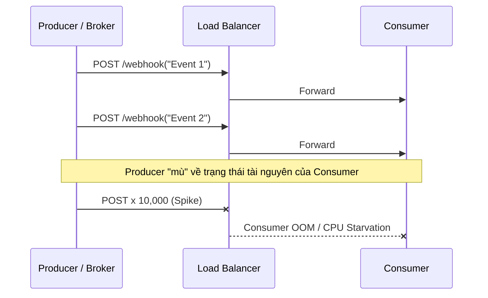
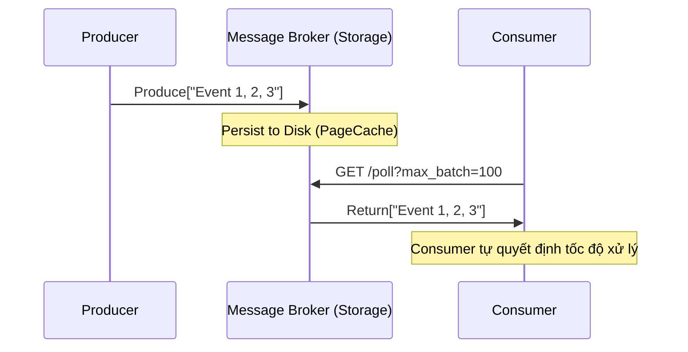

Trong thiết kế hệ thống phân tán (Distributed Systems), quyết định cách dữ liệu di chuyển giữa các node—Push (Đẩy) hay Pull (Kéo)—là một trong những lựa chọn kiến trúc nền tảng nhất. Lựa chọn này không đơn thuần là việc gọi API theo cách nào, mà nó định hình **Topology của dòng chảy dữ liệu (Data Flow)**, **Cơ chế chịu lỗi (Fault Tolerance)**, và **Mô hình tài nguyên (Resource Model)** của toàn bộ hệ thống.

Dưới góc nhìn của một Kỹ sư Hệ thống (Staff Engineer), chúng ta sẽ phẫu thuật sâu vào các trade-offs về Latency vs Throughput, bài toán Backpressure, hiện tượng Cascading Failures trong thực tế, và cách các hệ thống lớn như Apache Kafka, RabbitMQ hay SQS giải quyết chúng.

---

## 1. Push Architecture: Tốc độ tối đa, Rủi ro cực đại

### Physical Execution (Cơ chế thực thi vật lý)
Trong mô hình Push, Producer (Hoặc Broker) giữ vai trò chủ động. Ngay khi State thay đổi hoặc Event được sinh ra, Producer sẽ mở một TCP connection hoặc tái sử dụng connection pool (HTTP Keep-Alive, gRPC, Server-Sent Events - SSE) để đẩy payload thẳng tới Consumer.

Hệ thống điển hình: **RabbitMQ**, **Webhooks**, **Server-Sent Events (SSE)**.



### The Backpressure Nightmare (Cơn ác mộng quá tải)
Trade-off lớn nhất của Push là sự thiếu vắng **Backpressure tự nhiên**. 
Producer hoạt động độc lập và hoàn toàn "mù" (ignorant) về Capacity (CPU, Memory, Disk I/O) của Consumer. Khi có một đợt Traffic Spike (ví dụ: Marketing Push Notification), Producer xả dữ liệu với Rate `Rp`, trong khi Consumer chỉ có thể xử lý với Rate `Rc`. 
Nếu `Rp > Rc` trong thời gian đủ dài, các buffer ở tầng Network (TCP Receive Window) và Application (Thread Pool, Queue) của Consumer sẽ đầy. Kết quả là hiện tượng **Cascading Failure**:
1. Consumer chậm lại, Response Time tăng vọt (Latency Degradation).
2. Producer gặp Timeout, kích hoạt cơ chế Retry.
3. Retry làm tăng thêm lưu lượng ảo (Amplification), đánh sập hoàn toàn Consumer (OOM - Out of Memory, hoặc CPU Starvation).

**Cách khắc phục (Mitigations):**
- **Rate Limiting & Load Shedding:** Consumer buộc phải cấu hình Load Shedding (ví dụ dùng thuật toán Token Bucket). Nếu Request Rate vượt ngưỡng, lập tức trả về `HTTP 429 Too Many Requests` hoặc đóng connection, hy sinh Availability để bảo vệ System Core.
- **Circuit Breaker:** Đặt tại Producer. Nếu thấy tỷ lệ lỗi/timeout từ Consumer cao, ngắt mạch tạm thời để Consumer có thời gian "thở".

**Real-world Incident:** Các hệ thống Webhook quy mô lớn (như Stripe, GitHub) thường gặp bài toán này. Họ phải xây dựng hệ thống Forwarder khổng lồ với Exponential Backoff và Jitter để push dữ liệu mà không làm sập server của khách hàng.

---

## 2. Pull Architecture: Kỷ luật, Bền bỉ, nhưng Chậm chạp

### Physical Execution
Trong mô hình Pull, quyền kiểm soát tốc độ (Pacing) thuộc về Consumer. Producer ghi dữ liệu vào một thành phần lưu trữ trung gian (Write-Ahead Log, Message Queue), và Consumer sẽ thực hiện polling định kỳ để lấy dữ liệu.

Hệ thống điển hình: **Apache Kafka**, **Amazon SQS**, **REST API Polling**.



### Sức mạnh của Batching & Tự điều chỉnh (Self-Pacing)
Cơ chế Pull giải quyết triệt để bài toán Backpressure. Consumer sẽ gọi hàm Pull với tham số `max_batch_size`. 
- Nếu Consumer đang rảnh, nó pull liên tục.
- Nếu Consumer đang bận (ví dụ database đích bị chậm, hệ thống đang scale up), nó sẽ ngưng gọi Pull. Dữ liệu đơn giản là nằm chờ an toàn trên Disk của Message Broker.

Sự phân tách (Decoupling) này tạo ra khả năng chịu lỗi cực cao (Resilience). Khi Consumer sập (Crash), không có data nào bị mất, vì trạng thái (Offset) vẫn được lưu trên Broker hoặc Consumer tự quản lý.

### FinOps & Operational Risks: Empty Polling
Sự đánh đổi ở đây là độ trễ (Latency) và chi phí vận hành mạng (Network Cost).
- **Latency Penalty:** Dữ liệu có thể nằm trên Broker một lúc trước khi chu kỳ Pull tiếp theo diễn ra.
- **Empty Polling:** Nếu không có traffic, Consumer vẫn gửi Pull Request liên tục (ví dụ mỗi 100ms). Điều này gây lãng phí CPU cho việc parse HTTP/TCP headers và lãng phí băng thông mạng. Ở quy mô Cloud, điều này chuyển hoá thành **chi phí tiền mặt (FinOps)** rất lớn.

**Mẫu code Pull an toàn (AWS SQS):**
```python
# Cách Consumer xử lý Pull an toàn với Batching
while True:
    try:
        # Tự giới hạn số lượng message lấy về để không bị OOM
        messages = sqs.receive_message(
            QueueUrl=url, 
            MaxNumberOfMessages=10, # Batching để tối ưu Throughput
            WaitTimeSeconds=20      # Long Polling để giảm Empty Polling
        )
        
        if not messages:
            continue
            
        process_batch(messages)
        
        # Chỉ commit/delete sau khi xử lý thành công
        commit_messages(messages) 
    except Exception as e:
        log.error("Failed to process, message will reappear in queue after VisibilityTimeout")
```

---

## 3. The Hybrid Approach: Long Polling & Kafka Architecture

Để xoá bỏ nhược điểm Empty Polling của mô hình Pull truyền thống, các kỹ sư hệ thống sử dụng **Long Polling**. 

Trong Long Polling (áp dụng trong AWS SQS và Kafka `fetch.max.wait.ms`), Consumer gửi request lấy dữ liệu. Nếu Queue trống, Broker sẽ **giữ (hold)** connection đó mở thay vì trả về rỗng ngay lập tức (ví dụ giữ trong 20s). Ngay khi có event mới sinh ra, Broker lập tức thả event xuống connection đang mở này. 
$\rightarrow$ **Kết quả:** Đạt được độ trễ thấp tiệm cận Push, trong khi vẫn giữ nguyên đặc tính Self-Pacing của Pull.

### Case Study: Apache Kafka Architecture
Nhiều người lầm tưởng Kafka là "Push", nhưng thực chất, Data Flow của Kafka là sự kết hợp cực kỳ thông minh:
1. **Producer $\rightarrow$ Broker (Push):** Producer đẩy dữ liệu (thường đã được Batching trên memory của producer) vào Broker qua TCP socket. Broker sử dụng cơ chế Zero-copy (Sendfile) để ghi thẳng vào ổ đĩa.
2. **Broker $\rightarrow$ Consumer (Pull với Long Polling):** Consumer chủ động Pull dữ liệu. Consumer kiểm soát **Offset** của chính mình. 

Sự vắng mặt của việc Push từ Broker giúp Broker trở nên "Stateless" đối với consumer logic, tối đa hoá Throughput cho toàn hệ thống. Ngược lại, **RabbitMQ** duy trì trạng thái của Consumer (Push), nên nó giỏi xử lý Task Queue nhưng kém hiệu quả trong việc Replay dữ liệu.

```yaml
# Kafka Consumer Configuration Trade-offs
fetch.min.bytes: 1048576 # Pulling ít nhất 1MB mới return, tối ưu Throughput
fetch.max.wait.ms: 500   # Nếu chưa đủ 1MB, đợi tối đa 500ms (Long Polling)
max.poll.records: 500    # Giới hạn số lượng records mỗi lần pull (Tránh OOM)
```

---

## 4. Bảng So Sánh Quyết Định Lựa Chọn (Protocol Selection)

| Đặc tính | Push Model (Webhooks, RabbitMQ, SSE) |" Pull Model (Kafka, SQS, REST Polling) "|
| :--- | :--- | :--- |
| **Bản chất** | Event-driven, Interrupt-based | Data-driven, Polling-based |
|" **Độ trễ (Latency)** "| Cực thấp (Microseconds $\rightarrow$ Milliseconds) |" Trung bình (Tùy thuộc Poll Interval & Wait Time) "|
|" **Thông lượng (Throughput)** "| Thấp - Trung bình (Giới hạn bởi Network/Consumer) |" Cực cao (Tối ưu hóa bằng Batching & Sequential I/O) "|
| **Quản lý trạng thái** | Producer/Broker phải theo dõi trạng thái gửi |" Consumer tự theo dõi (Offset tracking) "|
|" **Dung sai lỗi (Fault Tolerance)** "| Kém. Dễ gây Cascading Failure. |" Rất tốt. Hấp thụ (Absorb) Traffic Spikes. "|

---

## Tổng Kết

Với vai trò Staff Engineer, nguyên tắc vàng là: **"Mặc định hãy chọn Pull cho giao tiếp Server-to-Server backend data pipeline để bảo vệ hệ thống khỏi sự cố sập dây chuyền (Cascading Failure), và chỉ sử dụng Push cho Edge/Client delivery (Web/Mobile) hoặc khi Latency thấp là yếu tố sống còn (Real-time Trading)."**

- Hệ thống **Pull** yêu cầu Message Broker (như Kafka/SQS) tốt để lưu trữ dữ liệu bền bỉ, bù lại cho bạn một hệ thống có thể ngủ yên vào ban đêm nhờ khả năng "chống ngập" [Backpressure handling].
- Hệ thống **Push** yêu cầu sự bảo vệ nghiêm ngặt (Rate Limiter, Circuit Breaker) và các chiến lược Retry tinh vi (Exponential Backoff & Jitter) để tránh hệ thống tự huỷ diệt.

## Nguồn Tham Khảo
* [Designing Data-Intensive Applications - Martin Kleppmann (O'Reilly]][https://dataintensive.net/]
* [AWS Architecture Blog: Handling Traffic Spikes with SQS][https://aws.amazon.com/blogs/architecture/]
* [Apache Kafka Documentation: Design and Implementation][https://kafka.apache.org/documentation/#design]
* [Stripe Engineering: Webhooks Delivery at Scale](https://stripe.com/blog/webhooks-at-scale]
