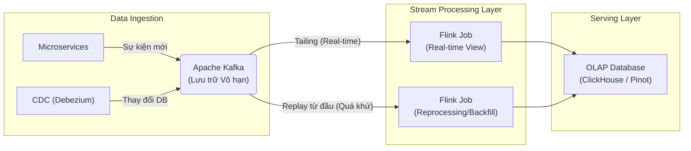

Real-time Architecture không đơn thuần là việc cài đặt Kafka rồi chạy vài job Flink. Ở quy mô lớn (hàng triệu messages/giây tương đương Gigabytes/giây), nó là bài toán tối ưu hóa vật lý ở tầng I/O, quản lý trạng thái phân tán (Distributed State), và sự giằng xé liên tục giữa độ trễ (Latency), thông lượng (Throughput) cùng chi phí vận hành đám mây (FinOps).

Dưới góc nhìn thiết kế hệ thống của một Staff Engineer, chúng ta sẽ lướt qua các định nghĩa bề mặt để đi thẳng vào cách kiến trúc này vận hành ở tầng phần cứng, cách nó phục hồi sau sự cố (Fault Tolerance), và những "bãi mìn" thực tế khi vận hành.

---

## 1. Đánh Đổi Tối Thượng: Latency vs. Throughput (Physical Execution)

Trong hệ thống streaming phân tán, Định luật Vật lý (Physics) quy định rằng: Bạn **không thể** có cả Latency siêu thấp (vài micro-giây) và Throughput siêu cao (hàng chục GB/s) cùng lúc trên nền tảng phần cứng thông thường mà không làm CPU quá tải.

### Cơ chế Micro-batching và Smart Buffering
Bản chất của việc truyền dữ liệu qua mạng TCP/IP liên quan đến chi phí gọi hàm hệ thống (Syscalls) và đóng gói Header mạng. Nếu Producer gửi từng Event một ngay khi nó xuất hiện (để tối ưu hóa Sub-millisecond Latency), CPU sẽ bị bóp nghẹt bởi Context Switching và Interrupts của Network Card. 
Do đó, tất cả các hệ thống streaming chuẩn Enterprise đều sử dụng cơ chế **Micro-batching / Smart Buffering**.

**Thực chiến: Tối ưu I/O trên Apache Kafka**
Sự đánh đổi này thể hiện rõ nhất qua tham số `linger.ms` và `batch.size` của Kafka Producer.

```properties
# Cấu hình Kafka Producer tối ưu cho High Throughput (Chấp nhận hy sinh Latency ~50ms)
compression.type=lz4
# Đợi tối đa 50ms để gom nhiều event lại thành 1 batch trước khi gửi qua mạng
linger.ms=50
# Hoặc gửi batch đi NGAY LẬP TỨC nếu kích thước buffer đạt 1MB
batch.size=1048576

# Đảm bảo tính toàn vẹn (Durability) - Leader và tất cả In-Sync Replicas phải nhận được
acks=all

# Giới hạn số lượng request đang bay (in-flight) để duy trì thứ tự (Order)
max.in.flight.requests.per.connection=5
```

*Sự cố vận hành thực tế:* Ở quy mô 500MB/s, nếu một kỹ sư ngây thơ thiết lập `linger.ms=0` (mong muốn real-time tuyệt đối), Network Interface Card (NIC) sẽ đối mặt với tình trạng Packet Rate quá cao (chạm ngưỡng PPS limit của AWS EC2). Điều này dẫn đến rớt gói tin hàng loạt ở tầng Hardware Queue, làm tăng P99 Latency (lên tới vài giây do TCP Retransmission) thay vì giảm độ trễ như mong muốn.

---

## 2. Kiến trúc Topology: Sự Lỗi Thời Của Lambda & Lời Giải Kappa

Lịch sử kiến trúc dữ liệu lớn chứng kiến cuộc nội chiến giữa hai trường phái: **Lambda Architecture** (do Nathan Marz đề xuất) và **Kappa Architecture** (do Jay Kreps - cha đẻ Kafka - khởi xướng).

### 2.1 Lambda Architecture và Nỗi Đau Vận Hành (Semantic Drift)
Mô hình Lambda chia hệ thống thành 2 luồng song song:
1.  **Batch Layer:** Xử lý lượng dữ liệu khổng lồ trong quá khứ để tạo ra kết quả chính xác tuyệt đối (Master View). Luồng này thường chạy bằng Hadoop/Spark mất vài giờ.
2.  **Speed Layer:** Xử lý luồng dữ liệu hiện tại trong bộ nhớ (Streaming) để đưa ra kết quả tức thời nhưng độ chính xác có thể bị thỏa hiệp (Ví dụ: tính gần đúng số lượng Unique User).
3.  **Serving Layer:** Hợp nhất (Merge) kết quả của 2 luồng trên khi user query.

**Rủi ro hệ thống (Operational Risks):**
Lỗi chí mạng của Lambda là **Sự Phân mảnh Ngữ nghĩa (Semantic Drift)**. Một logic tính toán doanh thu (Revenue) phải được viết 2 lần: Một lần bằng Flink/Kafka Streams cho Speed Layer, và một lần bằng Spark SQL cho Batch Layer. Khi Business yêu cầu sửa logic, kỹ sư rất dễ cập nhật sót 1 trong 2 nơi. Kết quả là Dashboard real-time hiển thị doanh thu 10 tỷ, nhưng báo cáo chốt tháng lại ra 9 tỷ. Việc duy trì 2 hệ thống phân tán khổng lồ cùng lúc cũng là thảm họa về nhân sự vận hành.

### 2.2 Kappa Architecture: "Mọi thứ đều là Stream"

Vào năm 2014, Jay Kreps công bố bài viết *"Questioning the Lambda Architecture"* và đề xuất **Kappa Architecture**. Tư tưởng rất đơn giản: Xóa sổ Batch Layer. Dùng Kafka làm Single Source of Truth [Nguồn chân lý duy nhất] chứa dữ liệu lịch sử vô hạn (Immutable Log).



Nếu phát hiện bug trong logic tính tiền, hoặc cần thêm một metric mới, chúng ta không cần viết Spark Job. Thay vào đó, ta deploy một Streaming Job [Flink] mới, cấu hình cho nó đọc Kafka từ `offset = 0` (đầu cuộn băng). Nó sẽ xử lý (Replay) lại toàn bộ lịch sử bằng chính xác đoạn code đang chạy cho real-time. Khi Job mới bắt kịp hiện tại, ta tắt Job cũ đi.

**Bài Toán Khốc Liệt Của Kappa (Replayability Constraints):**
Giữ dữ liệu 3 năm trên ổ SSD đắt đỏ của Kafka Cluster (ví dụ AWS `io2`) sẽ làm sếp CFO ngất xỉu. 
*Giải pháp Thực chiến:* Bật tính năng **Tiered Storage (KIP-405)** trên Kafka. Dữ liệu nóng (Hot Data - vài ngày gần nhất) nằm trên SSD cục bộ. Khi đầy, Kafka âm thầm nén và đẩy dữ liệu lạnh xuống AWS S3 (Rẻ hơn hàng chục lần). Flink khi Replay quá khứ sẽ tự động đọc từ S3 mà không cần quan tâm vị trí vật lý.

---

## 3. Quản Lý Trạng Thái (State Management) & Write Amplification

Khi Flink thực hiện các phép toán Stateful như Window Aggregation (Tính tổng doanh thu trong 5 phút) hoặc Stream-to-Stream Join, nó phải nhớ các sự kiện (State). Khi scale lên hàng chục triệu người dùng, RAM (Heap Memory) là không bao giờ đủ. Giải pháp tiêu chuẩn là sử dụng **RocksDB State Backend** để xả State xuống ổ cứng SSD cục bộ của từng Node.

**Sự Cố Hệ Thống: Write Amplification (Khuếch đại Ghi)**
RocksDB sử dụng cấu trúc dữ liệu LSM-Tree. Việc cập nhật State liên tục (ví dụ: đếm view video) sẽ kích hoạt quá trình dọn dẹp và gộp file (Compaction) chạy ngầm cực kỳ khốc liệt. Hiện tượng Write Amplification có thể nhân lượng I/O Disk lên 10-30 lần. Ổ đĩa bị IOPS Bottleneck (100% Load), khiến Node Flink bị treo cứng, Backpressure dội ngược lên Kafka, và Checkpoint bị timeout.

---

## 4. Operational Risks: Data Skew (Hot Keys) & OOM

Lỗi kinh điển nhất làm sập hệ thống Streaming trong các dịp Traffic Spike (Black Friday / Flash Sale).

**Căn bệnh:** Dữ liệu bị lệch (Data Skew). 
Ví dụ: Bạn Group By theo `shop_id`. Một shop lớn (Shopee Mall) có lượng đơn hàng bằng 10,000 shop nhỏ cộng lại. Do cơ chế Hash Partitioning, toàn bộ 10,000 sự kiện của shop đó bị nhồi vào chung **một TaskManager duy nhất**. Node đó bị quá tải CPU hoặc vỡ RAM (OOM - Out Of Memory), kéo theo cả Cụm Flink sụp đổ.

**Giải pháp: Two-Phase Aggregation (Local-Global)**
Trong Flink SQL, Staff Engineer phải chủ động bật tính năng chia nhỏ Hot Key (Salted Key). Flink sẽ tự động thêm một số ngẫu nhiên vào Key để phân tán tính toán sơ bộ (Local Aggregation) ra toàn cụm, trước khi gộp kết quả cuối cùng (Global).

```sql
-- Flink SQL: Xử lý Data Skew bằng Local-Global Aggregation
-- Bật chiến lược 2 pha để chia tải cho Hot Keys
SET 'table.optimizer.agg-phase-strategy' = 'TWO_PHASE';
-- Cho phép chia nhỏ dữ liệu Distinct Aggregation
SET 'table.optimizer.distinct-agg.split.enabled' = 'true';

-- Query thực tế tính lượng unique users
SELECT shop_id, COUNT(DISTINCT user_id) as unique_buyers
FROM orders
GROUP BY TUMBLE(order_time, INTERVAL '5' MINUTE), shop_id;
```

---

## 5. Exactly-Once Semantics (EOS) vs. End-to-End Latency

Nhiệm vụ tối thượng: Tiền của user không được mất, và không được tính đúp.
Flink đảm bảo EOS (Exactly-Once Semantics) bằng thuật toán Chandy-Lamport Checkpointing kết hợp với **Two-Phase Commit (2PC)** khi ghi ra hệ thống bên ngoài.

**Đánh đổi (The Ultimate Trade-off):**
Khi kích hoạt 2PC để ghi vào Kafka Sink hoặc Database, Transaction chỉ được Commit khi *toàn bộ cụm Flink hoàn thành Checkpoint*. Nếu Checkpoint Interval cấu hình là 3 phút, thì End-to-End Latency thấp nhất mà User thấy được là... 3 phút! (Vì dữ liệu trong 3 phút đó bị treo ở trạng thái UNCOMMITTED, downstream không được phép đọc).

Nếu bài toán yêu cầu độ trễ < 1 giây (Ví dụ: Fraud Detection), bạn **bắt buộc** phải lùi bước: Chuyển Semantics về `At-Least-Once` (Chấp nhận xử lý trùng), nhưng thiết kế **Idempotent Sink** ở tầng Database đích. Bằng cách dùng lệnh `UPSERT` thay vì `INSERT`, bạn đẩy trách nhiệm lọc trùng (Deduplication) xuống Database, giữ cho luồng Streaming nhẹ nhàng và siêu tốc.

---

## Nguồn Tham Khảo (References)

1. [Questioning the Lambda Architecture][https://www.oreilly.com/radar/questioning-the-lambda-architecture/] - *Jay Kreps (O'Reilly Radar, 2014)*
2. [The Log: What every software engineer should know about real-time data's unifying abstraction][https://engineering.linkedin.com/distributed-systems/log-what-every-software-engineer-should-know-about-real-time-datas-unifying] - *Jay Kreps (LinkedIn)*
3. [Apache Flink: State Management & RocksDB Tuning][https://flink.apache.org/2021/01/18/rescaling-flink-stateful-applications/] - *Flink Official Engineering Blog*
4. [Kafka Tiered Storage (KIP-405]](https://cwiki.apache.org/confluence/display/KAFKA/KIP-405%3A+Kafka+Tiered+Storage) - *Apache Kafka Confluence*
5. *Designing Data-Intensive Applications* - Martin Kleppmann (Part 2: Stream Processing)
