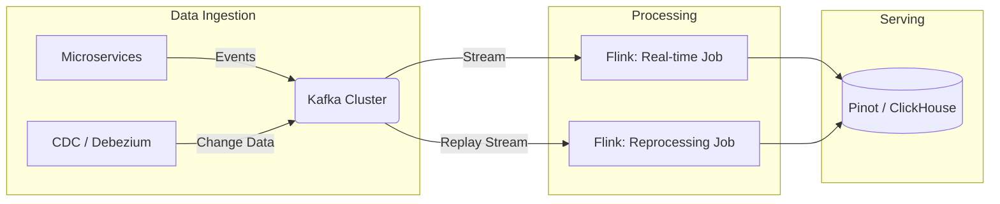

Real-time Architecture không đơn thuần là việc cài đặt Kafka và Flink. Ở quy mô lớn (hàng triệu messages/giây), nó là bài toán tối ưu hóa vật lý ở tầng I/O, quản lý trạng thái phân tán (Distributed State), và đánh đổi giữa độ trễ (Latency), thông lượng (Throughput) cùng chi phí vận hành (FinOps).

Dưới góc nhìn thiết kế hệ thống, chúng ta sẽ bỏ qua các khái niệm cơ bản để đi sâu vào cách kiến trúc này vận hành ở tầng phần cứng, cách nó phục hồi sau sự cố (Fault Tolerance), và những cạm bẫy thực tế.

## 1. Đánh Đổi Tối Thượng: Latency vs. Throughput vs. Cost (Physical Execution)

Trong streaming, bạn không thể có cả Latency cực thấp và Throughput cực cao mà không đánh đổi bằng CPU và Network Overhead.

### Cơ chế Buffer và I/O
Bản chất của việc truyền dữ liệu qua mạng là chi phí gọi hàm hệ thống (syscall) và đóng gói TCP/IP. Nếu hệ thống gửi từng event một (Sub-millisecond Latency), CPU sẽ bị bóp nghẹt bởi Context Switching và Interrupts. Do đó, các hệ thống streaming sử dụng **Micro-batching / Smart Buffering**.

Trong Apache Kafka, sự đánh đổi này được thể hiện qua `linger.ms` và `batch.size`. Ở Flink, đó là `setBufferTimeout`.

```yaml
# Cấu hình Producer (Kafka) tối ưu cho High Throughput (Đánh đổi Latency ~50ms)
compression.type: lz4
linger.ms: 50             # Đợi tối đa 50ms để gom event
batch.size: 1048576       # Hoặc gửi ngay khi buffer đạt 1MB
acks: all                 # Đảm bảo durability
max.in.flight.requests.per.connection: 5 # Pipeline requests để tăng throughput
```

```java
// Apache Flink: Tối ưu Network Buffer
// Mặc định timeout là 100ms. Giảm xuống 0ms (flush ngay) sẽ tăng CPU load và giảm Throughput nghiêm trọng.
env.setBufferTimeout(10); // 10ms: Balance giữa latency và throughput
```

**Thực tế vận hành:** Ở quy mô 500MB/s, nếu set `linger.ms=0`, Network Interface Card (NIC) sẽ đối mặt với tình trạng Packet Rate quá cao (PPS limit), dẫn đến rớt gói tin ở tầng Hardware Queue, làm tăng P99 Latency thay vì giảm.

## 2. Kiến trúc Topology ở Scale Lớn (Lambda vs. Kappa)

### 2.1 Lambda Architecture và Nỗi Đau Vận Hành

Lambda tách biệt hai luồng: **Batch** (chính xác tuyệt đối) và **Speed/Real-time** (chấp nhận sai sót nhỏ để lấy tốc độ). 


*Mô hình Lambda Architecture kinh điển với hai luồng dữ liệu song song.*

**Nỗi đau thực tế (Operational Pain):**
- **Training-Serving Skew / Code Duplication:** Logic tính toán doanh thu (Revenue) phải viết 2 lần. Một lần bằng Flink DataStream API (hoặc Kafka Streams) cho Speed Layer, và một lần bằng Spark SQL cho Batch Layer. Khi sửa logic, kỹ sư thường quên update 1 trong 2, dẫn đến sai lệch số liệu.
- **Merge Complexity:** Tầng Serving (ví dụ Druid / Pinot) phải liên tục hợp nhất dữ liệu Real-time (không chính xác) với Batch (chính xác) dựa trên Watermark.

### 2.2 Kappa Architecture & Bài Toán Backfilling

Để giải quyết vấn đề trên, Jay Kreps đề xuất **Kappa Architecture**: Biến mọi thứ thành Stream. Kafka đóng vai trò là Single Source of Truth.



**Bài toán Backfilling (Chạy lại dữ liệu quá khứ):**
Khi phát hiện bug logic, Kappa yêu cầu "tua lại" (rewind) Kafka offset từ 3 tháng trước. Tuy nhiên, lưu trữ 3 tháng dữ liệu trên ổ SSD của Kafka Brokers cực kỳ tốn kém (FinOps Alert!).

**Giải pháp Thực tế - Tiered Storage:**
Chuyển dữ liệu cũ xuống Object Storage (S3/GCS) và chỉ giữ dữ liệu nóng (Hot Data) trên SSD. Khi Flink chạy Reprocessing, Kafka sẽ tự động fetch từ S3.

```properties
# Kafka Tiered Storage Configuration (KIP-405)
remote.log.storage.system.enable=true
remote.log.manager.impl.class=org.apache.kafka.server.log.remote.storage.s3.S3RemoteLogManager
log.retention.hours=168            # Giữ trên Local SSD 7 ngày
remote.log.retention.bytes=10TB    # Giữ trên S3 10TB
```

## 3. State Management & Hiện Tượng Write Amplification

Khi Flink thực hiện Window Aggregation hoặc Join hai Streams, nó phải giữ trạng thái (State) của các event. Với dữ liệu lớn, Memory (Heap) là không đủ, do đó Flink sử dụng **RocksDB State Backend** (lưu state ra disk cục bộ của TaskManager).

**Sự cố thực tế:** Disk I/O Bottleneck do Write Amplification.
RocksDB dùng cấu trúc LSM-Tree (Log-Structured Merge-Tree). Việc liên tục cập nhật State (ví dụ: đếm số lượt click) gây ra quá trình Compaction liên tục dưới nền, làm nghẽn ổ đĩa (IOPS đạt 100%), khiến Flink bị Backpressure và checkpoint bị timeout.

**Cách Fix (RocksDB Tuning):**
Chuyển RocksDB sang sử dụng memory managed bởi Flink và tinh chỉnh Column Family.

```yaml
# Flink flink-conf.yaml cho RocksDB optimization
state.backend.type: rocksdb
state.backend.rocksdb.memory.managed: true
state.backend.rocksdb.memory.write-buffer-ratio: 0.7 # Ưu tiên write
state.backend.rocksdb.compaction.style: LEVEL
# Đặt state dir trên NVMe SSD
state.backend.rocksdb.localdir: /nvme/flink/state 
```

## 4. Operational Risks: Data Skew (Hot Keys) & OOM

Đây là lỗi phổ biến nhất gây sập hệ thống Streaming lúc cao điểm (ví dụ: Black Friday).
- **Nguyên nhân:** Dữ liệu bị lệch (Skew). Ví dụ một shop lớn (Shopee Mall) có lượng đơn hàng gấp 10,000 lần shop nhỏ. Key `shop_id` của shop lớn sẽ dồn hết về một TaskManager duy nhất (Hash Partitioning), khiến TaskManager đó bị OOM (Out of Memory) hoặc rớt nhịp, kéo sập cả Job.

**Giải pháp: Salted Keys / Two-Phase Aggregation**
Chia nhỏ Hot Key ra nhiều TaskManager bằng cách gắn thêm Random Salt, sau đó aggregate lại.

```sql
-- Flink SQL: Xử lý Data Skew bằng Local-Global Aggregation
-- Bật tính năng tự động chia nhỏ hot keys của Flink
SET 'table.optimizer.agg-phase-strategy' = 'TWO_PHASE';
SET 'table.optimizer.distinct-agg.split.enabled' = 'true';

-- Query thực tế
SELECT shop_id, COUNT(DISTINCT user_id) as unique_buyers
FROM orders
GROUP BY TUMBLE(order_time, INTERVAL '5' MINUTE), shop_id;
```

## 5. Exactly-Once Semantics (EOS) & Phân Tán Giao Dịch

Đảm bảo event không bị mất hoặc xử lý trùng là ác mộng của kỹ sư phân tán. Flink đảm bảo EOS bằng cách kết hợp Chandy-Lamport Checkpointing và **Two-Phase Commit (2PC)** khi ghi ra hệ thống bên ngoài (Kafka Sink / Postgres).

**Quy trình 2PC thực tế:**
1. **Pre-commit:** Flink gom kết quả tính toán vào một Kafka transaction. Chưa gửi lệnh `commit`.
2. **Snapshot State:** Chờ tất cả operator hoàn thành Checkpoint vào HDFS/S3.
3. **Commit:** Báo cho Kafka Sink thực hiện `commitTransaction()`. Lúc này downstream consumer mới đọc được data (nhờ `isolation.level=read_committed`).

**Trade-off:**
Nếu set EOS, Latency đầu cuối (End-to-End Latency) sẽ bị đội lên ít nhất bằng **Checkpoint Interval** (thường từ 1-5 phút). Nếu hệ thống yêu cầu độ trễ < 1s, bạn phải lùi về `At-Least-Once` và dùng cấu trúc dữ liệu Idempotent ở tầng Sink (ví dụ: dùng `UPSERT` thay vì `INSERT` trong ClickHouse/Postgres).

```sql
-- Đảm bảo Idempotent Sink trong ClickHouse thay vì dùng EOS nặng nề
CREATE TABLE revenue_agg (
    shop_id UInt64,
    window_start DateTime,
    total_revenue AggregateFunction(sum, Float64)
) ENGINE = AggregatingMergeTree()
ORDER BY (shop_id, window_start);
```

## 6. Nguồn Tham Khảo (References)

1. [The Log: What every software engineer should know about real-time data's unifying abstraction](https://engineering.linkedin.com/distributed-systems/log-what-every-software-engineer-should-know-about-real-time-datas-unifying) - *Jay Kreps (LinkedIn/Confluent)*
2. [Questioning the Lambda Architecture](https://www.oreilly.com/radar/questioning-the-lambda-architecture/) - *O'Reilly Radar*
3. [Apache Flink: State Management & RocksDB Tuning](https://flink.apache.org/2021/01/18/rescaling-flink-stateful-applications/) - *Flink Official Engineering Blog*
4. [Kafka Tiered Storage (KIP-405)](https://cwiki.apache.org/confluence/display/KAFKA/KIP-405%3A+Kafka+Tiered+Storage) - *Apache Kafka Confluence*
5. *Designing Data-Intensive Applications* - Martin Kleppmann (Part 2: Stream Processing)
