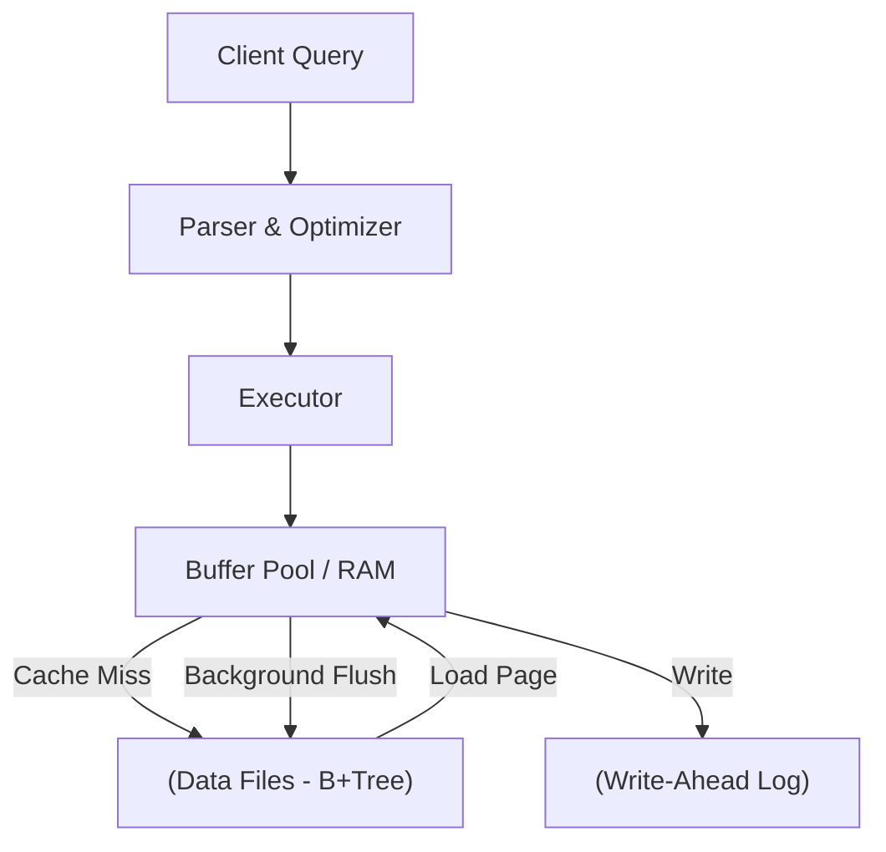
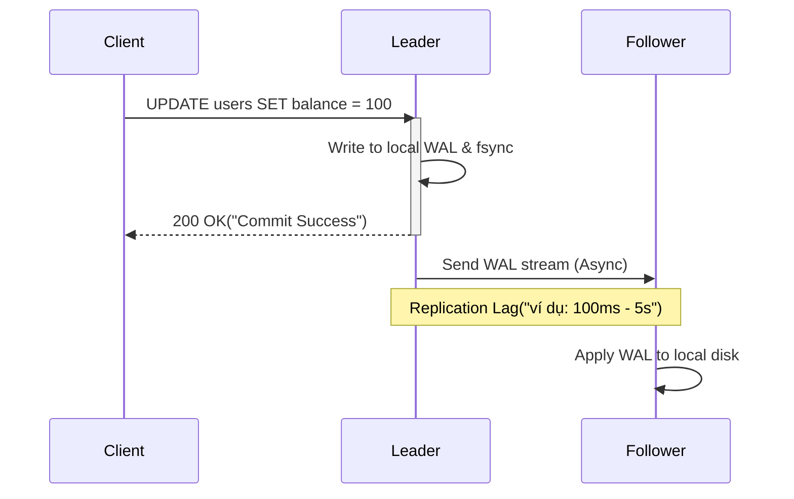

Relational Database (RDBMS) không chỉ là các bảng với hàng và cột. Ở quy mô lớn, RDBMS là những cỗ máy phức tạp giải quyết bài toán đồng bộ hóa (synchronization), độ trễ (latency), và độ tin cậy (reliability) ở mức độ vật lý. Dưới góc nhìn của một Staff Engineer, chúng ta sẽ không nói về "Khóa chính là gì?", mà sẽ đi sâu vào **Cơ chế lưu trữ vật lý**, **Concurrency Control (MVCC)**, **Replication Trade-offs**, và **Operational Risks**.

## 1. Kiến Trúc Vật Lý & Thực Thi (Physical Storage & Execution)

### 1.1. B+Tree, Pages và Buffer Pool
Khác với in-memory database, RDBMS tối ưu hóa cho Disk I/O. Đơn vị đọc/ghi nhỏ nhất trên đĩa không phải là một row, mà là một **Page** (thường là 8KB trong PostgreSQL hoặc 16KB trong InnoDB/MySQL).

Cấu trúc **B+Tree** được thiết kế đặc biệt để giảm thiểu số lần disk seek. Một B+Tree với độ sâu 3 hoặc 4 có thể lưu trữ hàng tỷ bản ghi, nghĩa là bạn chỉ tốn tối đa 3-4 thao tác I/O để tìm bất kỳ dòng dữ liệu nào.

Tuy nhiên, đọc từ đĩa luôn chậm (độ trễ milliseconds). Do đó, RDBMS sử dụng **Buffer Pool** (hay Shared Buffers) để cache các pages trên RAM.

> [!WARNING]
> **Trade-off:** RAM thì đắt và giới hạn. Việc quản lý Buffer Pool thường sử dụng thuật toán LRU (Least Recently Used) biến thể (như Clock-sweep) để quyết định page nào bị "evict" (đẩy ra khỏi RAM). Một truy vấn `SELECT *` quét toàn bộ bảng không cẩn thận có thể vô tình xóa sạch Buffer Pool, gây ra suy thoái hiệu năng toàn hệ thống (Cache churn).

### 1.2. Write-Ahead Logging (WAL) & fsync
Khi một transaction commit, RDBMS **không** ghi trực tiếp dữ liệu thay đổi vào Data Files (vì việc đó đòi hỏi random I/O rất chậm). Thay vào đó, nó ghi tuần tự vào một tệp nhật ký gọi là **WAL (Write-Ahead Log)**.

Chỉ khi WAL được đẩy xuống đĩa thành công bằng lệnh syscall `fsync()`, transaction mới được báo là commit thành công (đảm bảo tính **Durability**). Các trang dữ liệu (dirty pages) trong Buffer Pool sẽ được xả (flush) xuống Data Files ở chế độ nền (Background Writer/Checkpoint).

**Sự cố và Đánh đổi thực tế:** Cấu hình `fsync` sai.
Trong MySQL InnoDB, tham số `innodb_flush_log_at_trx_commit`:
- **`1`**: Fsync ở mỗi commit (An toàn nhất, chậm nhất - High Latency).
- **`2`**: Chỉ flush vào OS cache, hệ điều hành sẽ flush xuống đĩa mỗi giây (Nhanh hơn, nhưng mất tối đa 1s dữ liệu nếu OS crash).
- **`0`**: Xả log mỗi giây (Rủi ro mất dữ liệu cao nhất, nhưng Throughput cao nhất).

Ở quy mô lớn, việc đánh đổi giữa **Durability** và **Throughput** là quyết định kỹ thuật sống còn của Database Admin và Staff Engineer.

## 2. Kiểm Soát Đồng Thời: MVCC vs 2PL (Concurrency Control)

Làm sao để hàng ngàn kết nối có thể đọc/ghi cùng một dữ liệu mà không bị chặn (block) lẫn nhau?

Cách tiếp cận ngây thơ là khóa (Lock) dữ liệu: Đọc thì dùng Shared Lock, Ghi thì dùng Exclusive Lock. Đây gọi là **Two-Phase Locking (2PL)**. Nhưng 2PL khiến "người đọc chặn người ghi" và "người ghi chặn người đọc", làm giảm thê thảm Throughput.

Giải pháp hiện đại là **MVCC (Multi-Version Concurrency Control)**.
* **Nguyên lý:** Mỗi khi bạn Update một row, DB không ghi đè lên row cũ, mà tạo ra một **phiên bản mới** (new version) của row đó.
* **Đọc:** Mỗi transaction được gán một Transaction ID (XID) và chỉ nhìn thấy các phiên bản dữ liệu đã commit trước khi XID của nó bắt đầu (cơ chế *Snapshot Isolation*).
* **Kết quả:** Người đọc không chặn người ghi, và người ghi không chặn người đọc.

### Trận chiến kiến trúc: PostgreSQL vs MySQL (Uber's Migration)
Cả PostgreSQL và MySQL đều dùng MVCC, nhưng cách kiến trúc lưu trữ phiên bản khác biệt đã dẫn đến các trade-off khổng lồ. Điều này được thể hiện rõ qua sự kiện **Uber chuyển đổi từ PostgreSQL sang MySQL**.

* **PostgreSQL (Append-only):** Lưu trực tiếp các phiên bản cũ và mới ngay trong cùng một Data Page.
  * *Hậu quả:* Index trỏ trực tiếp vào vị trí của row. Khi update, vị trí thay đổi -> Index phải cập nhật lại dù cột Index không đổi (**Write Amplification**). Để dọn dẹp các phiên bản cũ (dead tuples), Postgres phải chạy một tiến trình gọi là **VACUUM**. Uber từng bị ảnh hưởng nặng nề bởi VACUUM overhead.
* **MySQL InnoDB (Undo Logs):** Lưu row mới nhất ở Data Page, và đẩy row cũ vào vùng **Undo Log**.
  * *Hậu quả:* Cập nhật nhanh hơn vì không làm phình Secondary Index (vì Secondary Index chỉ trỏ tới Primary Key, thay vì vị trí vật lý). Tuy nhiên, các truy vấn dài (Long-running queries) giữ lock quá lâu có thể gây tràn Undo Log và làm suy giảm tốc độ.

## 3. Kiến Trúc Mở Rộng & Nhân Bản (Replication & Scaling)

Rất hiếm có một máy chủ vật lý nào gánh được tải của một nền tảng quy mô lớn. RDBMS sử dụng **Replication** để dự phòng và chia sẻ tải đọc.

### 3.1. Asynchronous vs Synchronous Replication

* **Asynchronous (Bất đồng bộ):** Leader trả về success cho Client ngay khi ghi xong WAL cục bộ.
  * *Rủi ro:* Nếu Leader crash đột ngột, dữ liệu chưa kịp truyền sang Follower. Khi hệ thống Auto-Failover đưa Follower lên làm Leader mới, chúng ta bị **Mất dữ liệu (Data Loss)** (những commit ở leader cũ biến mất). Đổi lại, Write Latency cực thấp.
* **Synchronous (Đồng bộ):** Leader phải chờ ít nhất 1 Follower confirm đã ghi xong WAL rồi mới báo success cho client.
  * *Rủi ro:* Nếu Follower phản hồi chậm hoặc rớt mạng, Leader sẽ bị treo (block). Tính **Availability** giảm sút nghiêm trọng để đổi lấy sự toàn vẹn **Consistency**.

### 3.2. Vượt qua Replication Lag (Read-After-Write Consistency)
Mô hình Leader-Follower hay gặp lỗi kinh điển: User vừa cập nhật profile, trang web tải lại và hiển thị thông tin cũ (vì hệ thống điều hướng request đọc sang Follower đang bị lag).

**Giải pháp ở tầng System Architecture:**
1. **Client Pinning / Route to Leader:** Sau khi user ghi dữ liệu, ghi đè một cờ vào Session/Cookie. Mọi request của user này trong vòng 5 giây tiếp theo sẽ bị ép trỏ thẳng (route) vào Leader.
2. **Logical Replication & LSN:** Client gửi kèm LSN (Log Sequence Number) của lần ghi cuối cùng. API kiểm tra Follower, nếu Follower chưa đuổi kịp LSN đó, nó sẽ tự động chờ hoặc trả lỗi để client thử lại.

## 4. Vận Hành Thực Tế: Khủng Hoảng và Rủi Ro

### 4.1. Connection Starvation (Cạn kiệt kết nối)
Mỗi connection vào PostgreSQL/MySQL không chỉ là một socket TCP, nó khởi tạo một process/thread riêng biệt, tốn vài MB RAM và CPU context switching. Nếu bạn có 200 microservices pods, mỗi pod mở 50 connections (Connection Pool ở app-level), DB sẽ phải chịu 10,000 connections đồng thời. RDBMS sẽ sụp đổ vì Out Of Memory (OOM) hoặc thắt cổ chai CPU.

* **Giải pháp chuẩn chỉ (Best practice):** Sử dụng các **Connection Pooler trung gian** (như `PgBouncer` cho Postgres, `ProxySQL` cho MySQL). App sẽ trỏ tới Pooler, Pooler duy trì hàng ngàn connection "ảo" với app, nhưng chỉ mở giới hạn 100-200 connection thực sự tới DB thông qua cơ chế *Transaction-level pooling*.

### 4.2. Split-Brain và Cơn ác mộng Failover (GitHub Outage 2018)
Tháng 10/2018, GitHub gặp sự cố tồi tệ ngừng hoạt động dịch vụ 24 giờ.
Nguyên nhân gốc rễ là mạng kết nối giữa hai Data Center (DC1 và DC2) bị chập chờn dưới 1 phút. 
Hệ thống Orchestrator lầm tưởng Leader ở DC1 đã chết vì timeout, nên tự động promote Follower ở DC2 lên làm Leader mới. Thực tế Leader DC1 vẫn sống.
Kết quả: Hệ thống có **2 Leader nhận ghi (Write) cùng lúc -> Split-Brain**.

* Dữ liệu phân tách thành hai nhánh. Khi mạng ổn định, hai nhánh dữ liệu mâu thuẫn nhau (như merge conflict trong Git nhưng là SQL Data) khiến cluster bị vỡ. GitHub phải ngừng hoạt động mọi thứ để các kỹ sư khôi phục lại dữ liệu thủ công bằng tay.
* **Bài học (Takeaways):** Các hệ thống Auto-Failover cần cơ chế **Fencing** cực đoan (như STONITH - Shoot The Other Node In The Head), chủ động ra lệnh ngắt nguồn điện hoặc tắt mạng của Leader cũ trước khi promote Leader mới để đảm bảo không bao giờ có 2 Leader.

## 5. Tổng Kết: Khi nào RDBMS không còn phù hợp?

Dù được trang bị tới tận răng, RDBMS sẽ lộ rõ yếu điểm khi bạn ép nó vượt qua thiết kế cốt lõi:
1. **Sharding đau khổ:** Khi Write Throughput vượt mức 1 con máy vật lý có thể chịu tải, phân mảnh dữ liệu (Sharding) RDBMS phá vỡ toàn bộ cấu trúc `JOIN` phân tán và `Global ACID Transactions`. 
   *(Nếu hệ thống cần quy mô này, bạn nên xem xét NewSQL như CockroachDB, Spanner).*
2. **OLAP (Analytics trên Big Data):** RDBMS lưu theo Row (Row-oriented). Tính tổng doanh thu trên 10 tỷ dòng cần quét hết toàn bộ block đĩa dù chỉ cần 1 cột dữ liệu.
   *(Sử dụng Columnar DB/Data Warehouse như Snowflake, ClickHouse hoặc BigQuery thay thế).*

---

## Nguồn Tham Khảo (References)
* [Designing Data-Intensive Applications (Martin Kleppmann)](https://dataintensive.net/) - "Kinh thánh" cho kỹ sư thiết kế hệ thống phân tán.
* [Uber's move from PostgreSQL to MySQL (Uber Engineering Blog)](https://www.uber.com/en-VN/blog/postgres-to-mysql-migration/) - Lý giải chi tiết Write Amplification và MVCC.
* [GitHub's 24-hour Outage Post-Mortem](https://github.blog/2018-10-30-oct21-post-incident-analysis/) - Sự cố Split-brain kinh điển của giới công nghệ.
* [PostgreSQL MVCC and VACUUM internals](https://www.postgresql.org/docs/current/routine-vacuuming.html) - Documentation chính thức.
* [MySQL/InnoDB Architecture (Buffer Pool, Undo Logs, WAL)](https://dev.mysql.com/doc/refman/8.0/en/innodb-architecture.html)
