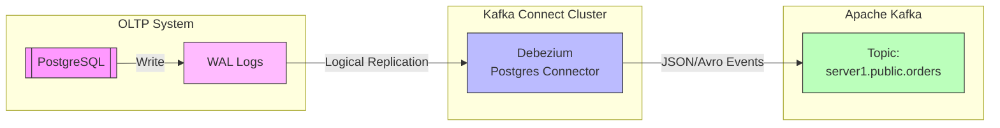
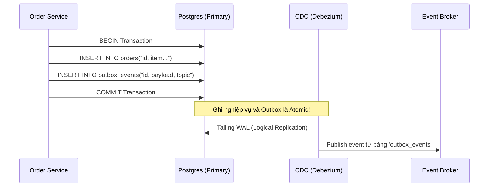

Lấy dữ liệu từ nguồn không chỉ đơn giản là việc gọi một câu lệnh `SELECT *` hoặc một API `GET`. Khi hệ thống phục vụ hàng chục ngàn Request/giây (RPS), bất kỳ một câu lệnh truy vấn phân tích (OLAP) vô tình nào chạy nhầm vào hệ thống tác nghiệp (OLTP) cũng có thể làm cạn kiệt Connection Pool, gây khóa bảng (Table Lock), và đánh sập hệ thống (Cascading Failure). 

Một Data/Software Engineer ở level Staff không nhìn hệ thống nguồn như những "bảng dữ liệu" tĩnh. Chúng tôi nhìn chúng như các **State Machines** và **Event Logs** phân tán, liên tục đối mặt với bài toán về tính nhất quán (Consistency), độ trễ (Latency) và giới hạn tài nguyên (Resource Limits).

---

## 1. Bản chất Hệ thống Tác nghiệp (OLTP) & Rủi ro Trích xuất (Operational Risks)

Hệ thống tác nghiệp (OLTP - Online Transaction Processing) như PostgreSQL, MySQL, hay MongoDB được thiết kế cho các giao dịch nhỏ, tốc độ cao (low latency), sử dụng kiến trúc lưu trữ dạng dòng (row-oriented storage) và B-Tree Index. Nhiệm vụ tối thượng của chúng là đảm bảo tính toàn vẹn giao dịch (ACID) cho người dùng cuối.

### 1.1 Vấn đề của Direct Query (Truy vấn trực tiếp)
* **Khóa tài nguyên (Resource Locking):** Nếu Data Pipeline của bạn chạy một câu lệnh `SELECT` kéo 50 triệu dòng để làm Full Extract hàng đêm, cơ sở dữ liệu sẽ phải giữ các Snapshot/Locks. Trong PostgreSQL, điều này ngăn cản tiến trình `VACUUM` dọn dẹp các Dead Tuples (các bản ghi cũ bị xóa/cập nhật), dẫn đến Table Bloat (phình to ổ cứng) và giảm hiệu năng nghiêm trọng cho toàn bộ hệ thống.
* **CPU & I/O Contention (Tranh chấp tài nguyên):** Truy vấn lớn sẽ đẩy cache của OLTP (như InnoDB Buffer Pool trong MySQL) ra ngoài ổ đĩa (Cache Eviction), làm tăng I/O latency cho các thao tác của Backend API.

**Giải pháp vật lý:**
Thay vì query thẳng vào Primary Node (Master), ta thiết lập **Read Replica** (bản sao đọc).
* **Trade-off:** Read Replica đồng bộ thông qua Replication Log (Asynchronous). Nếu Network chậm, Replication Lag có thể lên tới vài giây (thậm chí vài phút), khiến dữ liệu bạn trích xuất bị "stale" (cũ). Việc cấu hình Synchronous Replication (Đồng bộ) thì lại làm chậm thao tác Write trên Primary Node, vi phạm nguyên tắc Latency của OLTP.

---

## 2. Change Data Capture (CDC): Tiêu chuẩn Công nghiệp

Để giảm tải hoàn toàn cho Database nguồn và đạt được độ trễ tính bằng mili-giây, kiến trúc **CDC (Change Data Capture)** được áp dụng. CDC không query vào bảng, mà đọc trực tiếp vào **Transaction Logs** (WAL ở PostgreSQL, Binlog ở MySQL, Oplog ở MongoDB).

### Kiến trúc Debezium
Debezium là de facto standard mã nguồn mở cho CDC, thường được chạy như một plugin trên nền tảng Kafka Connect. 



### Deep Dive: PostgreSQL WAL & Replication Slots
Để triển khai CDC với Postgres, Debezium cần Postgres tạo một **Logical Replication Slot**. Replication Slot đảm bảo rằng Postgres *không được xóa* các WAL segment cho đến khi Debezium báo đã đọc (ACK) xong.

**Sự cố thực tế (Real-world Incident):**
Nếu hệ thống Kafka / Debezium bị sập trong cuối tuần (chẳng hạn do OOM) và không có ai trực On-call phát hiện, Replication Slot trên Postgres vẫn tiếp tục giữ các WAL logs lại. Do WAL logs liên tục sinh ra (vài chục GB mỗi giờ), phân vùng ổ cứng của Postgres sẽ bị đầy 100%. Khi Disk full, Postgres sẽ PANIC và sập toàn bộ hệ thống production.
* **Fix/Config:** Luôn phải monitor metric `pg_replication_slots` và cấu hình cảnh báo, kết hợp giới hạn `max_slot_wal_keep_size` (từ Postgres 13) để Postgres tự động drop slot nếu WAL giữ quá nhiều. Đứng ở góc độ Business, chúng ta **chấp nhận hy sinh pipeline dữ liệu để bảo vệ hệ thống Core OLTP**.

---

## 3. Dual Writes vs. Transactional Outbox Pattern

Khi kiến trúc phần mềm chuyển sang Microservices, một sự kiện (ví dụ: User đặt hàng thành công) cần được lưu vào DB nội bộ (Order DB), đồng thời phải đẩy vào Kafka để Data Warehouse hoặc các hệ thống khác (Inventory, Notification) tiêu thụ.

### 3.1 Cạm bẫy của Dual Writes
Nhiều kỹ sư Backend thiết kế code như sau:

```javascript
async function placeOrder(orderData) {
    // 1. Lưu vào Database
    await db.query('INSERT INTO orders ...'); 
    
    // 2. Publish sự kiện vào Kafka (Dual Write)
    await kafka.publish('orders_topic', orderData); 
}
```

Đây là mô hình **Dual Writes** (Ghi kép). Nếu hệ thống crash ngay sau bước 1 và trước bước 2 (hoặc Kafka đang bị rớt mạng), Database đã lưu đơn hàng, nhưng hệ thống downstream (Data/Analytics) không bao giờ nhận được sự kiện đó. Tính nhất quán bị phá vỡ vĩnh viễn (Inconsistent State). 

### 3.2 Transactional Outbox Pattern
Để giải quyết bài toán Atomicity (Tính nguyên tử) mà không dùng 2PC (Two-Phase Commit) vì quá chậm, ta sử dụng **Outbox Pattern** kết hợp với **Debezium CDC**.



**Thực chiến: Cấu hình Debezium Outbox Event Router**
Thay vì cấu hình Debezium bắt toàn bộ DB, ta dùng SMT (Single Message Transform) của Debezium để chỉ bắt bảng outbox và tự động định tuyến (route) event vào đúng topic.

```json
{
  "name": "outbox-connector",
  "config": {
    "connector.class": "io.debezium.connector.postgresql.PostgresConnector",
    "tasks.max": "1",
    "database.hostname": "postgres-primary",
    "database.port": "5432",
    "database.user": "debezium",
    "database.password": "secret",
    "database.dbname": "orderdb",
    "database.server.name": "ordrs",
    "table.include.list": "public.outbox_events",
    
    // Kích hoạt Outbox Event Router
    "transforms": "outbox",
    "transforms.outbox.type": "io.debezium.transforms.outbox.EventRouter",
    "transforms.outbox.route.topic.replacement": "${routedByValue}",
    "transforms.outbox.table.field.event.id": "id",
    "transforms.outbox.table.field.event.payload": "payload"
  }
}
```

* **Cơ chế:** Ghi dữ liệu nghiệp vụ và ghi event vào bảng `outbox_events` trong *cùng một Database Transaction*. Nếu 1 thao tác bị lỗi, cả 2 sẽ bị Rollback. Hệ thống luôn đảm bảo tính nhất quán Cuối (Eventual Consistency) 100%.
* **Trade-off:** Tăng khối lượng ghi (write I/O) trên Database chính, dẫn đến bảng `outbox_events` phình to liên tục. Cần có một tiến trình cron job định kỳ xóa dữ liệu cũ (Event Cleanup) hoặc dùng cơ chế Partitioning drop table.

---

## 4. API, Rate Limiting & Độ tin cậy mạng (Network Reliability)

Không phải hệ thống nguồn nào cũng là Database. Khi lấy dữ liệu từ các hệ thống SaaS bên thứ 3 (Salesforce, Zendesk, Stripe) qua API (REST/GraphQL), thách thức chuyển từ Disk I/O sang Mạng (Network) và Giới hạn tài nguyên (Rate Limiting).

### 4.1. Xử lý Rate Limits & Throttling
Các API SaaS luôn áp dụng thuật toán *Token Bucket* hoặc *Leaky Bucket*. Nếu pipeline của bạn bắn 1000 requests/giây để kéo dữ liệu, bạn sẽ lập tức bị khóa bằng mã lỗi `HTTP 429 Too Many Requests`.

Data Pipeline chạy Production không được phép crash vì 429. Chúng phải triển khai **Exponential Backoff with Jitter** (lùi lịch thử lại theo hàm mũ kèm độ trễ ngẫu nhiên). Độ trễ ngẫu nhiên (Jitter) giúp tránh hiện tượng "Thundering Herd" [Đàn trâu sấm sét] khi hàng ngàn threads cùng retry lại tại đúng một mili-giây, vô tình tự tạo ra một cuộc tấn công DDoS vào hệ thống.

```python
import time
import random
import requests

def api_request_with_backoff(url, max_retries=5):
    base_delay = 1.0  # seconds
    for attempt in range(max_retries):
        response = requests.get(url)
        if response.status_code == 200:
            return response.json()
        elif response.status_code in [429, 502, 503, 504]:
            # Calculate exponential backoff with full jitter
            temp = min(60, base_delay * (2 ** attempt])
            sleep_time = temp / 2 + random.uniform(0, temp / 2)
            time.sleep(sleep_time)
        else:
            response.raise_for_status()
    raise Exception("Max retries exceeded")
```

### 4.2. Pagination & Idempotency
SaaS API thường trả về dữ liệu qua nhiều trang (Cursor-based hoặc Offset-based). 
* Nếu pipeline sụp ở trang 99/100, bạn phải tải lại từ trang 1 nếu không thiết kế **Idempotency** (tính lũy đẳng) và Checkpointing. 
* Hệ thống trích xuất (Ingestion system) phải lưu lại Cursor (ID bản ghi cuối cùng đã xử lý thành công) vào một metadata store (như Redis hoặc DynamoDB) để khi Airflow chạy lại (resume) task bị lỗi, nó tiếp tục kéo từ ID đó thay vì chạy lại từ đầu, tiết kiệm API Quota quý giá.

---

## 5. Kiến trúc FinOps & Tối ưu chi phí (Cost Trade-offs)

Trong môi trường Cloud (AWS/GCP), mọi Data Engineer đều phải mang tư duy của FinOps. "Network Ingress/Egress" và "API Calls" đều tốn tiền thật.
* Trích xuất theo kiểu **Full Extract** hàng đêm [kéo vài TB dữ liệu qua HTTP] không chỉ giết chết network I/O mà chi phí Egress trên AWS có thể lên tới hàng chục nghìn đô la mỗi tháng.
* **Incremental Extract** (dựa trên cột `updated_at`) giảm chi phí băng thông cực kỳ hiệu quả, nhưng lại đòi hỏi câu query phải quét (scan) Index liên tục trên OLTP, tiêu tốn CPU. Hơn nữa, nó không bắt được các thao tác Hard Delete (Xóa cứng).
* Giải pháp tối ưu nhất cho cả chi phí I/O dài hạn và tính vẹn toàn dữ liệu vẫn là CDC (Debezium) + Kafka. Mặc dù chi phí Setup ban đầu và sự phức tạp trong vận hành (Ops Complexity) là rất cao, nhưng nó là lựa chọn duy nhất cho hệ thống Enterprise.

---

## Nguồn Tham Khảo (References)
* [Designing Data-Intensive Applications - Martin Kleppmann (Part 2: Distributed Data]][https://dataintensive.net/]
* [Debezium Architecture & Documentation][https://debezium.io/documentation/reference/stable/architecture.html]
* [Pattern: Transactional outbox - Microservices.io][https://microservices.io/patterns/data/transactional-outbox.html]
* [PostgreSQL Documentation: Logical Replication Slot & VACUUM Bloat][https://www.postgresql.org/docs/current/logicaldecoding-explanation.html]
* [AWS Architecture Blog: Exponential Backoff and Jitter](https://aws.amazon.com/blogs/architecture/exponential-backoff-and-jitter/]
