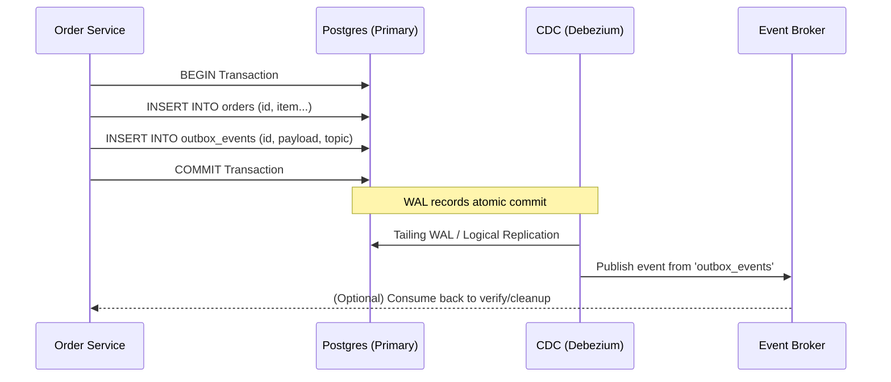

Lấy dữ liệu từ nguồn không chỉ là việc gọi `SELECT *` hoặc một API `GET` đơn giản. Khi hệ thống phục vụ hàng chục ngàn Request/giây (RPS), bất kỳ một câu lệnh truy vấn phân tích (OLAP) nào chạy nhầm vào hệ thống tác nghiệp (OLTP) cũng có thể làm cạn kiệt Connection Pool, gây khóa bảng (Table Lock), và đánh sập hệ thống (Cascading Failure).

Một Data/Software Engineer ở level Staff không nhìn hệ thống nguồn như những "bảng dữ liệu" tĩnh, mà nhìn chúng như các **State Machines** và **Event Logs** phân tán, liên tục đối mặt với bài toán về tính nhất quán (Consistency) và độ trễ (Latency).

---

## 1. Bản chất Hệ thống Tác nghiệp (OLTP) & Rủi ro Trích xuất (Operational Risks)

Hệ thống tác nghiệp (OLTP - Online Transaction Processing) như PostgreSQL, MySQL, hay MongoDB được thiết kế cho các giao dịch nhỏ, tốc độ cao (low latency), sử dụng row-oriented storage và B-Tree Index.

### 1.1 Vấn đề của Direct Query (Truy vấn trực tiếp)
* **Khóa tài nguyên (Resource Locking):** Nếu bạn chạy một câu lệnh `SELECT` kéo 50 triệu dòng, cơ sở dữ liệu sẽ phải giữ các Snapshot/Locks. Trong PostgreSQL, điều này ngăn cản tiến trình `VACUUM` dọn dẹp các Dead Tuples (các bản ghi cũ bị xóa/cập nhật), dẫn đến Table Bloat (phình to ổ cứng) và giảm hiệu năng nghiêm trọng.
* **CPU & I/O Contention:** Truy vấn lớn sẽ đẩy cache của OLTP (như InnoDB Buffer Pool trong MySQL) ra ngoài ổ đĩa (cache eviction), làm tăng I/O latency cho các thao tác của người dùng cuối.

**Giải pháp vật lý:**
Thay vì query thẳng vào Primary Node, ta thiết lập **Read Replica** (bản sao đọc).
* **Trade-off:** Read Replica đồng bộ thông qua Replication Log (Asynchronous). Nếu Network chậm, Replication Lag có thể lên tới vài giây, khiến dữ liệu bạn trích xuất bị "stale" (cũ). Việc cấu hình Synchronous Replication thì lại làm chậm thao tác Write trên Primary Node.

---

## 2. Change Data Capture (CDC): Tiêu chuẩn Công nghiệp

Để giảm tải hoàn toàn cho Database nguồn, kiến trúc **CDC (Change Data Capture)** được áp dụng. CDC không query vào bảng, mà đọc trực tiếp vào **Transaction Logs** (WAL ở PostgreSQL, Binlog ở MySQL).

### Kiến trúc Debezium
Debezium là de facto standard mã nguồn mở cho CDC, thường được chạy trên Kafka Connect.


*Hình: Kiến trúc tiêu chuẩn của Debezium stream dữ liệu thay đổi vào Kafka.*

### Deep Dive: PostgreSQL WAL & Replication Slots
Để triển khai CDC với Postgres, Debezium cần Postgres tạo một **Logical Replication Slot**. Replication Slot đảm bảo rằng Postgres *không được xóa* các WAL segment cho đến khi Debezium báo đã đọc (ACK) xong.

**Sự cố thực tế (Real-world Incident):**
Nếu hệ thống Kafka / Debezium bị sập trong cuối tuần và không ai phát hiện, Replication Slot trên Postgres vẫn tiếp tục giữ các WAL logs. Do WAL logs liên tục sinh ra (vài chục GB mỗi giờ), phân vùng ổ cứng của Postgres sẽ bị đầy 100%. Khi Disk full, Postgres sẽ PANIC và sập toàn bộ hệ thống production.
* **Fix/Config:** Luôn phải monitor metric `pg_replication_slots` và cấu hình cảnh báo, kết hợp giới hạn `max_slot_wal_keep_size` (từ Postgres 13) để Postgres tự động drop slot nếu WAL giữ quá nhiều, hy sinh pipeline dữ liệu để bảo vệ hệ thống Core OLTP.

---

## 3. Dual Writes vs. Transactional Outbox Pattern

Khi kiến trúc chuyển sang Microservices, một sự kiện (ví dụ: User đặt hàng) cần được lưu vào DB nội bộ (Order DB), đồng thời phải đẩy vào Kafka để Data Warehouse hoặc hệ thống khác tiêu thụ.

### 3.1 Cạm bẫy của Dual Writes
Nhiều kỹ sư thiết kế hàm như sau:

```javascript
async function placeOrder(orderData) {
    // 1. Lưu vào Database
    await db.query('INSERT INTO orders ...'); 
    // 2. Publish vào Kafka
    await kafka.publish('orders_topic', orderData); 
}
```

Đây là mô hình **Dual Writes**. Nếu hệ thống crash ngay sau bước 1 và trước bước 2, Database đã lưu đơn hàng, nhưng hệ thống downstream (Data/Analytics) không bao giờ nhận được sự kiện đó. Tính nhất quán bị phá vỡ (Inconsistent State). Sử dụng 2PC (Two-Phase Commit) thì lại quá chậm và dễ gây deadlock.

### 3.2 Transactional Outbox Pattern
Để giải quyết bài toán Atomicity, ta sử dụng **Outbox Pattern** kết hợp với **CDC**.



* **Cơ chế:** Ghi dữ liệu nghiệp vụ và ghi event vào bảng `outbox` trong cùng một Database Transaction. Nếu 1 cái fail, cả 2 sẽ rollback. Sau đó, Debezium chỉ cần bắt thay đổi trên bảng `outbox` và đẩy vào Kafka.
* **Trade-off:** Tăng khối lượng ghi (write I/O) trên Database chính, dẫn đến bảng `outbox` phình to. Cần có một tiến trình cron job định kỳ xóa dữ liệu cũ (Event Cleanup).

---

## 4. API, Rate Limiting & Độ tin cậy mạng (Network Reliability)

Khi lấy dữ liệu từ các hệ thống SaaS bên thứ 3 (Salesforce, Zendesk, Stripe) qua API (REST/GraphQL), thách thức không nằm ở cơ sở dữ liệu mà nằm ở Mạng (Network) và Giới hạn tài nguyên (Rate Limiting).

### 4.1. Xử lý Rate Limits & Throttling
Các API luôn áp dụng thuật toán *Token Bucket* hoặc *Leaky Bucket*. Nếu pipeline của bạn bắn 1000 requests/s, bạn sẽ lập tức nhận lỗi `HTTP 429 Too Many Requests`.

Pipeline không được phép crash. Chúng phải triển khai **Exponential Backoff with Jitter** (lùi lịch thử lại theo hàm mũ kèm độ trễ ngẫu nhiên). Độ trễ ngẫu nhiên (Jitter) giúp tránh hiện tượng "Thundering Herd" khi hàng ngàn threads cùng retry lại tại đúng một mili-giây.

```python
import time
import random
import requests

def api_request_with_backoff(url, max_retries=5):
    base_delay = 1.0  # seconds
    for attempt in range(max_retries):
        response = requests.get(url)
        if response.status_code == 200:
            return response.json()
        elif response.status_code in [429, 502, 503, 504]:
            # Calculate exponential backoff with full jitter
            temp = min(60, base_delay * (2 ** attempt))
            sleep_time = temp / 2 + random.uniform(0, temp / 2)
            time.sleep(sleep_time)
        else:
            response.raise_for_status()
    raise Exception("Max retries exceeded")
```

### 4.2. Pagination & Idempotency
SaaS API trả về dữ liệu qua nhiều trang (Cursor-based hoặc Offset-based). 
* Nếu pipeline sụp ở trang 99/100, bạn phải tải lại từ trang 1 nếu không thiết kế **Idempotency** (tính lũy đẳng) và Checkpointing. 
* Hệ thống trích xuất (Ingestion system) phải lưu lại Cursor (ID bản ghi cuối cùng) vào một metadata store để khi chạy lại (resume), nó tiếp tục lấy từ ID đó thay vì chạy lại từ đầu.

---

## 5. Kiến trúc FinOps & Tối ưu chi phí (Cost Trade-offs)

Trong Cloud, "Network Ingress/Egress" và "API Calls" đều tốn tiền.
* Trích xuất theo kiểu **Full Extract** hàng đêm (vài TB) không chỉ giết chết network I/O mà chi phí Egress trên AWS có thể lên tới hàng chục nghìn đô la.
* **Incremental Extract** (dựa trên cột `updated_at`) giảm chi phí băng thông, nhưng lại đòi hỏi truy vấn phải quét (scan) Index liên tục, tốn CPU.
* Giải pháp tối ưu nhất cho chi phí dài hạn vẫn là Kafka + CDC (Debezium), mặc dù chi phí Setup ban đầu và Ops Complexity (vận hành) rất cao.

---

## Nguồn Tham Khảo (References)
* [Designing Data-Intensive Applications - Martin Kleppmann (Part 2: Distributed Data)](https://dataintensive.net/)
* [Debezium Architecture & Documentation](https://debezium.io/documentation/reference/stable/architecture.html)
* [Pattern: Transactional outbox - Microservices.io](https://microservices.io/patterns/data/transactional-outbox.html)
* [PostgreSQL Documentation: Logical Replication Slot & VACUUM Bloat](https://www.postgresql.org/docs/current/logicaldecoding-explanation.html)
* [AWS Architecture Blog: Exponential Backoff and Jitter](https://aws.amazon.com/blogs/architecture/exponential-backoff-and-jitter/)
* [Confluent Blog: Dual Writes vs Outbox Pattern](https://www.confluent.io/blog/dual-write-problem/)
