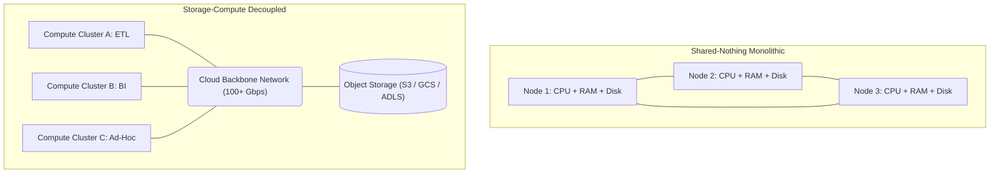
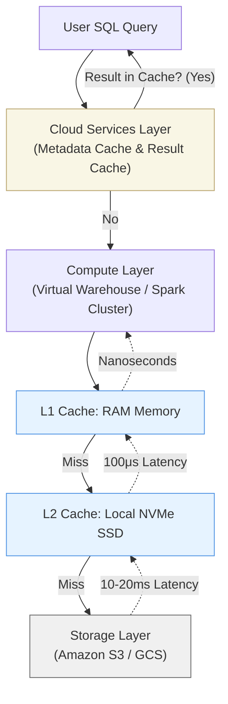

## 1. Sự Tiến Hóa Của Hệ Thống Phân Tán (Evolution of Distributed Systems)

Trong kỷ nguyên của hệ thống dữ liệu lớn thế hệ đầu tiên (Hadoop HDFS, Teradata), thiết kế chủ đạo là **Shared-Nothing Architecture**. Ở đó, Storage và Compute bị "khóa chặt" [Coupled] vào cùng một server vật lý (node). CPU phải xử lý dữ liệu nằm ngay trên ổ cứng cục bộ (DAS - Direct Attached Storage) của chính nó.

Sự trói buộc này sinh ra một bài toán vận hành thảm họa:
- **Coupled Scaling (Mở rộng bắt buộc):** Khi ổ cứng đầy, bạn phải mua thêm một node mới (tốn thêm tiền CPU và RAM đắt đỏ một cách lãng phí). Khi thiếu CPU, bạn mua thêm node và phải mất nhiều ngày để Rebalance (phân bổ lại) dữ liệu sang ổ cứng của node mới.
- **Workload Contention (Tranh chấp tài nguyên):** Một Batch Job ETL hạng nặng có thể vắt kiệt IOPS của ổ cứng và 100% CPU, làm tê liệt hoàn toàn các truy vấn báo cáo BI (Business Intelligence) chạy song song trên cùng cluster.

Việc dịch chuyển sang đám mây (Cloud Computing) đã sinh ra một khái niệm mang tính cách mạng: **Storage-Compute Decoupling (Tách biệt Lưu trữ và Tính toán)**.



Kiến trúc này biến Compute thành các **Stateless Worker Nodes (Node phi trạng thái)** có thể tự do mở rộng hoặc thu hẹp (Elastic), và Storage được phó thác cho các dịch vụ Cloud Object Storage cực kỳ bền bỉ nhưng siêu rẻ (AWS S3, GCS). Điểm nối giữa chúng là mạng lõi (Backbone Network) siêu tốc của Cloud Provider.

---

## 2. Deep Dive: Kiến Trúc 3 Tầng (3-Tier Architecture)

Một hệ thống Decoupled tiêu chuẩn (như Snowflake, Databricks SQL) thực chất không chỉ chia làm 2, mà bao gồm **3 tầng độc lập**:

### 2.1. Cloud Services / Metadata Layer (Tầng Não Bộ)
Đây là tập hợp các dịch vụ Stateful/Stateless quản lý Access Control, Query Parsing, Query Optimization, và quan trọng nhất là **Metadata (Siêu dữ liệu)**.
Tầng này lưu trữ thông tin về: 
- Bảng này gồm những file Parquet/Iceberg nào trên S3? 
- Giá trị Min/Max của các cột trong từng file là gì? (Cơ chế Bloom Filters / Z-Ordering).

**Mục đích cốt lõi:** Thực hiện **Data Pruning** — loại bỏ việc đọc các block dữ liệu không cần thiết *trước* khi Compute Layer phải gọi I/O mạng xuống Storage Layer.

### 2.2. Compute Layer (Tầng Thực Thi)
Bao gồm các cụm máy chủ ảo (EC2, GCE) được Provision theo yêu cầu.
Đặc tính kỹ thuật của tầng này là **MPP (Massively Parallel Processing)** và **Ephemeral (Phù du)**. Bạn có thể bật 100 node trong 2 phút để xử lý một truy vấn khổng lồ, và tắt chúng đi ngay lập tức (Scale-to-zero). Tính độc lập này mang lại **Workload Isolation** tuyệt đối: Cluster ETL bị OOM (Out of Memory) cũng không làm gián đoạn Cluster BI.

### 2.3. Storage Layer (Tầng Lưu Trữ)
Dữ liệu được lưu trữ dưới định dạng Columnar (Parquet, ORC) trên Object Storage. Do bản chất Object Storage (như Amazon S3) không hỗ trợ Cập nhật tại chỗ (In-place updates) hoặc Nối thêm (Append), dữ liệu được coi là **Immutable** (Bất biến).
Khi có sự thay đổi (UPDATE/DELETE), các Table Formats (Apache Iceberg, Delta Lake) sẽ tạo file Parquet mới và trỏ con trỏ Metadata về phiên bản mới (Cơ chế MVCC - Multi-Version Concurrency Control).

---

## 3. Systemic Trade-offs: Đánh Đổi Độ Trễ mạng (Network Latency) Lấy Khả Năng Mở Rộng

Không có kiến trúc nào là "Viên đạn bạc" (Silver Bullet). Tách biệt Storage và Compute sinh ra một vấn đề vật lý nhức nhối: **Network Latency (Độ trễ mạng)**.

Truy xuất dữ liệu trên ổ NVMe SSD cục bộ chỉ mất khoảng `10-100 microseconds` (Micro-giây). 
Việc gọi API qua mạng HTTP tới S3 (`GET Object`) thường mất từ `10 - 20 milliseconds` (Mili-giây) — **chậm hơn từ 100 đến 1000 lần**.

Để che lấp khuyết điểm vật lý này, các kỹ sư hệ thống sử dụng một thiết kế Caching nhiều lớp cực kỳ tinh vi:



1. **Result Cache:** Nếu truy vấn giống hệt một truy vấn đã chạy trước đó và Data nền chưa thay đổi, hệ thống trả luôn kết quả từ Metadata Layer trong vòng 5 mili-giây. Compute Layer thậm chí không bị đánh thức.
2. **Local Disk Cache (Data Cache):** Compute nodes sử dụng các dòng Cloud Instance có ổ cứng NVMe (như dòng `i3/i4` trên AWS). Lần đầu kéo file từ S3, nó được ghi chép vào NVMe cục bộ. Truy vấn thứ 2 chạm vào cùng khối dữ liệu đó sẽ được đọc với tốc độ bàn thờ của Local SSD.
3. **Lazy Fetching & Predicate Pushdown:** Nhờ Metadata Cache, Compute không tải toàn bộ file 1GB từ S3. Nó đọc Footer của Parquet, xác định Byte-range của cột cần thiết, và gọi HTTP `GET` với header `Range: bytes=500-1000` để chỉ lấy đúng 500 byte dữ liệu qua mạng.

---

## 4. Quản Lý Rủi Ro Vận Hành & FinOps

Trong thực tế triển khai, kiến trúc này sinh ra các rủi ro vận hành có thể đốt cháy ngân sách Cloud của công ty nếu Data Engineer không kiểm soát được (FinOps).

### 4.1. Bài Toán "Cold Start" và Auto-Suspend
Để tiết kiệm chi phí, bạn cấu hình Compute Cluster tự động tắt (Auto-suspend) sau 1 phút không có truy vấn.
**Sự cố:** Cluster dùng để phục vụ Tableau Dashboard liên tục bị tắt đi. 3 phút sau Giám đốc Refresh lại trang. Cluster bật lên (mất vài giây), nhưng thảm họa là **Local NVMe Cache đã bị xóa trắng (Evicted)** khi máy ảo bị tắt. Truy vấn phải scan lại từ S3 qua mạng, mất 30 giây thay vì 1 giây.
**Cách fix:** Đối với BI Cluster, thời gian Auto-suspend nên cấu hình từ `10 - 15 phút` để "giữ ấm" Cache (Warm Cache).

```sql
-- Đoạn mã Snowflake cấu hình một Warehouse cho hệ thống BI
-- Giữ trạng thái ấm (Warm) trong 15 phút (900s) để đảm bảo trải nghiệm tốt nhất
CREATE OR REPLACE WAREHOUSE bi_dashboard_wh
WITH
    WAREHOUSE_SIZE = 'LARGE'
    AUTO_SUSPEND = 900  -- Trễ 15 phút tắt máy để giữ Cache
    AUTO_RESUME = TRUE
    MIN_CLUSTER_COUNT = 1
    MAX_CLUSTER_COUNT = 3  -- Auto Scale-out ra tối đa 3 cluster khi có hàng trăm concurrent users
    SCALING_POLICY = 'STANDARD';
```

### 4.2. Cơn Ác Mộng File Nhỏ (The Small Files Problem)
Kiến trúc Decoupled chết đứng trước hiện tượng "Too many small files". Đánh đổi tốc độ Ingestion nhanh (Streaming), pipeline của bạn cứ 1 giây nhả ra 1 file JSON/Parquet 50KB xuống S3.
Đọc 10,000 file 50KB sẽ tạo ra 10,000 Network HTTP Requests. Độ trễ Overhead của giao thức TCP/TLS sẽ cộng dồn khiến truy vấn treo cả tiếng đồng hồ. Thêm vào đó, Cloud Provider tính phí bạn theo số lượng `GET` requests (ví dụ \$0.0004 mỗi 1000 request), dẫn đến hóa đơn I/O cao khủng khiếp.

**Kịch bản thực tế (Iceberg/Delta):** Phải liên tục setup các Job Compaction chạy ngầm ban đêm để gom file nhỏ thành file lớn (512MB).
```sql
-- Gọi thủ tục tối ưu hóa định kỳ (Compaction) trong Apache Iceberg
CALL catalog.system.rewrite_data_files(
    table => 'silver.streaming_events',
    strategy => 'sort',
    sort_order => 'event_time DESC',
    options => map(
        'target-file-size-bytes', '536870912' -- Nén thành file 512MB chuẩn hóa I/O
    )
);
```

### 4.3. Data Egress Costs (Chi Phí Băng Thông Xuyên Vùng)
Một sai lầm kinh điển của các kỹ sư non tay: Đặt S3 Bucket ở AWS Region `us-east-1`, nhưng lại spin-up Kubernetes Compute/Databricks workspace ở AWS `us-west-2`.
Cloud Provider tính phí dữ liệu truyền ra khỏi Region (Egress fee) vào khoảng `\$0.02 - \$0.09 / GB`. Quét 100TB dữ liệu sẽ mất ngay hàng nghìn Đô la chỉ cho phí chuyển mạng băng thông rác.
**Giải pháp cứng:** Luôn ràng buộc IaC (Terraform) cấu hình Storage và Compute đồng bộ Region.

```hcl
# Terraform: Đảm bảo Compute và Storage nằm cùng Region để tránh Egress Cost
resource "aws_s3_bucket" "data_lake" {
  bucket = "company-data-lake-prod"
  region = "us-east-1"
}

resource "databricks_mws_workspaces" "compute_workspace" {
  workspace_name = "data-eng-compute-workspace"
  aws_region     = "us-east-1" # BẮT BUỘC KHỚP VỚI S3 REGION
}
```

---

## 5. Implementations Trong Đời Thực: Snowflake vs BigQuery

Mặc dù có chung nguyên lý tách biệt, mỗi nền tảng có một cách Implement riêng biệt đầy thú vị:

### 5.1. Snowflake: Multi-Cluster Shared-Data
Snowflake sử dụng kiến trúc hoàn toàn tách biệt. Dữ liệu được băm nhỏ thành các *Micro-partitions* khoảng 16-64MB. Các Virtual Warehouses (Compute) hoạt động hoàn toàn độc lập và tự kéo Micro-partition về SSD NVMe cục bộ để Cache. Ưu điểm tuyệt đối là Workload Isolation rất mạnh (ETL không bao giờ tranh giành tài nguyên của BI).

### 5.2. Google BigQuery: Serverless In-Memory Shuffle
Kiến trúc Dremel của BigQuery không phụ thuộc quá nhiều vào Local Disk Cache ở tầng Compute. Tại sao? Nhờ vào hạ tầng mạng cực đoan của Google (**Mạng Jupiter**).
Tốc độ mạng nội bộ của Google Cloud lên tới **Petabit/s**, nhanh đến mức việc kéo dữ liệu thẳng từ Colossus (Storage Filesystem của Google) lên Dremel (Compute) gần như ngang với tốc độ đọc ổ cứng cục bộ.
Khi thực hiện JOIN khổng lồ, BigQuery đẩy thẳng dữ liệu trung gian vào RAM của một hạm đội hàng nghìn server Shuffle chuyên dụng (In-Memory Shuffle Tier). Đó là lý do BigQuery gần như không bao giờ bị văng lỗi OOM (Out of Memory).

---

## 6. Tổng Kết

Storage-Compute Decoupling không chỉ giải quyết bài toán giới hạn phần cứng, nó định hình lại toàn bộ quy trình làm việc (DataOps) của Data Engineer. Nó biến Data Warehouse từ một "vật thể tĩnh" đắt đỏ thành một dịch vụ "chỉ trả tiền cho mỗi lần uống nước". Hiểu sâu về thiết kế vật lý này giúp kỹ sư tối ưu hóa chi phí (FinOps), thiết lập các cụm tài nguyên thông minh (Warm Cache) và giải quyết triệt để vấn đề "Data Silos".

---

## Nguồn Tham Khảo [References]

1. **Snowflake Architecture:** [The Snowflake Elastic Data Warehouse (SIGMOD 2016]][https://dl.acm.org/doi/10.1145/2882903.2903741]
2. **Google Dremel (BigQuery):** [Interactive Analysis of Web-Scale Datasets (VLDB 2010]][https://research.google/pubs/pub36632/]
3. **Delta Lake:** [High-Performance ACID Table Storage over Cloud Object Stores](https://www.vldb.org/pvldb/vol13/p3411-armbrust.pdf]
4. **Designing Data-Intensive Applications** - Martin Kleppmann (Part 2: Distributed Data). Sách kinh điển về kiến trúc phân tán.
5. **FinOps Foundation:** Quản trị chi phí Egress và Data Transfer trên Cloud.
