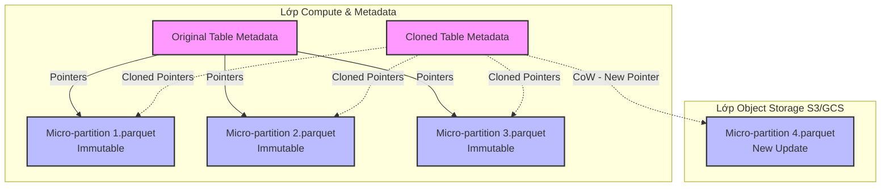

Trong các hệ thống Distributed Data Warehouse hiện đại (Snowflake, BigQuery) hay Data Lakehouse (Databricks/Delta Lake), **Zero-Copy Cloning** không phải là một phép màu. Về bản chất, nó là một thủ thuật thao tác trên cây metadata (Metadata-driven operation) kết hợp với kiến trúc lưu trữ bất biến (Immutable Storage) và cơ chế Copy-on-Write (CoW). 

Thay vì sao chép vật lý hàng Terabytes hay Petabytes dữ liệu qua network (một quá trình tốn kém I/O, Network Bandwidth và Storage), hệ thống chỉ việc nhân bản các con trỏ (pointers) trong hệ quản trị siêu dữ liệu (thường là Transaction Log hoặc Key-Value store như FoundationDB).

Bài viết này sẽ mổ xẻ kiến trúc bên dưới của Zero-Copy Cloning, tập trung vào thiết kế hệ thống, các điểm nghẽn (bottlenecks), rủi ro vận hành và bài toán FinOps.

---

## 1. Kiến Trúc Vật Lý & Lớp Siêu Dữ Liệu (Metadata Architecture)

Các hệ thống Cloud Data hiện đại đều tuân thủ nguyên tắc thiết kế **Tách biệt Storage và Compute (Decoupled Storage & Compute)**. Dữ liệu vật lý (Physical Data) được lưu trữ dưới dạng các tệp cột (Columnar files) như Parquet trên Object Storage (S3, GCS). Tuy nhiên, "bộ não" thực sự quản lý các tệp này lại là lớp Metadata.

### 1.1. Cấu trúc Metadata
Trong Snowflake, metadata của toàn bộ cluster được lưu trữ trong một hệ thống Key-Value phân tán, có tính nhất quán cao (FoundationDB). Các bảng được quản lý bằng một tập hợp các con trỏ trỏ tới các **Micro-partitions** (mỗi phân vùng khoảng 16MB - 500MB dữ liệu nén). 

Trong Delta Lake, lớp metadata này chính là **Transaction Log (`_delta_log`)**, lưu trữ dưới dạng JSON/Parquet chứa danh sách các tệp Parquet cấu thành nên bảng tại một phiên bản (version) cụ thể.



Khi lệnh Clone được kích hoạt, hệ thống **không chạm vào Object Storage**. Quá trình O(1) này chỉ duyệt qua cây metadata của bảng gốc và sao chép các tham chiếu (references/pointers) sang một đối tượng metadata mới. 

---

## 2. Cơ Chế Copy-on-Write (CoW) / Allocate-on-Write

Trạng thái "Zero-Copy" chỉ đúng ở thời điểm T0 (lúc vừa thực hiện clone). Kể từ T1, khi bản clone hoặc bản gốc có phát sinh các thao tác DML (INSERT/UPDATE/DELETE), nguyên lý **Copy-on-Write (CoW)** sẽ được kích hoạt.

Do các file dữ liệu (Parquet/Micro-partitions) là **Bất biến (Immutable)**, một thao tác UPDATE không ghi đè dữ liệu trực tiếp lên file cũ. Thay vào đó:

1. Hệ thống đọc file cũ vào memory (hoặc SSD cache cục bộ của Compute Node).
2. Áp dụng thay đổi.
3. Ghi ra một (hoặc nhiều) file Parquet mới xuống Object Storage.
4. Cập nhật Metadata của đối tượng bị thay đổi (Bản gốc hoặc Bản clone) để trỏ sang file mới. Các pointer cũ vẫn được giữ cho đến khi hết chu kỳ Time Travel hoặc Vacuum.

### Ví dụ về cấu hình và vận hành:

**SQL (Delta Lake Shallow Clone):**
```sql
-- Tạo Shallow Clone trong Databricks để cô lập môi trường test
-- Lưu ý: Phụ thuộc vào file Parquet của prod_db.user_data
CREATE TABLE sandbox_db.user_data_clone 
SHALLOW CLONE prod_db.user_data
VERSION AS OF 150;
```

**Terraform (Snowflake Clone):**
```hcl
resource "snowflake_database" "dev_db" {
  name          = "PROD_CLONE_DEV"
  from_database = "PROD_DB"
  # Tận dụng Zero-copy clone ở cấp độ Database
  # Tiết kiệm toàn bộ chi phí storage ban đầu cho hàng trăm TB
}
```

---

## 3. Rủi Ro Vận Hành & Quản Lý Vòng Đời (Lifecycle Risks)

Việc lạm dụng Cloning mà không hiểu rõ kiến trúc có thể dẫn đến các sự cố nghiêm trọng (Incident) trên môi trường Production.

### 3.1. Bài toán Garbage Collection & Vacuuming (Nỗi đau của Delta Lake)
Với Snowflake, hệ thống quản lý lưu trữ là một hộp đen (black box). Storage engine của họ tự động đếm tham chiếu (Reference Counting) để biết khi nào một micro-partition thực sự không còn ai trỏ tới (cả gốc, clone, và time-travel đều hết hạn) để tiến hành xóa đi (Garbage Collection) một cách an toàn.

Tuy nhiên, với các Open Table Formats như **Delta Lake** hay **Apache Iceberg**, storage thường nằm trên bucket S3 mà Data Team tự quản lý. 
Hãy tưởng tượng Incident sau:
- T0: Tạo một **Shallow Clone** từ bảng Production sang môi trường Research.
- T7: Một tuần sau, Data Pipeline trên Production chạy lệnh `VACUUM` để dọn dẹp các data files cũ nhằm tối ưu chi phí lưu trữ S3. 
- Nếu cấu hình `vacuum_retention` thấp hơn tuổi thọ của bản clone, lệnh `VACUUM` này sẽ **xóa sạch các tệp vật lý** trên S3 mà bản clone đang trỏ tới.
- **Kết quả (Impact):** Bản clone bị "mồ côi" (Orphaned pointers), các Data Scientist query vào sẽ nhận lỗi `FileNotFoundException` và job training ML sụp đổ hoàn toàn.

**Troubleshooting / Fix:**
- Bắt buộc phải tăng `VACUUM RETENTION` trên bảng gốc nếu biết hệ thống đang phục vụ shallow clones dài hạn.
- Thay vì dùng Shallow Clone, hãy sử dụng **Deep Clone** cho các môi trường tồn tại độc lập lâu dài (Long-lived environments).

### 3.2. Hiệu Ứng Phân Mảnh (Fragmentation) & Write Amplification
Một nhược điểm lớn của CoW kết hợp với cấu trúc Columnar lớn là **Write Amplification (Khuếch đại ghi)**.
Giả sử bạn có 1 row cần update (chỉ 10 bytes), row đó nằm trong 1 micro-partition nặng 250MB. Khi update row đó ở bản clone, hệ thống bắt buộc phải tải 250MB lên RAM của Compute node, sửa 10 bytes, và ghi xuống Object Storage 1 cục Parquet 250MB mới. 
Nếu thực hiện các batch update nhỏ rải rác liên tục trên bản clone, Storage Cost cho bản clone sẽ tăng vọt nhanh chóng theo cấp số nhân (đây chính là lúc ảo mộng "Zero-Cost Storage" tan vỡ).

---

## 4. FinOps & Đánh Đổi Hiệu Năng (Systemic Trade-offs)

Mọi quyết định kiến trúc đều là sự đánh đổi. Zero-Copy Cloning đánh đổi **Complex Metadata Management (Độ phức tạp quản lý Metadata)** lấy **Storage Cost & I/O Speed (Tốc độ khởi tạo và tiết kiệm lưu trữ)**.

### Trade-offs:
1. **Latency vs. Throughput in Metadata Query Planning:**
   - Việc có quá nhiều bản clone từ clone (Clone of a clone of a clone) tạo ra một chuỗi phụ thuộc (dependency chain) cực dài trong cây metadata. Mặc dù I/O throughput trên Object Storage vẫn cao (khi đã lấy được data), nhưng bước Query Planning (đọc metadata để xác định file nào hợp lệ cần quét) có thể bị tăng Latency đáng kể.
2. **Compute Cost vs Storage Cost:**
   - Dù tiết kiệm tiền lưu trữ ban đầu, việc query bản clone vẫn tiêu thụ Compute (Virtual Warehouses). Khi Data Team clone quá dễ dàng, rủi ro "Sprawl" (hàng chục bản clone bị bỏ quên) xuất hiện. Họ chạy các ad-hoc analytical queries trên các bản clone mồ côi khiến hóa đơn Compute (Snowflake Credits / Databricks DBUs) tăng đột biến.

### Best Practices cho Staff Engineer:
- **Nguyên tắc "Ephemeral Clones":** Mọi bản clone phục vụ cho luồng CI/CD (như kiểm thử dbt models) cần được gắn script tự động `DROP` sau khi pipeline chạy xong. Tuyệt đối không coi clone là phương án sao lưu (backup) dài hạn thay cho snapshots.
- **Monitoring Data Drift:** Thiết lập hệ thống observability để theo dõi mức độ phân kỳ (Data Drift) giữa bản gốc và bản clone. Khi lượng dữ liệu phân kỳ (bytes_changed) vượt quá 50%, lợi ích FinOps của Zero-Copy không còn đáng kể, nên cân nhắc tạo bảng độc lập (CTAS).

---

## Nguồn Tham Khảo (References)

1. [Snowflake Documentation: Cloning Considerations](https://docs.snowflake.com/en/user-guide/object-clone)
2. [Databricks: Shallow vs Deep Clone in Delta Lake](https://docs.databricks.com/en/delta/clone.html)
3. [Google Cloud: BigQuery Table Clones Architecture](https://cloud.google.com/bigquery/docs/table-clones-intro)
4. *Designing Data-Intensive Applications* - Martin Kleppmann (Part 2: Distributed Data - Giải thích cơ chế Copy-on-Write).
