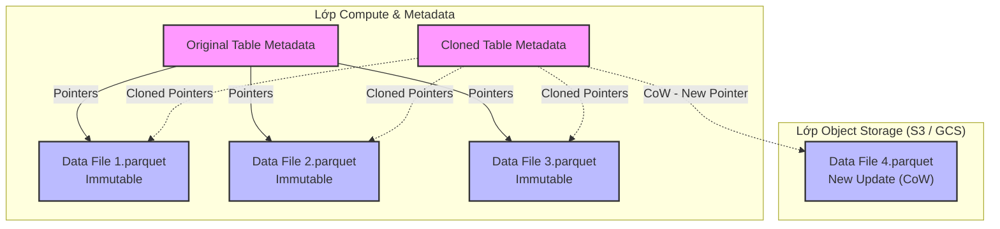

Trong các nền tảng Data Warehouse / Lakehouse hiện đại (Snowflake, BigQuery, Delta Lake, Apache Iceberg), **Zero-Copy Cloning** thường được quảng cáo như một phép màu có thể "nhân bản 1 Petabyte dữ liệu trong 1 giây mà không tốn một xu phí lưu trữ".

Dưới góc nhìn của một Staff Engineer, Zero-Copy Cloning không phải là phép màu. Về bản chất, nó là một thủ thuật thao tác trên cây siêu dữ liệu (Metadata-driven operation) kết hợp với kiến trúc **Lưu trữ Bất biến (Immutable Storage)** và cơ chế **Copy-on-Write (CoW)**. Bài viết này sẽ mổ xẻ kiến trúc vật lý bên dưới, các điểm nghẽn (Bottlenecks), rủi ro vận hành và bài toán FinOps.

---

## 1. Kiến Trúc Vật Lý & Lớp Siêu Dữ Liệu (Metadata Architecture)

Các hệ thống Cloud Data hiện đại đều tuân thủ nguyên tắc thiết kế **Tách biệt Storage và Compute (Decoupled Storage & Compute)**. Dữ liệu vật lý được lưu trữ dưới dạng các tệp định dạng cột (như Parquet) trên Object Storage (S3, GCS). Tuy nhiên, "bộ não" thực sự quản lý các tệp này lại là lớp Metadata.

### 1.1. Cấu trúc Metadata Pointers
- **Snowflake:** Metadata của toàn bộ Cluster được lưu trữ trong một hệ thống Key-Value phân tán nội bộ (được cho là FoundationDB). Các bảng được quản lý bằng một tập hợp các con trỏ (Pointers) trỏ tới các **Micro-partitions** (mỗi phân vùng khoảng 16MB - 500MB dữ liệu nén). 
- **Apache Iceberg / Delta Lake:** Lớp metadata này chính là cây thư mục (Manifest Lists $\rightarrow$ Manifests $\rightarrow$ Data Files) hoặc Transaction Log (`_delta_log`).



Khi lệnh Clone được kích hoạt, hệ thống **không chạm vào Object Storage**. Quá trình độ phức tạp $\mathcal{"O"}(1)$ này chỉ duyệt qua cây metadata của bảng gốc và sao chép các tham chiếu (References/Pointers) sang một Table Metadata mới. Tại thời điểm T0, dung lượng vật lý tiêu thụ là 0 bytes.

---

## 2. Cơ Chế Copy-on-Write (CoW)

Trạng thái "Zero-Copy" chỉ đúng ở khoảnh khắc nó vừa sinh ra. Kể từ T1, khi bản Clone hoặc bản Gốc có phát sinh các thao tác DML (INSERT/UPDATE/DELETE), nguyên lý **Copy-on-Write (CoW)** sẽ được kích hoạt để đảm bảo tính cô lập (Write Isolation).

Do các file dữ liệu (Parquet) trên S3 là **Bất biến (Immutable)**, một thao tác UPDATE không thể ghi đè lên file cũ. Thay vào đó:
1. Hệ thống đọc file cũ vào Memory của Compute Node.
2. Áp dụng thay đổi.
3. Ghi ra một (hoặc nhiều) file Parquet mới xuống Object Storage.
4. Cập nhật Metadata của đối tượng bị thay đổi (bản Clone) để trỏ sang file mới. Metadata của bản Gốc vẫn trỏ vào file cũ.

Lúc này, dung lượng lưu trữ bắt đầu phân kỳ (Diverge) và bạn bắt đầu phải trả thêm tiền Storage cho Cloud Provider.

### Ví dụ Vận Hành:
**SQL (Delta Lake Shallow Clone):**
```sql
-- Tạo Shallow Clone trong Databricks để cô lập môi trường test
-- Chỉ copy metadata, chia sẻ chung Parquet files với prod_db
CREATE TABLE sandbox_db.user_data_clone 
SHALLOW CLONE prod_db.user_data
VERSION AS OF 150;
```

**Terraform (Snowflake Clone):**
```hcl
resource "snowflake_database" "dev_db" {
  name          = "PROD_CLONE_DEV"
  from_database = "PROD_DB"
  # Tận dụng Zero-copy clone ở cấp độ toàn bộ Database
  # Môi trường DEV có dữ liệu hệt như PROD trong tích tắc
}
```

---

## 3. Rủi Ro Vận Hành & Quản Lý Vòng Đời (Lifecycle Risks)

Việc lạm dụng Cloning mà không hiểu kiến trúc bên dưới có thể dẫn đến các sự cố nghiêm trọng (Incident).

### 3.1. Bài toán Garbage Collection (Nỗi đau của Delta / Iceberg)
Với Snowflake, hệ thống lưu trữ là một hộp đen. Storage Engine của họ tự động đếm tham chiếu (Reference Counting) để biết khi nào một Micro-partition *thực sự* không còn ai trỏ tới (cả Gốc, Clone, và Time-Travel đều đã hết hạn) để tiến hành xóa vật lý một cách an toàn.

Tuy nhiên, với các Open Table Formats (Iceberg, Delta Lake), Storage nằm trên S3 mà Data Team tự quản lý. Hãy tưởng tượng kịch bản sau:
- **T0:** Tạo một **Shallow Clone** từ bảng Production sang môi trường Research.
- **T7:** Một tuần sau, Data Pipeline trên Production chạy lệnh `VACUUM` (hoặc Expire Snapshots) để dọn dẹp các data files cũ nhằm tối ưu chi phí S3.
- Do bảng Production không "biết" rằng bảng Clone ở môi trường Research vẫn đang cần dùng các file cũ đó, lệnh `VACUUM` sẽ **xóa sạch các tệp vật lý** trên S3.
- **Hậu quả (Impact):** Bảng Clone trở thành trẻ mồ côi (Orphaned pointers). Mọi câu Query từ Data Scientist sẽ văng lỗi `FileNotFoundException` và job ML sụp đổ hoàn toàn.

> **Giải pháp:** Nếu cần một môi trường độc lập dài hạn, hãy dùng **Deep Clone** (copy vật lý). Shallow Clone chỉ nên dùng cho các luồng CI/CD sống ngắn hạn (Ephemeral).

### 3.2. Hiệu Ứng Phân Mảnh (Write Amplification)
Một nhược điểm tàn khốc của CoW kết hợp với Columnar format là **Write Amplification (Khuếch đại ghi)**.
Giả sử bạn cần update 1 row (chỉ nặng 10 bytes), nhưng row đó lại nằm trong 1 file Parquet nặng 250MB. Khi update ở bản Clone, hệ thống bắt buộc phải tải 250MB lên RAM, sửa 10 bytes, và ghi ra đĩa 1 cục Parquet 250MB mới toanh. 
Nếu bạn chạy các script `UPDATE` rải rác liên tục trên bản Clone, Storage Cost sẽ bùng nổ theo cấp số nhân, phá nát ảo mộng "Zero-Cost Storage".

---

## 4. FinOps & Đánh Đổi Hệ Thống (Systemic Trade-offs)

### 4.1. Clone Sprawl (Bãi rác Clone)
Vì tạo Clone quá dễ (gần như tức thì và "miễn phí"), các Engineer thường tạo ra hàng chục bản Clone để test rồi... quên luôn. 
- Mặc dù Storage không tốn thêm lúc đầu, nhưng khi dữ liệu phân kỳ, chi phí lưu trữ sẽ tăng ngầm.
- Quan trọng hơn, người dùng sẽ chạy các Heavy Queries trên các bản Clone này, đốt sạch hạn mức Compute (Snowflake Credits / Databricks DBUs). 

### 4.2. Metadata Latency (Độ trễ do truy xuất cây siêu dữ liệu)
Nếu bạn tạo "Clone của một Clone của một Clone", bạn vô tình tạo ra một chuỗi phụ thuộc [Dependency Chain] khổng lồ trong hệ thống Metadata. 
Quá trình Query Planning (đọc metadata để xác định file nào hợp lệ cần quét trước khi thực thi) sẽ tốn rất nhiều thời gian, làm tăng độ trễ (Latency) của truy vấn.

### 4.3. Lỗ hổng Governance (Bảo mật)
Tại một số nền tảng, bản Clone không tự động thừa kế (inherit) các chính sách bảo mật động (như Row-level security hay Dynamic Data Masking) từ bản Gốc. Nếu không cẩn thận, việc clone database Production sang môi trường DEV sẽ làm lộ toàn bộ dữ liệu PII của người dùng ra ngoài.

## 5. Tổng Kết

**Zero-Copy Cloning** là một tính năng kiến trúc xuất sắc, nhưng nó đòi hỏi một Staff Engineer phải thiết lập **Guardrails (Vành đai bảo vệ)** rõ ràng:
1. Mọi bản Clone phục vụ CI/CD / Testing phải là **Ephemeral** (Tự động `DROP` sau khi test xong hoặc sau 24h).
2. Thiết lập Data Observability để theo dõi độ phân kỳ (Data Drift). Khi bản Clone đã phân kỳ quá 50% so với bản gốc, hãy cân nhắc tạo thành một bảng vật lý độc lập (CTAS).
3. Tuyệt đối không dùng Shallow Clone làm phương án Backup / Disaster Recovery dài hạn thay cho Storage Snapshots thực thụ.

## Nguồn Tham Khảo (References)
* [Snowflake Documentation: Cloning Considerations][https://docs.snowflake.com/en/user-guide/object-clone]
* [Databricks: Shallow vs Deep Clone in Delta Lake][https://docs.databricks.com/en/delta/clone.html]
* [Apache Iceberg: Branching and Tagging][https://iceberg.apache.org/docs/latest/branching/]
* [Designing Data-Intensive Applications - Martin Kleppmann (Part 2: Distributed Data]](https://dataintensive.net/)
