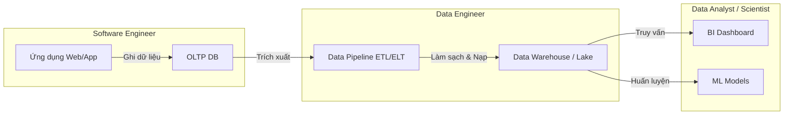
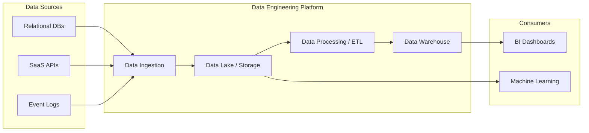

Trong kỷ nguyên số, chúng ta thường nghe nhiều về Trí tuệ nhân tạo (AI), Học máy (Machine Learning) hay những bảng dashboard phân tích kinh doanh (BI) lung linh sắc màu. Thế nhưng, đằng sau những báo cáo chuẩn xác hay những mô hình AI thông minh đó là một người hùng thầm lặng: **Kỹ thuật Dữ liệu (Data Engineering)** và các **Kỹ sư Dữ liệu (Data Engineers)**.

Nếu ví dữ liệu như dòng dầu mỏ quý giá, thì Kỹ sư Dữ liệu chính là những người thiết kế và vận hành các nhà máy lọc dầu cũng như hệ thống đường ống dẫn dầu khổng lồ, biến nguồn nguyên liệu thô sơ, lẫn tạp chất thành nguồn năng lượng tinh khiết, sẵn sàng đưa vào sử dụng. Về bản chất, Data Engineer là một kỹ sư phần mềm chuyên biệt hóa trong lĩnh vực dữ liệu, chịu trách nhiệm "lát đường" để dòng chảy thông tin trong tổ chức luôn thông suốt và đáng tin cậy.

---

## Kỹ thuật Dữ liệu & Kỹ sư Dữ liệu là gì?

* **Kỹ thuật Dữ liệu (Data Engineering)** là một lĩnh vực chuyên môn tập trung vào việc thiết kế, xây dựng, vận hành và duy trì hệ thống kiến trúc dữ liệu quy mô lớn. Đây là sự giao thoa hài hòa giữa Kỹ thuật phần mềm (`Software Engineering`) và Quản trị dữ liệu (`Data Management`).
* **Kỹ sư Dữ liệu (Data Engineer - DE)** chịu trách nhiệm thiết kế, xây dựng và vận hành hạ tầng luân chuyển, xử lý dữ liệu. Nhiệm vụ cốt lõi của họ là vận chuyển dữ liệu từ các hệ thống nguồn (thường ở dạng thô, phân tán và chưa có cấu trúc) đến các kho lưu trữ dữ liệu tập trung dưới dạng đã được làm sạch, biến đổi và tối ưu hóa để sẵn sàng cho việc phân tích và truy vấn.

---

## Sự trỗi dậy của vai trò Kỹ sư Dữ liệu

Thuật ngữ Data Engineer bắt đầu nổi lên mạnh mẽ từ khoảng những năm 2010. Khi các doanh nghiệp ồ ạt tuyển dụng Data Scientist với kỳ vọng tối ưu hóa kinh doanh bằng AI, họ nhanh chóng nhận ra một thực tế phũ phàng: các Data Scientist phải dành tới 80% thời gian chỉ để làm một việc cực kỳ thủ công và tẻ nhạt — đó là thu thập, dọn dẹp và định dạng lại dữ liệu thô, thay vì tập trung vào xây dựng các mô hình thuật toán.

Sự trỗi dậy và chuyên môn hóa của vai trò này được thúc đẩy bởi các yếu tố cốt lõi sau:

1. **Sự phân mảnh dữ liệu**: Dữ liệu của một công ty không nằm yên một chỗ. Chúng rải rác ở khắp nơi: từ cơ sở dữ liệu vận hành ([OLTP](/concepts/2-storage/database-storage/oltp/)), phần mềm SaaS (như Salesforce, HubSpot) cho đến log hành vi của người dùng trên web/app.
2. **Dữ liệu nhiễu và thiếu nhất quán**: Dữ liệu thô thường cực kỳ "bẩn". Có những dòng bị trùng lặp, thiếu thông tin, sai định dạng hoặc mang giá trị lỗi. Nguyên lý kinh điển "Garbage in, Garbage out" (Rác vào, Rác ra) khẳng định rằng một mô hình AI xuất sắc sẽ hoàn toàn vô dụng nếu dữ liệu đầu vào bị sai lệch.
3. **Bài toán hiệu năng**: Việc chạy trực tiếp các câu truy vấn phân tích nặng nề trên cơ sở dữ liệu đang vận hành (như DB của ứng dụng mua sắm) sẽ làm hệ thống bị chậm, thậm chí gây sập ứng dụng.
4. **Nhu cầu về kỹ thuật chuyên sâu**: Việc quản trị các hệ thống phân tán lớn như Hadoop, Spark hoặc thiết kế cấu trúc Kho dữ liệu (Data Warehouse) tối ưu đòi hỏi tư duy hệ thống và kỹ năng lập trình mạnh mẽ của Software Engineer, vốn không phải thế mạnh của các nhà toán học hay thống kê học (Data Scientist).

---


## Kiến trúc công việc và Phân biệt vai trò

Để hiểu rõ hơn về vai trò này, hãy đặt Data Engineer cạnh các thành viên khác trong Data Team nhằm thấy rõ sự phân công lao động:

* **Software Engineer (SWE)**: Tập trung xây dựng ứng dụng, API và hệ thống hướng tới người dùng cuối. Dữ liệu đối với họ thường là trạng thái giao dịch tức thời ([OLTP](/concepts/2-storage/database-storage/oltp/)).
* **Data Engineer (DE)**: Tập trung vào luồng chuyển động của dữ liệu. Họ tiếp nhận dữ liệu thô do SWE tạo ra, tổng hợp, làm sạch, biến đổi và tối ưu hóa nó cho mục đích đọc và phân tích quy mô lớn ([OLAP](/concepts/2-storage/database-storage/olap/)).
* **Data Analyst (DA)**: Khai thác nguồn dữ liệu sạch đã được DE chuẩn bị để trả lời các câu hỏi kinh doanh hiện tại và quá khứ thông qua các bảng biểu (Dashboard) và câu lệnh SQL.
* **Data Scientist (DS)**: Sử dụng nguồn dữ liệu chất lượng này để dự đoán tương lai thông qua các mô hình dự báo nâng cao (Predictive Modeling) hoặc Machine Learning.

Dưới đây là sơ đồ minh họa vị trí và vai trò của Data Engineer trong chuỗi giá trị dữ liệu:



---

## Bốn trụ cột cốt lõi của Data Engineering

Để xây dựng một hệ sinh thái dữ liệu hoàn chỉnh, các kỹ sư cần nắm vững bốn mảnh ghép quan trọng:

* **Thu nạp dữ liệu (Ingestion)**: Quá trình kéo dữ liệu từ các nguồn về. Nó có thể diễn ra theo lô định kỳ (`Batch`) hoặc theo thời gian thực liên tục (`Streaming`).
* **Lưu trữ dữ liệu (Storage)**: Lựa chọn mô hình và công nghệ lưu trữ phù hợp như Data Warehouse, Data Lake hoặc kiến trúc kết hợp Data Lakehouse.
* **Xử lý và Biến đổi dữ liệu (Processing & Transformation)**: Thực hiện các luồng biến đổi ETL (Extract, Transform, Load) hoặc ELT để lọc nhiễu, chuẩn hóa kiểu dữ liệu và tổng hợp thông tin.
* **Điều phối luồng công việc (Orchestration)**: Lên lịch trình chạy tự động và quản lý sự phụ thuộc giữa hàng trăm tác vụ khác nhau (ví dụ: dùng Apache Airflow để đảm bảo bảng A phải chạy xong thì bảng B mới được chạy).

---

## Quy trình xử lý dữ liệu thực tế & Một ngày làm việc của Data Engineer

### Quy trình xử lý dữ liệu tổng quan
Một dự án Data Engineering thông thường sẽ đi qua các bước được biểu diễn dưới sơ đồ sau:



1. **Khảo sát nhu cầu**: Xác định rõ đội ngũ phân tích (Analysts/Data Scientists) hay các phòng ban kinh doanh cần những dữ liệu gì.
2. **Xây dựng kết nối**: Viết các đoạn mã hoặc cấu hình các cổng kết nối (Connectors) để truy cập vào các hệ thống nguồn.
3. **Chuyển dữ liệu vào vùng đệm**: Vận chuyển dữ liệu thô vào vùng trung gian (Landing/Staging zone) một cách an toàn.
4. **Biến đổi dữ liệu**: Áp dụng các quy tắc nghiệp vụ (Business rules) thông qua SQL, Python hoặc Scala.
5. **Cung cấp dữ liệu**: Nạp dữ liệu sạch vào các kho dữ liệu (Data Marts/Serving tables) để sẵn sàng khai thác.
6. **Giám sát chất lượng (Observability)**: Thiết lập hệ thống theo dõi tự động để phát hiện ngay khi luồng dữ liệu bị chậm hoặc gặp lỗi.

### Phối hợp tác chiến trong thực tế
Hãy cùng nhìn vào một dự án thực tế về việc xây dựng hệ thống **Gợi ý sản phẩm (Recommendation System)** cho trang thương mại điện tử để thấy sự phối hợp nhịp nhàng giữa các vai trò:
1. **Software Engineer**: Viết mã để lưu lại hành vi click của người dùng vào bảng `user_clicks` trong cơ sở dữ liệu MySQL (OLTP).
2. **Data Engineer**: Xây dựng một đường ống dẫn dữ liệu (data pipeline) bằng Apache Spark để kéo dữ liệu `user_clicks` hàng ngày, lọc bỏ click ảo từ bot, ghép nối với thông tin sản phẩm và lưu vào BigQuery.
3. **Data Scientist**: Đọc dữ liệu đã được làm sạch từ BigQuery để huấn luyện mô hình gợi ý sản phẩm.
4. **Data Engineer**: Đóng gói và đưa mô hình của DS vào môi trường sản xuất (MLOps), thiết lập API.
5. **Software Engineer**: Gọi API gợi ý để hiển thị các sản phẩm đề xuất trực tiếp lên giao diện Web/App cho người dùng.

### Một ngày làm việc của Data Engineer
Một ngày làm việc của Data Engineer thường xoay quanh các công việc chuyên môn sau:
* **Thiết kế kiến trúc (Architecture Design)**: Lựa chọn mô hình xử lý dữ liệu phù hợp (Batch hay Streaming), định nghĩa cấu trúc dữ liệu bảng ([Dimensional Modeling](/concepts/2-storage/data-warehouse/dimensional-modeling/)).
* **Lập trình Pipeline (Coding)**: Viết script Python hoặc Scala để trích xuất dữ liệu từ REST API, Kafka hoặc các cơ sở dữ liệu quan hệ.
* **Chuyển đổi dữ liệu (Transformation)**: Viết các model [dbt](/concepts/3-integration/transformation-analytics/dbt/) bằng SQL để làm sạch, liên kết các bảng và tạo ra các chỉ số (metrics) kinh doanh.
* **Điều phối ([Orchestration](/concepts/3-integration/orchestration/orchestration/))**: Thiết lập lịch trình tự động chạy các pipeline thông qua [Apache Airflow](/concepts/3-integration/orchestration/apache-airflow/) (ví dụ: chạy định kỳ vào nửa đêm).
* **Bảo trì và Tối ưu (Maintenance & Optimization)**: Tinh chỉnh các câu lệnh SQL chạy chậm, xử lý lỗi phát sinh khi cấu trúc dữ liệu nguồn thay đổi và tối ưu hóa tài nguyên tính toán đám mây để tiết kiệm chi phí.

---

## Ví dụ minh họa về các đoạn mã phát triển dữ liệu

### 1. Thu nạp dữ liệu (Data Ingestion) bằng Python
Đoạn code Python này lấy dữ liệu giao dịch từ API và lưu trực tiếp vào Data Lake (S3) dưới dạng file Parquet:
```python
import requests
import pandas as pd

response = requests.get("https://api.store.com/v1/sales?date=2026-06-07")
data = response.json()
df_raw = pd.DataFrame(data)
# Lưu raw data vào Data Lake (S3) dưới dạng Parquet
df_raw.to_parquet("s3://data-lake/raw/sales/2026-06-07.parquet")
```

### 2. Biến đổi dữ liệu (Data Transformation) bằng SQL
Sử dụng SQL để làm sạch, lọc các giao dịch thành công và tính tổng doanh thu trên Data Warehouse:
```sql
-- Chạy trên Data Warehouse (ví dụ: BigQuery / Snowflake)
CREATE TABLE data_mart.daily_revenue AS
SELECT 
    DATE(transaction_timestamp) as sales_date,
    store_id,
    SUM(amount) as total_revenue
FROM staging.raw_sales
WHERE status = 'COMPLETED'
GROUP BY 1, 2;
```

### 3. Điều phối (Orchestration) bằng Apache Airflow
Đoạn mã Python thiết lập một Workflow (DAG) cơ bản để chạy lịch trình ETL hàng ngày:
```python
from airflow import DAG
from airflow.operators.python import PythonOperator
from airflow.providers.google.cloud.operators.bigquery import BigQueryInsertJobOperator
from datetime import datetime

# 1. Định nghĩa cấu trúc luồng công việc (DAG) chạy hàng ngày
dag = DAG('user_clicks_etl', start_date=datetime(2026, 6, 1), schedule_interval='@daily')

# 2. Extract: Python script kéo dữ liệu từ API
def extract_data_from_api():
    # Logic kéo dữ liệu từ REST API và lưu thành CSV
    pass

extract_task = PythonOperator(
    task_id='extract_clicks_from_api',
    python_callable=extract_data_from_api,
    dag=dag
)

# 3. Transform & Load: Chạy lệnh SQL làm sạch và nạp vào BigQuery
transform_and_load_task = BigQueryInsertJobOperator(
    task_id='clean_and_load_data',
    configuration={
        "query": {
            "query": """
                INSERT INTO `project.dataset.clean_user_clicks`
                SELECT user_id, click_time, product_id 
                FROM `project.dataset.raw_user_clicks`
                WHERE DATE(click_time) = '{{ ds }}'
            """,
            "use_legacy_sql": False
        }
    },
    dag=dag
)

extract_task >> transform_and_load_task
```

---

## Kinh nghiệm đúc kết từ thực tế (Best Practices) & Sai lầm thường gặp

### Best Practices
* **Thiết kế tính lũy đẳng ([Idempotency](/concepts/3-integration/etl-elt/idempotency/))**: Hãy thiết kế sao cho dù bạn chạy lại một pipeline bao nhiêu lần đi chăng nữa, kết quả cuối cùng vẫn không thay đổi và không làm trùng lặp dữ liệu.
* **Quản lý hạ tầng bằng mã (Infrastructure as Code - IaC)**: Sử dụng các công cụ như Terraform để quản lý và định nghĩa tài nguyên máy chủ, cơ sở dữ liệu nhằm dễ dàng kiểm soát phiên bản và khôi phục khi gặp sự cố.
* **Kiểm thử chất lượng tự động**: Tích hợp sẵn các bài test chất lượng dữ liệu (như kiểm tra giá trị NULL, kiểm tra tính duy nhất) bằng các thư viện như Great Expectations hoặc [dbt](/concepts/3-integration/transformation-analytics/dbt/) tests.
* **Tách rời Lưu trữ và Tính toán (Decoupling Storage and Compute)**: Giúp doanh nghiệp linh hoạt mở rộng dung lượng lưu trữ mà không cần trả thêm tiền cho sức mạnh CPU không cần thiết, tối ưu hóa chi phí vận hành.

### Sai lầm thường gặp
* **Quên thiết lập cảnh báo (Alerting)**: Pipeline bị lỗi âm thầm dẫn đến việc người dùng xem báo cáo với dữ liệu cũ từ nhiều ngày trước mà không hề hay biết.
* **Hội chứng "Over-engineering"**: Lạm dụng các công nghệ thời thượng, phức tạp (như Kafka, Spark, Kubernetes) cho những dự án nhỏ, trong khi chỉ cần một đoạn script SQL cơ bản chạy bằng Cron job là đủ.
* **Bỏ quên Quản trị dữ liệu (Data Governance)**: Xây dựng pipeline mà không lưu trữ tài liệu (Metadata), không định nghĩa từ điển dữ liệu (Data Dictionary), biến kho dữ liệu thành một "đầm lầy dữ liệu" (Data Swamp) không ai hiểu nổi.

---

## Điểm mạnh và điểm yếu

### Điểm mạnh (Pros)
* Đặt nền móng đáng tin cậy cho mọi phân tích chuyên sâu và các dự án AI/ML.
* Giải phóng sức lao động thủ công nhờ tự động hóa toàn bộ quy trình thu thập báo cáo.
* Đảm bảo tính nhất quán của dữ liệu trên toàn tổ chức (Single Source of Truth).
* Cơ hội nghề nghiệp vô cùng rộng mở và mức đãi ngộ hấp dẫn do thị trường luôn trong tình trạng khát nhân sự chất lượng.
* Làm việc chuyên sâu về mặt kỹ thuật, giải quyết các bài toán hệ thống quy mô lớn và ít phải chịu áp lực thay đổi yêu cầu liên tục từ nghiệp vụ bên ngoài.

### Điểm yếu (Cons)
* Đòi hỏi chi phí đầu tư lớn cho hạ tầng đám mây và đội ngũ nhân sự chuyên môn cao.
* Thời gian xây dựng ban đầu dài, giá trị mang lại thường gián tiếp nên khó đo lường ROI (Return on Investment) ngay lập tức.
* Dễ bị động khi các hệ thống nguồn thay đổi cấu trúc bảng ([Schema evolution](/concepts/2-storage/data-lake-lakehouse/schema-evolution/)) đột ngột.
* **Áp lực trực hệ thống (On-call)**: Hệ thống dữ liệu chạy liên tục 24/7 đòi hỏi bạn sẵn sàng ứng cứu bất kể đêm muộn khi pipeline gặp sự cố để đảm bảo dữ liệu sẵn sàng cho ngày làm việc mới.
* **Người hùng thầm lặng**: Khi hệ thống hoạt động trơn tru, không ai để ý đến bạn. Nhưng khi dữ liệu bị trễ hay sai sót, Data Engineer sẽ là người đầu tiên bị gọi tên chịu trách nhiệm.

---

## Khi nào nên dùng

Xây dựng một hệ thống Kỹ thuật Dữ liệu bài bản là cần thiết khi:
* Doanh nghiệp bắt đầu có lượng dữ liệu lớn từ nhiều nguồn khác nhau (Sales, Marketing, Web Logs, Third-party APIs) và cần hợp nhất chúng.
* Các báo cáo BI hoặc mô hình học máy yêu cầu dữ liệu sạch, đồng bộ và cập nhật tự động hàng ngày hoặc theo thời gian thực.
* Các truy vấn phân tích trực tiếp trên hệ thống nguồn (OLTP) gây chậm hoặc sập hệ thống vận hành.
* Có kế hoạch xây dựng đội ngũ Data Science để khai phá dữ liệu và huấn luyện mô hình Machine Learning, cần một nền tảng dữ liệu sạch và tự động hóa cao.

Doanh nghiệp chưa cần đến Kỹ thuật Dữ liệu phức tạp khi:
* Lượng dữ liệu còn nhỏ, có thể lưu trữ và xử lý tốt bằng các file Excel hoặc một cơ sở dữ liệu duy nhất mà không ảnh hưởng hiệu năng.
* Nhu cầu phân tích đơn giản, chỉ cần truy vấn ad-hoc thỉnh thoảng bởi một Data Analyst.

---

## Trọng tâm ôn luyện phỏng vấn

### 1. Phân biệt ETL và ELT. Khi nào ta nên dùng mô hình nào?
* **Mục đích của người phỏng vấn**: Đánh giá hiểu biết sâu sắc của bạn về sự dịch chuyển trong kiến trúc dữ liệu hiện đại.
* **Gợi ý trả lời**:
  * **[ETL](/concepts/3-integration/etl-elt/etl/) (Extract, Transform, Load)**: Biến đổi dữ liệu trên một máy chủ trung gian trước khi nạp vào kho lưu trữ. Đây là lựa chọn tối ưu khi kho lưu trữ hạ nguồn không có khả năng tính toán mạnh, hoặc khi cần mã hóa/che giấu dữ liệu nhạy cảm trước khi lưu trữ.
  * **[ELT](/concepts/3-integration/etl-elt/elt/) (Extract, Load, Transform)**: Nạp toàn bộ dữ liệu thô vào Data Warehouse trước rồi mới tận dụng sức mạnh tính toán của DWH (như BigQuery, [Snowflake](/concepts/2-storage/cloud-data-platform/snowflake/)) để biến đổi dữ liệu bằng SQL. Đây là xu hướng thịnh hành hiện nay nhờ chi phí lưu trữ đám mây ngày càng rẻ và tốc độ xử lý song song vượt trội của các Cloud DWH.

### 2. Tính lũy đẳng (Idempotency) trong Data Pipeline là gì và tại sao nó lại quan trọng?
* **Mục đích của người phỏng vấn**: Đo lường kinh nghiệm thực chiến của bạn trong việc thiết kế và xử lý lỗi hệ thống.
* **Gợi ý trả lời**: Idempotency là thuộc tính đảm bảo một tác vụ xử lý dữ liệu khi chạy lại nhiều lần vẫn cho ra cùng một kết quả duy nhất. Trong thực tế, pipeline rất dễ bị lỗi giữa chừng do mất mạng hoặc quá tải. Thiết kế pipeline lũy đẳng giúp ta tự tin nhấn nút "Retry" mà không sợ dữ liệu bị nhân đôi (duplicate). Chúng ta thường đạt được điều này bằng cách sử dụng câu lệnh `UPSERT` (`MERGE`) hoặc xóa sạch dữ liệu của ngày cần chạy trước khi ghi đè dữ liệu mới (`Delete-Write` pattern).

### 3. Sự khác biệt bản chất giữa Data Engineer và Data Scientist là gì?
* **Mục đích của người phỏng vấn**: Đánh giá khả năng hiểu rõ vai trò và phối hợp trong đội ngũ dữ liệu.
* **Gợi ý trả lời**: Hãy tưởng tượng Data Engineer là người xây dựng hệ thống đường ống dẫn và nhà máy lọc dầu, đảm bảo dòng dầu (dữ liệu) chảy liên tục, sạch sẽ và an sau. Còn Data Scientist là nhà hóa học sử dụng nguồn dầu sạch đó để chế tạo ra các loại nhiên liệu đặc biệt hoặc dự báo xu hướng tiêu thụ. DE tập trung vào tính ổn định, hiệu suất và quy mô hệ thống (Scale), trong khi DS tập trung vào toán học, mô hình hóa và phân tích thông tin chi tiết.

### 4. Theo bạn, kỹ năng nào là quan trọng và trường tồn nhất đối với một Data Engineer?
* **Mục đích của người phỏng vấn**: Đánh giá định hướng tư duy kỹ thuật lâu dài của ứng viên.
* **Gợi ý trả lời**: Mặc dù các công cụ Big Data thay đổi liên tục, nhưng **SQL** và **Data Modeling** (Mô hình hóa dữ liệu) vẫn là hai kỹ năng cốt lõi và bất biến nhất. Các công nghệ lưu trữ hay tính toán (từ Hadoop sang Spark, hay Snowflake/dbt) có thể thay đổi theo thời gian, nhưng tư duy cấu trúc dữ liệu, tối ưu hóa truy vấn hiệu năng cao và thiết kế lược đồ bảng hiệu quả sẽ luôn là bệ phóng vững chắc nhất. Kèm theo đó là kỹ năng lập trình tốt bằng một ngôn ngữ như Python để tự động hóa quy trình.

### 5. Bạn sẽ tiếp cận như thế nào khi một Data Pipeline bị lỗi (fail) đột ngột giữa đêm?
* **Mục đích của người phỏng vấn**: Đo lường kỹ năng giải quyết vấn đề và phản ứng dưới áp lực (Incident Management).
* **Gợi ý trả lời**:
  * **Bước 1 (Cô lập & Giảm thiểu ảnh hưởng)**: Kiểm tra log của hệ thống điều phối (ví dụ Airflow) để xác định xem lỗi xảy ra ở bước nào. Xác định xem lỗi này có ảnh hưởng đến các báo cáo quan trọng vào buổi sáng hay không để đưa ra cảnh báo kịp thời cho các bên liên quan.
  * **Bước 2 (Tìm nguyên nhân gốc rễ)**: Kiểm tra xem nguyên nhân là do hạ tầng (mạng chập chờn, hết bộ nhớ OOM, lỗi quyền truy cập) hay do dữ liệu (Schema thay đổi, dữ liệu nguồn bị NULL ở các cột bắt buộc, lỗi logic code).
  * **Bước 3 (Khắc phục & Cải tiến)**: Sửa lỗi nhanh (hotfix) để pipeline tiếp tục chạy và dữ liệu kịp thời cập nhật. Sau đó, viết thêm bài kiểm tra dữ liệu ([data quality](/concepts/5-quality-governance/data-quality/data-quality/) tests) và thiết lập cơ chế tự động thử lại (retry logic) trong DAG để giảm thiểu các lỗi tương tự trong tương lai.

---

## English Summary

**Data Engineering** is a specialized software engineering discipline focusing on the design, deployment, and management of data architectures, pipelines, and storage engines to handle large-scale data systems. 

A **Data Engineer (DE)** serves as the crucial link between raw source systems (databases, SaaS applications, and logs) and analytical environments (Data Warehouses and Data Lakes). While Data Scientists build predictive machine learning models and Data Analysts perform exploratory analysis, Data Engineers ensure the data flows reliably, securely, and in a high-quality, query-optimized format. The core pipeline lifecycle spans Ingestion, Storage, Processing, and Orchestration, utilizing key technologies like Python, SQL, Apache Spark, and Apache Airflow. Key practical standards require implementing **Idempotent** transformations to guarantee system retriability without data duplication, version-controlling resources via Infrastructure as Code (IaC), and building automated data quality checkpoints to prevent data pipelines from producing erroneous reports.

---

## Xem thêm các khái niệm liên quan
* [Vòng đời Dữ liệu](/concepts/1-foundations/foundation/data-lifecycle/) - Các giai đoạn xử lý dữ liệu từ đầu đến cuối.
* [Đường ống Dữ liệu](/concepts/1-foundations/foundation/data-pipeline/) - Cơ chế luân chuyển dữ liệu tự động.
* [Kiến trúc Nền tảng Dữ liệu](/concepts/1-foundations/system-architecture/data-platform-architecture/) - Mô hình thiết kế hệ thống dữ liệu doanh nghiệp.
* [Hệ thống Nguồn](/concepts/1-foundations/foundation/source-systems/) - Nơi dữ liệu thô được tạo ra.

---

## Tài liệu tham khảo

1. [What is Data Engineering?](https://www.databricks.com/glossary/data-engineering) - Databricks Glossary definition of data engineering and modern cloud lakehouse solutions.
2. [What is a Data Engineer?](https://www.databricks.com/glossary/data-engineer) - Databricks Glossary explanation of the data engineering role in modern data architecture.
3. [What is Data Engineering?](https://cloud.google.com/discover/what-is-data-engineering) - Google Cloud Learn page for data engineering concepts, tools, and certifications.
4. [AWS Data Analytics Solutions](https://aws.amazon.com/data-analytics/) - AWS analytics tools and services for large-scale data engineering.
5. [Azure Data Engineering Architecture](https://learn.microsoft.com/en-us/azure/architecture/data-guide/) - Azure Architecture Center guide for data platform and pipeline design.
6. [Snowflake Data Engineering Workloads](https://www.snowflake.com/trending/data-engineering-definition-challenges-and-benefits/) - Snowflake documentation on design benefits and workloads.
7. [Confluent Streaming Data Platform](https://www.confluent.io/use-case/data-engineering/) - Confluent resources on building stream-processing engineering systems.
8. [Apache Spark Documentation](https://spark.apache.org/docs/latest/) - Official documentation for the distributed processing framework.