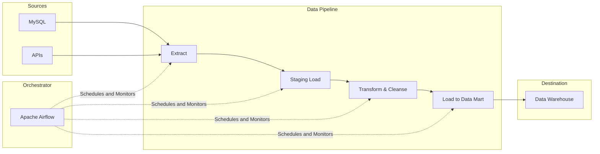

Hãy tưởng tượng dữ liệu trong doanh nghiệp giống như những dòng nước. Nếu không có hệ thống đường ống dẫn nước tự động, sạch sẽ và an toàn, nhân viên của bạn sẽ phải xách từng xô nước từ các nguồn sông hồ khác nhau về nhà để tự lọc và sử dụng. Quá trình thủ công này không chỉ tốn thời gian, dễ gây ô nhiễm mà còn không thể đáp ứng được nhu cầu sử dụng quy mô lớn của cả một thành phố.

**Đường ống dữ liệu (Data Pipeline)** chính là hệ thống dẫn nước tự động hóa đó, đóng vai trò như "hệ tuần hoàn" bơm dòng máu thông tin đi nuôi dưỡng toàn bộ các hoạt động phân tích và ra quyết định của doanh nghiệp.

---


## Data Pipeline thực chất là gì?

**Đường ống dữ liệu (Data Pipeline)** là một tập hợp các quy trình tự động hóa được thiết lập để vận chuyển dữ liệu từ các hệ thống nguồn (Sources - nơi sinh ra dữ liệu ban đầu) đến hệ thống đích (Destination - nơi lưu trữ dữ liệu phân tích), đồng thời thực hiện các bước lọc sạch, biến đổi định dạng và tổng hợp thông tin trên đường đi.

Trái tim của hầu hết các Data Pipeline là quy trình **Trích xuất, biến đổi và nạp dữ liệu (ETL - Extract, Transform, Load)** hoặc biến thể hiện đại của nó là **ELT (Extract, Load, Transform)**. Một đường ống dẫn dữ liệu chuẩn chỉnh không chỉ làm nhiệm vụ di chuyển các byte thông tin, mà còn phải tích hợp sẵn các cơ chế kiểm tra chất lượng, tự động thử lại khi mất mạng (retry logic) và cảnh báo tức thì khi xảy ra lỗi.

---

## Tại sao doanh nghiệp cần xây dựng Data Pipeline?

Nếu thiếu đi hệ thống đường ống tự động, doanh nghiệp sẽ phải đối mặt với nhiều rào cản lớn:

* **Sự thiếu hiệu quả của các quy trình thủ công**: Nhân viên phân tích phải tải các file Excel/CSV từ nhiều hệ thống hàng ngày, dùng hàm Excel để gộp dữ liệu bằng tay rồi mới vẽ biểu đồ báo cáo. Quy trình này tốn hàng giờ làm việc lặp đi lặp lại và cực kỳ dễ xảy ra sai sót do con người.
* **Nhu cầu hợp nhất dữ liệu từ nhiều nguồn**: Để có được bức tranh toàn cảnh về hiệu quả kinh doanh, bạn cần kết hợp dữ liệu giao dịch từ cơ sở dữ liệu MySQL với dữ liệu chiến dịch quảng cáo từ API của Facebook Ads. Data Pipeline giúp tự động hóa việc kết nối và ghép nối (JOIN) các nguồn dữ liệu này lại với nhau.
* **Khả năng chịu lỗi và tự khôi phục**: Hệ thống nguồn có thể bị mất mạng đột ngột hoặc file gửi qua API bị sai định dạng. Việc copy-paste thủ công không thể tự phát hiện lỗi, trong khi một pipeline kỹ thuật sẽ tự động cách ly dữ liệu lỗi, ghi nhận log và cảnh báo cho kỹ sư vào cuộc xử lý.

---


## Các thành phần cốt lõi của một Data Pipeline

Một đường ống dữ liệu hoàn chỉnh thường được cấu thành từ 4 mảnh ghép chính:

* **Trích xuất (Extract)**: Kết nối và rút dữ liệu ra khỏi các hệ thống vận hành.
* **Biến đổi (Transform)**: Làm sạch dữ liệu, xử lý giá trị rỗng, chuẩn hóa định dạng thời gian, che giấu thông tin nhạy cảm (data masking) và gộp các bảng dữ liệu lại.
* **Nạp dữ liệu (Load)**: Ghi dữ liệu sạch vào kho lưu trữ (Kho dữ liệu - Data Warehouse hoặc Hồ dữ liệu - Data Lake).
* **Điều phối (Orchestration)**: Bộ não điều khiển toàn bộ luồng chạy của pipeline. Nó quyết định công việc A chạy lúc nào, sau khi A chạy xong thì kích hoạt công việc B, và nếu công việc B bị lỗi thì gửi thông báo cảnh báo về hệ thống Slack của đội dữ liệu (ví dụ dùng Apache Airflow hoặc Dagster).

---

## Kiến trúc và Cơ chế hoạt động

Dưới đây là mô hình sơ đồ dòng chảy dữ liệu được điều phối bởi công cụ [Apache Airflow](/concepts/3-integration/orchestration/apache-airflow/):


---

## Ví dụ thực tế: Cấu hình DAG trong Apache Airflow bằng Python

Đoạn code Python dưới đây định nghĩa một quy trình điều phối pipeline hàng ngày (daily sales pipeline) bao gồm 3 bước: Extract, Transform và Load:
```python
from airflow import DAG
from airflow.operators.python import PythonOperator
from datetime import datetime

# Định nghĩa các hàm xử lý cho từng Task
def extract_data():
    print("Extracting data from API...")
    # Code kết nối API và trích xuất dữ liệu thô

def transform_data():
    print("Cleaning and standardizing data...")
    # Code xử lý dữ liệu bằng pandas hoặc Spark

def load_data():
    print("Loading data into PostgreSQL DWH...")
    # Code nạp dữ liệu sạch vào Data Warehouse

# Khởi tạo luồng điều phối DAG
with DAG('daily_sales_pipeline', start_date=datetime(2026, 6, 7), schedule_interval='@daily') as dag:
    
    t1 = PythonOperator(task_id='extract', python_callable=extract_data)
    t2 = PythonOperator(task_id='transform', python_callable=transform_data)
    t3 = PythonOperator(task_id='load', python_callable=load_data)

    # Thiết lập thứ tự chạy: t1 >> t2 >> t3
    t1 >> t2 >> t3
```

---

## Điểm mạnh và điểm yếu

### Ưu điểm:
* **Tự động hóa quy trình**: Giúp loại bỏ hoàn toàn các bước lặp đi lặp lại bằng tay, tiết kiệm nguồn lực cho doanh nghiệp.
* **Nhất quán và chất lượng dữ liệu**: Việc tự động hóa tích hợp các bước kiểm thử dữ liệu ([Data Quality](/concepts/5-quality-governance/data-quality/data-quality/)) đảm bảo dữ liệu đưa vào kho phân tích luôn sạch và chuẩn hóa.
* **Hợp nhất dữ liệu toàn diện**: Phá vỡ các silo dữ liệu, kết nối và tổng hợp thông tin từ nhiều nguồn ứng dụng khác nhau về một nơi duy nhất.
* **Tính mở rộng và tin cậy**: Dễ dàng nâng cấp để xử lý lượng dữ liệu lớn hơn mà không cần thay đổi cấu trúc cốt lõi của đường ống.

### Đánh đổi và Thách thức (Cons & Trade-offs):
* **Chi phí hạ tầng và vận hành**: Việc duy trì các máy chủ điều phối (Orchestrator) và cơ sở hạ tầng mạng, tính toán cần một khoản đầu tư định kỳ đáng kể.
* **Độ phức tạp khi gỡ lỗi (Debugging)**: Khi một pipeline lớn bị lỗi, việc dò tìm nguyên nhân trong một mạng lưới các tác vụ phụ thuộc lẫn nhau có thể tốn nhiều thời gian.
* **Yêu cầu kỹ năng chuyên môn**: Đòi hỏi kỹ sư dữ liệu phải có kiến thức lập trình tốt và hiểu sâu về hệ thống cơ sở dữ liệu phân tán.

---

## Khi nào nên dùng

Xây dựng đường ống dữ liệu tự động là cần thiết khi:
* Doanh nghiệp cần phân tích dữ liệu cập nhật liên tục từ nhiều nguồn khác nhau để đưa ra quyết định kinh doanh kịp thời.
* Đội ngũ phân tích dữ liệu đang tốn quá nhiều thời gian cho việc tải file và làm sạch dữ liệu thủ công.
* Cần đảm bảo tính nhất quán, bảo mật và chất lượng dữ liệu khi di chuyển qua các hệ thống.

Chưa cần thiết phải thiết kế đường ống phức tạp khi:
* Dữ liệu chỉ phát sinh ở một nguồn duy nhất, dung lượng nhỏ và có thể báo cáo trực tiếp.
* Chỉ cần phân tích dữ liệu tĩnh thỉnh thoảng (ad-hoc) vài tháng một lần, khi đó việc xuất file thủ công (manual export) sẽ nhanh và tiết kiệm chi phí hơn.

---

## Trọng tâm ôn luyện phỏng vấn

### 1. Hãy phân biệt sự khác nhau giữa Batch Pipeline và Streaming Pipeline?
* **Gợi ý trả lời**:
  * **Batch Pipeline**: Thu thập và xử lý dữ liệu theo từng lô lớn tại các thời điểm định sẵn trong ngày (ví dụ: mỗi đêm lúc 2h sáng). Phương pháp này có độ trễ cao (vài giờ đến 1 ngày) nhưng tối ưu băng thông mạng tốt, dễ thiết kế, quản lý lỗi và khôi phục khi gặp sự cố.
  * **Streaming Pipeline**: Xử lý dữ liệu liên tục theo từng bản ghi (event-by-event) ngay khi chúng phát sinh. Phương pháp này có độ trễ cực thấp (tính bằng mili-giây) nhưng thiết kế rất phức tạp, đòi hỏi các công cụ chuyên dụng như Kafka, Flink và gặp nhiều thử thách khi xử lý dữ liệu đến trễ hay việc ghép nối (JOIN) các luồng dữ liệu thời gian thực.

### 2. Khái niệm DAG có nghĩa là gì trong các công cụ điều phối đường ống dữ liệu (Orchestration)?
* **Gợi ý trả lời**: [DAG](/concepts/3-integration/orchestration/dag/) viết tắt của **Directed Acyclic Graph** (Đồ thị có hướng không chu trình).
  * **Directed (Có hướng)**: Chỉ ra rằng các tác vụ trong pipeline có thứ tự thực thi rõ ràng, ví dụ tác vụ A phải hoàn thành thành công thì tác vụ B mới được bắt đầu.
  * **Acyclic (Không chu trình)**: Đảm bảo luồng chạy không bao giờ bị rơi vào vòng lặp vô hạn (ví dụ tác vụ A đợi B, tác vụ B lại đợi A). Một DAG bắt buộc phải có điểm bắt đầu và điểm kết thúc rõ ràng để đảm bảo hệ thống có thể hoàn thành luồng công việc.

### 3. Làm thế nào bạn xử lý việc thay đổi cấu trúc bảng dữ liệu (Schema Evolution) của hệ thống nguồn mà không làm sập pipeline?
* **Gợi ý trả lời**: Để giải quyết việc thay đổi cấu trúc bảng ([schema drift](/concepts/5-quality-governance/observability-reliability/schema-drift/)), tôi áp dụng các giải pháp sau:
  1) **Sử dụng Schema Registry**: Quản lý và kiểm soát tính tương thích của schema giữa các phiên bản dữ liệu.
  2) **Lưu trữ dữ liệu bán cấu trúc**: Ở vùng nạp thô (Staging/Landing Zone), sử dụng định dạng linh hoạt như JSON (ở PostgreSQL/[Snowflake](/concepts/2-storage/cloud-data-platform/snowflake/)) để nạp toàn bộ thuộc tính mới mà nguồn gửi về mà không cần thay đổi cấu trúc bảng ngay lập tức.
  3) **Thiết lập cảnh báo tự động**: Giám sát schema drift và kích hoạt cảnh báo cho đội kỹ sư dữ liệu để họ chủ động cập nhật các bảng ở hạ nguồn trước khi các báo cáo BI bị lỗi dữ liệu.

---

## Xem thêm các khái niệm liên quan
* [Vai trò Kỹ sư Dữ liệu](/concepts/1-foundations/foundation/data-engineering/) - Chi tiết vai trò xây dựng pipeline.
* [Kỹ thuật Dữ liệu](/concepts/1-foundations/foundation/data-engineering/) - Khái niệm tổng quan về Data Engineering.
* [Vòng đời Dữ liệu](/concepts/1-foundations/foundation/data-lifecycle/) - Các giai đoạn dữ liệu trải qua trong hệ thống.
* [Kiến trúc Nền tảng Dữ liệu](/concepts/1-foundations/system-architecture/data-platform-architecture/) - Thiết kế hạ tầng dữ liệu tổng thể.
* [Hệ thống Nguồn](/concepts/1-foundations/foundation/source-systems/) - Nơi cung cấp dữ liệu đầu vào cho pipeline.

## Tài liệu tham khảo

1. [What is a Data Pipeline?](https://www.databricks.com/glossary/data-pipeline) - Databricks Glossary explaining different data pipeline architectures.
2. [What is a Data Pipeline?](https://cloud.google.com/discover/what-is-a-data-pipeline) - Google Cloud Learn page explaining stages and technologies for building data pipelines.
3. [What is a Data Pipeline?](https://aws.amazon.com/what-is/data-pipeline/) - AWS page introducing the concepts, benefits, and use cases of data pipelines.
4. [Azure Data Pipeline Services](https://learn.microsoft.com/en-us/azure/data-factory/concepts-pipelines-activities) - Microsoft Azure guide on building data pipelines and factory services.
5. [Snowflake Data Pipelines Guide](https://docs.snowflake.com/en/user-guide/data-pipelines-intro) - Snowflake documentation on continuous data pipelines.
6. [Confluent Streaming Pipelines](https://www.confluent.io/use-case/data-engineering/) - Confluent resources on stream processing pipelines.
7. [Apache Airflow Documentation](https://airflow.apache.org/docs/) - Official documentation for the industry-standard workflow [orchestration](/concepts/3-integration/orchestration/orchestration/) platform.

## English Summary

A **Data Pipeline** is an automated set of processes that extracts data from various sources, transforms it to ensure quality and compatibility, and loads it into a destination system such as a [Data Warehouse](/concepts/2-storage/data-warehouse/data-warehouse/) or [Data Lake](/concepts/2-storage/data-lake-lakehouse/data-lake/) ([ETL](/concepts/3-integration/etl-elt/etl/)/[ELT](/concepts/3-integration/etl-elt/elt/)). Orchestration tools (like Apache Airflow) manage the scheduling and dependencies of these pipelines using Directed Acyclic Graphs (DAGs). Pipelines can operate in batch mode (processing data in chunks at scheduled intervals) or streaming mode (processing events in real-time), and they are essential for eliminating manual data wrangling and ensuring reliable, scalable analytics.