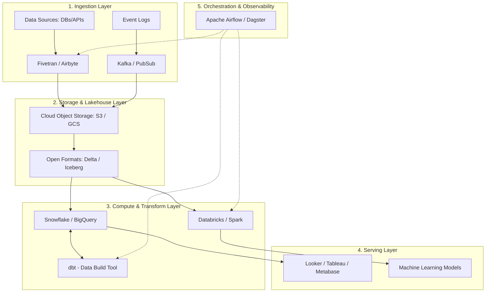

Trong bất kỳ tổ chức hướng dữ liệu (data-driven) nào, việc sở hữu một hạ tầng dữ liệu (data infrastructure) hoạt động trơn tru là yếu tố sống còn. Tuy nhiên, dữ liệu của doanh nghiệp không chỉ tăng trưởng về kích thước mà còn đa dạng về mặt hình thái: từ dữ liệu có cấu trúc (structured data) dạng bảng (SQL), dữ liệu bán cấu trúc (semi-structured data) như JSON từ API, XML, cho đến dữ liệu phi cấu trúc (unstructured data) như hình ảnh, video, âm thanh.

Không có một công nghệ hay cơ sở dữ liệu đơn lẻ nào đủ sức giải quyết hoàn hảo mọi bài toán phân tích. Đó là lý do chúng ta cần đến **Kiến trúc Nền tảng Dữ liệu (Data Platform Architecture)** và **Modern Data Stack (MDS)** – bản thiết kế tổng thể và hệ sinh thái các công cụ đám mây giúp liên kết linh hoạt các khối công nghệ lưu trữ, xử lý và phân phối thông tin.

---

## Nền tảng dữ liệu hiện đại & Modern Data Stack là gì?

* **Nền tảng dữ liệu (Data Platform)** là một hệ sinh thái tích hợp các công cụ công nghệ thông tin tương tác chặt chẽ với nhau nhằm thực hiện chuỗi nhiệm vụ: Thu nạp (Ingest), Lưu trữ (Store), Xử lý (Process) và Cung cấp (Serve) dữ liệu cho người dùng cuối và các ứng dụng.
* **Modern Data Stack (MDS - Hệ sinh thái dữ liệu hiện đại)** không phải là một công cụ đơn lẻ, mà là một triết lý thiết kế hệ thống dữ liệu xoay quanh các dịch vụ đám mây (Cloud-native SaaS). MDS được tích hợp dưới dạng các mô-đun (modular), giúp đơn giản hóa tối đa quy trình thu thập, lưu trữ và biến đổi dữ liệu, cho phép các doanh nghiệp có thể xây dựng một hệ thống báo cáo BI hoàn chỉnh chỉ trong vòng vài tuần thay vì mất nhiều tháng như trước.

---

## Sự tiến hóa của các mô hình Kiến trúc dữ liệu

Để đạt được kiến trúc hiện đại ngày nay, ngành công nghệ dữ liệu đã trải qua ba thế hệ tiến hóa lớn:

1. **Kho dữ liệu tập trung (Data Warehouse - DWH)**: Mọi dữ liệu có cấu trúc từ các phòng ban được gom về một kho dữ liệu trung tâm chuẩn hóa cao. Mô hình này rất xuất sắc cho các báo cáo phân tích kinh doanh (BI) nhưng chi phí lưu trữ cực kỳ đắt đỏ và hoàn toàn bất lực trước dữ liệu phi cấu trúc.
2. **Hồ dữ liệu (Data Lake)**: Ra đời cùng sự bùng nổ của Big Data. Dữ liệu được đổ đống ở dạng thô vào các hệ thống lưu trữ phân tán chi phí rẻ (như HDFS, Amazon S3). Mô hình này rất được các nhà khoa học dữ liệu (Data Scientists) ưa chuộng để chạy mô hình học máy (Machine Learning) nhưng lại cực kỳ khó khăn và chậm chạp khi cần truy vấn SQL làm báo cáo BI nhanh.
3. **Kiến trúc lai (Data [Lakehouse](/concepts/2-storage/data-lake-lakehouse/lakehouse/))**: Đây là xu hướng thịnh hành nhất hiện nay. Data Lakehouse mang các tính năng quản lý giao dịch an toàn (ACID) và khả năng truy vấn SQL tốc độ cao của Data Warehouse đặt trực tiếp lên trên lớp lưu trữ đối tượng giá rẻ của Data Lake, giúp doanh nghiệp khai thác cả BI và AI trên cùng một bản sao dữ liệu duy nhất.

---

## Sự dịch chuyển từ ETL truyền thống sang mô hình ELT hiện đại

Đặc trưng lớn nhất phân biệt Modern Data Stack và các kiến trúc dữ liệu hiện đại với các kiến trúc cũ là sự dịch chuyển từ mô hình **[ETL](/concepts/3-integration/etl-elt/etl/)** (Extract - Transform - Load) sang **[ELT](/concepts/3-integration/etl-elt/elt/)** (Extract - Load - Transform).

* **ETL truyền thống**: Dữ liệu được trích xuất (Extract), đưa qua một máy chủ trung gian để làm sạch, biến đổi logic (Transform), rồi mới nạp (Load) vào kho dữ liệu. Nguyên nhân là do phần cứng của các Data Warehouse thế hệ cũ rất đắt đỏ và hữu hạn, không thể gánh nổi các tác vụ biến đổi dữ liệu nặng nề.
* **ELT hiện đại**: Dữ liệu thô từ các nguồn được trích xuất và nạp thẳng vào **Cloud Data Warehouse** (như [Snowflake](/concepts/2-storage/cloud-data-platform/snowflake/), BigQuery) hoặc Cloud Object Storage mà không cần chế biến trước. Sau đó, chúng ta tận dụng sức mạng tính toán phân tán gần như vô hạn và rẻ tiền của đám mây để thực hiện toàn bộ việc biến đổi dữ liệu bằng ngôn ngữ SQL trực tiếp bên trong kho dữ liệu.

---

## Kiến trúc các tầng và Các thành phần cốt lõi của MDS

Một hệ thống Modern Data Stack và nền tảng dữ liệu hiện đại tiêu chuẩn được xây dựng theo kiến trúc module hóa và bao gồm các tầng sau:



### 1. Tầng Thu nạp (Data Integration / Ingestion Layer)
Thay vì tự viết code kết nối API, bạn sử dụng các công cụ SaaS hoặc mã nguồn mở có sẵn hàng ngàn cổng kết nối (connectors). Chỉ cần cấu hình và click chuột, dữ liệu sẽ tự động được đồng bộ vào kho.
* *Công cụ tiêu biểu*: Fivetran, Airbyte, Stitch, Apache Kafka, Google Pub/Sub.

### 2. Tầng Lưu trữ (Data Storage & Lakehouse Layer)
Trái tim của toàn bộ hệ thống, lưu trữ dữ liệu thô trên Cloud Object Storage (như AWS S3, Google Cloud Storage) sử dụng các định dạng tệp tin mở tối ưu như Parquet, Delta Lake hoặc Apache Iceberg, mang các tính năng quản lý giao dịch an toàn (ACID) đặt lên lớp lưu trữ rẻ tiền.

### 3. Tầng Tính toán & Biến đổi (Compute & Transformation Layer)
Tận dụng sức mạnh tính toán của Cloud Data Warehouse (Snowflake, BigQuery) hoặc nền tảng Apache Spark (Databricks) để xử lý dữ liệu. Sử dụng công cụ **dbt (data build tool)** hoặc Dataform để viết các câu lệnh SQL biến đổi dữ liệu một cách khoa học, hỗ trợ quản lý phiên bản bằng Git và chạy test case kiểm tra chất lượng.

### 4. Tầng Phục vụ (Serving Layer / BI & Analytics)
Nơi người dùng cuối (nhân viên, ban giám đốc, nhà phân tích) truy cập để vẽ biểu đồ và tự phục vụ (self-service) nhu cầu phân tích số liệu, hoặc cung cấp đầu vào để huấn luyện mô hình Machine Learning.
* *Công cụ tiêu biểu*: Looker, Tableau, Metabase, Superset.

### 5. Tầng Điều phối & Giám sát (Orchestration & Observability Layer)
Nhạc trưởng điều phối lịch chạy tuần tự của toàn bộ hệ thống và tự động gửi thông báo sang Slack/Teams nếu có lỗi xảy ra.
* *Công cụ tiêu biểu*: Apache Airflow, Dagster, Prefect.

---

## Kiến trúc Huy chương (Medallion Architecture) trong Data Lakehouse

Trong kiến trúc Data Lakehouse hiện đại, dữ liệu thường được xử lý và nâng cấp chất lượng qua 3 lớp huy chương:

* **Lớp Đồng (Bronze / Raw)**: Lưu giữ dữ liệu thô nguyên bản được lấy về từ nguồn. Dữ liệu ở đây có thể trùng lặp, sai định dạng nhưng tuyệt đối không được xóa bỏ vì đây là nguồn kiểm chứng gốc.
* **Lớp Bạc (Silver / Cleaned)**: Dữ liệu từ lớp Đồng được lọc trùng, làm sạch, định kiểu ngày tháng chuẩn hóa. Đây là "nguồn sự thật" sạch sẽ sẵn sàng cho các nhà phân tích khám phá.
* **Lớp Vàng (Gold / Aggregated)**: Dữ liệu được tổng hợp theo các chỉ số kinh doanh nghiệp vụ, thiết kế dưới dạng [Star Schema](/concepts/2-storage/data-warehouse/star-schema/) phục vụ trực tiếp và nhanh chóng cho các báo cáo của ban giám đốc.

Dưới đây là ví dụ minh họa bằng SQL chuyển đổi dữ liệu qua các lớp huy chương:
```sql
-- Bước 1: Làm sạch dữ liệu từ lớp Bronze sang lớp Silver
CREATE TABLE silver.users AS
SELECT DISTINCT user_id, LOWER(email) as email, CAST(signup_date AS DATE)
FROM bronze.raw_users
WHERE user_id IS NOT NULL;

-- Bước 2: Tổng hợp dữ liệu từ lớp Silver sang lớp Gold làm báo cáo
CREATE TABLE gold.daily_signups AS
SELECT signup_date, COUNT(user_id) as total_signups
FROM silver.users
GROUP BY signup_date;
```

---

## Minh họa thực tế: Đường ống tính ROI quảng cáo

Hãy tưởng tượng bạn có dữ liệu bán hàng nằm ở database MySQL và chi phí chạy quảng cáo nằm ở tài khoản Facebook Ads.
1. Bạn cấu hình kết nối Facebook Ads và MySQL trên giao diện **Airbyte (EL)**. Airbyte sẽ tự động copy toàn bộ dữ liệu thô này thả vào **BigQuery (Warehouse)** sau mỗi một tiếng.
2. Tại BigQuery, dữ liệu Facebook Ads ban đầu nằm dưới dạng JSON thô rất khó đọc.
3. Analytics Engineer sẽ viết các đoạn mã SQL trong **[dbt](/concepts/3-integration/transformation-analytics/dbt/) (T)** để thực hiện việc bóc tách JSON, JOIN bảng chi phí quảng cáo với bảng doanh số đơn hàng để tính toán tỷ suất hoàn vốn (ROI). dbt sẽ biên dịch đoạn code này và đẩy xuống BigQuery thực thi.
4. Cuối cùng, Giám đốc Marketing có thể mở dashboard trên **Metabase (BI)** để theo dõi hiệu quả chiến dịch một cách trực quan.

Dưới đây là một đoạn code dbt mẫu để tính toán ROI:
```sql
-- models/marts/marketing/fct_campaign_roi.sql
WITH facebook_ads AS (
    SELECT campaign_id, spend FROM {{ ref('stg_facebook_ads') }}
),
sales AS (
    SELECT campaign_id, SUM(revenue) as total_revenue FROM {{ ref('stg_sales') }} GROUP BY 1
)
SELECT 
    f.campaign_id,
    f.spend,
    COALESCE(s.total_revenue, 0) as revenue,
    (COALESCE(s.total_revenue, 0) - f.spend) / NULLIF(f.spend, 0) AS roi_percentage
FROM facebook_ads f
LEFT JOIN sales s ON f.campaign_id = s.campaign_id
```

---

## Điểm mạnh và điểm yếu

### Điểm mạnh (Pros)
* **Triển khai cực nhanh (Time-to-market)**: Rất phù hợp cho startup và các công ty vừa và nhỏ (SME) cần xây dựng nhanh hệ thống BI để ra quyết định kinh doanh.
* **Hiệu năng và Chi phí tối ưu**: Việc phân tách Tính toán (Compute) và Lưu trữ (Storage) giúp doanh nghiệp chỉ trả tiền cho tài nguyên tính toán thực sự sử dụng.
* **Không bị khóa bởi nhà cung cấp (No Vendor Lock-in)**: Việc sử dụng định dạng tệp tin mở (Open Formats) giúp dễ dàng chuyển đổi công cụ tính toán mà không phải di chuyển dữ liệu.
* **Dân chủ hóa vai trò (Analytics Engineering)**: Trao quyền cho các nhà phân tích dữ liệu (chỉ cần thạo SQL) tự mình xây dựng các đường ống dữ liệu hoàn chỉnh thông qua dbt mà không nhất thiết phải cần đến kỹ sư lập trình Python/Scala.

### Điểm yếu (Cons)
* **Nguy cơ hóa đơn tăng vọt**: Vì tính phí theo lượng sử dụng, nếu bạn viết SQL cẩu thả hoặc cấu hình dbt chạy full-refresh quá liên tục sẽ sinh ra hóa đơn Cloud khổng lồ vào cuối tháng.
* **Độ phức tạp vận hành cao**: Việc tích hợp và quản lý bản quyền cho quá nhiều công cụ chuyên biệt có thể dẫn đến việc vận hành phức tạp và gặp khó khăn khi đồng bộ thông tin giữa chúng.
* **Độ trễ xử lý (Latency)**: Qua nhiều lớp trung gian (Bronze -> Silver -> Gold) khiến dữ liệu không thể xuất hiện ngay lập tức tại tầng phục vụ mà cần một khoảng thời gian xử lý nhất định (thường thiết kế cho Batch thay vì real-time dưới 1 giây).
* **Quản trị khó khăn**: Nếu không có chính sách rõ ràng, Data Lake rất dễ trở thành "đầm lầy dữ liệu" (Data Swamp) với vô vàn tệp tin không có tài liệu hay từ điển dữ liệu đi kèm.

---

## Sai lầm thường gặp và Best Practices

* **Quy tắc vàng: Tách rời Tính toán và Lưu trữ**: Hãy đảm bảo bạn lưu trữ dữ liệu trên Object Storage giá rẻ độc lập với máy chủ tính toán. Khi không có tác vụ xử lý, bạn có thể tắt bớt máy chủ tính toán để tiết kiệm chi phí cloud mà không sợ mất dữ liệu.
* **Sử dụng định dạng tệp tin mở (Open Formats)**: Hãy lưu dữ liệu dưới định dạng Parquet, Iceberg hoặc [Delta Lake](/concepts/2-storage/data-lake-lakehouse/delta-lake/). Việc này giúp bạn dễ dàng chuyển đổi nhà cung cấp công nghệ trong tương lai mà không bị khóa chặt vào một hệ sinh thái độc quyền (vendor lock-in).
* **Tránh biến Data Lake thành đầm lầy**: Luôn kết hợp công cụ [Data Catalog](/concepts/5-quality-governance/governance-metadata/data-catalog/) để quản lý siêu dữ liệu (metadata) và định nghĩa từ điển dữ liệu rõ ràng.
* **Quản lý vòng đời dữ liệu ([Data Lifecycle](/concepts/1-foundations/foundation/data-lifecycle/))**: Thiết lập chính sách lưu trữ dài hạn (archiving) hoặc tự động xóa bỏ dữ liệu cũ ở lớp Bronze để tránh hóa đơn lưu trữ tăng vọt.
* **Tránh Over-engineering**: Tránh áp dụng các định dạng Lakehouse hay Apache Spark phức tạp cho các tập dữ liệu nhỏ dưới vài chục GB, trong khi một cơ sở dữ liệu quan hệ đơn giản (như PostgreSQL) là đủ để giải quyết bài toán nhanh và rẻ hơn nhiều.

---

## Khi nào nên dùng

Doanh nghiệp nên triển khai Kiến trúc Nền tảng Dữ liệu hiện đại (MDS / Lakehouse) khi:
* Khối lượng dữ liệu tăng nhanh chóng mặt và chi phí vận hành cơ sở dữ liệu truyền thống trở nên quá tải.
* Xuất hiện các loại dữ liệu phi cấu trúc hoặc bán cấu trúc (logs, hình ảnh, JSON) cần lưu giữ và xử lý.
* Cần tích hợp nhanh chóng hàng chục nguồn dữ liệu SaaS khác nhau để phục vụ báo cáo.
* Cần hỗ trợ đồng thời cả báo cáo phân tích BI tốc độ cao và các dự án khoa học dữ liệu (Data Science, ML/AI).

Doanh nghiệp chưa cần đến các giải pháp phức tạp này khi:
* Dữ liệu hoàn toàn là dữ liệu giao dịch có cấu trúc gọn nhẹ, dễ dàng xử lý trên một SQL Database duy nhất (như PostgreSQL).
* Không có nhu cầu ứng dụng Machine Learning và chỉ cần báo cáo kinh doanh tĩnh đơn giản hàng tháng.
* Hệ thống bắt buộc phải xử lý dữ liệu theo thời gian thực với độ trễ dưới 1 giây.

---

## Trọng tâm ôn luyện phỏng vấn

### 1. Hãy phân biệt sự khác nhau giữa Data Warehouse, Data Lake và Data Lakehouse?
* **Gợi ý trả lời**:
  * **Data Warehouse**: Chỉ lưu trữ dữ liệu có cấu trúc sạch sẽ, áp dụng mô hình *schema-on-write*. Tối ưu cực tốt cho truy vấn SQL và làm báo cáo BI nhanh, nhưng chi phí lưu trữ rất đắt và không xử lý được dữ liệu phi cấu trúc.
  * **Data Lake**: Lưu trữ mọi định dạng dữ liệu (cấu trúc, bán cấu trúc, phi cấu trúc) ở dạng thô nguyên bản trên Object Storage giá rẻ, áp dụng mô hình *schema-on-read*. Rất tốt cho các nhà khoa học dữ liệu chạy Machine Learning nhưng truy vấn SQL làm báo cáo BI rất chậm và khó quản lý chất lượng.
  * **Data Lakehouse**: Là mô hình lai hiện đại, mang lớp quản lý metadata và giao dịch ACID đặt trực tiếp lên trên lớp lưu trữ giá rẻ của Data Lake. Nó cho phép doanh nghiệp vừa truy vấn SQL làm báo cáo BI hiệu năng cao, vừa chạy Machine Learning trên cùng một nguồn dữ liệu duy nhất.

### 2. Kiến trúc Medallion (Bronze, Silver, Gold) mang lại lợi ích gì cho việc quản lý dữ liệu doanh nghiệp?
* **Gợi ý trả lời**: Kiến trúc Medallion giúp phân tách rõ ràng trách nhiệm quản lý chất lượng dữ liệu. Thay vì cố gắng biến đổi dữ liệu thô thành báo cáo cuối cùng chỉ trong một bước lớn (rất khó dò lỗi và sửa chữa khi sai số), kiến trúc này tạo ra các trạm dừng trung gian. Lớp Silver đóng vai trò là nguồn dữ liệu sạch, đáng tin cậy duy nhất của doanh nghiệp, giúp nhiều đội ngũ phân tích khác nhau có thể tái sử dụng để xây dựng nhiều bảng Gold phục vụ các mục tiêu báo cáo khác nhau mà không cần làm sạch lại từ đầu.

### 3. Tại sao việc phân tách giữa Tính toán (Compute) và Lưu trữ (Storage) lại cực kỳ quan trọng trong Modern Data Stack?
* **Gợi ý trả lời**: Việc phân tách Compute và Storage giải quyết bài toán lãng phí tài nguyên của kiến trúc truyền thống. Trước đây, khi muốn lưu trữ nhiều dữ liệu hơn, doanh nghiệp phải mua thêm máy chủ có cả ổ cứng và CPU, dẫn đến tình trạng thừa năng lực tính toán nhưng thiếu dung lượng lưu trữ (hoặc ngược lại). Với Modern Data Stack, dữ liệu được lưu trữ trên Cloud Object Storage (như S3) cực kỳ rẻ và vô hạn, trong khi tài nguyên tính toán (như Snowflake, Databricks) chỉ được bật lên khi có nhu cầu truy vấn hoặc chạy ETL. Điều này giúp tối ưu hóa chi phí vận hành một cách tối đa.

### 4. Tại sao Modern Data Stack lại thúc đẩy sự chuyển dịch từ ETL sang ELT?
* **Gợi ý trả lời**: 
  * Trước đây, tài nguyên lưu trữ và tính toán của các kho dữ liệu On-premise rất đắt đỏ và khó mở rộng. Do đó, chúng ta buộc phải trích xuất dữ liệu ra một máy chủ trung gian để lọc và biến đổi (Transform) trước khi nạp vào kho để tiết kiệm dung lượng (ETL).
  * Hiện nay, các Cloud Data Warehouse (Snowflake, BigQuery) đã tách biệt hoàn toàn bộ nhớ lưu trữ (rất rẻ) và bộ xử lý tính toán (có thể co giãn linh hoạt tức thì). Do đó, việc nạp trực tiếp dữ liệu thô vào kho rồi dùng chính SQL của kho để biến đổi (ELT) trở nên nhanh hơn, rẻ hơn và an toàn hơn rất nhiều. ELT cũng giúp bảo toàn dữ liệu gốc, giúp việc thay đổi logic kinh doanh sau này dễ dàng hơn mà không cần nạp lại dữ liệu từ nguồn.

### 5. dbt (Data Build Tool) đóng vai trò gì trong Modern Data Stack và tại sao nó lại được đánh giá cao như vậy?
* **Gợi ý trả lời**: 
  * dbt đóng vai trò làm trung tâm của tầng biến đổi (Transform - chữ T trong ELT). Nó cho phép viết các câu truy vấn SQL lồng nhau một cách có tổ chức (nhờ cấu trúc modularity và hàm `ref()`).
  * dbt được đánh giá cao vì nó đã mang các tiêu chuẩn chất lượng của kỹ nghệ phần mềm (Software Engineering) áp dụng vào việc phân tích dữ liệu: quản lý mã nguồn bằng Git, viết test case tự động kiểm tra chất lượng dữ liệu (kiểm tra trùng lặp, giá trị null), tự động vẽ bản đồ dòng chảy dữ liệu ([Data Lineage](/concepts/5-quality-governance/governance-metadata/data-lineage/)) và tự động tạo tài liệu hướng dẫn (documentation).

---

## English Summary

**Data Platform Architecture** defines the blueprint for managing an organization's data lifecycle. Historically divided between structured Data Warehouses (DWH) and unstructured Data Lakes, the industry has converged on the **Data Lakehouse** model. The Lakehouse combines ACID transactions, schema enforcement, and high-performance SQL querying with the low-cost, scalable storage of cloud objects (e.g., S3, GCS) storing open formats (Parquet, Delta Lake, Apache Iceberg). 

The **Modern Data Stack (MDS)** represents a modular, cloud-native realization of this architecture, heavily oriented around the **ELT (Extract, Load, Transform)** paradigm. MDS tools decouple storage from compute and segment workloads across dedicated layers: Automated Ingestion (Fivetran/Airbyte), Cloud Storage/Warehousing (Snowflake/BigQuery), SQL Transformation (dbt), BI Analytics (Looker/Tableau), and Orchestration (Airflow/Dagster). Key practices include adopting the **Medallion Architecture** (Bronze, Silver, Gold datasets) to logically separate raw ingestion, clean operational models, and aggregated reporting marts.

---

## Xem thêm các khái niệm liên quan
* [Kỹ thuật Dữ liệu & Vai trò Kỹ sư Dữ liệu](/concepts/1-foundations/foundation/data-engineering/) - Tổng quan về lĩnh vực và nghề nghiệp.
* [Vòng đời Dữ liệu](/concepts/1-foundations/foundation/data-lifecycle/) - Cách quản lý dữ liệu qua các giai đoạn trên nền tảng.
* [Đường ông Dữ liệu](/concepts/1-foundations/foundation/data-pipeline/) - Cơ chế luân chuyển dữ liệu giữa các tầng kiến trúc.
* [Data Lake](/concepts/2-storage/data-lake-lakehouse/data-lake/) - Khái niệm và cách xây dựng hồ dữ liệu.
* [Data Warehouse](/concepts/2-storage/data-warehouse/data-warehouse/) - Khái niệm và thiết kế kho dữ liệu truyền thống.

---

## Tài liệu tham khảo

1. [What is a Data Lakehouse?](https://www.databricks.com/glossary/data-lakehouse) - Databricks Glossary page on the hybrid data lakehouse paradigm.
2. [What is Data Architecture?](https://www.snowflake.com/trending/what-is-data-architecture) - Snowflake comprehensive guide on enterprise data platform design.
3. [Modern Data Stack Overview](https://www.databricks.com/glossary/modern-data-stack) - Databricks Glossary page on MDS components and benefits.
4. [Snowflake Blog - What is the Modern Data Stack?](https://www.snowflake.com/blog/what-is-the-modern-data-stack/) - Explanation of the SaaS data integration ecosystem.
5. [Modern Data Architecture on AWS](https://docs.aws.amazon.com/wellarchitected/latest/analytics-lens/modern-data-architecture.html) - AWS Well-Architected Analytics Lens documentation for designing scalable data architectures.
6. [Big Data Architecture Style](https://learn.microsoft.com/en-us/azure/architecture/guide/architecture-styles/big-data) - Microsoft Azure Architecture Center guide for designing large-scale big data architectures.
7. [Google Cloud Data Foundation](https://cloud.google.com/solutions/data-governance-on-gcp) - Google Cloud guide on building a secure and scalable data foundation.
8. [dbt Labs - Introduction to dbt and Analytics Engineering](https://docs.getdbt.com/docs/introduction) - Official guide on writing SQL transformations inside data platforms.
9. [Fundamentals of Data Engineering by Joe Reis & Matt Housley](https://www.oreilly.com/library/view/fundamentals-of-data/9781098108298/) - O'Reilly textbook on architecture and data lifecycle management.
