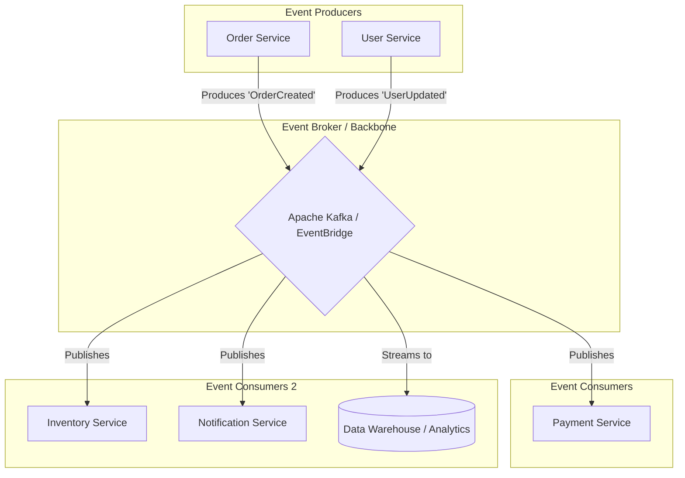

Trong phát triển phần mềm hiện đại, đặc biệt là khi làm việc với hệ thống Microservices, việc thiết kế cách các dịch vụ giao tiếp với nhau là một bài toán hóc búa. 

Nếu bạn từng chứng kiến cảnh một trang web bị đứng im, biểu tượng quay vòng tròn xoay mãi không ngừng sau khi bạn nhấn nút "Đặt hàng", rất có thể hệ thống phía sau đang bị nghẽn do các dịch vụ phải chờ đợi nhau phản hồi theo chuỗi. Để giải quyết triệt để vấn đề này, các kỹ sư thường chuyển dịch sang một mô hình thiết kế tối ưu hơn: **Event-Driven Architecture (EDA) – Kiến trúc hướng sự kiện**.


## Khi các dịch vụ không còn phải chờ đợi nhau

Về mặt khái niệm, một **sự kiện (Event)** là một bản ghi ghi nhận một sự thay đổi trạng thái có ý nghĩa đã xảy ra trong quá khứ (ví dụ: *"Khách hàng vừa nhấn nút Mua hàng"*, *"Đơn hàng #456 đã được thanh toán thành công"*).

Trong **Kiến trúc hướng sự kiện**, toàn bộ hệ thống được xây dựng xung quanh việc phát hiện, truyền tải và xử lý các sự kiện này. Thay vì dịch vụ này phải chủ động gọi trực tiếp cho dịch vụ kia một cách tuần tự (synchronous), các dịch vụ sẽ giao tiếp thông qua một "hộp thư" trung gian (Event Broker) một cách hoàn toàn bất đồng bộ (asynchronous). 

Dịch vụ phát ra sự kiện (Producer) chỉ việc quăng sự kiện lên Broker rồi đi làm việc khác, không cần quan tâm ai sẽ là người nhận nó. Ở đầu bên kia, các dịch vụ cần thông tin (Consumers) sẽ chủ động đăng ký nghe và tự động xử lý khi có sự kiện mới đổ về.

## Điểm yếu chí mạng của mô hình gọi API truyền thống (Request-Driven)

Để hiểu tại sao EDA lại được ưa chuộng, hãy nhìn vào mô hình gọi REST API truyền thống. Khi khách hàng nhấn nút "Mua hàng", quy trình sau sẽ diễn ra:
1. `Order Service` nhận yêu cầu, gọi API sang `Payment Service` để trừ tiền.
2. `Payment Service` xử lý xong, `Order Service` lại gọi tiếp sang `Inventory Service` để trừ tồn kho.
3. Trừ tồn kho xong, `Order Service` lại tiếp tục gọi sang `Notification Service` để gửi email xác nhận cho khách.

Thiết kế này chứa đựng 3 "tử huyệt" nguy hiểm:
* **Chờ đợi đồng bộ (Latency/Blocking)**: Khách hàng buộc phải ngồi đợi toàn bộ chuỗi API ở trên xử lý xong xuôi thì trang web mới hiển thị thông báo thành công. Chỉ cần dịch vụ gửi email phản hồi chậm 5 giây, khách hàng cũng sẽ bị trễ tương ứng.
* **Lỗi dây chuyền (Cascading Failures)**: Nếu `Inventory Service` bị sập đột ngột ở bước 2, toàn bộ quá trình đặt hàng bị thất bại, mặc dù tiền của khách có thể đã bị trừ.
* **Liên kết chặt chẽ (Tight Coupling)**: `Order Service` bắt buộc phải biết rõ địa chỉ mạng của tất cả các dịch vụ khác. Nếu tương lai doanh nghiệp muốn thêm một dịch vụ "Tích điểm thành viên", kỹ sư sẽ phải vào sửa lại mã nguồn của `Order Service` để chèn thêm một cuộc gọi API mới.

EDA sinh ra để đập tan sự ràng buộc này. Khi có đơn hàng, `Order Service` chỉ cần hét lên: *"Có đơn hàng mới đây!"* rồi hoàn thành ngay giao dịch cho khách hàng. Mọi dịch vụ khác tự nghe tin và tự lo liệu phần việc của mình.

## Triết lý "Tự biên đạo" (Choreography) thay vì "Chỉ huy" (Orchestration)

Trong kiến trúc Request-Driven, hệ thống hoạt động như một dàn nhạc giao hưởng dưới sự điều phối của một vị nhạc trưởng (Central Orchestrator). Vị nhạc trưởng này ra lệnh chi tiết cho từng nhạc công: *"Anh A thổi sáo đi, thổi xong thì báo tôi để tôi bảo anh B đánh trống"*. 

Ngược lại, EDA đi theo triết lý **Choreography (Tự biên đạo)**. Giống như các vũ công trên sân khấu biểu diễn không cần nhạc trưởng đứng chỉ tay năm ngón, họ tự lắng nghe nhịp điệu của âm nhạc (sự kiện) và tự thực hiện các động tác vũ đạo của mình một cách nhịp nhàng. Khi nhạc trưởng vắng mặt (một service bị sập), các vũ công khác vẫn có thể tiếp tục biểu diễn phần của họ dựa trên nhịp điệu chung.

## Cách thức vận hành của một hệ thống hướng sự kiện

Mô hình hướng sự kiện cơ bản được cấu thành từ 3 thành phần chính:


1. **Producer (Người phát hành sự kiện)**: Các dịch vụ nghiệp vụ ghi nhận sự thay đổi trạng thái. Chúng đóng gói thông tin vào một định dạng tin nhắn chuẩn (như JSON) và gửi vào một chủ đề (Topic) trên Event Broker.
2. **Event Broker / Router (Trạm trung chuyển)**: Một hệ thống phần mềm cực kỳ bền bỉ (ví dụ [Apache Kafka](/concepts/4-realtime/streaming-processing/apache-kafka/), RabbitMQ, AWS EventBridge). Broker có nhiệm vụ nhận tin nhắn, ghi an toàn xuống đĩa cứng và phân phối chúng đến các dịch vụ đăng ký theo dõi.
3. **Consumer (Người tiêu thụ)**: Các dịch vụ nghiệp vụ độc lập đăng ký lắng nghe một Topic cụ thể. Khi có sự kiện mới, Broker sẽ đẩy gói tin xuống để Consumer tự động thực thi logic nghiệp vụ của nó.

## Ví dụ thực tế: Hệ thống gọi xe công nghệ vận hành ra sao?

Hãy hình dung ứng dụng gọi xe công nghệ (như Grab hay Gojek) khi tài xế nhấn nút hoàn thành chuyến đi:

1. **Producer**: `Driver Service` phát đi sự kiện `TripCompleted(trip_id=99, fare=150000)`.
2. **Broker**: Sự kiện được đẩy vào Kafka topic `trip_events`.
3. **Consumers**:
   * `Payment Service` lập tức nghe thấy và tự động kích hoạt trừ tiền trên ví điện tử của khách hàng.
   * `Notification Service` nhận tin và gửi thông báo đẩy (push notification) yêu cầu khách hàng đánh giá 5 sao cho tài xế.
   * `Driver Reward Service` cộng điểm thưởng hoạt động cho tài xế.
   * `Data Lake Ingestion` lưu vết lịch sử chuyến đi phục vụ cho phân tích hành vi khách hàng sau này.

Nếu lúc này `Notification Service` đang gặp sự cố bảo trì, sự kiện gửi yêu cầu đánh giá vẫn được Kafka lưu giữ an toàn. Ngay khi dịch vụ này hoạt động trở lại, nó sẽ tự động đọc các tin nhắn tồn đọng và gửi bù thông báo cho khách hàng mà không làm mất mát bất kỳ thông tin nào.

Dưới đây là đoạn code giả lập bằng Python minh họa cách một Producer gửi sự kiện lên Kafka và Consumer nhận dữ liệu:
```python
# --- BÊN SENDER (Driver_Service) ---
from kafka import KafkaProducer
import json

producer = KafkaProducer(
    bootstrap_servers=['kafka-broker:9092'],
    value_serializer=lambda v: json.dumps(v).encode('utf-8')
)

# Phát đi sự kiện chuyến đi hoàn thành
event_payload = {
    "event_name": "TripCompleted",
    "trip_id": 99,
    "driver_id": "DRV_123",
    "fare_amount": 150.0
}
producer.send('trip_events_topic', event_payload)
print("Sự kiện hoàn thành chuyến đi đã được gửi lên Broker!")

# --- BÊN RECEIVER (Payment_Service) ---
from kafka import KafkaConsumer

consumer = KafkaConsumer(
    'trip_events_topic',
    bootstrap_servers=['kafka-broker:9092'],
    value_deserializer=lambda m: json.loads(m.decode('utf-8'))
)

# Lắng nghe liên tục các sự kiện mới đổ về
for message in consumer:
    event = message.value
    if event["event_name"] == "TripCompleted":
        print(f"Tiến hành trừ {event['fare_amount']}$ của khách hàng cho chuyến đi {event['trip_id']}...")
        # Thực hiện logic trừ tiền tại đây
```

## Những quy tắc vàng để thiết kế hệ thống EDA bền bỉ

### Quy tắc thiết kế (Best Practices)
* **Thiết kế sự kiện mang đủ trạng thái (Event-carried State Transfer)**: Tránh thiết kế sự kiện quá sơ sài chỉ chứa mỗi mã ID dạng `{"order_id": 123}` vì khi đó các Consumer sẽ phải gọi API ngược lại `Order Service` để hỏi thông tin chi tiết, vô tình tái lập lại nút thắt cổ chai giao tiếp đồng bộ. Hãy đưa đầy đủ các thông tin cần thiết vào sự kiện như `{"order_id": 123, "status": "paid", "amount": 150000, "customer_id": 456}`.
* **Áp dụng Lược đồ kiểm soát (Schema Registry)**: Dữ liệu sự kiện dạng JSON rất dễ bị lỗi nếu đội phát triển Producer tự ý đổi tên cột (ví dụ từ `user_id` thành `userId`). Hãy sử dụng các định dạng như Avro hoặc Protobuf kết hợp với Schema Registry để thiết lập các "hợp đồng dữ liệu" chặt chẽ, ngăn chặn việc đẩy các sự kiện sai định dạng lên Broker.
* **Thiết kế tính lũy đẳng cho Consumer (Idempotent Consumer)**: Trong hệ thống phân tán, do các sự cố truyền thông mạng, việc một sự kiện bị gửi trùng lặp hai lần là chuyện xảy ra rất thường xuyên. Dịch vụ Consumer phải luôn có cơ chế kiểm tra (ví dụ lưu lại ID các sự kiện đã xử lý thành công) để tránh việc thực hiện một giao dịch (như trừ tiền khách hàng) hai lần.

### Sai lầm dễ mắc phải (Common Mistakes)
* **Biến Broker thành Database vĩnh viễn**: Kafka hay RabbitMQ là hệ thống chuyên biệt để trung chuyển sự kiện, không phải là cơ sở dữ liệu để lưu trữ vĩnh viễn. Việc lưu trữ dữ liệu không giới hạn trên Broker sẽ ngốn rất nhiều chi phí ổ đĩa đắt đỏ và ảnh hưởng lớn đến hiệu năng của hệ thống.
* **Gửi các sự kiện khổng lồ (God Events)**: Nhồi nhét toàn bộ lịch sử mua sắm hay file ảnh nặng hàng chục Megabyte vào một sự kiện và bắn đi. Hãy giữ các sự kiện ở mức tinh gọn nhất có thể, chỉ mang thông tin về sự thay đổi vừa phát sinh.

## Điểm mạnh (Pros) và điểm yếu (Cons)

### Điểm mạnh (Pros)
* **Loose Coupling (Liên kết lỏng lẻo) tuyệt đối**: Các đội phát triển có thể tự do viết code bằng các ngôn ngữ khác nhau (Go, Java, Python), triển khai độc lập mà không lo sợ làm ảnh hưởng đến các dịch vụ khác.
* **Tính chống chịu lỗi cao**: Một dịch vụ sụp đổ không kéo theo sự đổ vỡ của toàn bộ hệ thống. Khách hàng vẫn có thể trải nghiệm dịch vụ chính, các sự kiện phân tích sẽ được xử lý bù sau khi hệ thống hồi phục.
* **Khả năng hấp thụ tải tốt**: Đóng vai trò như một bộ giảm xóc giúp hệ thống đứng vững trước các đợt lưu lượng tăng đột biến (như ngày hội mua sắm Black Friday hay Flash Sales).

### Điểm yếu (Cons)
* **Khó khăn khi theo dõi dấu vết (Debugging)**: Do các luồng xử lý chạy bất đồng bộ và rải rác ở nhiều dịch vụ, việc theo dõi đường đi của một yêu cầu là rất phức tạp. Bạn bắt buộc phải gắn mã định danh giao dịch chung (`Correlation ID`) vào mọi sự kiện để phục vụ việc trace log.
* **Độ trễ nhất quán (Eventual Consistency)**: Hệ thống không còn duy trì tính nhất quán tức thì (ACID). Sẽ có độ trễ ngắn (vài phần mười giây hoặc vài giây) để dữ liệu được đồng bộ hoàn toàn giữa các dịch vụ. Đây là bài toán đau đầu cần giải quyết đối với các giao dịch tài chính yêu cầu độ chính xác tuyệt đối ngay lập tức.

---

## Khi nào nên dùng

### Nên dùng EDA khi:
* Bạn đang xây dựng hệ thống Microservices quy mô trung bình đến lớn với nhiều đội ngũ làm việc độc lập.
* Các quy trình nghiệp vụ dài hơi, không yêu cầu người dùng phải ngồi đợi phản hồi tức thì (như quy trình xử lý hình ảnh, gửi thông báo, phân tích dữ liệu, chấm điểm hành vi).
* Cần tích hợp linh hoạt các tính năng mới theo dạng cắm-rút (Plug-and-play) mà không muốn can thiệp sâu vào lõi hệ thống cũ.

### Không nên dùng EDA khi:
* Ứng dụng nhỏ nguyên khối (Monolith) nơi chi phí hạ tầng và vận hành của Event Broker vượt quá lợi ích mang lại.
* Các luồng giao dịch yêu cầu tính toàn vẹn dữ liệu nghiêm ngặt trong một phiên giao dịch duy nhất (như chuyển khoản ngân hàng đồng thời).

---

## Trọng tâm ôn luyện phỏng vấn

### Câu hỏi 1: Phân biệt sự khác nhau giữa Choreography và Orchestration trong Microservices. Kiến trúc hướng sự kiện đi theo mô hình nào?
**Trả lời:** 
[Orchestration](/concepts/3-integration/orchestration/orchestration/) (Chỉ huy) là mô hình giao tiếp có một dịch vụ trung tâm đóng vai trò nhạc trưởng (Orchestrator) ra lệnh tuần tự cho các dịch vụ khác thực hiện công việc. Mô hình này giúp kiểm soát luồng nghiệp vụ chặt chẽ nhưng lại tạo ra điểm nghẽn và rủi ro Single Point of Failure tại Orchestrator. Ngược lại, Choreography (Tự biên đạo) là mô hình phân tán, không có ai chỉ huy. Mỗi dịch vụ tự lắng nghe các tín hiệu (sự kiện) và tự động thực thi logic nghiệp vụ của riêng mình. Kiến trúc hướng sự kiện (EDA) là biểu hiện rõ nét nhất của mô hình Choreography, mang lại sự linh hoạt và khả năng mở rộng tối đa cho hệ thống.

### Câu hỏi 2: Sự khác biệt giữa Event Notification và Event-carried State Transfer là gì?
**Trả lời:** 
* **Event Notification (Thông báo sự kiện)**: Chỉ chứa một tín hiệu ngắn thông báo có sự thay đổi kèm mã ID (ví dụ: `{"event": "UserUpdated", "user_id": 45}`). Khi nhận được, các Consumer buộc phải gọi ngược lại `User Service` qua API để lấy thông tin chi tiết. Điều này vô tình tạo lại sự phụ thuộc đồng bộ giữa các dịch vụ.
* **Event-carried State Transfer (Chuyển giao trạng thái kèm sự kiện)**: Đóng gói đầy đủ các thông tin thay đổi vào trong sự kiện (ví dụ: `{"user_id": 45, "name": "Nguyen Van A", "phone": "090..."}`). Gói tin sẽ lớn hơn nhưng nó giúp giải phóng hoàn toàn sự phụ thuộc, các Consumer có thể tự xử lý dữ liệu ngay lập tức mà không cần gọi ngược lại dịch vụ phát hành. Đây là phương pháp thiết kế EDA chuẩn mực nhất.

---

## English Summary

Event-Driven Architecture (EDA) is an asynchronous software design pattern where decoupled services communicate by producing and consuming events—records of state changes—via an event broker (like Kafka). By replacing synchronous API calls with event choreography, EDA prevents cascading failures, eliminates rigid service dependencies, and acts as a shock-absorber during traffic spikes. While it provides unmatched scalability and organizational flexibility (enabling teams to develop and deploy independently), it introduces challenges such as eventual consistency, the necessity for robust [idempotency](/concepts/3-integration/etl-elt/idempotency/) handling, and the complexity of debugging distributed workflows without centralized control.

---

## Xem thêm các khái niệm liên quan
* [Data Fabric](/concepts/1-foundations/system-architecture/data-fabric/)
* [Data Mesh](/concepts/1-foundations/system-architecture/data-mesh/)
* [Kiến trúc Nền tảng Dữ liệu & Modern Data Stack](/concepts/1-foundations/system-architecture/data-platform-architecture/)

## Tài liệu tham khảo

* [AWS - What is an Event-Driven Architecture?](https://aws.amazon.com/event-driven-architecture/)
* [Google Cloud - Eventarc Documentation and Asynchronous Event Routing](https://cloud.google.com/eventarc/docs)
* [Microsoft Azure - Event-Driven Architecture Style Guide](https://learn.microsoft.com/en-us/azure/architecture/guide/architecture-styles/event-driven)
* [Confluent - Designing Event-Driven Systems Book](https://www.confluent.io/designing-event-driven-systems/)
* [Apache Kafka - Official Documentation on Event Streaming and Consumers](https://kafka.apache.org/documentation/)
* [O'Reilly Media - Building Microservices (2nd Edition) - Decoupled Communications](https://www.oreilly.com/library/view/building-microservices-2nd/9781492034018/)