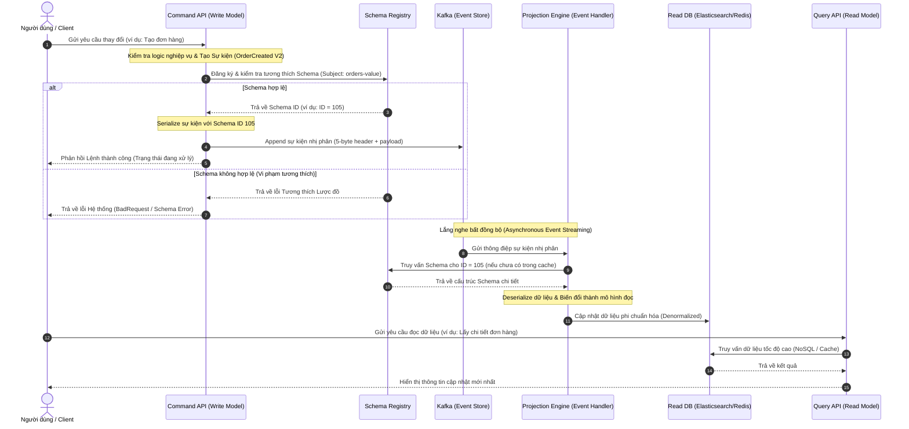

Trong thiết kế hệ thống phân tán và ứng dụng quy mô lớn, việc quản lý trạng thái dữ liệu (data state management) và duy trì sự nhất quán giữa các dịch vụ luôn là một thách thức lớn. Các phương pháp truyền thống dựa trên cơ sở dữ liệu quan hệ với các giao dịch ACID thường gặp giới hạn về hiệu năng và khả năng mở rộng khi đối mặt với lượng dữ liệu khổng lồ. 

Để giải quyết vấn đề này, các kiến trúc sư đã kết hợp bộ ba mô hình mạnh mẽ: **Event Sourcing (Lưu vết sự kiện)**, **CQRS (Command Query Responsibility Segregation - Phân tách trách nhiệm lệnh ghi và truy vấn đọc)**, và **Confluent Schema Registry (Quản lý lược đồ dữ liệu)**. Sự kết hợp này mang lại một giải pháp toàn diện cho kiến trúc [Event-Driven Architecture (EDA)](/concepts/1-foundations/system-architecture/event-driven-architecture/), giúp đảm bảo tính tương thích, toàn vẹn dữ liệu và khả năng truy vết hoàn hảo.

---

## 1. Event Sourcing Paradigm: Sổ Cái Bất Biến (Append-Only Ledger)

Trong các hệ thống lưu trữ truyền thống (như cơ sở dữ liệu [OLTP](/concepts/2-storage/database-storage/oltp/) quan hệ hoặc NoSQL), chúng ta thường chỉ lưu trữ **trạng thái hiện tại** (current state) của thực thể. Khi người dùng cập nhật thông tin địa chỉ hoặc số dư tài khoản, dữ liệu cũ sẽ bị ghi đè trực tiếp. Dù chúng ta có lưu vết thông qua cơ chế [CDC (Change Data Capture)](/concepts/3-integration/etl-elt/cdc-patterns/) hoặc bảng lịch sử, trạng thái hiện tại vẫn là nguồn thông tin gốc duy nhất được ứng dụng truy vấn.

**Event Sourcing (Lưu vết sự kiện)** đảo ngược hoàn toàn triết lý này. Thay vì lưu trạng thái cuối cùng, hệ thống lưu trữ **toàn bộ chuỗi các sự kiện (events)** đã xảy ra với thực thể đó dưới dạng một **sổ cái chỉ ghi thêm (append-only ledger)** bất biến. Trạng thái hiện tại của thực thể được tính toán bằng cách chạy lại (replaying) chuỗi sự kiện này từ đầu.

```
Trạng thái hiện tại = f(Sự kiện 1, Sự kiện 2, Sự kiện 3, ..., Sự kiện N)
```

### Các khái niệm cốt lõi của Event Sourcing

*   **Sự kiện (Event):** Là một sự thật không thể thay đổi đã xảy ra trong quá khứ. Ví dụ: `OrderCreated` (Đơn hàng đã được tạo), `ItemAdded` (Sản phẩm đã được thêm vào giỏ), `PaymentProcessed` (Thanh toán đã được xử lý). Sự kiện luôn được đặt ở thì quá khứ và là bất biến (immutable).
*   **Kho lưu trữ sự kiện (Event Store):** Là một cơ sở dữ liệu chuyên biệt chỉ cho phép ghi thêm (append-only), tối ưu hóa cho việc đọc và ghi sự kiện theo tuần tự. Kafka hoặc EventStoreDB là những ví dụ điển hình.
*   **Tái hợp trạng thái (Rehydration/State Reconstitution):** Là quá trình khôi phục trạng thái hiện tại của một thực thể bằng cách tải toàn bộ sự kiện liên quan đến thực thể đó từ Event Store và áp dụng chúng tuần tự theo thời gian.
*   **Ảnh chụp trạng thái (Snapshots):** Khi số lượng sự kiện của một thực thể lên tới hàng ngàn hoặc hàng triệu, việc chạy lại toàn bộ sự kiện từ đầu mỗi lần cần truy vấn sẽ gây ra độ trễ cực lớn. Hệ thống sẽ định kỳ chụp lại trạng thái hiện tại (ví dụ: sau mỗi 100 sự kiện) và lưu vào bộ nhớ đệm (cache) hoặc DB phụ trợ. Khi cần tái hợp trạng thái, hệ thống chỉ cần lấy snapshot mới nhất và chạy tiếp các sự kiện phát sinh sau thời điểm chụp snapshot đó.

---

## 2. CQRS: Phân Tách Mô Hình Đọc Và Ghi (Separating Read & Write Models)

Mặc dù Event Sourcing rất mạnh mẽ trong việc lưu vết và đảm bảo tính nhất quán của ghi chép, nó lại cực kỳ kém hiệu quả đối với các truy vấn đọc phức tạp. Hãy tưởng tượng bạn muốn thực hiện một truy vấn tìm kiếm: *"Liệt kê tất cả các đơn hàng được mua bởi khách hàng VIP trong tháng 5 có giá trị lớn hơn 2 triệu đồng"*. Nếu chỉ sử dụng Event Sourcing, bạn sẽ phải quét toàn bộ Event Store, rehydrate hàng triệu đơn hàng để tìm ra kết quả. Điều này là hoàn toàn bất khả thi trong thực tế.

Để khắc phục nhược điểm này, **CQRS (Command Query Responsibility Segregation)** được áp dụng. CQRS chia hệ thống thành hai phần riêng biệt:

1.  **Command Side (Mô hình ghi - Write Model):** Chỉ chịu trách nhiệm xử lý các lệnh thay đổi trạng thái (Create, Update, Delete). Nó thực hiện kiểm tra logic nghiệp vụ (business rules validation) và lưu các sự kiện mới vào Event Store. Mô hình này được tối ưu hóa hoàn toàn cho việc ghi dữ liệu an toàn và nhanh chóng.
2.  **Query Side (Mô hình đọc - Read Model):** Chỉ chịu trách nhiệm phục vụ các yêu cầu truy vấn dữ liệu (Read/Query). Dữ liệu ở đây được tổ chức dưới dạng phi chuẩn hóa (denormalized), tối ưu hóa riêng cho từng giao diện người dùng hoặc mục đích báo cáo cụ thể (ví dụ: dùng Elasticsearch cho tìm kiếm văn bản, Redis cho bộ nhớ đệm tốc độ cao, PostgreSQL cho quan hệ phức tạp).

### Cơ chế đồng bộ hóa dữ liệu (Projection/Eventual Consistency)

Khi một sự kiện mới được ghi vào Event Store ở phía Command, một bộ xử lý sự kiện (Projection Engine / Event Handler) sẽ lắng nghe sự kiện đó bất đồng bộ, tiến hành biến đổi cấu trúc dữ liệu và cập nhật trực tiếp vào cơ sở dữ liệu phía Query.

Quá trình này mang tính chất **nhất quán cuối cùng (eventual consistency)**. Điều này có nghĩa là sẽ có một khoảng trễ cực nhỏ (thường tính bằng mili-giây) từ lúc dữ liệu được ghi thành công ở phía Command cho đến khi nó xuất hiện ở phía Query.

---

## 3. Confluent Schema Registry Internals: Cơ Chế Quản Lý Lược Đồ Dữ Liệu

Trong kiến trúc hướng sự kiện lớn, các dịch vụ giao tiếp với nhau qua thông điệp (messages) gửi lên Broker như Apache Kafka. Để tối ưu hóa băng thông mạng và hiệu suất I/O, dữ liệu sự kiện thường được mã hóa (serialize) dưới dạng nhị phân bằng các định dạng như **Apache Avro, Protocol Buffers (Protobuf)** hoặc **JSON Schema**.

Tuy nhiên, định dạng nhị phân khiến con người và các hệ thống không thể đọc trực tiếp nếu không biết cấu trúc lược đồ (schema) của nó. Nếu một Producer tự ý thay đổi cấu trúc dữ liệu (ví dụ: đổi kiểu dữ liệu của một trường từ `INT` sang `STRING`) mà Consumer không biết, Consumer sẽ bị lỗi giải mã (deserialization error) và hệ thống sẽ bị gián đoạn.

**Confluent Schema Registry** ra đời để giải quyết vấn đề này bằng cách đóng vai trò là một dịch vụ quản lý lược đồ trung tâm.

### Kiến trúc và nguyên lý hoạt động của Schema Registry

Thay vì đính kèm toàn bộ Schema (thường rất nặng) vào mỗi message gửi qua Kafka, Schema Registry cho phép lưu trữ tập trung các Schema và gán cho mỗi Schema một **Schema ID** duy nhất (4 bytes).

Quy trình gửi và nhận thông điệp được mô tả cụ thể như sau:

1.  **Phía Producer (Gửi sự kiện):**
    *   Producer chuẩn bị gửi một sự kiện. Trước khi serialize, thư viện Serializer tích hợp của Confluent sẽ kiểm tra Schema của đối tượng dữ liệu.
    *   Serializer gửi yêu cầu đến Schema Registry để đăng ký Schema này dưới một tên chủ đề cụ thể (Subject - thường có dạng `<topic-name>-value`).
    *   Nếu Schema này đã tồn tại, Schema Registry trả về **Schema ID** cũ. Nếu chưa có và thỏa mãn luật tương thích, Schema Registry lưu Schema vào một topic nội bộ của Kafka tên là `_schemas` và trả về một **Schema ID** mới.
    *   Producer tiến hành serialize dữ liệu thành mã nhị phân. Thư viện sẽ chèn một Header đặc biệt dài 5 bytes vào đầu chuỗi nhị phân (gồm 1 byte Magic Byte `0` và 4 bytes chứa `Schema ID`).
    *   Producer gửi chuỗi nhị phân 5-byte-header + payload này lên Kafka Broker.
2.  **Phía Consumer (Nhận sự kiện):**
    *   Consumer nhận chuỗi nhị phân từ Kafka Broker.
    *   Thư viện Deserializer đọc 5 bytes đầu tiên để lấy ra **Schema ID**.
    *   Consumer kiểm tra trong bộ nhớ đệm cục bộ (local cache) xem đã có Schema tương ứng với Schema ID này chưa. Nếu chưa có, nó sẽ gửi yêu cầu HTTP đến Schema Registry để lấy Schema về và lưu vào cache.
    *   Consumer sử dụng Schema vừa lấy được để giải mã (deserialize) payload nhị phân thành đối tượng dữ liệu gốc để xử lý.

```
Producer ---> (Đăng ký Schema) ---> Schema Registry (Lưu trữ trong topic _schemas)
    |                                     ^
    v                                     |
[Serialize với ID]                   [Tải Schema theo ID]
    |                                     |
    v                                     |
Kafka Broker (Topic) ----------------> Consumer (Deserialize)
```

---

## 4. Các Cấp Độ Tương Thích Lược Đồ (Schema Compatibility Levels)

Khi hệ thống phát triển, các yêu cầu nghiệp vụ thay đổi đòi hỏi cấu trúc sự kiện phải tiến hóa, hay còn gọi là quá trình [Tiến hóa lược đồ (Schema Evolution)](/concepts/2-storage/data-lake-lakehouse/schema-evolution/). Ví dụ: thêm trường số điện thoại, xóa trường địa chỉ cũ, hoặc thay đổi kiểu dữ liệu. Để đảm bảo quá trình nâng cấp hệ thống diễn ra mượt mà mà không làm sụp đổ các Consumer đang chạy, Schema Registry cung cấp các cấp độ tương thích (compatibility levels) nghiêm ngặt:

| Cấp độ tương thích | Ý nghĩa | Quy tắc thiết kế | Kịch bản áp dụng |
| :--- | :--- | :--- | :--- |
| **BACKWARD** (Tương thích ngược) | Consumer sử dụng lược đồ mới (V2) có thể đọc dữ liệu được ghi bởi Producer sử dụng lược đồ cũ (V1). | Chỉ được phép **xóa trường** hoặc **thêm trường có giá trị mặc định (default value)**. | Nâng cấp toàn bộ Consumer trước, sau đó mới nâng cấp Producer. |
| **FORWARD** (Tương thích xuôi) | Consumer sử dụng lược đồ cũ (V1) có thể đọc dữ liệu được ghi bởi Producer sử dụng lược đồ mới (V2). | Chỉ được phép **thêm trường** mới hoặc **xóa trường có giá trị mặc định**. | Nâng cấp toàn bộ Producer trước, sau đó mới nâng cấp Consumer sau. |
| **FULL** (Tương thích toàn diện) | Đảm bảo cả hai chiều tương thích ngược và tương thích xuôi. Bất kỳ phiên bản Consumer nào cũng đọc được dữ liệu của bất kỳ phiên bản Producer nào. | Chỉ được phép **thêm hoặc xóa các trường có giá trị mặc định**. | Cho phép nâng cấp bất kỳ thành phần nào trước mà không lo ảnh hưởng tới các thành phần khác. |
| **NONE** (Không tương thích) | Schema Registry không thực hiện bất kỳ kiểm tra tính tương thích nào giữa các phiên bản. | Không có giới hạn. | Dùng trong môi trường thử nghiệm (development) hoặc khi cấu trúc dữ liệu bị thay đổi hoàn toàn (breaking changes) và chấp nhận dừng hệ thống để di trú dữ liệu. |

---

## 5. Schema Validation Trong Hệ Thống Event-Driven

Trong kiến trúc hướng sự kiện, tính toàn vẹn dữ liệu là yếu tố sống còn. Một thông điệp có cấu trúc sai lệch lọt vào Kafka được gọi là **Poison Pill** (thông điệp độc hại). Khi Consumer đọc phải Poison Pill, nó sẽ liên tục bị lỗi giải mã, dẫn đến luồng xử lý bị tắc nghẽn (gây kẹt lag partition).

Có hai lớp phòng vệ chính để kiểm tra và xác thực Schema (Schema Validation):

### Lớp phòng vệ 1: Xác thực phía Client (Client-Side Validation)
Các thư viện Serializer của Kafka ở phía Producer sẽ chặn đứng các thông điệp không khớp với cấu trúc Schema đã đăng ký ngay tại ứng dụng nguồn. Dữ liệu lỗi sẽ không bao giờ được gửi lên mạng lưới Kafka, giúp bảo vệ Broker khỏi dữ liệu rác.

### Lớp phòng vệ 2: Xác thực phía Broker (Broker-Side Schema Validation)
Từ các phiên bản Kafka hiện đại, Confluent hỗ trợ cấu hình **Broker-Side Schema Validation**. Khi bật tính năng này trên một Topic, Kafka Broker sẽ chủ động kiểm tra Header của mỗi tin nhắn gửi đến. Broker sẽ trích xuất Schema ID và đối chiếu trực tiếp với Schema Registry xem Schema đó có thực sự hợp lệ và đã được đăng ký dưới Subject tương ứng hay chưa. Nếu không khớp, Broker sẽ từ chối nhận tin nhắn và trả về lỗi `InvalidRecordException` cho Producer. Cơ chế này đảm bảo tuyệt đối không một Poison Pill nào có thể lọt vào hệ thống lưu trữ sự kiện chung.

---

## 6. Sơ Đồ Kiến Trúc Tổng Thể (Architecture Reference Flow)

Dưới đây là sơ đồ Mermaid mô tả luồng hoạt động tổng thể của Event Sourcing kết hợp CQRS, được bảo vệ bởi Confluent Schema Registry để xác thực tính hợp lệ của cấu trúc sự kiện.



---

## Điểm mạnh và điểm yếu

### Điểm mạnh (Pros)
*   **Khả năng truy vết hoàn hảo (Audit Trail):** Event Sourcing cung cấp một lịch sử thay đổi chi tiết tuyệt đối của hệ thống. Bạn có thể biết chính xác ai đã làm gì, vào thời điểm nào và tại sao trạng thái lại thay đổi như vậy.
*   **Khả năng quay ngược thời gian (Time Travel / Temporal Query):** Bạn có thể dễ dàng tái tạo lại trạng thái của toàn bộ hệ thống tại bất kỳ thời điểm nào trong quá khứ bằng cách chỉ chạy các sự kiện cho đến mốc thời gian đó. Rất hữu ích cho việc kiểm toán tài chính hoặc gỡ lỗi (debugging).
*   **Hiệu năng ghi cực cao:** Event Store chỉ hoạt động theo cơ chế append-only nên không bị ảnh hưởng bởi vấn đề khóa dòng (row lock) hay tranh chấp tài nguyên phức tạp như các DB truyền thống.
*   **Phân tách mối quan tâm (Separation of Concerns):** CQRS tách độc lập tải đọc và ghi, giúp bạn dễ dàng mở rộng độc lập các service ghi và đọc, hoặc lựa chọn công nghệ lưu trữ tối ưu nhất cho từng nhiệm vụ.
*   **Đảm bảo an toàn cấu trúc dữ liệu:** Schema Registry ngăn ngừa hoàn toàn lỗi phá vỡ dữ liệu do thay đổi code, đảm bảo giao tiếp an toàn giữa hàng trăm microservices.

### Điểm yếu (Cons)
*   **Độ phức tạp cực cao:** Thiết kế hệ thống với Event Sourcing và CQRS yêu cầu sự thay đổi lớn trong tư duy lập trình. Việc quản lý các projection, xử lý lỗi đồng bộ và thiết kế event đòi hỏi trình độ kỹ thuật rất cao.
*   **Nhất quán cuối cùng (Eventual Consistency):** Phía đọc sẽ có một khoảng trễ nhỏ so với phía ghi. Ứng dụng client cần được thiết kế thân thiện để xử lý trải nghiệm người dùng trong thời gian chờ đợi này (ví dụ: hiển thị trạng thái loading hoặc cập nhật UI tạm thời).
*   **Rủi ro tiến hóa sự kiện (Event Evolution):** Nếu cấu trúc sự kiện cũ bị lỗi thời và bạn cần thay đổi lớn, bạn phải quản lý việc chuyển đổi cấu trúc của các sự kiện lịch sử (event migration) hoặc viết các adapter để đọc được nhiều phiên bản sự kiện đồng thời.
*   **Khó khăn khi Debug:** Việc theo dõi luồng đi của dữ liệu qua nhiều tầng bất đồng bộ (Kafka, Projection, Read DB) khó hơn nhiều so với việc kiểm tra một cơ sở dữ liệu quan hệ duy nhất.

---

## Khi nào nên dùng

Hệ thống Event Sourcing, CQRS kết hợp với Schema Registry là một kiến trúc mạnh mẽ nhưng đi kèm chi phí vận hành lớn.

### Nên dùng khi:
1.  **Hệ thống tài chính, ngân hàng hoặc ví điện tử:** Nơi yêu cầu lịch sử giao dịch tuyệt đối chính xác, không được phép mất mát thông tin và cần khả năng đối soát (audit) chặt chẽ.
2.  **Ứng dụng thương mại điện tử quy mô lớn:** Nơi luồng xử lý đơn hàng phức tạp, lượng truy cập đọc (xem sản phẩm, tìm kiếm) lớn hơn hàng ngàn lần so với lượng ghi (đặt hàng).
3.  **Hệ thống cộng tác thời gian thực (Collaborative Systems):** Các ứng dụng như Google Docs, Trello, Figma nơi nhiều người dùng cùng thay đổi một trạng thái và cần theo dõi lịch sử chỉnh sửa chi tiết.
4.  **Các dự án Microservices phức tạp:** Nơi có nhiều đội phát triển độc lập cùng giao tiếp qua Kafka và cần một hợp đồng dữ liệu chung (Schema Registry) để tránh xung đột cấu trúc.

### Không nên dùng khi:
1.  **Ứng dụng CRUD đơn giản:** Nếu hệ thống của bạn chỉ xoay quanh việc nhập liệu và hiển thị cơ bản, việc áp dụng bộ ba này sẽ tạo ra gánh nặng kỹ thuật khổng lồ không đáng có.
2.  **Yêu cầu tính nhất quán tức thì ở mọi nơi (Strong Consistency):** Nếu nghiệp vụ bắt buộc mô hình đọc phải phản ánh tức thì trạng thái ghi mà không chấp nhận bất kỳ độ trễ nào.
3.  **Nguồn lực kỹ thuật giới hạn:** Đội ngũ phát triển chưa có kinh nghiệm vận hành hệ thống phân tán, Kafka, hoặc lập trình bất đồng bộ.

---

## Trọng tâm ôn luyện phỏng vấn

### Câu hỏi 1: Làm thế nào để giải quyết vấn đề "Dual Write" (Ghi kép) trong kiến trúc CQRS khi vừa phải ghi vào Event Store vừa phải cập nhật Read DB?
**Trả lời:**
Vấn đề ghi kép xảy ra khi ta cố tình cập nhật vào hai hệ thống lưu trữ độc lập trong cùng một luồng xử lý. Nếu ghi vào Event Store thành công nhưng cập nhật Read DB thất bại, hệ thống sẽ mất nhất quán dữ liệu.
Để giải quyết triệt để, chúng ta sử dụng triết lý **Single Source of Truth (Nguồn sự thật duy nhất)**. Command Side chỉ ghi duy nhất vào Event Store. Sau đó, hệ thống sẽ sử dụng cơ chế **Transaction Log Mining (như Debezium)** hoặc **Event Streaming (như Kafka Consumer)** để lắng nghe sự kiện từ Event Store và cập nhật vào Read DB một cách bất đồng bộ. Nếu quá trình cập nhật Read DB bị lỗi, Consumer sẽ tự động thử lại (retry) dựa trên offset của Kafka cho đến khi thành công, đảm bảo tính nhất quán cuối cùng mà không làm nghẽn luồng ghi.

### Câu hỏi 2: Điểm khác biệt lớn nhất giữa BACKWARD và FORWARD compatibility trong Schema Registry là gì? Cho ví dụ cụ thể?
**Trả lời:**
*   **BACKWARD compatibility (Tương thích ngược):** Hướng tới việc bảo vệ **Consumer mới**. Consumer mới có thể đọc được dữ liệu cũ. 
    *   *Ví dụ:* Schema V1 có trường `name`. Schema V2 xóa trường `name`. Consumer V2 được nâng cấp trước. Khi Consumer V2 đọc tin nhắn cũ dạng V1 (có trường `name`), nó chỉ đơn giản bỏ qua trường này và xử lý bình thường.
*   **FORWARD compatibility (Tương thích xuôi):** Hướng tới việc bảo vệ **Consumer cũ**. Consumer cũ có thể đọc được dữ liệu mới.
    *   *Ví dụ:* Schema V1 có trường `name`. Schema V2 thêm trường `phone` (không có giá trị mặc định). Producer V2 được nâng cấp trước và bắt đầu gửi tin nhắn chứa `phone`. Consumer V1 (chưa nâng cấp) nhận được tin nhắn mới, nó sẽ tự động bỏ qua trường `phone` và vẫn đọc được các thông tin cũ bình thường mà không bị sập.

### Câu hỏi 3: Làm thế nào để xử lý các thay đổi phá vỡ cấu trúc (Breaking Changes) trong Event Store khi sử dụng Event Sourcing?
**Trả lời:**
Khi có các thay đổi breaking changes (ví dụ: cấu trúc sự kiện thay đổi hoàn toàn khiến không thể dùng các luật tương thích thông thường), chúng ta có 3 chiến lược chính:
1.  **Upcaster (Chuyển đổi động):** Khi đọc sự kiện từ Event Store, ta chèn một lớp trung gian (Upcaster). Lớp này sẽ nhận chuỗi JSON/nhị phân của sự kiện cũ (V1) và tự động chuyển đổi cấu trúc của nó thành cấu trúc mới (V2) ngay trên bộ nhớ trước khi chuyển cho Aggregate xử lý. Dữ liệu vật lý trong Event Store vẫn được giữ nguyên.
2.  **Event Migration (Di trú sự kiện):** Tạo một tool đọc toàn bộ sự kiện từ Event Store cũ, thực hiện chuyển đổi cấu trúc dữ liệu, và ghi vào một Event Store mới. Phương pháp này tốn chi phí và thời gian chạy.
3.  **Versioned Events (Phiên bản hóa sự kiện):** Chấp nhận lưu trữ song song cả hai sự kiện cũ và mới dưới dạng các Class hoặc Schema khác nhau (ví dụ: `OrderCreatedV1` và `OrderCreatedV2`). Mã nguồn ứng dụng sẽ có các hàm xử lý riêng biệt cho từng phiên bản.

---

## English Summary

*   **Event Sourcing** is an architectural pattern where state changes are logged as an immutable sequence of events in an append-only ledger, enabling absolute auditability and time-travel debugging.
*   **CQRS (Command Query Responsibility Segregation)** splits the application into a Write Model (Command Side) and a Read Model (Query Side), optimizing performance, scalability, and database choices for reads and writes separately.
*   **Confluent Schema Registry** serves as a centralized metadata layer for Apache Kafka, enabling services to exchange binary payloads (Avro, Protobuf) efficiently by registering and validating schemas using a 5-byte wire format wrapper.
*   **Schema Compatibility Levels** (Backward, Forward, Full, None) govern how schemas can evolve over time without breaking downstream consumers, enforcing structural integrity and preventing "Poison Pills" from polluting the event stream.
*   **Broker-Side Schema Validation** ensures that the Kafka broker rejects malformed payloads before they are appended to the log, enforcing strict contract compliance at the infrastructure level.

---

## Xem thêm các khái niệm liên quan
* [Data Fabric](/concepts/1-foundations/system-architecture/data-fabric/)
* [Data Mesh](/concepts/1-foundations/system-architecture/data-mesh/)
* [Kiến trúc Nền tảng Dữ liệu & Modern Data Stack](/concepts/1-foundations/system-architecture/data-platform-architecture/)

## Tài liệu tham khảo

*   [AWS Architecture Guide - Build a CQRS Event Store on AWS](https://aws.amazon.com/blogs/database/build-a-cqrs-event-store-with-amazon-dynamodb/)
*   [Google Cloud - Event-Driven Architecture Design Patterns](https://cloud.google.com/architecture/event-driven-architecture-patterns)
*   [Confluent Schema Registry Deep Dive and Internal Architecture](https://docs.confluent.io/platform/current/schema-registry/index.html)
*   [Apache Kafka Documentation on Event Schemas and Serialization](https://kafka.apache.org/documentation/)
*   [Databricks Guide to Schema Enforcement and Evolution in Delta Lake](https://docs.databricks.com/en/delta/schema-validation.html)
*   [Azure Microsoft Architecture Dictionary - Event-Driven Patterns](https://azure.microsoft.com/en-us/resources/cloud-computing-dictionary/what-is-event-driven-architecture/)
